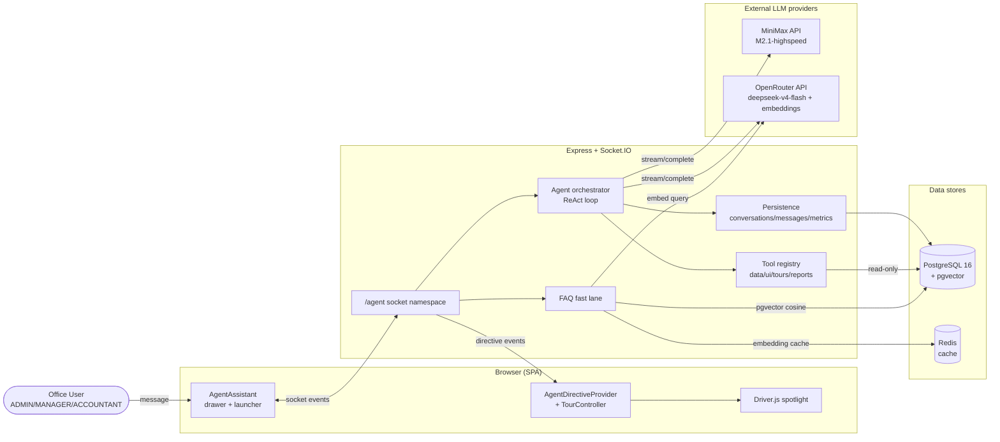
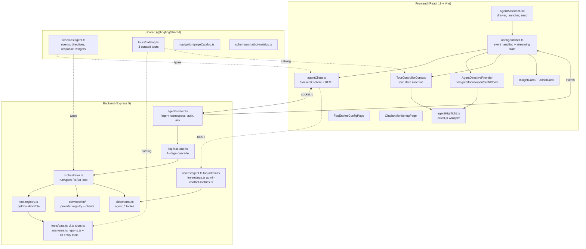
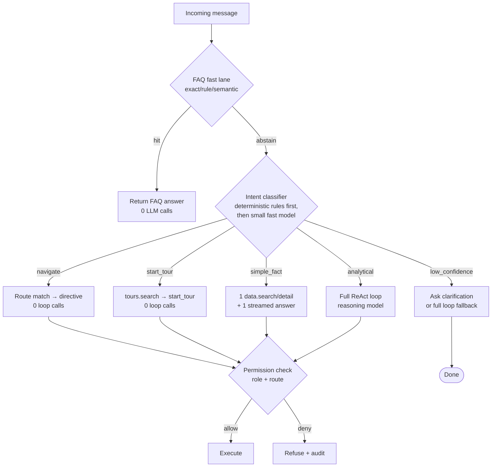
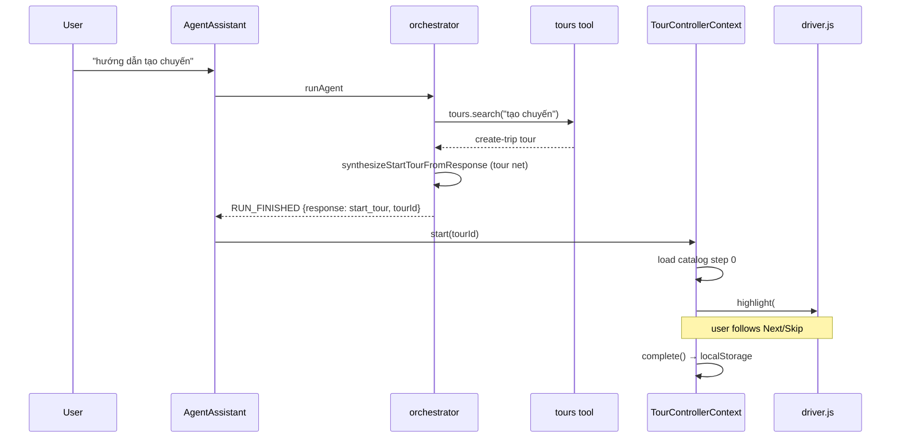
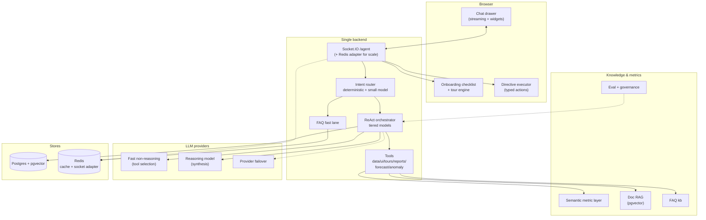

# Chatbot High-Level Design

> **Reading guide.** This document is grounded in the repository at the commit observed on 2026-07-13. Every current-state claim cites a repository-relative path. Where functionality does **not** exist, that is stated explicitly, because absences are findings. **Proposed** and **inferred** content is always labeled as such and kept separate from confirmed current state.
>
> **Conventions used in this document**
> - **[CONFIRMED]** = directly supported by the code at the cited path.
> - **[INFERRED]** = a reasonable conclusion drawn from code/configuration, but not explicitly documented.
> - **[PROPOSED]** = a future-state recommendation; not implemented.
> - **[UNKNOWN]** = needs product/engineering clarification.
>
> **Acronyms** (expanded on first use): **LLM** (Large Language Model), **ReAct** (Reason + Act loop), **RAG** (Retrieval-Augmented Generation), **SSE** (Server-Sent Events), **TTFT** (Time To First Token), **p50/p95/p99** (latency percentiles), **OTel** (OpenTelemetry), **RBAC** (Role-Based Access Control), **pgvector** (PostgreSQL vector extension), **MoE** (Mixture of Experts), **CoT** (Chain of Thought), **SLA** (Service Level Agreement), **PII** (Personally Identifiable Information), **NL→SQL** (Natural Language to SQL), **FRM** (First-Run/Onboarding experience).

---

## 1. Executive Summary

The chatbot ("TingTing Agent") is an in-app assistant for a Vietnamese trucking/logistics web application. It is intended to help office staff (ADMIN, MANAGER, ACCOUNTANT) ask questions about business workflows, navigate the application, analyze business data, and trigger guided product tours.

**Currently implemented architecture [CONFIRMED]:**

- **Transport:** A bidirectional **Socket.IO** namespace (`/agent`) — *not* HTTP/SSE — carries an AG-UI-style event protocol (`RUN_STARTED`, `TOOL_CALL_*`, `DIRECTIVE`, `TEXT_MESSAGE_*`, `RUN_FINISHED`, `RUN_ERROR`) defined in `shared/src/schemas/agent.ts`.
- **Brain:** A **ReAct loop** (≤4 iterations) in `backend/src/services/agent/orchestrator.ts` that calls a single reasoning model (`MiniMax-M2.1-highspeed`, or `deepseek/deepseek-v4-flash` via OpenRouter when the admin switches provider) with a registry of ~25 domain **tools** (semantic data gateway, reports, UI actions, tour search).
- **Fast lane:** A **zero-LLM FAQ cascade** (`backend/src/services/agent/faq-fast-lane.ts`) — exact → rule-gated → pgvector cosine (HNSW) → score/margin gate — that answers seeded domain questions before invoking the LLM at all.
- **Actions:** A typed **directive bridge** (`navigate`/`focus`/`open`/`prefill`/`toast`/`scrollTo`) connects chatbot output to the SPA, with an optional ack protocol so the model can compose accurate "đã mở" / "không mở được" text.
- **Tutorials:** A real, working **guided-tour subsystem** built on `driver.js` — 3 curated tours, a tour state machine, localStorage progress, resume-on-refresh, and a "tour net" that rewrites rambled chatbot tutorials into curated ones.
- **Observability:** Per-turn metrics (`agent_turn_metrics` table) capture p50/p95/p99 latency broken down by stage (LLM, tools, final, ack, persist), plus token counts, fallback/abort/guardrail flags, and a browser-reported `latency_client_wait_ms`. OpenTelemetry tracing wraps each call. An admin **Chatbot Monitoring** dashboard visualizes this.

**Most important architectural constraints:**

1. The bot is **read-only v1** — system prompt explicitly forbids create/update/delete. *(Confirmed in `orchestrator.ts` `buildSystemPrompt`.)*
2. The bot is gated to **office roles only** (ADMIN/MANAGER/ACCOUNTANT); DRIVER/FORWARDER get no tools (`backend/src/services/agent/tool.registry.ts`). Master on/off is `BOT_ENABLE` (default **off**).
3. Two **external LLM providers** (MiniMax, OpenRouter) are the only out-of-process dependencies. There is **no queue, no separate vector DB, no model server** — pgvector inside the existing Postgres is the vector store, and Redis is a cache (FAQ embedding cache), not a queue.

**Largest response-time risks (detailed in §14):**

- A bot turn is a **sequential chain of reasoning-model LLM calls**: wall-clock ≈ `(iterations + final) × per-call reasoning latency`. The repo's own latency-reduction plan (`docs/plans/chatbot-latency-reduction.md`) cites a production p95 ≈ 17 s and a recorded **6-iteration / 78 s / 145 k prompt-token** tail before the cap was lowered to 4 (`backend/src/services/llm/models.ts`).
- **Per-call context growth:** the system prompt (~4–5 kB) and full tool-schema set are re-billed on every iteration; `trimToolHistory` trims only old tool results, not the prompt/schemas.
- **No intent fast-path:** every non-FAQ message runs the full ReAct loop; a pure-navigation question pays for a reasoning-model round-trip.

**Most important functional gaps:**

- **Analytics/forecasting is shallow.** Tools exist to *retrieve and aggregate* data, but there is **no forecasting engine, no anomaly-detection module, no semantic metric layer, and no NL→SQL**. Forecasts/scenario analysis are **not implemented**.
- **No general RAG over product docs.** The only retrieval is the **FAQ fast lane** over `faq_entries`. There is no ingestion pipeline for `CONTEXT.md`, ADRs, or product specs.
- **`ui.open`/`ui.prefill` are registered by only one page** (`DebtDetailPage`); the directive bridge has no global action catalog.
- **No onboarding/first-run flow.** Tours exist but are launched ad hoc from chat; there is no new-user wizard, no role-based onboarding checklist, no tutorial triggered by first login.

**Proposed architectural direction (§18):** keep the single-node, socket-driven, tool-calling agent (proportional to project maturity), and prioritize (1) perceived-latency wins already scoped in `docs/plans/chatbot-latency-reduction.md`, (2) an intent router that collapses simple turns, (3) a permission-aware semantic layer for trustworthy analytics, and (4) elevating tours to a first-class onboarding subsystem with a registry + analytics. Avoid microservices; the biggest leverage is inside the existing orchestrator.

---

## 2. Scope and Product Capabilities

### 2.1 Capability matrix

Legend: **Implemented** = code exists and is wired; **Partial** = some code exists but coverage is limited; **Not found** = no code; **Proposed** = recommendation only.

| # | Capability | Example user request | Status | Main components | Required data/tools | Key risks | Recommended next step |
|---|---|---|---|---|---|---|---|
| 1 | Business workflow knowledge | "Quy tắc tính tiền phụ trội thế nào?" | **Implemented** (FAQ-seeded) | `faq-fast-lane.ts`, `faq_entries` (30 seeded rows, `0104_faq_knowledge_base.sql`) | Curated Q/A + embeddings | FAQ coverage gaps; semantic-miss abstains → full LLM | Expand FAQ; add RAG over `CONTEXT.md` (§7) |
| 2 | Feature "how-to" knowledge | "Cách khóa chuyến?" | **Partial** | FAQ + LLM prose answer; `tutorial` response shape; curated tours | FAQ; system prompt rules | LLM may hallucinate steps not in code | Author more curated tours; cite source |
| 3 | Frontend navigation | "Mở trang công nợ" | **Implemented** | `tools/ui.ts` (`ui.navigate`), `AgentDirectiveProvider`, A3 guardrail | `PAGE_CATALOG`, route keys | Guardrail fires; ack timeout (6 s) | Intent fast-path for nav (§6) |
| 4 | Frontend highlight/focus | "Chỉ cho tôi nút khóa chuyến" | **Implemented** | `ui.focus`, `agentHighlight.ts` (driver.js) | Stable element IDs | Element missing on page | Stable IDs; graceful miss (§9) |
| 5 | Business data retrieval | "Chuyến X206 hôm nay?" | **Implemented** | `tools/data.ts` semantic gateway (6 tools) | DB (read-only) | Wrong entity match; no PII filter | Semantic layer (§8) |
| 6 | Business data analysis | "Lợi nhuận tháng này?" | **Partial** | `tools/analyzers.ts`, `insight_card` widgets, `report.run` | DB aggregations | Hallucinated numbers; stale data | Metric definitions + provenance (§8) |
| 7 | Metric explanation | "Tiền chuẩn là gì?" | **Implemented** (FAQ/glossary) | FAQ; system prompt | Glossary (`CONTEXT.md`) | Term drift | Sync glossary → FAQ/RAG |
| 8 | Anomaly detection | "Tại sao chi phí tăng?" | **Not found** | — | Trend data | Unfounded conclusions | Add analyzer + safeguards (§8) |
| 9 | Forecasting | "Dự báo doanh thu quý sau?" | **Not found** | — | Historical series | Overconfident/unsupported | Add forecast service w/ intervals (§8) |
| 10 | Advice/recommendations | "Nên làm gì để giảm nợ?" | **Partial** (LLM prose) | LLM prose only | Data + policy | Overconfident advice | Guardrails + provenance (§8) |
| 11 | Follow-up actions from chat | Action chips on cards | **Implemented** | `agentActionChipSchema`, `TutorialCard`/`InsightCard` chips | Route keys | Chip → missing page | Expand chip coverage |
| 12 | Multi-turn conversation | "Còn chuyến nào nữa?" | **Implemented** | In-memory session history (6000-char cap); `agent_conversations`/`agent_messages` persistence | Session memory | History trim loses context | Summarization (§11) |
| 13 | Permission-aware answers | (any, as a non-ADMIN) | **Implemented** (coarse) | Role-gated tool registry; JWT role | Role enum | Coarse role-only, not row-level | Row-level enforcement (§12) |
| 14 | Guided tutorial (text steps) | "Hướng dẫn từng bước tạo chuyến" | **Implemented** | `tutorial` response shape; `TutorialCard` | Curated tours | Steps may not match UI | Authoring workflow (§10) |
| 15 | Guided tour (spotlight walkthrough) | "Mở hướng dẫn tạo chuyến" | **Implemented** | `shared/src/tours/catalog.ts` (3 tours); `TourControllerContext`; `agentHighlight.ts` (driver.js) | Stable element IDs | DOM targets missing; only 3 tours | Registry + analytics (§10) |
| 16 | Chatbot-triggered tour | (user types "tutorial") | **Implemented** | `start_tour` response; tour net guardrail | Curated tours | Net mismatch → wrong tour | Tour versioning (§10) |
| 17 | Onboarding / first-run | (new user login) | **Not found** | — | User state | None exists | New-user flow (§10) |
| 18 | Form prefill from chat | "Ghi thanh toán 500k cho X" | **Partial** | `ui.prefill` directive; only `DebtDetailPage` registers | Page handlers | One page only | Expand `useAgentOpenable` (§9) |
| 19 | Permission-aware data (row-level) | (multi-tenant query) | **Not found** | — | Tenant scoping | Cross-tenant leak | Row-level security (§12) |
| 20 | Streaming token rendering | (long prose answer) | **Implemented** | `TEXT_MESSAGE_*` events; JSON-probe suppress | Streaming runner | `<think>` leakage; abort | Already in latency plan (§14) |

### 2.2 Summary of coverage

**Strong:** workflow Q/A (FAQ), navigation/highlight, data retrieval, guided tours, multi-turn chat, streaming.
**Weak:** data analysis (no semantic layer), forecasting (none), advice (no safeguards), form actions (one page).
**Missing:** anomaly detection, forecasting, onboarding, row-level data permissions.

---

## 3. Current-State System Context

### 3.1 Actors and external systems

| Actor / system | Role | Status |
|---|---|---|
| Office user (ADMIN/MANAGER/ACCOUNTANT) | Types messages, receives streamed answers, observes directives/tours | [CONFIRMED] (`agentSocket.ts` role gate) |
| Driver/Forwarder user | Excluded from chat | [CONFIRMED] (no tools; launcher hidden) |
| MiniMax API (`api.minimax.io`) | Primary LLM (reasoning model `MiniMax-M2.1-highspeed`); also embeddings n/a | [CONFIRMED] (`minimax.client.ts`, `models.ts`) |
| OpenRouter API (`openrouter.ai`) | Alternate LLM (`deepseek/deepseek-v4-flash`); **also** embeddings (`text-embedding-3-small`) + OCR (`qwen3-vl-32b`) | [CONFIRMED] (`openrouter.client.ts`, `embeddings.ts`, `ocr.service.ts`) |
| PostgreSQL 16 (+ pgvector) | Conversation/message/metrics persistence; FAQ vector store; business data | [CONFIRMED] (`pgvector/pgvector:pg16` in compose) |
| Redis 7 | FAQ embedding cache (30-min TTL); generic cache (geocoding, etc.) | [CONFIRMED] (`lib/redis.ts`) |
| Driver.js (client lib) | Spotlight/highlight engine for tours and `focus` directive | [CONFIRMED] (`agentHighlight.ts`) |
| OTel collector (OTLP/HTTP) | Trace export (optional; falls back to console) | [CONFIRMED] (`lib/telemetry.ts`) |

### 3.2 System context diagram



### 3.3 Inferred integrations

- **[INFERRED]** OpenRouter is the production provider for **embeddings** (FAQ) because `embeddings.ts` hardcodes the OpenRouter `/embeddings` endpoint; MiniMax has no embedding path. FAQ embeddings therefore depend on the OpenRouter key being present even when the chat LLM is MiniMax.
- **[INFERRED]** A single OTel collector endpoint is expected (`OTEL_EXPORTER_OTLP_ENDPOINT`) but the code falls back to console export if unset — so observability may be **console-only in some deployments**.

---

## 4. Current-State Component Architecture



### 4.1 Component reference

| Component | Responsibility | Repo path | Inputs | Outputs | Dependencies | State owned | Failure behavior | Sync/Async | Status |
|---|---|---|---|---|---|---|---|---|---|
| AgentAssistant | Chat drawer UI, send, render | `frontend/src/components/agent/AgentAssistant.tsx` | user input, chat state | UI events | `useAgentChat`, auth | none (stateless) | shows error bubble | async | [CONFIRMED] |
| useAgentChat | Event handling, streaming accumulation, conversation seed | `frontend/src/hooks/useAgentChat.ts` | socket events | messages[], streamingMessage, isThinking | `agentClient` | in-memory messages, conversationId (localStorage) | sets error, clears thinking | async | [CONFIRMED] |
| agentClient | Socket.IO client + REST (conversations, FAQ, metrics, settings) | `frontend/src/api/agentClient.ts` | JWT, message | events, REST responses | socket.io-client | socket singleton | reject promise / emit RUN_ERROR | async | [CONFIRMED] |
| AgentDirectiveProvider | Execute directives (navigate/focus/open/prefill/toast/scrollTo) | `frontend/src/context/AgentDirectiveProvider.tsx` | directive events | router nav, toasts, driver highlight | react-router, driver.js, `useAgentOpenable` | pending-open map | toast on miss | async | [CONFIRMED] |
| TourControllerContext | Tour state machine (start/next/prev/complete/skip/resume) | `frontend/src/context/TourControllerContext.tsx` | tour events, localStorage | current step, progress | `tourProgress`, driver.js | tourActive, step index | recovery prompt | async | [CONFIRMED] |
| agentHighlight | driver.js spotlight wrapper | `frontend/src/lib/agentHighlight.ts` | element | visual highlight | driver.js | singleton driver | graceful no-op | sync | [CONFIRMED] |
| InsightCard / TutorialCard | Render structured responses | `frontend/src/components/agent/InsightCard.tsx`, `TutorialCard.tsx` | AgentResponse | UI | shared schemas | none | — | sync | [CONFIRMED] |
| agentSocket | `/agent` namespace: auth, ack, chat dispatch | `backend/src/agentSocket.ts` | socket events | emit events | auth, orchestrator, FAQ | per-socket session history, pending acks | RUN_ERROR, disconnect | async | [CONFIRMED] |
| orchestrator | ReAct loop, prompt build, tool exec, final answer, persist, metrics | `backend/src/services/agent/orchestrator.ts` (`runAgent`) | ctx, message, priorMessages | AgentResponse, events, toolTrace | provider, tools, db | per-turn metrics accumulator | throws (pre-persist) / persists errorKind | async | [CONFIRMED] |
| faq-fast-lane | 4-stage zero-LLM match | `backend/src/services/agent/faq-fast-lane.ts` (`tryFaqFastLane`) | message | FaqMatch \| null | db, embeddings, redis | none | fail-open (return null) | async | [CONFIRMED] |
| tool.registry | Assemble per-role tools; retire legacy | `backend/src/services/agent/tool.registry.ts` (`getToolsForRole`) | role | AgentToolDef[] | tool modules | none | — | sync | [CONFIRMED] |
| tools/data | Semantic data gateway (meta/search/list/detail/aggregate/timeline) | `backend/src/services/agent/tools/data.ts` | args, ctx | ToolResult | db | none | ToolError | async | [CONFIRMED] |
| tools/ui | navigate/focus/open/prefill/toast/scrollTo | `backend/src/services/agent/tools/ui.ts` | args, ctx | directive | routeMatcher, pageCatalog | none | ToolError | sync (directive), async (ack) | [CONFIRMED] |
| tools/tours | Tour search | `backend/src/services/agent/tools/tours.ts` | query | tour list | shared tours catalog | none | — | sync | [CONFIRMED] |
| tools/reports | `report.run` (financial reports) | `backend/src/services/agent/tools/reports.ts` | report args | ToolResult | reporting service | none | ToolError | async | [CONFIRMED] |
| tools/analyzers | Financial analysis aggregations | `backend/src/services/agent/tools/analyzers.ts` | args | ToolResult | db | none | ToolError | async | [CONFIRMED] |
| LLM provider registry | Resolve active provider from DB settings (hot-swap) | `backend/src/services/llm/provider-registry.ts` | none | LlmProvider | settings | cached provider | throws | async | [CONFIRMED] |
| minimax.client / openrouter.client | OpenAI-compatible complete + stream | `backend/src/services/llm/{minimax,openrouter}.client.ts` | messages, tools | MiniMaxCallResult | openai-runner | none | MiniMaxError | async | [CONFIRMED] |
| openai-runner | Generic OpenAI-compatible fetch + SSE parse | `backend/src/services/llm/openai-runner.ts` | config, opts | result + delta callbacks | fetch | none | MiniMaxError | async | [CONFIRMED] |
| embeddings | FAQ query/entry embedding | `backend/src/services/llm/embeddings.ts` | text | vector | OpenRouter | none | fail-soft | async | [CONFIRMED] |
| routes/agent | Conversation history REST | `backend/src/routes/agent.ts` | HTTP | JSON | db | none | ApiError | async | [CONFIRMED] |
| routes/faq-admin | FAQ CRUD + auto-embed | `backend/src/routes/faq-admin.ts` | HTTP | JSON | embeddings, db | none | ApiError | async | [CONFIRMED] |
| routes/llm-settings | Provider + key management | `backend/src/routes/llm-settings.ts` | HTTP | masked settings | crypto, registry | none | ApiError | async | [CONFIRMED] |
| routes/admin-chatbot-metrics | Roll-up metrics queries | `backend/src/routes/admin-chatbot-metrics.ts` | HTTP + range | metrics JSON | db | none | ApiError | async | [CONFIRMED] |
| Persistence | agent_conversations / agent_messages / agent_turn_metrics | `backend/src/db/schema.ts` | rows | rows | postgres.js | DB | caught, no crash | async | [CONFIRMED] |
| Observability | OTel spans + per-turn metrics + token attribution | `backend/src/services/agent/telemetry.ts`, `token-attribution.ts` | spans | metrics row | OTel SDK | none | swallowed | async | [CONFIRMED] |

---

## 5. End-to-End Chat Request Pipeline

### 5.1 Normal path (LLM answer)

```mermaid
sequenceDiagram
    participant U as User
    participant AA as AgentAssistant
    participant UAC as useAgentChat
    participant Sock as agentSocket (/agent)
    participant FAQ as faq-fast-lane
    participant Orc as orchestrator
    participant Prov as LLM provider
    participant Tools as tools
    participant DB as Postgres
    participant Drv as driver.js

    U->>AA: type message
    AA->>UAC: send(text, currentRouteKey)
    UAC->>Sock: emit agent:chat
    Sock->>Sock: RUN_STARTED (immediate)
    Sock-->>UAC: event RUN_STARTED
    UAC->>AA: isThinking=true (rich label)

    Sock->>FAQ: tryFaqFastLane(message)
    alt FAQ hit
        FAQ->>DB: pgvector cosine (rule-gated)
        FAQ-->>Sock: FaqMatch
        Sock-->>UAC: RUN_FINISHED {response:text, fastLane:true}
        UAC->>AA: render bubble
    else FAQ abstain
        FAQ-->>Sock: null
        Sock->>Orc: runAgent(ctx, message, prior, emit)
        loop ReAct (≤4 iters)
            Orc->>Prov: streamComplete(messages, tools)
            Prov-->>Orc: deltas (onText) + result
            Orc-->>UAC: TEXT_MESSAGE_* (prose only; JSON suppressed)
            alt tool_calls present
                Orc->>Tools: execute (readonly concurrent, ui.* serial)
                Tools->>DB: read-only query
                Tools-->>Orc: ToolResult
                Orc-->>UAC: TOOL_CALL_START/END
                alt ui.navigate/focus
                    Orc-->>UAC: DIRECTIVE {requiresAck}
                    UAC->>Drv: navigate + highlight
                    UAC-->>Sock: action_result (ack)
                    Sock-->>Orc: ack
                end
            else no tool_calls
                Orc->>Orc: break to final
            end
        end
        Orc->>Orc: produceFinalAnswer (3 cases)
        Orc->>DB: persist conversation+message+metrics
        Orc-->>Sock: RunAgentResult
        Sock-->>UAC: RUN_FINISHED {response, conversationId, messageId}
        UAC->>UAC: replace streaming bubble; fire pending directives
        UAC->>Sock: agent:client_timing (browser wait)
    end
```

### 5.2 Pipeline stage breakdown

| # | Stage | Component | Processing | External calls | Latency source | Timeout | Retry | Cache opportunity | Observability | Source files |
|---|---|---|---|---|---|---|---|---|---|---|
| 1 | Frontend event | AgentAssistant | input trim, form submit | none | none | — | — | — | — | `AgentAssistant.tsx:92` |
| 2 | Request construction | useAgentChat | abort previous, add user msg, capture currentRouteKey | none | none | — | — | — | — | `useAgentChat.ts:231` |
| 3 | Transport | agentClient | socket.emit `agent:chat` | socket.io | network RTT | socket.io defaults | socket.io reconnect | — | — | `agentClient.ts:145` |
| 4 | Auth | agentSocket | JWT verify on handshake + role gate | none | JWT verify | handshake timeout | none | — | blacklist check | `agentSocket.ts:107` |
| 5 | FAQ fast lane | faq-fast-lane | normalize, exact match, embed, pgvector cosine, gate | OpenRouter embeddings (cached) | embedding call (cache miss), SQL cosine | embed 30s | none | embedding cache (Redis 30m) | fail-open | `faq-fast-lane.ts:183` |
| 6 | Prompt construction | orchestrator | buildSystemPrompt (role, date, rules, shape hint) | none | string concat | — | — | — | — | `orchestrator.ts:127` |
| 7 | LLM call (per iteration) | provider → openai-runner | stream chat/completions | MiniMax or OpenRouter | reasoning-model TTFT + generation | 60s | none | semantic cache (proposed) | OTel span `agent.llm.react_call` | `openai-runner.ts:204` |
| 8 | Tool execution | tools/* | readonly concurrent; ui.* serial + ack | DB (read-only) | DB query; ack wait | none explicit | none | tool-result cache (proposed) | OTel span `agent.tool.execute` | `orchestrator.ts:541` |
| 9 | Directive ack | agentSocket + frontend | wait for action_result | socket round-trip | round-trip | 6s | none | — | latencyAckMs | `agentSocket.ts:148` |
| 10 | Final answer | orchestrator | parse/repair JSON, sanitize widgets, A3 guardrail, tour net | none | parsing | — | jsonrepair | — | — | `orchestrator.ts:610` |
| 11 | Persistence | orchestrator → db | insert conversation/message/metrics | DB | 3 inserts | none | caught (no crash) | — | OTel span `agent.db.persist_turn` | `orchestrator.ts:359` |
| 12 | Delivery | agentSocket → useAgentChat | emit RUN_FINISHED, render | socket | RTT | — | — | — | client timing reported | `agentSocket.ts:230` |
| 13 | Rendering | AgentAssistant | dispatch on response.type, markdown, widgets | none | React render | — | — | — | — | `AgentAssistant.tsx:208` |
| 14 | Telemetry | metrics accumulator | write agent_turn_metrics row | DB | (counted in persist) | — | — | — | full per-turn row | `orchestrator.ts:303` |

> **Latency honesty note.** No measured values are reproduced as fact here. The repo's `agent_turn_metrics` schema and admin dashboard are designed to capture these, and the latency-reduction plan cites a **p95 ≈ 17 s** baseline (`latency_user_perceived_ms`) and a recorded 6-iter/78 s/145 k-token tail (`models.ts:26-30`). Per-stage numbers (LLM vs tools vs ack vs persist) are **captured per turn** but the document does not assert specific production measurements — instrumentation exists; reading specific figures requires a metrics pull (Phase 0 of the latency plan).

### 5.3 Alternate paths

| Path | Trigger | Flow | Source |
|---|---|---|---|
| Knowledge/workflow question | FAQ-seeded query | FAQ fast lane returns `text` answer; **0 LLM calls**; `fastLane:true` on RUN_FINISHED | `faq-fast-lane.ts`, `agentSocket.ts:222` |
| Frontend navigation | "mở trang X" | (FAQ miss →) LLM emits `ui.navigate`; A3 guardrail rewrites prose paths to validated directives; ack requested | `tools/ui.ts`, `orchestrator.ts:236` (`synthesizeNavigateFromProse`) |
| Business-data analysis | "lợi nhuận tháng này" | LLM calls `data.search`/`data.aggregate`/`report.run`/`analyzers.*`; synthesizes `insight_card`; widgets sanitized | `tools/data.ts`, `tools/analyzers.ts`, `orchestrator.ts` widget sanitize |
| Forecasting request | "dự báo..." | **Not implemented.** LLM may produce prose but no forecast tool exists | §8 |
| Advice/recommendation | "nên làm gì..." | LLM prose only; no safeguards | §8 |
| Tutorial-triggering | "hướng dẫn/từng bước" | LLM returns `tutorial` shape; tour net matches to curated `start_tour` if applicable | `orchestrator.ts:207` (`synthesizeStartTourFromResponse`) |
| Tool failure | tool throws | `errorKind:'tool'`; error label; tool message returned to model; loop continues; metrics flagged | `orchestrator.ts:552` |
| LLM timeout | 60s AbortController | `MiniMaxError` code `timeout`; re-thrown pre-persist; RUN_ERROR; **no metrics row** (no messageId) | `openai-runner.ts`, `orchestrator.ts:461` |
| Unauthorized data access | non-office role | socket disconnect + RUN_ERROR at handshake | `agentSocket.ts:129` |
| Empty/low-confidence retrieval | FAQ abstain | returns null → full ReAct loop (fail-open) | `faq-fast-lane.ts:151` |
| Client abort mid-turn | new message / disconnect | AbortController aborts; events dropped; pre-persist → no row; mid-persist → row with `aborted=true` | `orchestrator.ts:399`, `agentSocket.ts:195` |
| JSON streaming suppression | terminal JSON turn | probe first chars; if `{`/`[`, suppress TEXT_MESSAGE; card arrives whole in RUN_FINISHED | `orchestrator.ts:423` |

---

## 6. Intent Routing and Capability Orchestration

### 6.1 Current behavior [CONFIRMED]

There is **no explicit intent router**. Routing is implicit and emerges from three mechanisms:

1. **FAQ fast lane** (`faq-fast-lane.ts`) — a deterministic pre-filter that answers only high-confidence seeded questions. It is the only "router" that avoids the LLM entirely.
2. **The LLM itself** — the system prompt (`orchestrator.ts:127`) instructs the model which response shape to produce (`text` / `insight_card` / `tutorial` / `start_tour` / `directive`) and which tools to call. Tool selection, including `ui.navigate` for navigation, is delegated to the model's function-calling.
3. **Post-hoc synthesizers** — `synthesizeNavigateFromProse`, `synthesizeStartTourFromResponse`, `synthesizeTextActionsFromProse` (orchestrator.ts:207–282) patch up directives the model *described in prose* rather than emitted as tool calls (the "A3 honest guardrail" + "tour net").

So today: **every non-FAQ turn pays for at least one reasoning-model call**, even a pure "open the debt page" request.

### 6.2 Proposed future intent router [PROPOSED]



**Design principles [PROPOSED]:**
- Deterministic keyword/route rules first (cheap, auditable), then a small fast model only for ambiguous cases — mirrors the latency plan's Phase 2 (`docs/plans/chatbot-latency-reduction.md` P2.1, ≤10% misroute gate).
- **Permission checks at the tool/data layer, not only in the prompt** (see §12).
- Confidence threshold: below it, fall through to the full loop (correctness preserved) or ask a clarification.
- Every routing decision logged to `agent_turn_metrics` (add `intent_bucket` column) for auditability.

---

## 7. Knowledge, Retrieval, and Business Context

### 7.1 Current knowledge sources [CONFIRMED]

| Source | What it covers | How it's retrieved | Status |
|---|---|---|---|
| `faq_entries` (30 seeded rows) | Domain rules (penalty, fuel modes, road allowance, lifecycle) | FAQ fast lane (exact/rule/pgvector) | [CONFIRMED] |
| System prompt rules | Response shapes, v1 read-only constraint, tool guidance, date handling, target IDs | Hardcoded in `buildSystemPrompt` | [CONFIRMED] |
| `PAGE_CATALOG` (`shared/src/navigation/pageCatalog.ts`) | App screens + agent metadata | Route matcher | [CONFIRMED] |
| Curated tours (`shared/src/tours/catalog.ts`) | 3 workflow walkthroughs | Tour search tool | [CONFIRMED] |
| `CONTEXT.md`, `docs/`, ADRs | Domain glossary, business rules, decisions | **Not retrieved by the bot** | [UNKNOWN] |

### 7.2 RAG over FAQ (the only retrieval pipeline) [CONFIRMED]

The FAQ fast lane is a focused, well-engineered RAG-over-a-curated-FAQ pipeline:

| Stage | Implementation | Source |
|---|---|---|
| Source ingestion | Admin CRUD page → `faq-admin.ts` POST/PUT | `routes/faq-admin.ts` |
| Chunking | One embedding per FAQ entry (question + variants + answer implicit) | `faq-fast-lane.ts` |
| Embedding | `openai/text-embedding-3-small` (1536 dims) via OpenRouter | `services/llm/embeddings.ts` |
| Indexing | pgvector HNSW cosine index, partial (`embedding IS NOT NULL AND is_active`) | migration `0104_faq_knowledge_base.sql` |
| Metadata | `required_terms`, `forbidden_terms`, `question_variants`, `sort_order`, `is_active` | `db/schema.ts` faqEntries |
| Query rewriting | `normalizeText` (Vietnamese diacritic strip + lower + punct strip) | `services/agent/text.ts` |
| Retrieval | SQL: `1 - (embedding <=> query)` with rule gates (`required_terms <@`, `forbidden_terms &&`), LIMIT 5 | `faq-fast-lane.ts:103` |
| Reranking | None (single-stage top-k) | — |
| Context assembly | Top-1 answer returned verbatim | `faq-fast-lane.ts:151` |
| Citation/provenance | **None** — answer returned without source attribution | gap |
| Permission filtering | `is_active` only; no per-role FAQ visibility | gap |
| Freshness/reindex | Re-embedded on admin edit; backfill script `backfill-faq-embeddings.ts`; embedding cache 30-min TTL | [CONFIRMED] |
| Failure/fallback | Fail-open (any error → null → full LLM) | `faq-fast-lane.ts` |
| Gate thresholds | `SCORE_FLOOR = 0.40`, `MARGIN = 0.12` | `faq-fast-lane.ts:51` |

### 7.3 What does NOT exist [CONFIRMED absent]

- **No RAG over product docs** (`CONTEXT.md`, ADRs, `docs/`). The glossary is referenced in the system prompt only as guidance to the model, not retrieved.
- **No reranking.** Single-stage top-k.
- **No citation/provenance** in answers — users cannot tell FAQ vs LLM-prose vs tool-data apart (except `fastLane:true` on the event, not surfaced in UI).
- **No permission-filtered retrieval** beyond `is_active`.

### 7.4 Proposed future knowledge architecture [PROPOSED]

1. **Generalize the FAQ pipeline** into a document-RAG pipeline over `CONTEXT.md` + ADRs + product specs, reusing the pgvector + HNSW + OpenRouter-embeddings stack already in place.
2. **Add citations**: every retrieved-grounded answer should carry a source pointer (doc path, FAQ id) surfaced in the UI.
3. **Add a rerank stage** only if top-k recall proves insufficient (defer until measured).

---

## 8. Business Data Analysis and Forecasting

### 8.1 Current analytical pipeline [CONFIRMED]

The bot can **retrieve and aggregate** business data but **cannot forecast, detect anomalies systematically, or guarantee metric consistency**:

- **NL → tools, not NL → SQL.** The model selects from typed tools: the semantic data gateway (`data.meta/search/list/detail/aggregate/timeline` over 11 entity types), `report.run` (financial reports), and `tools/analyzers.ts` (predefined aggregations). **There is no generated SQL, no semantic metric layer, no NL→SQL.**
- **Validation:** tool args are Zod-validated (`tool.types.ts`); SQL is built via Drizzle parameterized queries (no string interpolation) — so **SQL injection risk is low** for the gateway. Entity-specific tools (`tools/trips.ts`, etc.) likewise use Drizzle.
- **Permissions:** enforced at the **role** level (tool registry gates which tools a role sees). There is **no row-level / tenant filtering** beyond the single-tenant deployment assumption.
- **Metric consistency:** metric definitions live implicitly across tools/analyzers; there is **no single semantic layer** ensuring "lợi nhuận" means the same thing everywhere.
- **Data freshness:** live DB reads (no caching of analytical results) — fresh by default, but expensive queries may be slow.
- **Large datasets / aggregation:** handled inside tools; no explicit pagination/limits surfaced to the model uniformly.
- **Chart/table generation:** the model emits `insight_card` widgets (`kpi_grid`, `bar_chart`, `line_chart`, `table`, `callout`, `anomaly_list`) which the frontend renders dependency-free (CSS/SVG) — `InsightCard.tsx`.
- **Explanation of findings:** the model writes a `summary`; no structured provenance.
- **Anomaly detection:** `anomaly_list` widget exists but **no anomaly-detection engine** populates it deterministically — the model decides.
- **Forecasting:** **Not found.** No forecast tool, no time-series model, no scenario engine.
- **Backtesting / uncertainty / assumptions:** **Not found.**

### 8.2 Safeguard gaps

- The system prompt rule "LUÔN dùng công cụ để lấy số liệu; KHÔNG bịa số" instructs the model not to fabricate, but **there is no post-hoc check** that numbers in the answer trace to a tool result.
- No distinction is enforced between **observed facts, calculated values, forecasts, assumptions, and recommendations** in the response schema.

### 8.3 Proposed analytical architecture [PROPOSED]

1. **Semantic metric layer:** a single source of truth for metric definitions (e.g., "lợi nhuận gộp", "tiền chuẩn") consumed by both the bot tools and the existing reporting service (`services/reporting.service.ts`). Eliminates drift.
2. **Provenance-tagged responses:** extend `insight_card` widgets so each value carries `{source: 'tool', toolName, args}` or `{source: 'assumption'}`, rendered as a provenance chip. Distinguishes observed vs calculated vs assumed.
3. **Forecasting service [PROPOSED]:** a bounded service that, given a metric + history, returns a forecast **with prediction intervals and stated assumptions**, callable as a typed tool. Output must include methodology + backtest summary.
4. **Anomaly detection [PROPOSED]:** deterministic, metric-layer-backed, surfaced via `anomaly_list` with severity + threshold explanation — not left to model judgment.
5. **Advice guardrails [PROPOSED]:** recommendations must (a) cite the data, (b) state assumptions, (c) include uncertainty; overconfident advice should be downgraded to "possible action" framing.

---

## 9. Frontend Navigation and Action Architecture

### 9.1 Current action contract [CONFIRMED]

The bot communicates executable UI intent via a **typed directive union**, not arbitrary JS/DOM instructions — exactly the safety boundary the brief recommends. Defined in `shared/src/schemas/agent.ts` (`agentDirectiveSchema`, 6 kinds):

| Kind | Fields | Effect | Source |
|---|---|---|---|
| `navigate` | `path`, `highlight?`, `animation?` | router push; optional highlight-on-ready | `tools/ui.ts`, `AgentDirectiveProvider` |
| `focus` | `targetId`, `fdur?` | navigate + `?focus=<id>` deep link | `useFocusDeepLink.ts` |
| `open` | `componentId`, `prefill?` | per-page open handler | `useAgentOpenable` |
| `prefill` | `values` | per-page prefill handler | `useAgentOpenable` |
| `toast` | message | toast notification | — |
| `scrollTo` | `targetId` | driver.js spotlight on current page | `agentHighlight.ts` |

Responses can also carry `start_tour` (begin a curated walkthrough) and `tutorial` (text steps with directive CTAs).

### 9.2 Frontend action executor [CONFIRMED]

`AgentDirectiveProvider` (`frontend/src/context/AgentDirectiveProvider.tsx`) is the executor. Properties:

- **Allowlisting:** only the 6 directive kinds parse (Zod) — anything else is dropped.
- **Schema validation:** `agentDirectiveSchema.safeParse` on every directive event (also on the socket in `agentSocket.ts`).
- **Route validation:** the A3 guardrail (`synthesizeNavigateFromProse` + `routeMatcher.ts`) validates paths against `AGENT_ROUTE_KEYS` (closed set) before emitting; unknown paths are not navigated.
- **Permission checks:** at the **route mount** level via `strictAdminOnly` / role-based routing in `App.tsx`; plus tool registry gates which UI tools a role gets. **[INFERRED]** deeper permission re-checks inside the executor are limited.
- **Element identifiers:** stable DOM IDs (e.g., `#trip-new-form`, `#customerId`, `#fuel-loaded-norm-field`) referenced in tours; `focus`/`scrollTo` resolve by `document.getElementById`.
- **Idempotency:** not explicitly enforced (a duplicate navigate is a React Router no-op).
- **Timeouts:** directive ack has a **6 s** timeout (`agentSocket.ts:148`).
- **Confirmation for consequential actions:** **not present** — v1 is read-only, so no destructive actions exist yet. **[PROPOSED]** add a `REQUEST_CONFIRMATION` directive kind before any write action is enabled.
- **Error feedback to bot:** ack returns `{status:'ok'|'error'|'timeout', reason}`; the model's final answer reflects it ("đã mở" only if ok).
- **Analytics/audit:** `navigateDirectiveEmitted` + `guardrailFired` flags on metrics row; broader action audit is limited.
- **Prompt-injection protection:** the closed directive set + route allowlist + read-only v1 are the primary defenses. There is **no content-sanitization of model-prose-becoming-path** beyond the route-key match.

### 9.3 Proposed extended action contract [PROPOSED]

The repo's 6-kind directive union already matches the spirit of the brief's recommended contract. Field names below are **recommendations** (the repo's existing snake/camel mix should be preserved on adoption):

```json
{
  "type": "NAVIGATE",
  "requestId": "uuid",
  "path": "/debt",
  "highlight": { "targetId": "lock-trip-btn", "fdur": 4000 },
  "requiresConfirmation": false
}
```

Recommended additional contracts (mapping to repo kinds):
- `NAVIGATE` → `navigate`
- `HIGHLIGHT_ELEMENT` → `focus` / `scrollTo`
- `OPEN_PANEL` → `open`
- `SET_FILTER` → **[PROPOSED new]** (no current kind; needed for "show me only canceled trips")
- `PREFILL_FORM` → `prefill`
- `START_TUTORIAL` → `start_tour`
- `CONTINUE_TUTORIAL` → **[PROPOSED]** tour state machine supports `start(tourId, resumeStep)`, expose as directive
- `CANCEL_TUTORIAL` → **[PROPOSED]** wire `skip()` to a directive
- `REQUEST_CONFIRMATION` → **[PROPOSED new]** for v2 write actions
- `TOAST` → `toast`

---

## 10. Guided Tutorial and Onboarding Architecture

### 10.1 Current implementation [CONFIRMED]

A real, working tutorial/tour subsystem exists — this is a strength of the codebase, not a gap.

**Tour infrastructure:**

| Component | Path | Role |
|---|---|---|
| Tour catalog (3 curated tours) | `shared/src/tours/catalog.ts` | `create-trip` (4 steps), `lock-trip-and-payment` (4), `fuel-config` (6) |
| Tour schema | `shared/src/tours/schema.ts` | `Tour` interface |
| Tour state machine | `frontend/src/context/TourControllerContext.tsx` | start/next/prev/complete/skip/resume |
| Persistent chrome | `frontend/src/components/agent/TourController.tsx` | bottom-right dialog, progress, controls |
| Shared step body | `frontend/src/components/agent/TourStepBody.tsx` | DRY step render |
| Tutorial card (in-chat) | `frontend/src/components/agent/TutorialCard.tsx` | numbered steps + directive CTAs |
| Progress persistence | `frontend/src/lib/tourProgress.ts` | localStorage |
| Spotlight engine | `frontend/src/lib/agentHighlight.ts` | driver.js (`animate`, `smoothScroll`, overlay) |
| Tour search tool | `backend/src/services/agent/tools/tours.ts` | bot finds applicable tour |
| Tour net guardrail | `orchestrator.ts:207` | rewrites rambled tutorials → curated `start_tour` |

**Supported features (from code):** registry of tours ✓; stable step IDs ✓; route-aware steps ✓; DOM target IDs (more stable than CSS selectors) ✓; animated spotlight ✓; tooltips ✓; back/next/skip ✓; resume-on-refresh ✓; role-specific tours (`roles` field on catalog) ✓; chatbot-triggered start ✓.

**Not yet supported:** animated hand pointer (uses popover, not a hand icon) [CONFIRMED absent]; spotlight effects beyond driver.js default; pause/resume across sessions (localStorage only, no server); tutorial versioning; conditional steps; feature-flag-aware steps; localization (Vietnamese only); accessibility audit; mobile/responsive layout; analytics for completion/abandonment/failed steps; recovery UI when target missing (best-effort highlight).

### 10.2 Chatbot-triggered tutorial sequence



### 10.3 Tutorial authoring/storage recommendation [PROPOSED]

The repo uses **TypeScript-configured tours** (`shared/src/tours/catalog.ts`) — authored in code, versioned with the app, type-checked, and reviewable in PRs. Compared to alternatives:

| Option | Pros | Cons | Fit |
|---|---|---|---|
| **TS config (current)** | Type-safe, versioned, reviewable, ships with app, free | Requires deploy to change; non-technical authoring hard | ✅ **Best for this project** |
| CMS-managed | Non-technical authors; no deploy | Adds a CMS dependency; drift risk; loses type safety | ❌ Disproportionate |
| DB-managed | Runtime edits; per-tenant possible | Needs admin UI, schema, migration; weaker review | ⚠️ Only if many tours / per-tenant |

**Recommendation:** keep TS-config tours as the canonical source. Add (a) a **version field** on each tour for compatibility checks, (b) **completion analytics** (start/complete/abandon/failed-step events to `agent_turn_metrics`-style table), and (c) a **missing-target recovery** UX (skip step with explanation).

### 10.4 Onboarding [PROPOSED — does not exist]

No first-run/onboarding flow exists. Proposed: a role-aware onboarding checklist that, on first login, suggests 1–2 relevant curated tours (e.g., ACCOUNTANT → `lock-trip-and-payment`), tracks completion in a `user_onboarding` table, and can be re-triggered from a help menu. Reuse the existing tour engine — do not build a parallel system.

---

## 11. Conversation, State, and Memory

### 11.1 Current state model [CONFIRMED]

| Concern | Implementation | Source |
|---|---|---|
| Conversation IDs | serial PK `agent_conversations.id`, surfaced as string to client | `db/schema.ts:1097` |
| Message persistence | `agent_messages` (role, content, response jsonb, tool_trace jsonb, directives jsonb, tokens) | `db/schema.ts:1121` |
| Context-window management | `trimToolHistory` (24k-char budget on old tool results); in-memory session cap 6000 chars / ≥2 turns | `orchestrator.ts:1335`, `agentSocket.ts:48` |
| Summarization | **None** — char-cap truncation only | gap |
| User preferences | none bot-specific | — |
| Organization/tenant context | single-tenant assumed | [INFERRED] |
| Current page / frontend state | `currentRouteKey` sent per message | `agentClient.ts`, `AgentAssistant.tsx:97` |
| Tutorial state | localStorage (`tourProgress.ts`); in-memory `TourControllerContext` | `lib/tourProgress.ts` |
| Tool-call state | per-turn toolTrace jsonb | `db/schema.ts` |
| Long-term memory | none (no cross-conversation recall) | gap |
| Retention policy | none explicit (conversations kept indefinitely; only last 30 listed) | gap |
| Privacy | conversation content stored in DB; PII handling not specialized | gap |

### 11.2 Safe frontend context supply [CONFIRMED + PROPOSED]

Today the bot receives **only `currentRouteKey`** (the SPA path) plus the user's role/username from the JWT. This is appropriately minimal.

**[PROPOSED]** extend with a bounded, allowlisted context payload — **never the full DOM**:
- current route ✓ (exists)
- current feature/module
- selected entity IDs (e.g., active trip id) — only IDs, not contents
- active filters (keys + values, sanitized)
- user role ✓ (exists)
- tutorial progress (current tour + step)

All fields should pass an allowlist + size cap before being included in the system prompt.

---

## 12. Security, Privacy, and Governance

### 12.1 Risk analysis

| Risk | Existing controls [CONFIRMED] | Gaps / Proposed controls [PROPOSED] |
|---|---|---|
| Cross-tenant data leakage | Single-tenant deployment assumed; tool registry role gate | Add row-level/tenant scoping if multi-tenant is ever introduced |
| Unauthorized business-data access | Role-gated tool registry; JWT; socket role gate | **Permission enforcement at data/tool layer, not only prompts** — add per-tool row filters; audit tool results |
| Prompt injection | Closed directive set + route allowlist; read-only v1; A3 guardrail | Input sanitization for retrieved content; separate trusted vs untrusted prompt segments |
| Malicious retrieved content | FAQ is admin-curated (trusted) | If doc-RAG added, treat retrieved docs as untrusted; isolate from instructions |
| Unsafe tool calls | All tools read-only in v1; args Zod-validated | Add allowlist + confirmation for any future write tool |
| Arbitrary navigation/execution | Route-key closed set; Zod directive parse; no JS eval | Keep; add `REQUEST_CONFIRMATION` for destructive nav |
| SQL injection | Drizzle parameterized queries throughout tools; no raw string SQL for user input | **One caveat:** `faq-fast-lane.ts` issues **raw SQL with the embedding vector cast** — but the vector is model-generated and the token arrays are normalized server-side, not user-string-interpolated. Audit confirm. |
| Sensitive data in prompts/logs | `token-attribution.ts` logs **counts only**, no prompt text/PII; `AGENT_TRACE_PROMPTS=1` is dev-only opt-in | Keep; add PII redaction if doc-RAG ingests user content |
| Model-provider data handling | MiniMax/OpenRouter receive prompts (incl. business data) | **[UNKNOWN]** review provider DPAs; consider data-residency/provider-selection governance |
| Hallucinated workflows | Tour net maps to curated tours; system-prompt rule "dùng công cụ" | Add citation/provenance for workflow answers |
| Incorrect forecasts | **No forecast capability** | When added, mandate intervals + assumptions + backtest |
| Overconfident advice | None | Add advice guardrails (§8) |
| Audit requirements | `audit.ts` logs FAQ/LLM-settings admin mutations; metrics rows per turn | Extend audit to cover directive execution + future write actions |
| Data retention | None explicit | Define a retention policy for `agent_messages` |
| PII | Conversation content (incl. names/amounts) persisted | PII inventory + minimization; redaction options |

### 12.2 Key recommendation

**Enforce permission at the data and tool layers, not only through prompts.** The prompt says "v1 CHỈ ĐỌC" but a determined prompt-injection cannot be trusted to honor it. The tool registry + read-only tools + Zod validation are the real controls and should be treated as the security boundary; the prompt is defense-in-depth, not the primary control.

---

## 13. Reliability and Failure Handling

| Failure mode | Current behavior [CONFIRMED] | Recommended [PROPOSED] |
|---|---|---|
| LLM provider error | `MiniMaxError` thrown; pre-persist → no row; RUN_ERROR | Add provider failover (MiniMax↔OpenRouter) |
| Rate limit | surfaces as error (no special handling) | Exponential backoff + 429-aware fallback provider |
| Model timeout | 60 s AbortController; `errorKind:'timeout'`; no row | Lower timeout for simple paths; partial-answer fallback |
| Retrieval (FAQ) failure | fail-open → full LLM | Keep; add structured log |
| Database failure (tools) | `errorKind:'tool'`; loop continues | Add circuit-breaker on repeated DB errors |
| Database failure (persist) | caught, **does not crash chat**; no metrics row | Keep; add dead-letter for lost metrics |
| Tool failure | error label to model; loop continues | Keep; per-tool error budget |
| Invalid model-generated actions | Zod parse drops invalid directives; A3 guardrail rewrites | Keep; log drop rate |
| Missing tutorial definition | tour net abstains; falls back to text tutorial | Log + admin alert |
| Missing frontend target element | driver.js best-effort; ack may timeout (6 s) | Add graceful "element not found" skip + recovery |
| Interrupted streams | AbortController; pre-persist no row; mid-persist `aborted=true`; half-rendered bubble cleared | Keep; verify abort-semantics test exists (latency plan §5) |
| Duplicate requests | new `agent:chat` aborts previous (1 in-flight per socket) | Keep; add idempotency key for write actions (v2) |
| User cancellation | `agent:cancel` aborts current turn | Keep |
| Partial analytical results | not specially handled | Mark partial results explicitly |
| Forecast failures | n/a (no forecast) | Fail safe: refuse + explain |

**Retry/timeout/circuit-breaker:** There is **no retry, no circuit-breaker, no provider failover** today — a single provider error fails the turn. The latency plan and §18 propose adding fallback.

---

## 14. Response-Time and Performance Analysis

> **This is the most latency-sensitive section. No unmeasured number is presented as fact.** Each value is labeled **Measured** (read from the code's own recorded datapoints/metrics design), **Configured** (a constant in code), **Estimated** ( reasoned from architecture), or **Unknown** (instrumentation required).

### 14.1 Latency budget (end-to-end)

| Stage | Value | Label | Evidence |
|---|---|---|---|
| Browser processing / RTT | ~tens of ms | Estimated | socket.io local |
| Auth (handshake) | JWT verify | Unknown | per-request; instrumentation needed |
| FAQ fast lane (cache hit) | embedding cached → SQL cosine only | Unknown | designed for sub-second; needs measurement |
| FAQ fast lane (cache miss) | + OpenRouter embedding round-trip | Unknown | 30 s embed timeout configured |
| Intent routing | **none** (no router) | Configured | full ReAct always |
| Prompt construction | string concat | Estimated | negligible |
| LLM TTFT (per call) | reasoning model | Unknown | **the dominant unknown** — instrumentation (`latency_first_token_ms`) is Phase 0 P0.2 |
| LLM generation (per call) | reasoning model | Unknown | depends on output length |
| Tool execution | DB queries | Unknown | `latency_tools_ms` captured per turn |
| Directive ack | socket round-trip | Configured | **6 s timeout** (`agentSocket.ts:148`) |
| Final answer parse | JSON repair/sanitize | Estimated | small |
| Persistence | 3 inserts | Unknown | `latency_persist_ms` captured |
| Streaming render | React re-render per delta | Estimated | small per delta |
| **End-to-end p95** | **≈ 17 s** | **Measured (cited in plan)** | `docs/plans/chatbot-latency-reduction.md` (column: `latency_user_perceived_ms`) |
| **Tail (pre-cap)** | **78 s / 145 k tokens** at 6 iters | **Measured (cited in code)** | `models.ts:26-30` |
| Per-call HTTP timeout | 60 s | Configured | `MINIMAX_TIMEOUT_MS`, `OPENROUTER_TIMEOUT_MS` |
| ReAct iteration cap | 4 | Configured | `AGENT_MAX_ITERATIONS` |

### 14.2 Likely bottlenecks (evidence-backed)

1. **Sequential reasoning-model calls dominate.** Wall-clock ≈ `(iterations + final) × per-call`. The repo's own analysis (`docs/plans/chatbot-latency-reduction.md` §1) identifies the N+1 reasoning-call structure as the root actual-latency cost.
2. **Per-call context growth.** System prompt (~4–5 kB) + full tool schemas re-bill every iteration; `trimToolHistory` trims only old tool results (`orchestrator.ts:1335`), not prompt/schemas.
3. **No intent fast-path** → pure-navigation and simple-fact questions pay for a full reasoning round-trip.
4. **Single model tier** — `MODEL_STRONG` is only a comment (`models.ts:10-14`); there is no fast non-reasoning model for simple iterations.
5. **Directive ack** adds up to 6 s per navigate/focus directive (serial).

### 14.3 Optimization opportunities (mapped to this codebase)

| Opportunity | Expected benefit | Architectural change | Complexity | Risks | Prerequisites | How to measure | Repo anchor |
|---|---|---|---|---|---|---|---|
| Token streaming (Case-2 prose) | TTFT win; "feels broken >10–12 s" fixed | `TEXT_MESSAGE_*` already shipped; ensure Case-2 streams live | Low | `<think>` token leakage; abort semantics | P0.3 MiniMax stream-shape spike | TTFT p95 ≤ 2 s (ack+progress) | already shipped; latency plan P1.3 Step A |
| Instant ack + tool progress | kills blank pause | emit RUN_STARTED + render TOOL_CALL_START checklist | Low | none | none | perceived latency survey | latency plan P1.1/P1.2 |
| Intent fast-path | ≥50% of turns in ≤1 call | deterministic router + cheap classifier | Medium | misroute (≤10% gate) | labeled intent set | call-count distribution | latency plan P2.1 |
| Model tiering | per-call floor ↓ ≥30% | introduce `MODEL_STRONG`; validate tool-calling | High | fallback-rate regression | P0.4 spike | `latency_llm_ms` at equal prompt | latency plan P3.1 |
| Context diet | per-call token floor ↓ | lazy tool schemas; conditional few-shot | Medium | tool-discovery miss | token attribution (exists) | prompt tokens/call | `token-attribution.ts` |
| Conversation summarization | long-session cost ↓ | summarize old turns vs truncate | Medium | summary drift | none | tokens/call over session | gap (§11) |
| Retrieval (FAQ) caching | embed cache hits | already (Redis 30m) | — | staleness | none | cache-hit rate | `faq-fast-lane.ts` |
| Semantic caching | repeat Q → cached A | hash(prompt)+vector sim | Medium | stale/wrong cache | eval set | cache-hit rate, correctness | [PROPOSED] |
| DB indexing | tool-query latency ↓ | review indexes on hot tool paths | Low | write perf | EXPLAIN analysis | `latency_tools_ms` | `db/schema.ts` indexes |
| Connection pooling | DB connection latency | postgres.js pool tuning | Low | pool exhaustion | load test | tool latency | `db/index.ts` |
| Precomputed embeddings | FAQ embed latency ↓ | already (admin embeds on save) | — | — | — | — | `faq-admin.ts` |
| Async persistence | persist off critical path | write metrics async | Low | lost rows on crash | dead-letter | persist latency | [PROPOSED] |
| Tool-result caching | repeat data call in session | short-TTL memo on `data.*` | Medium | stale P&L/debt | invalidation on mutation | cache-hit, correctness | latency plan P4.1 |
| Warm model connections | cold-start ↓ | keep-alive | Low | none | none | first-turn TTFT | [PROPOSED] |
| Speculative UI feedback | perceived ↓ | show "đang mở..." pre-ack | Low | mismatch | ack | perceived survey | [PROPOSED] |
| Preload tutorial definitions | tour-start latency ↓ | lazy-import catalog | Low | none | none | tutorial-start latency | [PROPOSED] |
| Latency-aware fallback | tail ↓ | timeout → fallback model | Medium | wrong answer | failover wiring | tail % | [PROPOSED] |

### 14.4 Recommended telemetry

**Already captured [CONFIRMED]** (`agent_turn_metrics`): `latency_user_perceived_ms`, `latency_client_wait_ms` (browser), `latency_total_ms`, `latency_llm_ms`, `latency_tools_ms`, `latency_final_ms`, `latency_ack_ms`, `latency_persist_ms`, `react_iterations`, `tool_call_count`, `fallback_used`, `aborted`, `navigate_directive_emitted`, `guardrailFired`, `error_kind`, `tokens_in/out`, `estimated_cost_vnd`.

**Gaps to add [PROPOSED]:**
- `latency_first_token_ms` (TTFT) — explicitly called out as P0.2 in the latency plan.
- `intent_bucket` / `case_path` (which of the 3 final-answer paths fired) — P0.2.
- Cache-hit rate (FAQ embedding, future semantic/tool cache).
- Model error rate by provider.
- Abandonment rate (user sends no follow-up / closes drawer after a slow turn).
- Tutorial-start latency, tutorial completion/abandonment/failed-step rate.
- Cache hit, tool-call success per tool.

---

## 15. Observability and Evaluation

### 15.1 Current observability [CONFIRMED]

- **Logging:** Pino (`backend/src/lib/logger.ts`) with automatic `trace_id`/`span_id` mixing; `LOG_LEVEL` configurable. Orchestrator also uses targeted `console.log/error` for token-attribution and persist diagnostics.
- **Tracing:** OpenTelemetry SDK (`backend/src/lib/telemetry.ts`) with auto-instrumentations (Express, HTTP, PG, Redis), OTLP/HTTP exporter (console fallback), `TraceIdRatioBasedSampler` (default 0.1). Agent spans: `agent.turn` (root), `agent.llm.react_call`, `agent.tool.execute`, `agent.socket.ack_wait`, `agent.db.persist_turn`. `withRootSpan` returns `traceId` stored in `agent_turn_metrics.trace_id` for DB↔trace correlation.
- **Metrics:** per-turn DB rows (`agent_turn_metrics`) + admin dashboard (`ChatbotMonitoringPage`) with summary, latency-by-stage, per-tool, timeseries, recent/slowest turns. SLA bands configurable (`AGENT_SLA_P95_GREEN_MS`/`AMBER_MS`).
- **Client-side timing:** browser reports `latency_client_wait_ms` via `agent:client_timing`.

### 15.2 Correlation model [CONFIRMED + PROPOSED]

A shared **`trace_id`** already links browser→API→LLM→tool→DB→persist within a turn (stored on the metrics row). **[PROPOSED]** extend the same trace ID (or a derived `conversation_id` + `turn_id`) into: retrieval requests, frontend action execution, and tutorial sessions, so a single user moment is fully traceable end-to-end.

### 15.3 Evaluation framework [PROPOSED — mostly absent]

**Not found:** offline test sets for answer correctness, navigation accuracy, data-analysis correctness, forecast quality, citation quality, permission compliance, tutorial success. Existing tests are **unit/contract** (FAQ schema, SSE parsing, stripThink, metrics math, schema drift, tour net) — valuable but not behavioral eval.

**[PROPOSED]** evaluation framework:

| Dimension | Method | Source of truth |
|---|---|---|
| Answer correctness | offline golden Q/A set | domain experts |
| Workflow accuracy | curated tour match | `tours/catalog.ts` |
| Navigation accuracy | route-key assertion | `AGENT_ROUTE_KEYS` |
| Data-analysis correctness | tool-result↔answer numeric match | metric layer (§8) |
| Forecast quality | backtest | historical data |
| Advice quality | rubric + human review | domain experts |
| Citation quality | every grounded claim cites source | RAG provenance (§7) |
| Permission compliance | role-based test matrix | RBAC policy |
| Tool-call success | per-tool success rate | metrics |
| Tutorial success | start/complete/abandon | new analytics table |
| Response latency | p50/p95/p99 + TTFT | metrics |
| User satisfaction | thumbs-up/down in drawer | new UI + table |

Combine: **offline test sets** (regression in CI), **automated production metrics** (dashboard), **periodic human review**.

---

## 16. Deployment and Scalability

### 16.1 Current topology [CONFIRMED]

- **Dev:** `docker-compose.dev.yml` — `pgvector/pgvector:pg16` (port 5440), `redis:7-alpine` (6390), adminer. Backend (Express, 3090) + frontend (Vite, 7173) run on host via `make dev`.
- **Prod:** `deploy/docker-compose.prod.yml` — postgres (pgvector pg16, internal), redis (maxmemory 128mb LRU + AOF, internal), backend image `franknguyenvd/tingting-backend:latest` (3090, localhost-only), frontend image (3000, localhost-only), optional adminer (profile). Backend Dockerfile: node:22-alpine multi-stage (build → dist + drizzle SQL + casbin policy).
- **Reverse proxy / TLS:** [UNKNOWN] — not in the repo; presumably an external nginx/Caddy in front of :3000/:3090 terminating TLS and handling the `/socket.io` upgrade.

### 16.2 Scalability characteristics

| Concern | Current state | Notes |
|---|---|---|
| Stateless vs stateful | **Stateful per socket** — in-memory session history + pending acks (`agentSocket.ts`); provider cache is process-local | **Sticky sessions / single-instance assumption** [INFERRED]; horizontal scaling would lose in-flight session memory unless externalized |
| Horizontal scaling | Not addressed | Socket.IO adapter (Redis) not configured [CONFIRMED absent]; multi-instance would need it |
| Session storage | in-memory + Postgres (conversations) | DB-backed; in-memory is a cache |
| Streaming connection limits | Socket.IO long-poll/WS; no limit config | [UNKNOWN] per-deployment |
| DB scaling | single Postgres | pgvector co-located |
| Vector-store scaling | pgvector (scales with PG) | no separate vector DB |
| Rate limiting | none on chat endpoints [CONFIRMED absent] | add per-user rate limit |
| Queueing | none | not needed at current size |
| Multi-tenant isolation | single-tenant | [INFERRED] |
| Model-provider quotas | [UNKNOWN] | MiniMax/OpenRouter quotas managed externally |
| Disaster recovery | `make backup`/`restore` exist | [CONFIRMED] Makefile targets |
| Config & secret management | `.env` + DB `app_settings` (LLM keys AES-256-GCM encrypted via `SETTINGS_ENCRYPTION_KEY`) | [CONFIRMED] |

### 16.3 Scaling risks [PROPOSED]

The biggest scaling risk is **stateful socket handling with no Redis adapter** — adding a second backend instance today would break in-flight chat sessions. Before horizontal scaling, either (a) add the Socket.IO Redis adapter, or (b) externalize session memory. Given the project's size, a **single backend instance with vertical headroom** is the proportional recommendation (§18).

---

## 17. Current Gaps and Technical Risks

| # | Gap / risk | Evidence | User impact | Engineering impact | Severity | Recommended mitigation | Dependency | Phase |
|---|---|---|---|---|---|---|---|---|
| 1 | p95 ≈ 17 s, >20 s tail | `docs/plans/chatbot-latency-reduction.md`; `models.ts:26-30` | feels broken | re-engages users poorly | **High** | execute latency plan (streaming + intent router + tiering) | P0 measurement | 1 |
| 2 | No intent router | `orchestrator.ts` (always full ReAct) | slow simple Qs | wasted tokens/cost | **High** | Phase 2 intent fast-path | labeled set | 2 |
| 3 | Context growth per call | `orchestrator.ts:1335` trims tool results only | cost + latency | token bill | **High** | context diet (lazy schemas, few-shot) | attribution (exists) | 1–2 |
| 4 | No forecasting | §8 | cannot fulfill product vision | new service | **Medium** | forecast service w/ intervals + backtest | metric layer | 6 |
| 5 | No anomaly detection | §8 | missed insights | deterministic engine | **Medium** | anomaly engine on metric layer | metric layer | 6 |
| 6 | No semantic metric layer | §8 | inconsistent numbers | refactor | **High** | centralize metric defs | reporting service | 3 |
| 7 | No general RAG (only FAQ) | §7 | cannot answer doc-grounded Qs | doc ingestion pipeline | **Medium** | extend FAQ pipeline to docs | embeddings (exist) | 2 |
| 8 | No citation/provenance | §7, §8 | untrustworthy answers | schema + UI | **Medium** | provenance chips | RAG/metric layer | 2–3 |
| 9 | No onboarding/first-run | §10 | poor new-user activation | new flow | **Medium** | role-aware onboarding checklist | tour engine (exists) | 5 |
| 10 | Tour analytics missing | §10 | can't measure tour ROI | new table | **Low** | start/complete/abandon events | — | 5 |
| 11 | Only 1 page registers `ui.open`/`prefill` | `DebtDetailPage` only | limited chat actions | expand handlers | **Low** | roll out `useAgentOpenable` | per-page work | 4 |
| 12 | No row-level / tenant permissions | §12 | (single-tenant ok now) | blocks multi-tenant | **Low** (now) / **High** (if multi-tenant) | row filters at tool layer | tenant model | 7 |
| 13 | Stateful socket, no Redis adapter | §16 | breaks if scaled | adapter work | **Low** (now) / **High** (scale) | Socket.IO Redis adapter | redis (exists) | 7 |
| 14 | No rate limiting on chat | §16 | abuse/cost risk | middleware | **Medium** | per-user rate limit | — | 7 |
| 15 | No provider failover | §13 | single-provider outage = bot down | fallback wiring | **Medium** | MiniMax↔OpenRouter failover | both exist | 7 |
| 16 | No conversation summarization | §11 | long-session context loss | summarizer | **Low** | summarize old turns | — | 4 |
| 17 | No retention policy for `agent_messages` | §11 | privacy/storage growth | TTL job | **Low** | retention policy + job | — | 7 |
| 18 | No behavioral eval sets | §15 | regressions undetected | golden sets + CI | **Medium** | eval framework | domain experts | 7 |
| 19 | Prompt-injection hardening limited | §12 | v1 read-only mitigates | isolations for RAG | **Medium** | untrusted-content isolation | RAG (gap 7) | 7 |
| 20 | `botEnabled` default off | `config/index.ts` | feature gating | rollout governance | **Info** | staged rollout plan | — | 0 |

---

## 18. Recommended Future-State Architecture

**Guiding principle:** keep the single-node, socket-driven, tool-calling agent — it is proportional to this project's size and maturity. The highest-leverage changes are **inside** the orchestrator, not a migration to microservices.



**Key tenets:**
1. **Perceived latency first** — instant ack + streaming + visible tool progress (latency plan Phase 1, partially shipped).
2. **Collapse call count** — intent router (Phase 2) + dynamic iteration budget.
3. **Per-call cost** — model tiering + context diet (Phase 3).
4. **Trustworthy analytics** — semantic metric layer + provenance-tagged responses (§8).
5. **Knowledge expansion** — generalize FAQ RAG to docs + citations (§7).
6. **First-class onboarding** — elevate tours with registry, versioning, analytics, role-aware first-run (§10).
7. **Robust operations** — provider failover, rate limiting, Redis socket adapter, retention, eval framework (§13, §15, §16).
8. **Incremental** — each item is independently shippable and measured.

---

## 19. Recommended Delivery Roadmap

Effort is relative (S/M/L). No calendar dates — the repo contains no delivery schedule.

| Phase | Objective | Main deliverables | Dependencies | Risks | Acceptance criteria | Metrics | Effort |
|---|---|---|---|---|---|---|---|
| **0. Measurement & baseline** | Know the numbers | Pull `agent_turn_metrics` baseline; add `latency_first_token_ms` + `case_path`/`intent_bucket` columns; MiniMax stream-shape spike; model-tier spike | none | spikes block later phases | baseline p50/p95/p99 + TTFT documented | per-stage latency | S |
| **1. Response-time (perceived)** | Kill the "blank pause" | Confirm streaming (Case-2 prose live); instant RUN_STARTED; tool-progress checklist; `AGENT_STREAMING_ENABLED` kill-switch | Phase 0 | `<think>` leakage; abort semantics | TTFT p95 ≤ 2 s (ack+progress); no fallback-rate increase | TTFT, fallback rate | M |
| **2. Knowledge & workflow answers** | Trustworthy grounded answers | Intent fast-path (≤10% misroute); doc-RAG over `CONTEXT.md`/ADRs; citations; expand FAQ | Phase 0 | retrieval quality | misroute ≤10%; citations rendered | cache-hit, correctness | M |
| **3. Business-data analysis** | Consistent, proven analytics | Semantic metric layer; provenance-tagged widgets; retire legacy entity tools in favor of gateway + `report.run` | reporting service | refactor scope | metric defs single-sourced; numbers trace to tools | schema-conformance | L |
| **4. Frontend navigation actions** | Richer chat actions | Roll out `useAgentOpenable` to key pages; `SET_FILTER`/`CONTINUE_TUTORIAL`/`CANCEL_TUTORIAL` directives; missing-target recovery | stable element IDs | per-page effort | ≥N pages register handlers | action success rate | M |
| **5. Guided tutorials & onboarding** | Tutorials as first-class | Tour versioning + analytics (start/complete/abandon); role-aware first-run onboarding; more curated tours | tour engine | authoring capacity | onboarding completion ≥ target | tutorial completion rate | M |
| **6. Forecasting & advanced advice** | Bounded, honest forecasts | Forecast service (intervals + assumptions + backtest); anomaly engine; advice guardrails | metric layer (3) | overconfidence | forecasts carry intervals; backtest pass | forecast accuracy | L |
| **7. Evaluation, governance, scale** | Harden | Provider failover; rate limiting; Socket.IO Redis adapter; retention policy; eval framework (offline golden sets + prod metrics + human review); row-level perms if multi-tenant | — | scope | eval green; scale tested | error rate, eval pass rate | L |

---

## 20. Architectural Decisions Requiring Consultation

| # | Decision | Context | Available options | Trade-offs | Current recommendation | Evidence still needed |
|---|---|---|---|---|---|---|
| 1 | Single orchestrator vs specialized agents | One ReAct loop handles all intents today | (a) single orchestrator + router; (b) specialist agents (nav agent, data agent, etc.) | (a) simpler, shared infra; (b) better per-domain tuning | Keep single orchestrator + add intent router (§6) | Volume per intent bucket (Phase 0) |
| 2 | Model selection & routing | `MiniMax-M2.1-highspeed` for everything | (a) single model; (b) tiered (fast for tools, reasoning for synthesis) | (a) simple; (b) lower latency/cost, fallback risk | Tier after Phase 0 spike | P0.4 benchmark |
| 3 | Streaming transport | Socket.IO today | (a) Socket.IO; (b) SSE; (c) WebSocket raw | (a) bidirectional ack/cancel; (b) simpler unidirectional; (c) most control | Keep Socket.IO; add Redis adapter for scale | Connection limits in deployment |
| 4 | Retrieval architecture | pgvector + HNSW for FAQ | (a) pgvector (current); (b) dedicated vector DB; (c) hybrid | (a) co-located, fewer moving parts; (b) scale/features; (c) recall | Keep pgvector | FAQ/doc corpus size growth |
| 5 | Semantic layer for business data | Implicit in tools today | (a) centralize metric defs; (b) leave in tools | (a) consistency; (b) less refactor | Centralize (§8) | Metric drift evidence |
| 6 | Safe NL→SQL | No NL→SQL today (typed tools only) | (a) keep typed tools; (b) add NL→SQL with sandbox | (a) safe, limited; (b) flexible, risky | Keep typed tools; add semantic layer, not raw NL→SQL | Whether users hit tool limits |
| 7 | Forecasting service boundaries | None today | (a) in-process tool; (b) separate service | (a) simple; (b) isolate compute | In-process tool first | Forecast load |
| 8 | Tutorial storage & authoring | TS catalog today | (a) TS config; (b) CMS; (c) DB | (a) safe/versioned; (b) non-tech authors; (c) runtime edits | Keep TS config (§10) | Authoring volume |
| 9 | Frontend command schema | 6-kind directive union | (a) extend current; (b) adopt a standard protocol | (a) fits codebase; (b) interop | Extend current with SET_FILTER/CONFIRMATION | — |
| 10 | Client- vs server-side tutorial orchestration | Client state machine today | (a) client (current); (b) server-driven | (a) snappy; (b) synchronized/observable | Keep client; add server analytics | Multi-device resume demand |
| 11 | Conversation-memory strategy | char-cap truncation today | (a) truncate; (b) summarize; (c) vector memory | (a) lossy/cheap; (b) balanced; (c) rich/complex | Add summarization | Long-session prevalence |
| 12 | Cache design | Redis FAQ embed cache | (a) per-key TTL; (b) semantic cache | (a) simple; (b) hit-rate win, stale risk | Add semantic cache cautiously | Repeat-question rate |
| 13 | Evaluation framework | unit/contract tests only | (a) offline golden sets; (b) prod A/B; (c) human review | coverage vs cost | All three layered | — |
| 14 | Tenant isolation | single-tenant | (a) stay single; (b) add row-level | (a) simple; (b) market expansion | Decide on product direction | Business intent |
| 15 | Build-vs-buy (LLM gateway, eval, onboarding) | raw fetch + driver.js | (a) in-house; (b) buy gateway/eval/tour lib | (a) control/cost; (b) speed/features | In-house given current scale; revisit per domain | Total cost of ownership |

---

## 21. Open Questions

**Product**
- P1. Is the chatbot's primary value workflow Q/A, data analysis, or onboarding? (Affects roadmap priority.)
- P2. Should the bot serve DRIVER/FORWARDER eventually (Phase 2 per `tool.registry.ts`)?
- P3. Is multi-tenancy on the roadmap (changes §12, §16)?
- P4. What is the target p95 latency the business will accept?

**Frontend**
- F1. Which additional pages should register `useAgentOpenable` handlers (priority order)?
- F2. Is a first-run onboarding checklist desired, or only on-demand tours?
- F3. Should tours support a hand-pointer animation, or is the driver.js popover sufficient?
- F4. Mobile/responsive tour support — required?

**Backend**
- B1. Should the intent router be deterministic-only, or include a small classifier model?
- B2. Is provider failover (MiniMax↔OpenRouter) desired, or is manual admin switch sufficient?
- B3. Should conversation history be summarized after N turns?
- B4. Is a job queue acceptable for future async work (embeddings, forecasts)?

**Data**
- D1. Where is the canonical source for metric definitions (reporting service? a new table?)
- D2. What is the forecast horizon/granularity required?
- D3. Is there an anomaly baseline (thresholds) already documented in `CONTEXT.md` or business rules?
- D4. Data retention for `agent_messages` — indefinite or bounded?

**AI and ML**
- A1. Is the recorded p95≈17 s / 78 s tail still representative, or has streaming already moved it? (Phase 0.)
- A2. Will MiniMax/OpenRouter DPAs allow sending the business data currently in prompts?
- A3. Is a non-reasoning fast model acceptable for tool selection (fallback-rate tolerance)?
- A4. How to detect/prevent `<think>` token leakage in streaming (P0.3 spike)?

**Security**
- S1. Is the closed route-key set + read-only v1 considered sufficient, or is formal prompt-injection hardening required before v2?
- S2. Should directive execution be audited at action granularity (not just turn)?
- S3. PII inventory for conversation content — what may be logged/sent to providers?

**Infrastructure**
- I1. What terminates TLS / handles `/socket.io` upgrade in prod? (Not in repo.)
- I2. Is single-instance backend acceptable, or is horizontal scaling imminent (needs Socket.IO Redis adapter)?
- I3. OTel collector endpoint configured in all environments?
- I4. MiniMax/OpenRouter quota ceilings?

**User experience**
- U1. How should the UI distinguish FAQ (curated) vs LLM (generated) vs tool-data answers (provenance chips)?
- U2. Should users be able to thumb-up/down answers (satisfaction signal)?
- U3. Tour interruption/resume UX expectations?

**Analytics and evaluation**
- E1. Who owns the golden Q/A set for offline eval?
- E2. What is the acceptable misroute rate for the intent fast-path (plan suggests ≤10%)?
- E3. Tutorial success metric definition (completion? task performed after?)

---

## 22. Source-Code Reference Index

| Path | Contribution |
|---|---|
| `shared/src/schemas/agent.ts` | Wire contract: `AgentEvent`, `AgentDirective`, `AgentResponse`, widgets, tutorials, action chips, route keys |
| `shared/src/schemas/faq.ts` | FAQ CRUD contract + paths |
| `shared/src/schemas/llm-settings.ts` | LLM provider settings contract + model map |
| `shared/src/schemas/chatbot-metrics.ts` | Admin monitoring types |
| `shared/src/tours/catalog.ts` | 3 curated tours (create-trip, lock-trip-and-payment, fuel-config) |
| `shared/src/tours/schema.ts` | `Tour` interface |
| `shared/src/navigation/pageCatalog.ts` | Page metadata for navigation |
| `backend/src/agentSocket.ts` | `/agent` Socket.IO namespace: auth, ack (6 s), chat dispatch, FAQ-first, client timing |
| `backend/src/services/agent/orchestrator.ts` | `runAgent` ReAct loop; prompt build; streaming peek-then-commit; tool exec; final answer (3 cases); A3 guardrail; tour net; persist; metrics |
| `backend/src/services/agent/faq-fast-lane.ts` | 4-stage zero-LLM FAQ cascade (exact/rule/pgvector/score-margin) |
| `backend/src/services/agent/tool.registry.ts` | Per-role tool assembly; office-roles only |
| `backend/src/services/agent/tools/data.ts` | Semantic data gateway (6 tools) |
| `backend/src/services/agent/tools/ui.ts` | UI directive tools (navigate/focus/open/prefill/toast/scrollTo) |
| `backend/src/services/agent/tools/tours.ts` | Tour search |
| `backend/src/services/agent/tools/reports.ts` | `report.run` |
| `backend/src/services/agent/tools/analyzers.ts` | Financial analyzers |
| `backend/src/services/agent/telemetry.ts` | OTel `withSpan`/`withRootSpan` + latency contract |
| `backend/src/services/agent/token-attribution.ts` | Per-component token estimation |
| `backend/src/services/agent/routeMatcher.ts` | Route-key matching for A3 guardrail |
| `backend/src/services/llm/provider.ts` | `LlmProvider` interface (`complete` + `streamComplete`) |
| `backend/src/services/llm/provider-registry.ts` | Hot-swap provider resolution from DB settings |
| `backend/src/services/llm/minimax.client.ts` | MiniMax provider + `stripThink` |
| `backend/src/services/llm/openrouter.client.ts` | OpenRouter provider |
| `backend/src/services/llm/openai-runner.ts` | Generic OpenAI-compatible fetch + SSE parser |
| `backend/src/services/llm/models.ts` | Hardcoded constants (models, URLs, timeouts, iter cap) |
| `backend/src/services/llm/embeddings.ts` | OpenRouter `text-embedding-3-small` for FAQ |
| `backend/src/services/llm/settings.ts` | Encrypted LLM settings DB read/write |
| `backend/src/routes/agent.ts` | Conversation history REST |
| `backend/src/routes/faq-admin.ts` | FAQ CRUD + auto-embed |
| `backend/src/routes/llm-settings.ts` | Provider/key admin |
| `backend/src/routes/admin-chatbot-metrics.ts` | Metrics roll-up queries |
| `backend/src/db/schema.ts` | `agent_conversations`, `agent_messages`, `agent_turn_metrics`, `faq_entries`, `app_settings`, pgvector type |
| `backend/src/db/backfill-faq-embeddings.ts` | One-off FAQ embedding backfill |
| `backend/src/config/index.ts` | Config: `BOT_ENABLE`, guardrails, SLA thresholds |
| `backend/src/lib/telemetry.ts` | OTel SDK bootstrap |
| `backend/src/lib/logger.ts` | Pino logger with trace mixing |
| `backend/drizzle/0104_faq_knowledge_base.sql` | pgvector extension + faq_entries + HNSW index + 30 seed rows |
| `backend/drizzle/0071_keen_siren.sql` | agent_conversations/messages |
| `backend/drizzle/0083–0088` | agent_turn_metrics + telemetry columns |
| `frontend/src/components/agent/AgentAssistant.tsx` | Chat drawer, launcher, send, render dispatch |
| `frontend/src/components/agent/InsightCard.tsx` | Structured card + dependency-free widgets |
| `frontend/src/components/agent/TutorialCard.tsx` | In-chat tutorial steps |
| `frontend/src/components/agent/TourController.tsx` | Persistent tour chrome |
| `frontend/src/components/agent/TourStepBody.tsx` | Shared step render |
| `frontend/src/hooks/useAgentChat.ts` | Event handling, streaming accumulation, conversation seed |
| `frontend/src/hooks/useAgentOpenable.ts` | Per-page directive handler registration |
| `frontend/src/hooks/useFocusDeepLink.ts` | URL-driven spotlight |
| `frontend/src/hooks/useChatbotMetrics.ts` | Monitoring dashboard queries |
| `frontend/src/api/agentClient.ts` | Socket.IO client + REST (conversations) |
| `frontend/src/api/faqClient.ts` | FAQ admin REST |
| `frontend/src/api/llmSettingsClient.ts` | LLM settings REST |
| `frontend/src/api/chatbotMetricsClient.ts` | Monitoring REST |
| `frontend/src/context/AgentDirectiveProvider.tsx` | Directive executor bridge |
| `frontend/src/context/TourControllerContext.tsx` | Tour state machine |
| `frontend/src/lib/agentHighlight.ts` | driver.js spotlight wrapper |
| `frontend/src/lib/tourProgress.ts` | localStorage tour persistence |
| `frontend/src/pages/config/FaqEntriesConfigPage.tsx` | FAQ admin CRUD UI |
| `frontend/src/pages/config/LlmSettingsConfigPage.tsx` | LLM provider settings UI |
| `frontend/src/pages/ChatbotMonitoringPage.tsx` | Admin performance dashboard |
| `frontend/src/pages/DebtDetailPage.tsx` | Only page registering `useAgentOpenable` |
| `frontend/src/App.tsx` | Route registration + provider tree |
| `frontend/package.json` | `driver.js`, `react-markdown`, `socket.io-client` deps |
| `docker-compose.dev.yml` / `deploy/docker-compose.prod.yml` | pgvector/redis/backend/frontend topology |
| `docs/plans/chatbot-latency-reduction.md` | Phased latency plan (status: pending approval) |
| `docs/plans/agent-semantic-data-gateway.md` | Tool consolidation plan |
| `docs/plans/bot-navigate-and-spotlight.md` | Navigation + spotlight design |
| `docs/system-architecture.md` | Agent subsystem overview |
| `docs/project-roadmap.md` | Feature roadmap |
| `CONTEXT.md` | Domain glossary & business rules (authoritative) |
| `AGENTS.md` | Repo conventions + architecture map |

---

*End of document.*
