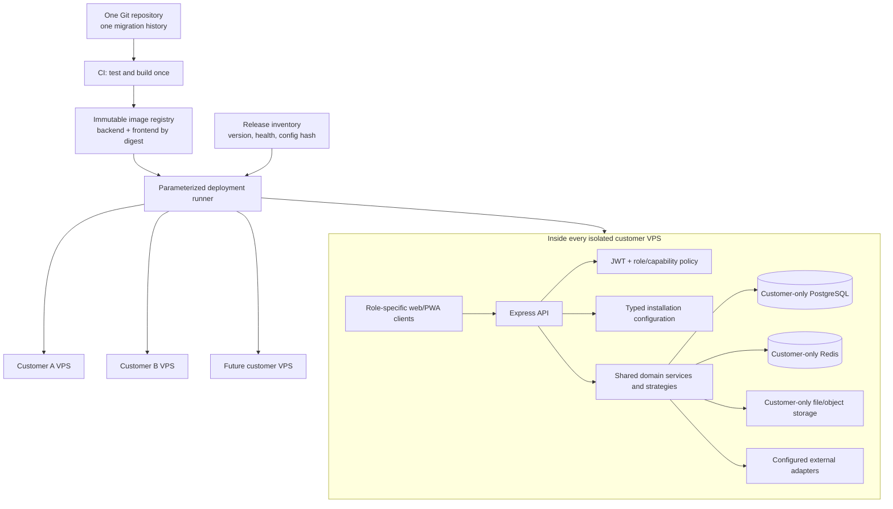

# Multi-Customer Product Roadmap

**Product:** TingTing logistics and fleet-management platform

**Customer requirement source:** `logistic-software-requirements.pdf` — Silver Sea, 5 pages (page 4 is blank)

**Review date:** 2026-07-13

**Status:** Technical discovery and implementation roadmap; no application changes are included

## 1. Executive summary

The Silver Sea requirements can be accommodated in TingTing without a customer-specific code fork. Each customer will run a physically isolated installation: its own VPS, PostgreSQL database, Redis instance, file/object storage, domain, secrets, backups, and runtime configuration. All installations use the same source repository, migration stream, and immutable backend/frontend images. The existing system already provides a strong portion of the requested capability: customer/route pricing, driver and forwarder mobile portals, container/seal OCR, trip expenses with receipt photos, advance settlement, debit-note generation, dashboards, audit logs, and a text-based AI assistant.

The largest gaps are architectural rather than cosmetic:

1. **Repeatable deployment and configuration are the product foundation.** The current production and demo already use the same images with separate databases, but deployment configuration is customer-specific and partly embedded in host files. Scaling to many customers requires one parameterized deployment template, immutable image versions, per-installation configuration, automated backup/migrate/health-check/rollback, and a release inventory.
2. **Silver Sea organizes work around a shipment/lot created by Documentation, while the current core aggregate is a standalone Trip.** A shipment layer is needed above Trips so several containers, dispatches, and field expenses can share one commercial reference.
3. **The fuel models conflict.** The current NEPO behavior calculates a trip fuel allowance from global loaded/empty norms, route legs, or a flat-rate override. Silver Sea requires actual full-tank refuel events, pump-photo OCR, location/time evidence, and supplier-invoice reconciliation. Both can coexist behind an explicit installation-level fuel-control policy.
4. **The expense approval models conflict.** The current forwarder workflow accepts pending expenses atomically when an advance settlement is approved. Silver Sea describes accountant approval of field expenses after paper-document checking, before official recognition. This requires a configurable approval policy, not duplicate expense implementations.
5. **Configuration drift is the main multi-customer risk.** Customer differences must live in validated database settings, role/capability policies, catalogs, or integration adapters—not branches, customer-specific images, manually edited code, or `if customer === ...` checks.

The recommendation is one codebase with:

- a shared domain core and one migration history;
- one immutable backend image and one immutable frontend image per release;
- physically isolated customer installations;
- typed, versioned instance settings with safe defaults that preserve current NEPO behavior;
- configurable workflow policies only where real customer differences exist;
- shipment, refuel, billing-cycle, and port-tariff domain modules;
- role/capability policies rather than customer-name checks;
- automated provisioning, upgrades, backups, health checks, and rollback for every VPS.

The Silver Sea document promises a two-month delivery, but the repository evidence does not support accepting that commitment for the complete scope. Deployment automation, shipment modeling, new fuel evidence, voice AI, mobile workflows, and customer-controlled operations are multiple medium or large changes. Phase 0 must agree an MVP cut and acceptance data before any schedule is committed.

## 2. Scope

### In scope

- Normalize all requirements in the Silver Sea PDF.
- Compare them with the current repository, domain rules, APIs, database, UI, RBAC, settings, tests, and deployment model.
- Identify gaps, contradictions, ambiguities, and compatible reuse.
- Recommend a maintainable multi-customer architecture and configuration model.
- Define how one release is safely deployed to multiple isolated VPS installations.
- Define a phased implementation and migration roadmap.

### Out of scope

- Implementing the roadmap.
- Modifying application code, migrations, or existing documentation.
- Committing delivery dates, commercial warranty terms, or support obligations.
- Treating the requested “three mobile apps” as necessarily three native binaries before offline, device, and app-store needs are confirmed.
- Inferring requirements from the blank PDF page 4.
- Building a shared database, shared VPS, customer switcher, or cross-customer reporting control plane.

## 3. Documents and repository areas reviewed

### Customer inputs

- `/Users/dev/Downloads/logistic-software-requirements.pdf`, pages 1–5.
- `/Users/dev/.codex/attachments/c5a7e2e5-d401-4405-8f1e-2c807d2b0774/pasted-text.txt`, which defines the requested review and roadmap format.

### Product and domain documentation

- `README.md` — product, packages, roles, commands, and deployment entry points.
- `CONTEXT.md` — authoritative NEPO domain rules, including trip lifecycle, fuel, ledger, expense approval, and driver behavior.
- `docs/project-overview-pdr.md:1` — current single-company application scope, which remains appropriate inside each isolated installation.
- `docs/system-architecture.md:1` — request flow, data flow, RBAC, agent, storage, Redis, and observability.
- `docs/project-roadmap.md:1` — shipped and planned capability inventory.
- `docs/deployment-guide.md:5` — current dev, production, and demo environments; production and demo use separate databases.
- Relevant flow documents under `docs/flows/`, especially trip lifecycle, system configuration, forwarder/advance, dashboard/reporting, and user administration.

### Implementation areas

- **Identity and isolation:** `backend/src/middleware/auth.ts:8` (`AuthUser`), `backend/src/routes/auth.ts:37` (JWT issuance), `backend/src/db/schema.ts:49` (`users`).
- **Authorization:** `shared/src/constants/index.ts:27` (`Role`), `backend/src/casbin/policy.csv:1`, `backend/src/middleware/casbin.ts:1`, `frontend/src/App.tsx:85`.
- **HTTP composition:** `backend/src/index.ts:60`–`146`.
- **Data model:** `backend/src/db/schema.ts:22`–`1198`.
- **Trip lifecycle and pricing:** `backend/src/routes/trips.ts:50`, `backend/src/services/trip-mutations.service.ts:138`, `backend/src/services/trip-status-machine.service.ts:11`.
- **Driver portal:** `backend/src/routes/driver.ts:21`, `frontend/src/pages/DriverTripDetailPage.tsx:1`.
- **Forwarder/OP-like workflows:** `backend/src/routes/forwarder.ts:44`, `backend/src/services/forwarder.service.ts:147`, `backend/src/services/advance.service.ts:613`, `frontend/src/pages/ForwarderTripDetailPage.tsx:29`.
- **Container/seal OCR and media:** `backend/src/routes/ocr.ts:126`, `backend/src/routes/upload.ts:49`, `backend/src/services/ocr.service.ts:386`.
- **Billing:** `backend/src/db/schema.ts:409`, `backend/src/services/billingDocument.service.ts:173` and `:617`.
- **Configuration:** `backend/src/db/schema.ts:930`, `backend/src/db/schema.ts:941`, `backend/src/routes/config.ts:72`, `backend/src/services/company-info.service.ts:12`, `backend/src/routes/llm-settings.ts:39`.
- **Dashboard and assistant:** `frontend/src/pages/DashboardPage.tsx:20`, `backend/src/services/dashboard-stats.service.ts:1`, `backend/src/routes/agent.ts:1`, `backend/src/agentSocket.ts:30`.
- **Audit:** `backend/src/middleware/audit.ts:125`, `backend/src/db/schema.ts:915`.
- **Tests:** current `*.test.ts(x)` suites under `backend/src/tests/`, `shared/src/`, and `frontend/src/`; package commands in `backend/package.json`, `frontend/package.json`, and `shared/package.json`.
- **Deployment:** `docs/deployment-guide.md:71`, `deploy/docker-compose.prod.yml:1`.

## 4. Assumptions

Facts, assumptions, interpretations, and recommendations are kept separate below.

### Facts

- Only one new-customer PDF was supplied. Therefore, no direct contradiction between two new-customer PDFs can be proven.
- Existing NEPO behavior is treated as the default installation baseline because it is encoded in `CONTEXT.md` and the implementation.
- Each installation serves exactly one trucking company. A user never selects or switches between companies inside one installation.
- “Customer” in the deployment roadmap means a trucking company operating its own TingTing installation. The existing `customers` table continues to mean that trucking company's transport clients; it must not be reused as an installation registry.
- The PDF uses “Cust/Cớt App” for Documentation staff, not necessarily an external Customer app; the intended spelling and audience require confirmation.
- PDF page 4 contains no substantive requirement text.

### Working assumptions requiring confirmation

- A Silver Sea “lô hàng” is a Shipment/Job that may contain one or more containers and may produce one or more Trips.
- “Hai lệnh điều động trong ngày cho cùng một xe” may mean two visible sequential orders, not two physically simultaneous active journeys. The current system blocks simultaneous `IN_TRANSIT` trips for one truck.
- “Ba ứng dụng di động độc lập” describes separated user experiences and permissions; it does not by itself prove a need for three native app-store applications.
- “Tự sở hữu dữ liệu và không có sự can thiệp từ nhà cung cấp” requires Silver Sea's isolated VPS and database to use customer-controlled access, keys, and backups. The exact support-access procedure is a contractual decision.
- Fuel-photo location/time is evidentiary, not a trusted anti-fraud signal unless device attestation and capture-time controls are added.

### Default-preservation rule

All migrations and settings must preserve current behavior for the existing NEPO installation unless an explicit approved change says otherwise. In particular:

- trip remains the current work unit by default;
- one truck may have only one active `IN_TRANSIT` trip by default;
- fuel remains the current normative/allowance model by default;
- driver expense entry remains disabled by default;
- forwarder expenses remain settlement-atomic by default;
- the current five roles remain available;
- local file storage and current chatbot environment gating remain valid deployment defaults.

## 5. Current architecture summary

### Application structure

TingTing is a React SPA backed by an Express v5 API, shared TypeScript/Zod contracts, PostgreSQL through Drizzle ORM, Redis, local file storage, Socket.io, and an LLM integration. The API applies JWT authentication, Casbin resource authorization, global mutation auditing, route/service business logic, error handling, and response serialization (`backend/src/index.ts:60`–`146`; `docs/system-architecture.md:24`).

### Current single-company boundary is compatible with isolated installations

- `AuthUser` contains `userId`, identity fields, and `role` (`backend/src/middleware/auth.ts:8`–`15`). It does not need a tenant claim because one deployed application connects to exactly one company database.
- `users`, `trips`, `customers`, `ledger`, and `app_settings` are installation-local tables (`backend/src/db/schema.ts:49`, `:172`, `:282`, `:374`, `:941`). Their global uniqueness constraints are correctly global within that one company's database.
- No `tenant_id`, tenant membership table, Row-Level Security policy, or customer switcher is required for the chosen architecture.
- Physical isolation is provided by separate VPS/network, database, Redis, storage, secrets, and backups. Application authorization still enforces roles and record ownership within each company.

The architectural gap is therefore not runtime multi-tenancy. It is **repeatable instance lifecycle management**: creating, configuring, upgrading, observing, backing up, and rolling back many installations without code or configuration drift.

### Existing product-variation mechanisms

The repository already demonstrates several useful patterns:

- Configurable catalogs through `createCrudRouter()` and `/api/config` routes (`backend/src/routes/config.ts:90`–`159`).
- Singleton operational configuration in `fuel_config` and `road_config` (`backend/src/db/schema.ts:248`, `:930`).
- Key/value `app_settings` used for company identity and LLM provider settings (`backend/src/db/schema.ts:941`; `backend/src/services/company-info.service.ts:12`; `backend/src/routes/llm-settings.ts:41`).
- Per-customer debit-note template selection with frozen historical snapshots (`backend/src/db/schema.ts:182`–`184`; `backend/src/services/billingDocument.service.ts:183`–`217`).
- Environment-level assistant enablement (`backend/src/routes/agent.ts:23`–`29`).
- Casbin resource policies plus route-level role checks (`backend/src/casbin/policy.csv:1`; `backend/src/index.ts:92`–`140`).

These are good foundations but not a complete per-installation configuration platform: settings have no declared type, schema version, effective period, before/after audit record, dependency validation, exportable non-secret manifest, or general resolution service.

### Existing functional reuse relevant to Silver Sea

- Customer × Route × effective-date pricing and automatic trip revenue (`backend/src/db/schema.ts:223`–`234`; `backend/src/services/trip-mutations.service.ts:165`–`179`).
- Driver-assigned trip list/detail and trip instructions (`backend/src/routes/driver.ts:21`–`45`; `backend/src/db/schema.ts:767`–`781`).
- Container and multiple-seal records (`backend/src/db/schema.ts:725`–`765`).
- Container/seal OCR with driver ownership checks and user confirmation before committing recognized values (`backend/src/routes/ocr.ts:91`–`137`).
- Forwarder mobile trip expenses, invoice data, receipt photos, advances, and settlements (`backend/src/routes/forwarder.ts:86`–`336`; `backend/src/db/schema.ts:783`–`894`).
- Pending forwarder expenses approved atomically as part of settlement approval (`backend/src/services/forwarder.service.ts:203`–`223`; `backend/src/services/advance.service.ts:633`–`722`).
- Configurable debit-note layouts and explicit document date ranges (`backend/src/db/schema.ts:409`–`494`; `backend/src/services/billingDocument.service.ts:617`–`640`).
- Dashboard revenue, profit, top trucks/routes, cost structure, and fleet utilization (`frontend/src/pages/DashboardPage.tsx:64`–`193`).
- Office-role text assistant over Socket.io (`backend/src/agentSocket.ts:30`–`37`, `:83`–`104`).
- Mutation auditing with sanitized payload, actor, IP, entity, and path (`backend/src/middleware/audit.ts:125`–`220`; `backend/src/db/schema.ts:915`–`926`).
- Production and demo already deploy the same images with separate databases, proving that one codebase can serve isolated deployments (`docs/deployment-guide.md:71`–`88`, `:129`–`148`).

## 6. Requirements inventory

**Priority note:** the PDF does not assign per-requirement MoSCoW or numeric priorities. “Not stated” is therefore recorded rather than inferred. The terms “core objective” and “core process” are retained in the summaries where applicable.

| ID | Source | Requirement summary and expected behavior | Role(s) | Priority | Dependencies | Ambiguities / unanswered questions |
|---|---|---|---|---|---|---|
| SILVER-REQ-001 | PDF p.1 §1 | Support a fleet of about 39–40 trucks, more than 100 plans/trips per day, and both FCL and LCL operations without proportional office headcount growth. | All/Operations | Not stated | Capacity model, FCL/LCL domain model, performance tests | “100 chuyến/kế hoạch” may distinguish plans from executed trips; LCL grouping rules are absent. |
| SILVER-REQ-002 | PDF p.1 §1, core objective | Enter data once at its source—Driver, OP, or Documentation—and synchronize it through the system. | Driver, OP, Documentation | Not stated | Shared shipment identity, event/API contracts, mobile connectivity | Offline behavior and conflict resolution are not specified. |
| SILVER-REQ-003 | PDF p.1 §1, core objective | Accounting verifies, reconciles, and approves data without re-entering field slips. | Accountant | Not stated | Source-entry workflows, approval queue, evidence | Which financial fields Accounting may correct is not stated. |
| SILVER-REQ-004 | PDF p.1 §1, core objective | Field staff, drivers, Documentation, and directors can work anywhere through mobile experiences. | Driver, OP, Documentation, Director | Not stated | Responsive/PWA/native decision, connectivity, auth | Offline and device-platform requirements are absent. |
| SILVER-REQ-005 | PDF pp.1–2 §2 | Provide three role-specific mobile applications: Driver, OP, and Documentation (Cust/Cớt). | Driver, OP, Documentation | Not stated | UI shell, role policies, release model | “Independent apps” may mean separate binaries or separated portals. |
| SILVER-REQ-006 | PDF p.1 §2, Driver App | Driver receives detailed transport orders, including factory/depot instructions and lift-on/lift-off invoice information. | Driver | Not stated | Shipment/trip, dispatch, instructions, billing evidence | Exact required order fields are not listed. |
| SILVER-REQ-007 | PDF p.1 §2, Driver App | Support two-way freight by showing two dispatch orders in parallel for the same vehicle on the same day. | Driver, Dispatcher | Not stated | Dispatch policy, sequencing, conflict validation | Must both orders be `IN_TRANSIT`, or only visible/scheduled together? |
| SILVER-REQ-008 | PDF p.1 §2, Driver App | After container pickup or delivery, capture container/seal photos and recognize the identifiers automatically. | Driver | Not stated | Camera upload, OCR, container/seal records | Required confidence threshold and manual-confirmation policy are absent. |
| SILVER-REQ-009 | PDF p.1 §2, Driver App | Driver enters lifting/lowering amounts and incidental travel expenses directly into the system. | Driver | Not stated | Expense permissions, categories, approval policy | Whether these are claims, cash disbursements, or customer recharges is unclear. |
| SILVER-REQ-010 | PDF p.2 §2, OP App | OP performs cash-advance and disbursement/settlement procedures on mobile. | OP | Not stated | Advance ledger, expense workflow, mobile UI | Approval limits and cash custodians are absent. |
| SILVER-REQ-011 | PDF p.2 §2, OP App | Suggest a configured port tariff (example: Nam Đình Vũ lift fee 2,000,000 VND), while allowing manual actual amounts. | OP | Not stated | Port tariff catalog, effective dates, override audit | Tariff dimensions, VAT, container type, customer markup, and override limits are absent. |
| SILVER-REQ-012 | PDF p.2 §2, OP App | Capture and upload disbursement invoices/evidence at the port. | OP | Not stated | Secure file storage, expense linkage, photo access | Accepted document types and retention period are absent. |
| SILVER-REQ-013 | PDF p.2 §2, Documentation App | Create basic shipment information quickly after hours or on holidays. | Documentation | Not stated | Shipment aggregate, role permissions, mobile form | Who may amend/cancel a created shipment is absent. |
| SILVER-REQ-014 | PDF p.2 §2, Documentation App | Minimal shipment fields: Bill number, container number, customs declaration number, and delivery date. | Documentation | Not stated | Shipment/container schema, validation | Cardinality—one Bill to many containers/declarations—is not specified. |
| SILVER-REQ-015 | PDF p.2 §2, Documentation App | Synchronize entries immediately to the central system without returning to an office LAN computer. | Documentation | Not stated | Cloud API, online sync, conflict handling | “Immediate” latency target and offline queue behavior are absent. |
| SILVER-REQ-016 | PDF p.3 §3.1 steps 1–2 | Documentation creates a shipment first; OP selects that shipment when entering port expenses. | Documentation, OP | Not stated | Shipment identity and expense linkage | Relationship between shipment, trip, container, and customer order needs confirmation. |
| SILVER-REQ-017 | PDF p.3 §3.1 step 2 | Expenses entered by multiple OP users remain pending and aggregate under one shipment code. | OP | Not stated | Multi-actor expense model, pending state, shipment totals | Duplicate detection and ownership/edit rules are absent. |
| SILVER-REQ-018 | PDF p.3 §3.1 step 3 | On the next day, Accounting checks original paper documents and approves costs for official recognition. | Accountant | Not stated | Approval state machine, evidence checklist, accounting posting | Per-line versus per-settlement approval is not explicit. |
| SILVER-REQ-019 | PDF p.3 §3.1 step 4 | Classify customer disbursements and let Accounting assign a shipment to the appropriate Debit Note period, including customer cutoffs such as the 25th or 30th. | Accountant | Not stated | Expense classification, customer billing-cycle policy, debit notes | Whether assignment may cross accounting periods after approval is unclear. |
| SILVER-REQ-020 | PDF p.3 §3.1 table | Invoice-required disbursements include storage, lifting/lowering, infrastructure, and port-yard fees; require photographed or synchronized e-invoice evidence before approval. | OP, Accountant | Not stated | Expense-type document policy, e-invoice adapter | “Four basic types” may be initial defaults, not an exhaustive fixed enum. |
| SILVER-REQ-021 | PDF p.3 §3.1 table | Non-invoice customs-supervision/customs disbursements post directly to the customer account and are reviewed after the fact. | OP, Accountant | Not stated | Expense classification, customer ledger, post-audit queue | Required evidence and whether approval is bypassed are unclear. |
| SILVER-REQ-022 | PDF p.3 §3.2 | Silver Sea does not allocate a fixed fuel amount to drivers; drivers refill the tank and actual refuels are controlled. | Driver, Accountant | Not stated | Instance fuel policy, refuel-event model | “Fill the tank” measurement and opening/closing tank assumptions are absent. |
| SILVER-REQ-023 | PDF p.3 §3.2 | Configure consumption norms by vehicle model and fixed distance by frequently used route. | Admin, Accountant | Not stated | Vehicle model catalog, fuel norms, routes | Whether trailer/load type modifies a model norm is absent. |
| SILVER-REQ-024 | PDF p.3 §3.2 | Driver photographs the pump display showing liters, unit price, and total on each refuel. | Driver | Not stated | Fuel-event mobile flow, secure media | Whether gallery uploads are allowed versus live camera only is absent. |
| SILVER-REQ-025 | PDF p.3 §3.2 | AI extracts liters, unit price, total, capture time, and refuel location from the image and metadata without manual entry. | Driver, Accountant | Not stated | Fuel OCR, metadata extraction, geolocation/privacy policy | EXIF may be absent or spoofed; fallback and confidence rules are absent. |
| SILVER-REQ-026 | PDF p.3 §3.2 | At month end, reconcile total actual refuel quantity against the fuel supplier's invoice and report variance. | Accountant | Not stated | Fuel fills, supplier invoice import, reconciliation periods | Invoice format, tolerance, and multi-supplier rules are absent. |
| SILVER-REQ-027 | PDF p.3 §3.3 | Configure customer × route rates and automatically apply contracted freight price during trip planning. | Dispatcher, Accountant | Not stated | Pricing catalog, effective dates | Container/type modifiers and overlapping rates are not specified. |
| SILVER-REQ-028 | PDF p.3 §3.3 | Track non-transport revenue/margin, including LCL combinations, vehicle combinations, and lift-fee invoice margin. | Accountant, Director | Not stated | Revenue classification, expense buy/sell amounts, reports | Whether these are trip-level, shipment-level, or standalone revenues is unclear. |
| SILVER-REQ-029 | PDF p.5 §4 | Mobile director dashboard shows daily cash flow, per-truck operating efficiency, two-way combination ratio, and revenue from external vehicles. | Director | Not stated | Analytics definitions, responsive UI, external-carrier data | “Cash flow” basis and the denominator for combination ratio need definition. |
| SILVER-REQ-030 | PDF p.5 §4 | AI assistant answers internal-data analysis questions immediately by voice or text. | Director | Not stated | Instance-local semantic layer, LLM, speech input, authorization | Voice provider, retention, supported questions, and SLA are absent. |
| SILVER-REQ-031 | PDF p.5 §4 | Strong permissions for Admin, Director, Accountant, Dispatcher, Documentation, OP, and Driver groups. | All | Not stated | Instance role/capability policy | Whether one user may hold several roles is not stated. |
| SILVER-REQ-032 | PDF p.5 §4 | Preserve detailed history for all add, edit, and delete operations. | Admin/Auditor | Not stated | Audit service, retention, export | Required retention and whether reads/approvals must also be audited are absent. |
| SILVER-REQ-033 | PDF p.5 §4 | Deploy on company-owned dedicated cloud, with company data ownership and no software-provider intervention/access. | Company/Admin | Not stated | Dedicated deployment, access control, backups, support contract | “Cloud riêng” ownership, operator, break-glass support, and key custody require agreement. |
| SILVER-REQ-034 | PDF p.5 §5, Phase 1 | Weeks 1–4 deliver desktop shipment entry, OP port payment, accountant cost approval, and Driver order/progress flow. | Delivery team | Stated: Phase 1 | Scope decisions, acceptance examples, environments | A four-week commitment is stated without technical acceptance criteria. |
| SILVER-REQ-035 | PDF p.5 §5, Phase 1 | Silver Sea supplies standard Excel P&L and disbursement forms for algorithm design. | Customer/Delivery team | Stated dependency | Customer artifacts, data mapping | Files were not supplied in this review. |
| SILVER-REQ-036 | PDF p.5 §5, Phase 2 | Weeks 5–8 deliver Documentation App, smart fuel, director dashboard with AI, and user permissions. | Delivery team | Stated: Phase 2 | Phase 1, fuel/AI decisions, deployment automation | Scope is too broad to validate against the stated duration without an MVP cut. |
| SILVER-REQ-037 | PDF p.5 §5, Phase 2 | Run a parallel pilot, test defects, and synchronize company-wide data. | All/Delivery team | Stated: Phase 2 | Migration plan, training data, support, rollback | Pilot population, success metrics, and source systems are absent. |
| SILVER-REQ-038 | PDF p.5 §5, post-handover | Hand over the system and train staff and drivers on site. | Delivery team/All users | Not stated | Training plan, environments, materials | Number of sessions, location, and acceptance evidence are absent. |
| SILVER-REQ-039 | PDF p.5 §5, post-handover | One-year free warranty covers defects and UI adjustments requested by the customer. | Commercial/support | Stated: one year | Contract, severity/SLA, change-control boundary | “UI adjustment” versus chargeable feature change is undefined. |
| SILVER-REQ-040 | PDF p.5 §5, post-handover | Lifetime technical support. | Commercial/support | Stated: lifetime | Contract, SLA, hosting/access model | Duration, response targets, exclusions, and conflict with no-provider-access policy are undefined. |

## 7. Requirement-to-implementation traceability matrix

Classification reflects the current workspace, not the project roadmap's claims alone.

| ID | Classification | Current evidence | Exact gap / disposition |
|---|---|---|---|
| SILVER-REQ-001 | Partially implemented | Paginated trip list at `backend/src/routes/trips.ts:50`–`70`; trip indexes at `backend/src/db/schema.ts:351`–`357`; configurable cargo types at `:214`–`221`. | No explicit Shipment/Plan or LCL consolidation model and no evidence-based load test for 100+ daily plans. |
| SILVER-REQ-002 | Partially implemented | Driver container entry (`backend/src/routes/driver.ts:77`–`155`) and forwarder expense entry (`backend/src/routes/forwarder.ts:86`–`126`) flow directly to shared records. | Documentation source entry and shipment-wide propagation are missing; Accounting still enters/updates trip figures. |
| SILVER-REQ-003 | Implemented differently / conflict | Accounting-capable routes update pre-departure and actual figures (`backend/src/routes/trips.ts:173`–`199`). | Current workflow expects office figure entry; Silver Sea expects source entry with Accounting acting mainly as reviewer. Introduce configurable field ownership and approval, not a global behavior change. |
| SILVER-REQ-004 | Partially implemented | Driver and Forwarder portal routes exist (`frontend/src/App.tsx:28`–`39`); dashboard is responsive React UI. | No Documentation portal, explicit offline support, or verified mobile director acceptance. |
| SILVER-REQ-005 | Implemented differently | One SPA selects role-specific routes (`frontend/src/App.tsx:85`–`110`) rather than three separately released applications. | Confirm whether role-separated PWA portals satisfy the requirement; separate binaries add release and maintenance cost without proven need. |
| SILVER-REQ-006 | Partially implemented | Driver list/detail at `backend/src/routes/driver.ts:21`–`45`; one trip instruction row at `backend/src/db/schema.ts:767`–`781`. | Detailed factory/depot structure and lift invoice information are not modeled as a complete order payload. |
| SILVER-REQ-007 | Conflicts with current implementation / ambiguous | Dispatch explicitly rejects another `IN_TRANSIT` trip for the same truck (`backend/src/services/trip-status-machine.service.ts:43`–`71`). | Sequential same-day orders already can exist, but concurrent active orders cannot. Stakeholder must define intended status semantics. |
| SILVER-REQ-008 | Fully implemented | OCR recognizes container/seal data and enforces trip ownership (`backend/src/routes/ocr.ts:91`–`184`); driver confirms before saving (`backend/src/routes/driver.ts:77`–`100`). | Add configurable evidence timing; retain manual confirmation. |
| SILVER-REQ-009 | Not implemented / conflicts with current role contract | Driver routes expose trips, containers, earnings, penalties, and photo deletion, but no expense mutation (`backend/src/routes/driver.ts:21`–`166`); NEPO Driver is read-only for financials in `CONTEXT.md`. | Add an instance role/capability for expense capture; do not make all drivers financial editors. |
| SILVER-REQ-010 | Partially implemented | Forwarder mobile APIs include advance requests and settlements (`backend/src/routes/forwarder.ts:174`–`269`). | Role terminology and exact OP cash workflow need mapping; shipment linkage is missing. |
| SILVER-REQ-011 | Not implemented | Ports contain identity/address only (`backend/src/db/schema.ts:698`–`708`); expense types have no port-rate matrix (`:710`–`721`). | Add effective-dated Port × Service × container/customer dimensions and auditable override behavior. |
| SILVER-REQ-012 | Fully implemented for the analogous Forwarder role | Expense-photo endpoints at `backend/src/routes/forwarder.ts:271`–`335`; secure photo rows at `backend/src/db/schema.ts:813`–`823`. | Extend to OP capability and keep evidence inside that installation's isolated storage; define document policy by expense type. |
| SILVER-REQ-013 | Not implemented | Trip creation is limited to Admin/Manager (`backend/src/routes/trips.ts:73`–`78`); no Documentation role or Shipment table exists. | Add Documentation role template and mobile Shipment quick-create. |
| SILVER-REQ-014 | Not implemented as a shipment contract | Trip has only a generic `customerReference` (`backend/src/db/schema.ts:282`–`297`); customs declaration currently belongs to a trip expense (`:792`–`802`). | Add normalized Shipment/Bill/Container/Declaration data with confirmed cardinalities. |
| SILVER-REQ-015 | Partially implemented | Current browser portals write to central APIs immediately. | No offline queue, sync conflict policy, or latency SLA is implemented/evidenced. |
| SILVER-REQ-016 | Conflicts with current data model | `trip_expenses.trip_id` is mandatory (`backend/src/db/schema.ts:783`–`786`); Trip is the current work aggregate. | Add Shipment above Trip and permit expenses to link to shipment/container, with optional derived Trip allocation. |
| SILVER-REQ-017 | Partially implemented | Forwarder-created costs default to `PENDING` (`backend/src/services/forwarder.service.ts:203`–`223`). | Costs aggregate by Trip/container, not one shipment code; multi-OP linkage and ownership rules are required. |
| SILVER-REQ-018 | Conflicts with current approval implementation | Settlement approval atomically converts linked pending expenses to approved (`backend/src/services/advance.service.ts:633`–`722`). | Add policy `SETTLEMENT_ATOMIC` versus `LINE_ITEM_DOCUMENT_CHECK`; preserve atomic mode for NEPO. |
| SILVER-REQ-019 | Partially implemented | Billing draft accepts explicit `rangeFrom`/`rangeTo` (`backend/src/services/billingDocument.service.ts:617`–`640`); customer has `debitNoteMode` (`backend/src/db/schema.ts:182`). | No effective-dated customer cutoff/cycle policy or explicit “assigned billing period” on shipment/expense. |
| SILVER-REQ-020 | Partially implemented | Configurable expense types, invoice fields, and photos exist (`backend/src/db/schema.ts:710`–`823`). | Type-level `requires_document`, allowed evidence, pre-approval validation, and e-invoice adapter are absent. |
| SILVER-REQ-021 | Partially implemented | Approved service-fee sell amounts post to Customer ledger and appear in debit notes (`backend/src/services/advance.service.ts:718`–`735`; `backend/src/services/billingDocument.service.ts:600`–`614`). | No policy-driven post-audit bypass for non-invoice expense types; direct posting timing needs a stakeholder decision. |
| SILVER-REQ-022 | Conflicts with current default model | Current Trip stores normative/override fuel fields and snapshots (`backend/src/db/schema.ts:248`–`268`, `:298`–`320`). | No first-class actual refuel-event ledger. Support both through `fuel.control_mode`; do not replace NEPO calculations. |
| SILVER-REQ-023 | Partially implemented / data-model conflict | Routes have fixed distance and default legs (`backend/src/db/schema.ts:200`–`212`); fuel norms are global singleton values (`:248`–`259`); Truck has no model reference (`:66`–`83`). | Add vehicle model and effective-dated norm tables; resolve by the installation's fuel policy. |
| SILVER-REQ-024 | Not implemented | Trip photo enum is only `CONTAINER`, `SEAL`, `OTHER` (`backend/src/db/schema.ts:32`, `:953`–`969`). | Add FuelFill and fuel evidence rather than overloading generic Trip photos. |
| SILVER-REQ-025 | Not implemented for fuel; conflicts with media processing | Container/seal VLM OCR exists, but upload processing auto-orients and strips EXIF before storage (`backend/src/routes/upload.ts:73`–`105`; `backend/src/services/ocr.service.ts:391`–`396`). | Extract and validate metadata before sanitization; store normalized evidence separately with consent and confidence. |
| SILVER-REQ-026 | Not implemented | Fuel cost/price history exists, but no fill-event or supplier-invoice reconciliation tables are present (`backend/src/db/schema.ts:248`–`268`). | Add reconciliation periods, invoice import, matching, tolerances, and variance reports. |
| SILVER-REQ-027 | Fully implemented | Effective-dated Customer × Route pricing (`backend/src/db/schema.ts:223`–`234`) is resolved and applied on Trip creation (`backend/src/services/trip-mutations.service.ts:165`–`179`). | Extend dimensions only if Silver Sea contracts require them; do not build a generic pricing engine prematurely. |
| SILVER-REQ-028 | Partially implemented | Trip has `revenueCombine` and external carrier fields (`backend/src/db/schema.ts:325`–`346`); expenses store buy/sell amounts (`:783`–`805`). | Add explicit revenue categories and shipment/trip allocation; report LCL, combination, and lift margin separately. |
| SILVER-REQ-029 | Partially implemented | Dashboard provides daily/monthly revenue/profit, top trucks/routes, costs, and utilization (`frontend/src/pages/DashboardPage.tsx:64`–`193`). | Missing defined daily cash-flow basis, two-way ratio, and dedicated external-vehicle revenue KPI; mobile QA is needed. |
| SILVER-REQ-030 | Partially implemented | Text assistant is present and role-gated (`backend/src/routes/agent.ts:1`–`29`; `backend/src/agentSocket.ts:30`–`37`). | No voice input was found. Each assistant already operates against its installation's isolated database; add voice/privacy controls and retain role filtering. |
| SILVER-REQ-031 | Partially implemented | Fixed roles are ADMIN, MANAGER, ACCOUNTANT, DRIVER, FORWARDER (`shared/src/constants/index.ts:27`–`33`) with Casbin policies (`backend/src/casbin/policy.csv:1`–`65`). | Missing distinct Dispatcher, Documentation, and OP templates; fixed enum expansion for every customer will not scale. |
| SILVER-REQ-032 | Fully implemented for successful mutations and denied access | Global middleware audits POST/PUT/PATCH/DELETE, sanitizes secrets, and captures actor/IP/payload (`backend/src/middleware/audit.ts:125`–`220`). | Add installation identity to exported logs, setting before/after values, retention policy, and customer-controlled export. |
| SILVER-REQ-033 | Partially implemented; target architecture confirmed | Current production runs on one DigitalOcean droplet (`docs/deployment-guide.md:71`–`80`); the same images already run against an isolated demo database (`:129`–`148`). | Standardize this proven pattern for every customer: separate VPS/database/storage/secrets, one parameterized deployment template, and customer-controlled access governance. |
| SILVER-REQ-034 | Ambiguous delivery constraint | Current product reuses many requested parts, but Shipment, Documentation role, and policy-driven expense approval are absent. | Rebaseline after Phase 0; do not promise complete scope in four weeks without acceptance examples. |
| SILVER-REQ-035 | Not applicable to implementation yet | No Silver Sea Excel forms were supplied. | Required discovery input; inventory and map them before financial algorithm changes. |
| SILVER-REQ-036 | Ambiguous delivery constraint | Fuel event/OCR/reconciliation, voice AI, repeatable VPS deployment, and new RBAC are not small changes. | Define Phase-2 MVP; no evidence supports the full week-5–8 commitment. |
| SILVER-REQ-037 | Not implemented as a Silver Sea rollout | Deployment docs cover current environments, not a parallel Silver Sea migration (`docs/deployment-guide.md:5`–`13`). | Define pilot cohort, data sources, reconciliation, support, and rollback. |
| SILVER-REQ-038 | Not applicable to code | Training is a delivery artifact. | Create materials and attendance/acceptance evidence after workflows stabilize. |
| SILVER-REQ-039 | Not applicable to code / commercial decision | No repository artifact can establish warranty scope. | Contract must distinguish defects, configuration, UI adjustment, and new features. |
| SILVER-REQ-040 | Not applicable to code / commercial decision | No repository artifact can establish lifetime support terms. | Reconcile with the provider-no-access requirement and define customer-operated diagnostics/break-glass access. |

Coverage check: all 40 inventory IDs appear exactly once in this traceability matrix.

## 8. Contradictions and conflict analysis

No contradiction was found within the Silver Sea PDF itself. Page 4 is blank. Because only one external customer PDF was supplied, direct PDF-to-PDF customer conflicts cannot be assessed. The table below compares Silver Sea with the current NEPO product behavior and architecture.

| Conflict | Requirements | Affected implementation | Severity | Can both coexist? | Recommended resolution / decision |
|---|---|---|---|---|---|
| One codebase versus manually customized deployments | All functional requirements | Production and demo already use the same images but separate host paths/databases (`docs/deployment-guide.md:7`–`13`, `:129`–`148`). However, production Compose uses hardcoded NEPO names/paths/domain, mutable `:latest` images, and a fallback database password (`deploy/docker-compose.prod.yml:1`–`54`). Copying this file per customer would create drift and secret risk. | **Critical operational risk** | Yes. | Build one parameterized Compose/deployment template, require immutable image digests and generated unique credentials, use a per-instance non-secret manifest plus protected secret file/store, maintain a release inventory, and automate preflight/backup/migrate/health-check/rollback. Never edit application code on a customer VPS. |
| Configuration drift between isolated installations | All configurable behavior | Current `app_settings` is untyped key/value storage (`backend/src/db/schema.ts:941`–`946`) and other settings live in singleton/catalog tables. | **High** | Yes. | Add a typed setting registry, schema versions, config audit, validation, export/diff tooling, and migration rules that preserve local overrides. |
| Shipment-first work versus Trip-only aggregate | SILVER-REQ-013–019 | Mandatory `trip_expenses.trip_id`; Trip owns customer/route/container (`backend/src/db/schema.ts:282`, `:725`, `:783`). | **High** | Yes. | Add Shipment/Job above Trips. Keep `TRIP_ONLY` as the default instance setting and enable `SHIPMENT_AND_TRIP` where required. Confirm cardinalities first. |
| Line-item document approval versus settlement-atomic approval | SILVER-REQ-018, 020–021 | `approveAdvanceSettlement()` approves linked pending costs atomically (`backend/src/services/advance.service.ts:633`–`722`). | **High** | Yes. | Typed `expense.approval_mode`, category document policies, explicit state machine, and accounting-posting event. Never branch on installation/customer name. |
| Actual-refill control versus normative fuel allowance | SILVER-REQ-022–026 | Global norms and per-trip calculations (`backend/src/db/schema.ts:248`–`268`, `:298`–`320`). | **High** | Yes. | Store `fuel.control_mode` in each installation's settings: `NORMATIVE_ALLOWANCE | ACTUAL_REFILL_RECONCILIATION | HYBRID`; keep independent domain strategies with shared reporting contracts. |
| Two active orders versus physical single-active-trip guard | SILVER-REQ-007 | Busy-truck guard (`backend/src/services/trip-status-machine.service.ts:43`–`71`). | **High** if simultaneous; **Low** if display-only | Yes, after terminology decision. | Prefer DispatchOrder sequencing above Trip. Keep one physical active movement unless Silver Sea proves a multi-leg/order status model. Do not simply disable the guard. |
| Driver financial write versus current read-mostly Driver role | SILVER-REQ-009 | Driver routes have no expense mutation (`backend/src/routes/driver.ts:21`–`166`); NEPO business rule is read-only financial access. | **High** | Yes. | Capability `field_expense:create` plus category/amount limits and approval. Default off per installation. |
| Seven Silver Sea groups versus five fixed roles | SILVER-REQ-031 | Role enum and frontend role checks (`shared/src/constants/index.ts:27`; `frontend/src/App.tsx:96`–`110`). | **Medium** | Yes. | Instance-local role templates mapped to stable capabilities. Preserve built-ins; avoid adding every customer title to scattered enums/conditionals. |
| Metadata extraction versus EXIF stripping | SILVER-REQ-025 | Sharp pipeline strips metadata (`backend/src/routes/upload.ts:73`–`105`). | **High** for evidence integrity/privacy | Yes. | Parse only approved fields before sanitization, persist normalized evidence and provenance, discard raw metadata, require consent, and mark trust level. |
| Three independent apps versus one SPA | SILVER-REQ-005 | Role-specific routes inside one React application (`frontend/src/App.tsx:15`–`74`). | **Medium** | Yes. | Default to one installable PWA with role-specific shells. Separate native apps only if device APIs, offline guarantees, branding, or store distribution require them. |
| Debit-note cutoff policy versus arbitrary date range | SILVER-REQ-019 | Billing accepts explicit ranges (`backend/src/services/billingDocument.service.ts:617`–`640`). | **Medium** | Yes. | Effective-dated CustomerBillingPolicy suggests/assigns periods while Accounting retains an audited override. |
| Customer-controlled VPS versus lifetime support | SILVER-REQ-033 and SILVER-REQ-040 | Contract/deployment concern. | **High** | Only with governance. | Decide whether upgrades are customer-pulled or vendor-pushed after approval; define diagnostics bundle, temporary access, key custody, patch responsibility, and incident ownership. |
| Complete two-month scope versus prerequisites | SILVER-REQ-034–037 | Shipment, fuel-event, voice, and instance-deployment automation are not fully implemented. | **High** delivery risk | Only with MVP cuts. | Phase 0 produces accepted MVP, deferred list, customer test data, and measurable exit gates before schedule commitment. |

### Conflict disposition principle

Use configuration only when two legitimate customer behaviors must coexist. Do not configure invariants such as one-installation/one-database isolation, ledger correctness, audit completeness, money precision, object ownership, or migration compatibility. Those remain shared mandatory behavior.

## 9. Recommended product-variation strategy

| Variation | Mechanism | Rationale |
|---|---|---|
| VPS/database/storage isolation, audit, financial precision | Shared mandatory core + deployment template | These are safety invariants, not preferences. |
| Shipment-first versus Trip-only operation | Instance feature + shared Shipment extension | A real domain difference; Trip-only remains the default projection. |
| Normative fuel versus actual refills | Instance workflow policy | Both are valid operating models with different data and validation. |
| Settlement-atomic versus line-item approval | Instance workflow policy with category rules | Avoids two expense modules while preserving accounting semantics. |
| Driver/OP expense entry | Instance role/capability policy | Permission differs by operating company and user responsibility. |
| Port tariffs, fuel norms, expense categories, customer rates | Instance-local catalogs with effective dates | Business data belongs to the customer installation and never leaves its database. |
| Transport-client billing cutoff | Customer policy inside one installation | It varies by that trucking company's client contract, not by deployment user. |
| Dashboard cards | Instance/role dashboard profile | Only expose metrics supported by that installation's enabled modules. |
| Terminology such as Forwarder/OP or Manager/Director | Instance localization/terminology profile | Labels can vary while stable internal capability names remain unchanged. |
| AI assistant and voice | Environment kill switch + instance feature + role capability | Cost, provider choice, and privacy differ by VPS. |
| E-invoice, fuel supplier import, maps, LLM, object storage | Integration adapters | Provider-specific code stays at boundaries. |
| Vendor-managed versus customer-managed operations | Deployment operations policy | Infrastructure remains isolated in both cases; only upgrade/support authority differs. |
| Native mobile binaries | Separate client shell only if proven | Avoid three release trains unless PWA cannot meet device/offline needs. |
| Customer-name conditionals | Prohibited | No `if customer === "Silver Sea"`; decisions come from typed policies/capabilities. |
| Code fork | Last resort, not recommended | No identified Silver Sea requirement currently requires a fork. |

### What should not become configurable

- One installation connecting only to its own database, Redis, storage, and secrets.
- One shared source branch, image set, and migration stream.
- Append-only ledger correction behavior.
- VND precision and shared financial calculation helpers.
- Required audit fields and secret sanitization.
- Ownership checks for driver/OP files and records.
- State-transition concurrency protection.
- Historical snapshots of applied financial policies.

## 10. Proposed configuration model

### Storage and resolution

Add typed instance configuration rather than extending the current untyped singleton `app_settings` indefinitely. Because every deployment has its own database, settings do not need a tenant column: the database itself is the customer boundary.

Suggested tables and code-owned definitions:

- `installation_settings(key, value_json, definition_version, updated_by, updated_at)` with one row per overridden setting. This may evolve the existing `app_settings` table rather than introducing a parallel store.
- `configuration_changes(id, key, old_value_json, new_value_json, reason, changed_by, changed_at)` for immutable change history.
- `role_templates(id, code, label, capabilities_json, version, is_system)` and user-role assignments if Phase 0 confirms dynamic roles.
- A code-owned `setting_definitions` registry containing type/schema, product default, sensitivity, restart policy, dependency validator, and migration function. Keeping definitions in code ensures every installation running a release understands the same keys.
- Domain tables for relational/effective-dated data: `customer_billing_policies`, `port_tariffs`, `vehicle_models`, `fuel_norm_policies`, and `expense_document_policies`.
- A read-only installation identity assembled from environment (`INSTANCE_CODE`, `PUBLIC_URL`, release version) plus company identity already stored under `company.*`.

Resolution order:

1. Environment/deployment constraint or kill switch.
2. Installation database override.
3. Role override, only for presentation/capability settings designed for it.
4. User override, only for harmless preferences.
5. Typed product default from the shared code release.

Transport-client contract policies—such as a billing cutoff for one client of Silver Sea—are normal domain records inside that installation, not deployment settings. Every financial/operational write that depends on a mutable policy stores the applied policy ID/version or a compact immutable snapshot.

### Proposed setting registry

“Default” means behavior in a fresh installation and the current NEPO installation unless Phase 0 verifies a different production value. Silver Sea receives non-default values through its own admin UI or a validated provisioning preset; no runtime code checks its name.

| Setting key | Description | Scope | Type / allowed values | Default / current behavior | Non-default customer | Validation | Restart | Existing-data effect | Required permission | Audit |
|---|---|---|---|---|---|---|---|---|---|---|
| `deployment.operations_mode` | Who is authorized to operate the isolated VPS | Environment | enum: `VENDOR_MANAGED`, `CUSTOMER_CONTROLLED` | `VENDOR_MANAGED` for current production | Silver Sea: likely `CUSTOMER_CONTROLLED` | Immutable at runtime; deployment manifest and access policy must agree | Yes | None | Platform operator + customer owner | Deployment record; not normal admin UI |
| `deployment.release_channel` | Upgrade policy for this VPS | Environment | enum: `CANARY`, `STABLE`, `HOLD` | `STABLE` | Per installation | `HOLD` requires owner/reason/expiry; image digest remains explicit | Yes | None | Release operator | Every change and deployment result |
| `operations.work_unit` | Whether Shipment exists above Trip | Instance | enum: `TRIP_ONLY`, `SHIPMENT_AND_TRIP` | `TRIP_ONLY` | Silver Sea: `SHIPMENT_AND_TRIP` | Cannot disable while non-implicit Shipments exist | No | Enabling is additive; disabling may be blocked | `settings.operations.write` | Before/after + reason |
| `dispatch.active_order_policy` | Truck/order concurrency semantics | Instance | enum: `ONE_ACTIVE_MOVEMENT`, `SEQUENCED_ORDERS` | `ONE_ACTIVE_MOVEMENT` | Silver Sea: decision pending | Never permits two physical active movements without explicit state design | No | No retroactive status changes | `settings.dispatch.write` | Before/after + reason |
| `mobile.experience` | Client delivery shell | Instance | enum: `RESPONSIVE_WEB`, `INSTALLABLE_PWA`, `NATIVE_SHELLS` | `RESPONSIVE_WEB` | Silver Sea: likely `INSTALLABLE_PWA` | Native requires registered app manifests and supported release channel | Build/deploy for native | None | Platform operator | Release audit |
| `driver.expense_entry_enabled` | Allow driver-created field expenses | Instance | boolean | `false` | Silver Sea: `true` if confirmed | Requires approval mode and at least one driver-allowed expense category | No | None | `settings.expenses.write` | Before/after + reason |
| `expense.approval_mode` | Recognition workflow for field expenses | Instance | enum: `SETTLEMENT_ATOMIC`, `LINE_ITEM_DOCUMENT_CHECK` | `SETTLEMENT_ATOMIC` | Silver Sea: likely `LINE_ITEM_DOCUMENT_CHECK` | Cannot change with in-flight items unless migration plan supplied | No | In-flight records retain snapshotted workflow version | `settings.expenses.write` | Before/after, reason, impacted count |
| `expense.accounting_post_event` | When approved expense affects accounting | Instance | enum: `TRIP_COMPLETION`, `EXPENSE_APPROVAL`, `BILLING_ASSIGNMENT` | Existing posting behavior seeded during migration | Silver Sea: decision pending | Must be compatible with approval mode; exactly-once posting invariant | No | Existing rows never reposted automatically | `settings.financial.write` | Sensitive before/after + reason |
| `billing.default_cycle` | Default transport-client billing cycle | Instance | object: cutoff day 1–31, timezone, assignment rule | Manual explicit date range; represent as `MANUAL` | Silver Sea: cutoff-based default | Day valid for month; client overrides effective-dated | No | New/unassigned work only | `settings.billing.write` | Before/after + reason |
| `fuel.control_mode` | Installation fuel operating model | Instance | enum: `NORMATIVE_ALLOWANCE`, `ACTUAL_REFILL_RECONCILIATION`, `HYBRID` | `NORMATIVE_ALLOWANCE` | Silver Sea: `ACTUAL_REFILL_RECONCILIATION` | Required supporting catalogs must exist before activation | No | Existing Trips retain prior applied mode/snapshot | `settings.fuel.write` | Before/after + reason |
| `fuel.norm_scope` | Norm lookup dimension | Instance | enum: `GLOBAL`, `VEHICLE_MODEL`, `VEHICLE` | `GLOBAL` | Silver Sea: `VEHICLE_MODEL` | Referenced models/vehicles require effective norm | No | Applies only to new events/Trips | `settings.fuel.write` | Before/after + reason |
| `fuel.pump_photo_required` | Require evidence for each refill | Instance | boolean | `false` | Silver Sea: `true` | Only valid in actual/hybrid mode | No | New FuelFill only | `settings.fuel.write` | Before/after + reason |
| `fuel.photo_metadata_policy` | Approved metadata capture | Instance | enum: `NONE`, `CAPTURE_TIME`, `TIME_AND_LOCATION` | `NONE` | Silver Sea: `TIME_AND_LOCATION` if privacy approved | Requires notice/consent, retention, and fallback policy | No | New uploads only; do not reconstruct legacy EXIF | `settings.security.write` | Before/after + reason |
| `fuel.monthly_supplier_reconciliation` | Enable monthly fuel reconciliation | Instance | boolean | `false` | Silver Sea: `true` | Actual/hybrid mode and fuel supplier mapping required | No | No effect until period created | `settings.fuel.write` | Before/after + reason |
| `pricing.auto_apply` | Auto-apply effective customer/route tariff | Instance | boolean | `true` | None identified | Missing price must produce configured warning/zero policy | No | New Trip/Order only; snapshots preserved | `settings.pricing.write` | Before/after + reason |
| `dashboard.profile` | Enabled dashboard widgets by role | Instance + role | validated string array from widget registry | Current NEPO dashboard widgets | Silver Sea: add cash flow, two-way ratio, external revenue | Reject unknown/incompatible widget; capability-check data source | No | Presentation only | `settings.dashboard.write` | Before/after |
| `assistant.enabled` | Installation access to AI assistant under environment kill switch | Instance | boolean | Seed to current resolved behavior; environment gate remains authoritative | Silver Sea: `true` if approved | LLM provider/key/data-residency policy required | No | None | `settings.ai.write` | Before/after; never log secrets |
| `assistant.voice_input_enabled` | Voice-to-text input | Instance | boolean | `false` | Silver Sea: `true` if privacy/provider approved | Requires speech adapter, consent, supported locale, retention policy | No | None | `settings.ai.write` | Before/after |
| `terminology.profile` | Customer-facing labels for stable concepts | Instance | enum/reference to validated translation profile | `NEPO_VI` | Silver Sea: distinct profile only if labels differ | Cannot redefine accounting semantics, only labels/help text | No | Presentation only | `settings.ui.write` | Before/after |
| `storage.provider` | File/object storage adapter for this isolated installation | Environment | enum: `LOCAL_FILESYSTEM`, `S3_COMPATIBLE`, `CUSTOMER_OBJECT_STORE` | `LOCAL_FILESYSTEM` (`backend/src/services/storage.service.ts:5`) | Silver Sea: customer decision | Credentials from instance secret store; bucket/path must not be shared | Yes | Requires copy/verification migration | Platform operator | Provider/key reference only; no secrets |
| `integration.einvoice_provider` | E-invoice evidence source | Instance | enum: `NONE` or registered adapter ID | `NONE` | Silver Sea: decision pending | Adapter health and credential check before activation | Usually no | New sync only | `settings.integrations.write` | Before/after; secret-safe |

### Admin UI

- Add an installation settings area grouped by Operations, Expenses, Fuel, Billing, Dashboard, AI, Security, and Integrations.
- Render controls from a server-owned setting registry; do not let the client invent keys or value types.
- Show current value, default, effective source, impact, dependencies, last editor/time, and whether the change affects only new records.
- Require an impact preview and reason for workflow/financial/security settings.
- Block invalid combinations server-side in one transaction; client validation is convenience only.
- Hide environment-only settings from normal company admins and show them read-only where helpful.

### Loading and caching

- Load one immutable `InstallationConfigurationSnapshot` at startup and on version invalidation.
- Keep a monotonic `config.version` in the installation database; increment it transactionally with each setting change and invalidate the local/Redis cache.
- A generic cache key such as `settings:current` is safe because Redis is physically separate per VPS; include the config version to prevent stale reads.
- On cache failure, load from PostgreSQL; on invalid configuration, fail closed for writes and emit an operational alert.

### Versioning and migration

- Every setting definition has a schema version and migration function.
- Upgrade migrations add new defaults only when no local override exists; they never overwrite a customer-admin value silently.
- Support a redacted configuration export/diff for operations and a validated provisioning preset for a new VPS. Secrets are referenced, never exported.
- Persist workflow/policy version on Shipment, Trip, FuelFill, expense, and billing assignment when it affects accounting.
- Never reinterpret historical records using today's settings.
- Add deprecation metadata and a read-compatible transition period before removing a key.

## 11. Target architecture

### Component responsibilities

1. **Shared release pipeline:** tests one commit and produces immutable, versioned backend/frontend images. A release is identified by commit SHA plus image digests, never by a mutable `latest` tag.
2. **Parameterized deployment runner:** provisions or upgrades a VPS using the same Compose/infrastructure templates. Customer identity, domain, paths, image digests, and operational choices are inputs, not copied files or source edits.
3. **Installation manifest:** records non-secret facts such as `INSTANCE_CODE`, public URL, desired release, release channel, storage adapter, backup policy, and configuration preset. It contains no business data or credentials.
4. **Per-VPS secret bundle:** supplies unique database, Redis, JWT, encryption, integration, mail, maps, and AI credentials through host environment or a secret manager. Secrets are never committed or copied between customers.
5. **Policy evaluator:** maps stable capabilities such as `shipment:create`, `field_expense:create`, `expense:approve`, `fuel_fill:create`, and `settings:fuel:write`; UI guards mirror but do not replace backend enforcement.
6. **Configuration resolver:** returns a typed, immutable, versioned installation snapshot. Domain services receive the snapshot explicitly rather than reading customer names.
7. **Shared domain services:** contain universal invariants and use strategies only at genuine variation points, such as normative versus actual-refill fuel control.
8. **Adapters:** e-invoice, fuel supplier import, OCR, speech-to-text, maps/GPS, notifications, and storage stay outside domain logic and are selected by validated configuration.
9. **Per-installation migration runner:** takes a backup, checks compatibility, acquires a database advisory lock, applies the same migrations to one database, runs health checks, and records the outcome before moving to another VPS.
10. **Release inventory:** stores operational metadata only—installation code, endpoint, desired/actual image digest, schema version, configuration hash, release channel, backup result, and health. It must not store customer business records or secret values.
11. **Observability:** every installation labels logs, traces, metrics, and support bundles with a non-sensitive `instance_code`; centralized telemetry is optional and must redact business payloads.

### Installation isolation

- Each customer has a separate VPS or customer-owned cloud account, private network, PostgreSQL database, Redis, storage namespace/bucket, secrets, backups, domain, and TLS certificate.
- PostgreSQL and Redis must not be exposed publicly. Only the reverse proxy should accept public traffic; administration uses VPN, SSH allowlisting, or the customer's approved access path.
- Application processes in one installation must have no database, Redis, storage, or runtime credentials for another installation.
- Use unique JWT secrets, encryption keys, database passwords, integration credentials, and operator accounts for every VPS. Do not share a root password across installations.
- A vendor-operated release inventory may coordinate versions and health, but it holds metadata only. It is not a shared product database and cannot query customer business data.
- Logs and telemetry leave the customer's VPS only when approved. Centralized records use `instance_code`, redact payloads, and avoid documents, images, tokens, financial details, and personal data.
- Backups are encrypted, retained, restored, and tested independently per customer. A successful restore test for one installation does not validate another.
- Physical separation is the customer boundary, so adding `tenant_id`, membership tables, Row-Level Security, or a customer switcher would add complexity without improving the selected deployment model.

### Backward compatibility

- Treat the existing NEPO deployment as the first managed installation; no customer-data rewrite or tenant backfill is required.
- Parameterize its current deployment files and register its release/configuration metadata without moving its database or files.
- Existing endpoints, JWT payloads, table uniqueness, and application authorization remain valid because each database still serves one company.
- Seed typed settings so their effective defaults exactly match current NEPO behavior; a Silver Sea installation receives a validated Silver preset plus explicit admin choices.
- New Shipment endpoints are additive. In `TRIP_ONLY`, existing Trip flows remain unchanged.
- Existing fuel fields remain authoritative for normative Trips; FuelFill is additive.
- Existing role labels/routes remain while capability checks replace scattered role conditionals incrementally.
- Upgrade installations independently. One customer may remain on a supported prior image while another enters a canary release, provided database compatibility rules are respected.

## 12. Phased implementation roadmap

### Sizing basis

- **Small:** localized change with no new persistent workflow.
- **Medium:** cross-layer feature or additive table with bounded migration.
- **Large:** new domain workflow, several packages, security/test matrix, or material migration.
- **Extra Large:** foundational change across most tables/queries/deployments or multiple high-risk domains.

Sizes are relative complexity indicators, not calendar estimates.

### Phase 0 — Discovery and binding decisions (Medium)

| Item | Detail |
|---|---|
| Goal | Convert ambiguous Silver Sea statements into accepted domain contracts and an MVP cut. |
| Scope | Shipment cardinality, two-order semantics, mobile delivery, approval timing, billing cycles, fuel evidence/reconciliation, dedicated-cloud governance, dashboard definitions, commercial handoff boundaries. |
| Requirements covered | All; specifically SILVER-REQ-001, 005, 007, 009, 013–026, 029–040. |
| Technical tasks | Obtain Silver Sea Excel forms; create sample Shipment/Trip/expense/fuel cases; define capability matrix; define metric formulas; document data classification and retention; prototype PWA camera/metadata behavior; inventory data sources and imports. |
| Likely files/components | Documentation only under a future `plans/<timestamp>-silver-sea-mvp/`; `CONTEXT.md` and ADRs only after stakeholder decisions. No code in this phase. |
| Dependencies | Customer process owners, Accounting, OP, drivers, IT/security, supplied Excel and invoice samples. |
| Database/API/UI impact | None yet; produces accepted contracts. |
| Security considerations | Decide VPS ownership, support access, metadata consent, AI/speech data residency, retention, secret ownership, backup ownership, and upgrade approval. |
| Testing requirements | Write acceptance examples in Given/When/Then form and representative datasets before implementation. |
| Acceptance criteria | Every open question affecting schema/workflow has an owner and decision or explicit deferral; MVP IDs are selected; current NEPO defaults approved; metrics formulas and pilot success criteria signed off. |
| Risks | Schedule pressure causes assumptions to be coded as customer checks. |
| Rollback | Not applicable; reject or revise decisions before implementation. |

### Phase 1 — Repeatable deployment, configuration, and policy foundations (Large)

| Item | Detail |
|---|---|
| Goal | Provision and upgrade multiple isolated customer installations from one tested release without source forks, shared data, or manual configuration drift. |
| Scope | Immutable release pipeline, parameterized VPS deployment, per-installation secrets/backups, release inventory, settings registry/resolver, capability policy, configuration audit, and operational runbooks. |
| Requirements covered | Foundation for SILVER-REQ-002–005, 031–033 and every later functional requirement. |
| Technical tasks | Build backend/frontend images once in CI; pin deployments by digest; parameterize Compose, reverse proxy, volumes, domains, and health checks; define a non-secret instance manifest and per-VPS secret procedure; automate preflight → backup → migrate → deploy → health check → rollback; create release channels (`CANARY`, `STABLE`, `HOLD`) and inventory; add typed configuration definitions/resolver/change audit/export-diff; seed behavior presets without customer-name checks; define role templates/capabilities; document provisioning, restore, key rotation, and temporary support access. |
| Likely files/components | `deploy/docker-compose.prod.yml`, reverse-proxy/deployment scripts or infrastructure templates, CI workflow, `backend/src/config/`, `backend/src/db/schema.ts`, Drizzle migrations for configuration only, config and health/version routes, `shared/src/constants/`, `shared/src/schemas/`, frontend settings pages, deployment and operations documentation. |
| Dependencies | Phase 0 deployment ownership and support decisions; inventory of existing production/demo hosts, configuration, storage, backups, secrets, and current image/schema versions. |
| Database impact | Additive typed-setting, configuration-change, role-template, and applied-policy metadata only. No `tenant_id` migration, tenant backfill, or global uniqueness rewrite. |
| API impact | Add typed settings endpoints and authenticated health/version/configuration-hash diagnostics. Existing JWT identity remains unchanged; environment-only values are never writable through the product UI. |
| UI impact | Installation settings and change history; capability-driven navigation; read-only installation code, release, schema, backup status, and support-access state. No customer switcher. |
| Security considerations | Unique credentials and keys per VPS; database/Redis private; secrets absent from repo, settings, logs, exports, and audit; encrypted backups; least-privilege operator access; customer-approved break-glass procedure. |
| Testing requirements | Provision two clean installations from the same image digests with different secrets, domains, databases, Redis, volumes, settings, and backups; prove no shared network/storage/database access; rehearse upgrade and rollback independently; test capability and setting schema/version matrices. |
| Acceptance criteria | A NEPO-like and Silver-like installation can be provisioned from the same artifacts with no source diff; their data and credentials are physically separate; settings are typed/audited; one can be upgraded or restored without affecting the other. |
| Risks | Manual host edits, mutable tags, copied secrets, missed backup, or incompatible migrations create deployment drift and customer-specific failures. |
| Rollback | Keep prior image digests and a verified pre-deployment database/storage backup; automatically restore traffic to the prior image on failed health checks; use forward fixes or verified backup restore for non-reversible schema changes. |

### Phase 2 — Shipment and shared field-operation capabilities (Large)

| Item | Detail |
|---|---|
| Goal | Introduce the Silver Sea shipment-first workflow while preserving Trip-only operation. |
| Scope | Shipment/Job, Bill/declaration/container relationships, DispatchOrder sequencing, Documentation portal, shared field expense capture, port tariffs, evidence policy, source-entry flow. |
| Requirements covered | SILVER-REQ-001–021 and 027. |
| Technical tasks | Add Shipment and DispatchOrder models; link existing/new Trips; add Documentation capability and quick-create; implement configurable order sequencing; refactor expenses to shipment/container with optional Trip allocation; add effective-dated port tariffs and suggestions; add expense document policies; enable driver/OP entry by capability; build central accounting review queue; preserve container/seal OCR. |
| Likely files/components | `backend/src/db/schema.ts`, migrations, new `shipment`/`dispatch-order` services/routes, `backend/src/services/forwarder*`, `backend/src/services/advance.service.ts`, `backend/src/routes/driver.ts`, `backend/src/routes/forwarder.ts`, `shared/src/schemas/`, `frontend/src/App.tsx`, new Documentation/Shipment pages, Driver/Forwarder pages, config catalogs. |
| Dependencies | Phase 1; accepted Shipment cardinality and approval policy; Silver Sea form samples. |
| Database impact | Additive Shipment/DispatchOrder/port tariff/document policy tables; nullable transitional Shipment links; expense source/allocation history. |
| API impact | New `/api/shipments`, `/api/dispatch-orders`, review-queue, tariff-suggestion endpoints; existing Trip routes remain. |
| UI impact | Documentation mobile shell, Shipment workspace, sequenced driver orders, source-entry expense form, Accounting review queue, tariff suggestion/override. |
| Security considerations | Capability and ownership checks; amount/category limits; evidence remains inside the installation's storage; maker-checker separation; override reason. |
| Testing requirements | Trip-only regression; Shipment-to-many-Trip cases; two-order sequencing; multi-OP concurrency; duplicate cost prevention; document-policy matrix; tariff effective-date/override; driver cannot approve own expense. |
| Acceptance criteria | Silver Sea sample shipment can be created once, dispatched, updated by authorized field roles, reviewed without re-entry, and traced to billing; NEPO Trip-only workflow remains unchanged. |
| Risks | Premature Shipment abstraction or accidental double posting across expense allocation. |
| Rollback | Module flag off hides Shipment workflows; additive records remain readable; no destructive conversion of existing Trips; accounting postings use idempotency keys and reversal entries rather than deletion. |

### Phase 3 — Configurable approval, billing, fuel, and reporting behavior (Extra Large)

| Item | Detail |
|---|---|
| Goal | Deliver the customer-specific behaviors that genuinely conflict with NEPO while keeping shared accounting/reporting contracts. |
| Scope | Expense approval strategies, customer billing cycles, actual FuelFill workflow/OCR/metadata, supplier reconciliation, revenue categories, Silver Sea dashboard metrics. |
| Requirements covered | SILVER-REQ-018–030. |
| Technical tasks | Implement versioned approval state machine; exactly-once accounting event; billing period assignment and audited override; vehicle model/norm tables; FuelFill capture; pump OCR with confidence and confirmation; pre-sanitization metadata extraction; supplier invoice import/reconciliation; revenue category/allocation; cash-flow/two-way/external-carrier KPI definitions and widgets. |
| Likely files/components | `backend/src/db/schema.ts`, migrations, `backend/src/services/advance.service.ts`, `backend/src/services/ledger.service.ts`, `backend/src/services/billingDocument.service.ts`, new fuel/reconciliation services and OCR adapter, `backend/src/routes/ocr.ts`, `backend/src/routes/upload.ts`, reporting services, shared calculations/schemas, Fuel/Accounting/Dashboard frontend features. |
| Dependencies | Phase 1; relevant Phase 2 Shipment/expense capabilities; approved fuel and KPI definitions; supplier invoice samples. |
| Database impact | Workflow histories/snapshots, CustomerBillingPolicy, billing assignments, VehicleModel/FuelNorm/FuelFill/FuelReconciliation, revenue categories. |
| API impact | Approval/reject/correct endpoints with expected version; billing assignment preview; fuel capture/confirm/reconcile; new report endpoints. |
| UI impact | Accountant evidence review, billing calendar, Driver fuel capture, OCR confirmation, reconciliation workspace, configurable director widgets. |
| Security considerations | Maker-checker, immutable evidence hashes, metadata minimization, anti-IDOR, upload validation, AI confidence display, no automatic posting from unconfirmed OCR. |
| Testing requirements | Strategy matrix for NEPO/Silver settings; ledger invariants; workflow concurrency/idempotency; cutoff boundary/timezone; OCR malformed/low-confidence; EXIF absent/spoofed; reconciliation tolerance; report totals reconcile to source transactions. |
| Acceptance criteria | Both fuel modes and both expense approval modes pass the same invariant suite; historical records retain applied policy; Silver dashboard figures reconcile to ledger/operational queries; no setting combination can double post or bypass authorization. |
| Risks | Financial drift, trusting OCR/EXIF, policy combinations becoming untestable. |
| Rollback | Feature flags disable new entry paths; retain prior mode for new records only after closing in-flight periods; corrections use append-only adjustments; keep raw import batch and reconciliation rollback status. |

### Phase 4 — Integrations, AI voice, and customer-controlled operations (Large)

| Item | Detail |
|---|---|
| Goal | Complete optional integrations and customer-owned operations after core data is stable. |
| Scope | E-invoice/fuel supplier adapters, object storage, voice input, installation-local semantic tools, customer-controlled cloud operations, data import. |
| Requirements covered | SILVER-REQ-020, 025–026, 030, 033, 035–037. |
| Technical tasks | Adapter interfaces and first approved providers; speech-to-text with Vietnamese consent flow; restrict agent tools by capability and installation-local data access; deploy customer-controlled secrets/storage/backups; create import validation/reconciliation reports; define support bundle and break-glass process. |
| Likely files/components | `backend/src/services/agent/`, `backend/src/services/llm/`, new `integrations/`, storage adapter, deployment manifests/scripts, frontend assistant composer, import/reconciliation UIs. |
| Dependencies | Phase 1 isolation; stable Phase 2/3 schemas; customer provider choices and credentials. |
| Database impact | Integration connection metadata (secret references only), import batches, sync cursors/errors, voice consent/preferences if required. |
| API impact | Integration health/sync/import endpoints; speech transcription endpoint or approved client-side provider contract. |
| UI impact | Admin integrations, import preview, sync failures, voice control, customer operations dashboard. |
| Security considerations | Customer-owned keys, least-privilege service accounts, no secrets in audit, outbound allowlist, LLM/speech data minimization, approved temporary support access. |
| Testing requirements | Adapter contract tests, replay/idempotency, credential rotation, failure recovery, installation-boundary tests, backup restore, infrastructure security review, voice accessibility/fallback. |
| Acceptance criteria | A customer stack can be installed/upgraded/restored by documented procedure; integrations fail safely and replay idempotently; AI/voice can access only data authorized to the caller inside that installation. |
| Risks | Provider instability, data residency, customer-operated infrastructure limits support visibility. |
| Rollback | Disable adapter/voice independently; preserve manual upload/text path; pin previous image; restore verified database/object-store backup; integration cursors support safe replay. |

### Phase 5 — Hardening, pilot, rollout, and observability (Large)

| Item | Detail |
|---|---|
| Goal | Prove correctness and operational readiness before Silver Sea company-wide use. |
| Scope | Parallel run, migration, performance, security, reconciliation, training, runbooks, support handoff. |
| Requirements covered | SILVER-REQ-001–004, 015, 029–040. |
| Technical tasks | Production-like load test; migration dry runs; parallel reconciliations; dashboards/alerts labeled by installation; SLOs; backup/restore drill; security review; user training; support/runbook package; release and rollback checklist. |
| Likely files/components | Tests, deployment/observability config, runbooks, training and QA docs; application fixes only for discovered defects. |
| Dependencies | All MVP phases complete; customer pilot users/data; agreed acceptance and support responsibilities. |
| Database/API/UI impact | Final indexes/retention jobs and non-breaking polish based on measured pilot evidence. |
| Security considerations | Access review, audit export, incident response, backup encryption, log/trace redaction, customer acceptance of support access model. |
| Testing requirements | End-to-end role workflows on representative devices; VPS/network/secret/storage isolation review; 100+ daily plan capacity with agreed concurrency; financial reconciliation; disaster recovery; upgrade/rollback rehearsal. |
| Acceptance criteria | Pilot success metrics met for agreed period; zero unresolved Critical/High isolation or accounting defects; source-versus-system balances reconcile; customer signs training, restore, security, and workflow acceptance. |
| Risks | Company-wide cutover before reconciliation, insufficient field connectivity, unowned operational alerts. |
| Rollback | Phased cohort rollout; read-only fallback; reversible traffic switch to prior version; source systems remain authoritative until signed cutover; documented data export and reconciliation. |

## 13. Data migration and backward-compatibility plan

1. **Keep one ordered migration history.** Every customer database uses the same Drizzle migrations. Never maintain a customer-only migration folder or make schema decisions based on customer name.
2. **Register current installations without moving data.** Record each existing host's non-secret installation code, endpoint, actual image digest, schema version, configuration hash, storage mode, backup result, and release channel in the operations inventory.
3. **Parameterize the existing deployment in place.** Convert host-specific Compose/proxy values into validated inputs while retaining current database volumes, uploads, domains, and secrets. NEPO does not need a tenant table or data backfill.
4. **Provision new installations idempotently.** Create independent database, Redis, storage, secrets, admin account, TLS, and backup destination; run all migrations; then apply a validated non-secret configuration preset and explicit admin overrides.
5. **Upgrade one installation at a time.** Preflight disk space and supported source version, verify the latest backup, enter maintenance/read-only mode when required, acquire a database advisory lock, run migrations, start pinned images, verify health and critical workflows, then record the result.
6. **Use canary release channels.** Upgrade an internal/non-production installation first, then selected `CANARY` customers, then `STABLE`. `HOLD` keeps a customer on a supported prior release until its change window is approved.
7. **Use expand–migrate–contract schema changes.** New releases first add compatible fields/tables, later backfill local data, and remove old contracts only after every supported installation has crossed the compatibility window. This is essential because customer VPSs will not all upgrade simultaneously.
8. **Version installation settings.** Setting migrations add defaults only when a local override does not exist. Before deployment, export a redacted configuration snapshot/hash; after deployment, compare effective settings and surface invalid/deprecated keys.
9. **Introduce capabilities compatibly.** Map existing roles to built-in templates, then replace route/UI role checks incrementally. Do not remove existing role names until all callers use capabilities.
10. **Add Shipment without rewriting history.** Existing Trips remain valid. For shipment-enabled mode, new work may require Shipment; optional implicit Shipments for legacy reporting are created only after cardinality rules are approved.
11. **Add FuelFill without inventing history.** Existing trip fuel totals and snapshots remain authoritative. Actual refuel records start from the feature activation date.
12. **Snapshot mutable policies.** Expense approval, billing cycle, tariff, and fuel mode/version are captured on affected business records so later setting changes do not reinterpret history.
13. **Treat database rollback cautiously.** Roll application images back only while the prior version remains schema-compatible. For destructive/non-reversible migrations, use a forward fix or restore the verified pre-deployment database and file backup as an explicit customer-approved recovery operation.
14. **Rehearse per installation class.** Test migration and restore against sanitized production-sized backups for local-file and object-storage modes; record duration, locks, failed-row handling, financial reconciliation, and recovery evidence.

## 14. Testing strategy

### Required layers

- **Pure unit tests:** setting schemas/resolution, capability evaluation, billing-cycle boundaries, fuel calculations, reconciliation tolerance, OCR validation, revenue classification.
- **Strategy contract tests:** run the same expense/fuel invariants for every supported policy mode.
- **Repository integration tests:** each supported strategy obeys the same authorization, lifecycle, ledger, audit, and idempotency invariants in an installation-local database.
- **API authorization tests:** positive and negative capability matrix for Admin, Director/Manager, Accountant, Dispatcher, Documentation, OP/Forwarder, and Driver templates.
- **Financial invariants:** no duplicate posting, balanced running balances, immutable historical snapshots, append-only correction, Debit Note totals reconcile to approved sources.
- **Workflow concurrency:** two users editing a shipment, multiple OP costs, simultaneous approval, order dispatch races, setting changes during in-flight work.
- **Media/security:** MIME sniffing, size limits, ownership, malformed images, missing/spoofed metadata, deleted/locked record behavior, and proof that deployment storage paths/buckets are not shared.
- **Frontend tests:** role shell, settings dependency UI, source-entry forms, OCR confirmation, offline/online behavior if PWA is selected, mobile accessibility.
- **End-to-end tests:** Documentation creates Shipment → Dispatcher assigns orders → Driver/OP enters data → Accounting approves → billing assignment → Debit Note/report.
- **Performance tests:** agreed concurrency and at least the stated 100+ daily plans, with list/search/dashboard/approval latency targets established in Phase 0.
- **Deployment contract tests:** provision two installations from the same digests and prove distinct databases, credentials, Redis, volumes/buckets, domains, TLS, backups, configuration, and log labels.
- **Fleet migration tests:** upgrade different source versions sequentially, reject unsupported jumps, recover from a failed migration/health check, reconcile rows/amounts, and restore each backup independently.

### Configuration test matrix

At minimum, continuously test these supported profiles:

1. `TRIP_NORMATIVE`: Trip-only + normative fuel + settlement-atomic + no driver expense entry (current NEPO behavior).
2. `SHIPMENT_FIELD_APPROVAL`: Shipment + sequenced orders + line-item document approval + Driver/OP source entry.
3. `SHIPMENT_ACTUAL_FUEL`: shipment profile + actual refills + photo/metadata + monthly reconciliation.
4. `CUSTOMER_CONTROLLED_OPS`: each applicable behavior profile with customer-owned secrets, storage, backups, and upgrade approval.

Unsupported setting combinations must be rejected, not left untested.

## 15. Security and installation-isolation considerations

- Backend authorization is authoritative; frontend hiding is not a security boundary.
- Each VPS serves one company only. No application credential, database connection, storage key, Redis endpoint, background job, or AI tool may reach another installation.
- PostgreSQL and Redis bind to private/container networks; only the reverse proxy exposes approved HTTP(S) endpoints. Administrative access follows an allowlisted, VPN, or customer-approved path.
- Files, signed URLs, exports, Socket.io rooms, Redis, notifications, agent conversations, and semantic tools remain local to the installation unless an approved integration explicitly transfers data.
- Each installation uses unique JWT, encryption, database, and integration credentials, TLS material, operator accounts, storage paths/buckets, and encrypted backup keys. Secret reuse between customers is prohibited.
- LLM and speech providers receive the minimum required data. Provider usage, region, retention, and training policy must be approved per deployment.
- Pump-photo metadata is minimized to approved normalized fields. Raw EXIF is removed after extraction. The UI distinguishes device-reported metadata from verified server capture data.
- OCR never posts financial data automatically. A user confirms low/high-confidence extraction under maker-checker rules.
- Settings affecting financial recognition, security, integrations, or data retention require privileged capability, reason, before/after audit, and impact preview.
- Secrets are stored in a per-VPS secret manager or protected environment file, never generic application setting JSON, configuration exports, support bundles, or audit payloads.
- Optional central release telemetry contains non-sensitive health/version metadata only. Business data, raw queries, images, documents, tokens, and financial payloads stay on the customer VPS unless separately authorized.
- Every installation needs its own backup monitoring, restoration test, key rotation, patching, incident-response ownership, and explicit temporary support-access protocol.

## 16. Deployment and rollout strategy

### Supported deployment modes

- **Vendor-managed isolated installation:** a separate VPS, database, Redis, storage, secrets, and backups operated by the product team for one customer. It uses the same immutable images and migration stream as every other installation.
- **Customer-controlled isolated installation:** the same stack in the customer's account/network, with customer-owned keys, backups, DNS, and upgrade approval. Vendor access is disabled by default and granted only through an approved, time-limited support procedure.

Shared VPS, shared database, in-app customer switching, and shared-SaaS persistence are deliberately unsupported. The two supported modes differ only in infrastructure ownership and operational responsibility—not application source code or schema.

### Where customer differences belong

| Concern | Storage/location | Example | Changed by |
|---|---|---|---|
| Shared product behavior and schemas | Application repository | Trip invariants, ledger rules, setting definitions, migrations | Engineering through reviewed releases |
| Non-secret deployment identity | Private operations inventory/manifest | `INSTANCE_CODE`, domain, image digest, release channel, backup policy | Authorized platform operator |
| Infrastructure secrets | Protected file or secret manager on that VPS/account | Database/JWT/encryption/API credentials | Customer or authorized platform operator |
| Customer workflow choices | That installation's database through typed settings | Fuel mode, expense approval mode, enabled modules, terminology | Authorized application admin |
| Operational business data | That installation's relational catalogs | Rates, ports, routes, fuel norms, expense categories | Authorized business users/admins |
| Historical applied policy | Immutable record snapshots | Fuel/approval/billing policy version used for a transaction | Application automatically |

The application repository contains templates and setting definitions, not live customer secrets. A private operations inventory may contain non-secret manifests and deployment state. Each VPS keeps its own protected runtime secrets and customer data.

### Build and release flow

1. Merge a change into the single release branch after tests pass.
2. CI builds backend/frontend artifacts once, scans them, and publishes immutable versioned images with signed provenance and digests.
3. Create release notes containing schema compatibility, setting changes, backup requirements, health checks, and rollback constraints.
4. Promote the exact same digests through internal, `CANARY`, and `STABLE` channels. Do not rebuild per customer.
5. For each approved installation, the deployment runner validates its manifest and secrets, confirms a recent backup, applies migrations, starts pinned images, runs health/smoke checks, and records the result.
6. A failed installation stops the rollout and rolls that installation back where schema-compatible; it does not affect running customers.
7. Customers on `HOLD` retain a supported prior version until their approved maintenance window. The compatibility policy limits how many versions may be skipped.

### New-customer provisioning flow

1. Agree infrastructure ownership, domain, data region, backup/retention, storage provider, integrations, support access, behavior profile, and release channel.
2. Create a new VPS/account and DNS/TLS endpoint; harden firewall and administrator access.
3. Generate unique credentials and keys; never copy another customer's environment file or database snapshot as a template.
4. Run the idempotent deployment template using an approved non-secret instance manifest and pinned image digests.
5. Apply the shared migrations to the new empty database, create the initial administrator securely, and load only approved catalogs/import data.
6. Apply a validated behavior preset, review every non-default setting with the customer, and save a redacted configuration baseline/hash.
7. Verify isolation, health, backup, restore, monitoring, audit, role access, and critical business flows before production acceptance.
8. Register only operational metadata in the release inventory and hand over the agreed customer/vendor runbooks.

### Rollout sequence

1. Bring the existing NEPO environment under the parameterized deployment and release inventory without moving or rewriting its data.
2. Verify no behavior or accounting change under `TRIP_NORMATIVE` and confirm backup/restore evidence.
3. Provision a Silver Sea non-production VPS from the exact same image digests with independent secrets, database, Redis, storage, and backups.
4. Import validated reference catalogs and test Shipments; do not import financial history until reconciliation rules are approved.
5. Pilot Documentation and OP source entry with Accounting review while existing source records remain authoritative.
6. Add Driver and fuel workflows to a limited cohort.
7. Run parallel financial/fuel/billing reconciliation for the agreed acceptance period.
8. Promote the verified release/configuration by role/site only after metrics and open defects meet gates.
9. Cut over source-of-truth status through an explicit signed decision; retain export/rollback capability.

No big-bang company-wide rollout is recommended.

## 17. Risks and mitigations

| Risk | Impact | Mitigation |
|---|---|---|
| A deployment reuses another customer's database, volume, bucket, secret, or endpoint | Critical data disclosure or corruption | Generated unique resources, manifest validation, infrastructure assertions, deployment contract tests, and security review. |
| Customer-specific conditionals spread through code | High maintenance cost | Typed policy resolver and capability evaluator; prohibit customer-name branches in review. |
| Manual VPS edits create configuration drift | Unrepeatable failures and support cost | Immutable image digests, parameterized templates, typed settings, configuration hashes/diffs, and no manual production code changes. |
| Installations skip too many releases | Unsafe or impossible migration | Supported-version window, release inventory, `HOLD` alerts, expand–migrate–contract changes, and rehearsed upgrade paths. |
| Backup exists but cannot be restored | Permanent customer data loss | Automated backup monitoring plus scheduled per-installation restore drills with recorded evidence. |
| Shipment model does not match real cardinality | High rework/data corruption | Phase 0 examples and Excel/source artifacts before schema implementation. |
| Policy combinations cause double posting | Critical financial error | Supported profile matrix, exactly-once idempotency, applied-policy snapshots, ledger invariants. |
| EXIF treated as trustworthy | Fraud/privacy risk | Trust labels, consent, live-capture policy, server timestamp, optional device attestation, manual review. |
| OCR misreads fuel amounts | Financial error | Confidence thresholds, field-level validation (`liters × unit price ≈ total`), user confirmation, accountant review. |
| Two-month promise drives unsafe scope | Quality or operational failure | MVP cut and acceptance gates before schedule commitment; defer voice/integrations if necessary. |
| Three native apps multiply releases | Delivery/maintenance risk | PWA role shells first; native only with proven requirement. |
| Dedicated customer cloud limits diagnostics | Longer incidents | Customer-run health checks, support bundle, shared runbooks, approved break-glass access. |
| Settings change historical results | Accounting drift | Effective dates and immutable applied-policy snapshots. |
| Parallel run produces two sources of truth | Reconciliation failures | Declare authoritative source per stage, import idempotency, signed cutover and rollback plan. |
| New dynamic RBAC weakens permissions | Unauthorized actions | Stable capability catalog, deny-by-default policies, per-profile role test matrix, backend enforcement. |

## 18. Open questions and required stakeholder decisions

### Product/domain decisions

1. Is a Silver Sea Shipment one Bill, one container, one customer job, or a parent containing multiple Bills/containers/Trips?
2. Can one Shipment serve multiple customers, routes, or delivery dates?
3. Does “two orders for one truck in a day” mean simultaneous active status or a sequenced schedule visible together?
4. Is “Cust/Cớt” definitely internal Documentation staff? What Vietnamese label should appear?
5. Must the three mobile experiences be native apps, or is an installable role-specific PWA acceptable?
6. What offline behavior is required at ports and on the road?
7. Which expense fields may Driver and OP enter, and what amount/category limits apply?
8. Does Accounting approve each expense line, a shipment batch, or an advance settlement? When is the customer ledger affected?
9. For non-invoice costs, what evidence and post-audit action are required?
10. What dimensions define a port tariff: port, service, container size/type, customer, VAT, date, and markup?
11. Can tariff suggestions be overridden freely, within tolerance, or only with approval?
12. What exact rule assigns work around cutoff day 25/30, and may Accounting move it to another period after approval?
13. How are FCL and LCL represented, and what event counts as a two-way/combined trip?
14. Are non-transport revenues standalone records or derived margins on Shipment/Trip expenses?

### Fuel decisions

15. Is every refuel associated with a Trip, a truck shift, or only a truck/date?
16. How is “full tank” verified, and are opening/closing readings or odometer values required?
17. May drivers upload from gallery, or must the app use live camera capture?
18. What happens when EXIF location/time is missing, denied, or inconsistent?
19. Is GPS/device attestation required, and what privacy notice/retention applies?
20. Which supplier invoice formats are available, how are credit notes handled, and what variance tolerance is accepted?
21. Does vehicle-model norm also vary by load, trailer, route, season, or effective date?

### AI, security, deployment, and commercial decisions

22. Which LLM and speech providers are allowed, in which region, and with what retention/training terms?
23. Which director questions/actions may the assistant perform versus only report?
24. Who owns the Silver Sea cloud account, encryption keys, DNS, backups, and upgrade approval?
25. How can lifetime support operate if the provider has no standing access? Define break-glass approval, logging, and revocation.
26. What are audit and image retention periods, export requirements, and deletion/legal-hold rules?
27. What are the exact pilot cohort, success metrics, parallel-run duration, and rollback authority?
28. What is included in the one-year warranty, and how are UI adjustments distinguished from new scope?
29. Which requirements must fit the initial MVP, and which can be deferred from the PDF's two-month commitment?

## 19. Definition of done

The multi-customer roadmap is implemented only when all of the following are true:

- Every customer runs on its own VPS/account, database, Redis, storage, secrets, domain, and backup chain; automated checks prove that none of those resources is shared.
- A release is built once and the same signed backend/frontend image digests and ordered migration history are deployed to every applicable installation.
- Existing NEPO behavior and financial outputs remain unchanged under explicit default settings.
- No production logic branches on customer or installation name for behavior selection, and no customer-specific source branch, image, or migration exists.
- Settings are typed, versioned, validated, permissioned, cached safely, and audited with before/after values and reasons.
- Invalid setting combinations are rejected; all supported configuration profiles pass continuous tests.
- Silver Sea Shipment, DispatchOrder, field expense, approval, billing-cycle, and selected fuel workflows pass agreed end-to-end acceptance examples without Accounting re-entry.
- Financial postings are idempotent, historically reproducible, and reconcilable to source records and Debit Notes.
- OCR/metadata results show confidence/provenance and require human confirmation before financial recognition.
- Current and Silver Sea role templates enforce least privilege on backend and UI.
- Vendor-managed and customer-controlled isolated installations use the same codebase, images, and migration stream.
- New-customer provisioning is idempotent and produces unique credentials/resources from a reviewed manifest without copying another customer's environment.
- The release inventory accurately reports each installation's desired/actual image, schema version, configuration hash, release channel, backup result, and health without storing business data or secrets.
- Backup, restore, upgrade, rollback, observability, incident, and support-access procedures are tested independently for NEPO and Silver Sea deployment classes.
- Capacity tests meet the agreed interpretation of 100+ daily plans/trips and concurrent users.
- No unresolved Critical or High installation-isolation, accounting-integrity, deployment, backup, or authorization defect remains at rollout.
- Stakeholders sign off the open decisions, pilot reconciliation, training, data ownership, and operational handover.
