# Architecture Diagrams

> **Audience:** Developers who think in pictures. Renderable Mermaid v11 diagrams of current repo logic and architecture, each tied to its source file so the diagram is verifiable.
> Companion to [system-architecture.md](system-architecture.md) (which uses ASCII). Where the two disagree, the **code wins**; this file is regenerated against the live codebase.

## 1. System Topology & Deployment

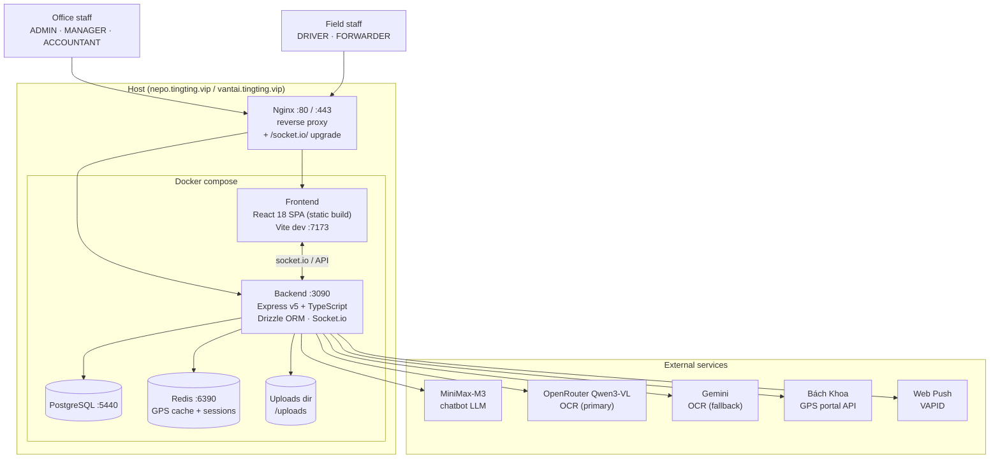

Two deploy targets share one pipeline: **nepo** (production) and **vantai** (demo). GitHub Actions is the intended CI/CD; when billing-blocked, deploy falls back to `make push` + SSH. Source: `deploy/`, `Makefile`, `docker-compose.dev.yml`.

## 2. Monorepo Package Dependencies

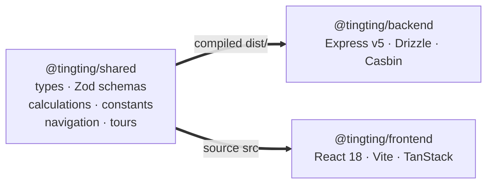

**Build order matters:** `shared` must compile first — the backend imports `@tingting/shared` from `shared/dist/`, the frontend from source. Editing `shared/` requires a rebuild before backend picks it up. Source: `pnpm-workspace.yaml`, `shared/package.json`.

## 3. Backend Request Lifecycle (Middleware Chain)

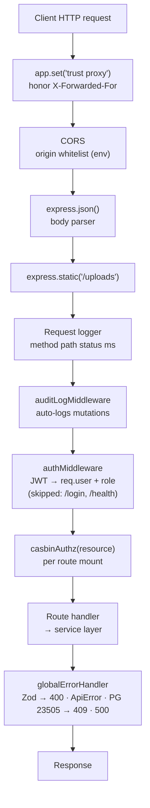

Routes mount in two tiers (see `backend/src/index.ts`): specific paths first (`/api/trips`, `/api/agent`, `/api/ocr`, …), then catch-all `/api` for catalog/config/financial. A `404` catch-all sits before the error handler so unmatched API routes return 404, not 500.

## 4. RBAC — Dual-Layer Authorization

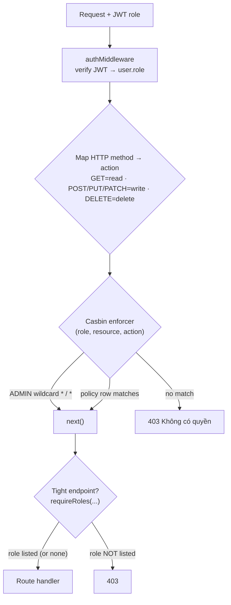

Two complementary gates: **Casbin** (`backend/src/casbin/policy.csv` + `middleware/casbin.ts`) does coarse resource-level `(role, resource, action)` checks; **`requireRoles()`** does fine-grained role gating for sensitive endpoints (e.g. profit distribution). `ADMIN` passes everything via wildcard.

## 5. Trip Lifecycle State Machine

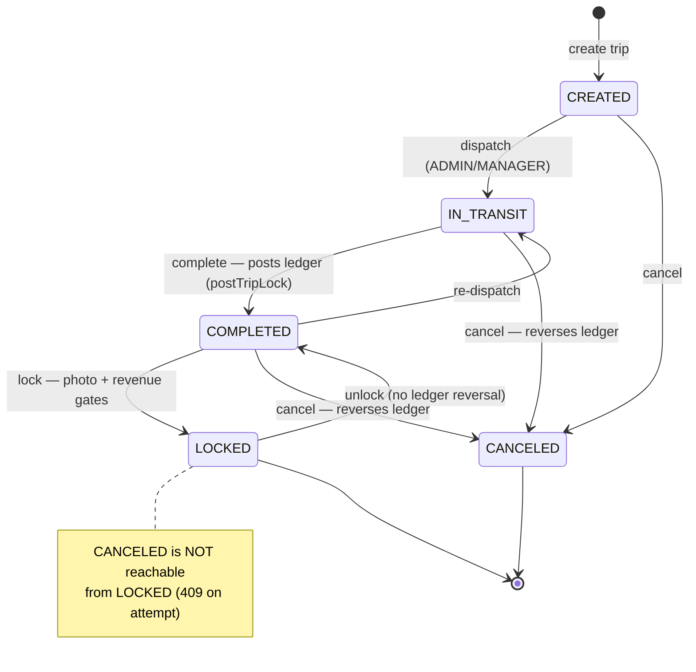

Status enum: `CREATED · IN_TRANSIT · COMPLETED · LOCKED · CANCELED` (`backend/src/db/schema.ts`). Transitions in `services/trip-status-machine.service.ts`:

- **Dispatch** (`→IN_TRANSIT`): only ADMIN/MANAGER; acquires `pg_advisory_xact_lock(truckId)` to block two concurrent dispatches on the same truck.
- **Complete** (`IN_TRANSIT→COMPLETED`): calls `LedgerService.postTripLock` — this is where ledger rows are actually written.
- **Lock** (`→LOCKED`): gates on zero-revenue confirmation and a photo evidence baseline (≥1 photo; if cargo type `requires_photos`, also ≥1 CONTAINER + ≥1 SEAL; `confirmNoPhoto` overrides).
- **Unlock** (`LOCKED→COMPLETED`): ADMIN/MANAGER, optimistic `version` bump — **does not** reverse ledger (rows were posted at completion, not at lock).
- **Cancel** (`→CANCELED`): not allowed from `LOCKED`; zeroes financials, and if cancelled from `COMPLETED` calls `postTripUnlock` to reverse.

## 6. Append-Only Ledger — Double-Entry Posting

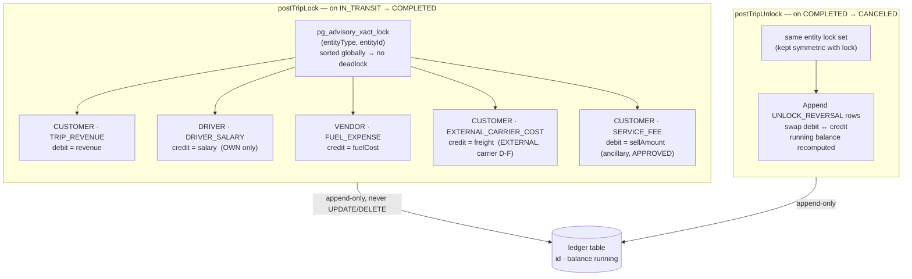

**Sign convention** (`services/ledger.service.ts`):

| Entity | Debit | Credit |
|---|---|---|
| CUSTOMER | + outstanding (AR) | − outstanding |
| DRIVER / VENDOR / FORWARDER | − payable | + payable (AP) |

`postEntry` locks the entity, reads the latest row's `balance`, computes the new running balance, and appends an immutable row. Reversals are new rows with `txnType = UNLOCK_REVERSAL` — the ledger is append-only.

## 7. TxnType — What Each Ledger Row Means

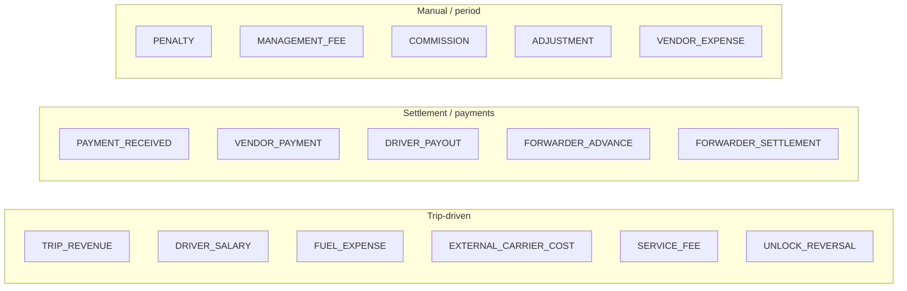

16 enum values (`shared/src/constants/index.ts`). Trip-driven types are posted by the state machine; settlement types by payment/advance flows; `ADJUSTMENT` is the manual reconciliation entry (never mutate existing rows — post a correcting `ADJUSTMENT`).

## 8. Agent / Chatbot — Real-Time Tool Loop

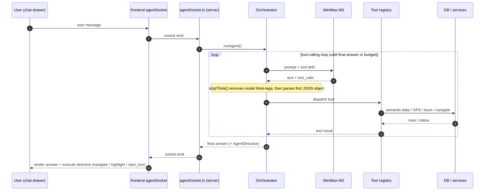

Transport is Socket.io (not SSE). The orchestrator is data-first by prompt design. Tool families: **semantic data** (6 tools over 12 entities), **GPS** (Bách Khoa live tracking), **tours** (curated walkthroughs), **navigate + highlight** (SPA nav + element spotlight). Perf is recorded to `agent_turn_metrics` for the ADMIN monitoring page. Sources: `backend/src/agentSocket.ts`, `services/agent/orchestrator.ts`, `services/agent/semantic-data.service.ts`.

## 9. Semantic Data Gateway (Agent Read Tools)

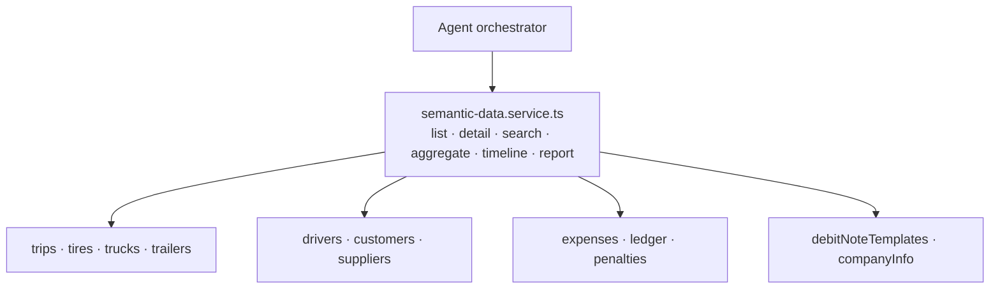

A single declarative gateway (`ENTITIES` map) backs 6 generated tools across 12 entities, so the LLM addresses business objects by name rather than touching 45 narrow endpoints. `report.run` delegates to analyzer functions (`getPnlReport`, `getReceivablesSummary`, …) — it never recomputes financial logic itself. Per-entity `aggregateMetrics` is whitelisted; non-additive fields (e.g. `creditLimit`, `baseSalary`) are list/detail-only by design.

## 10. Data Flow — Trip Figures → Ledger → P&L

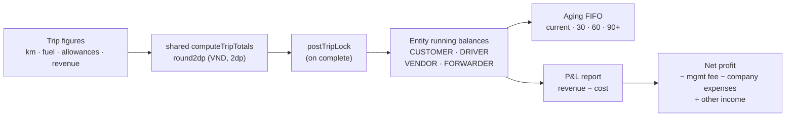

The ledger is the **single source of truth** for every balance. P&L and aging are *derived reads* over ledger rows, not separate stores. Financial precision lives in `shared/src/calculations/` (`round2dp`, `computeTripTotals`); VAT asymmetry (revenue ex-VAT, costs incl-VAT) is handled there.

## 11. Frontend Structure

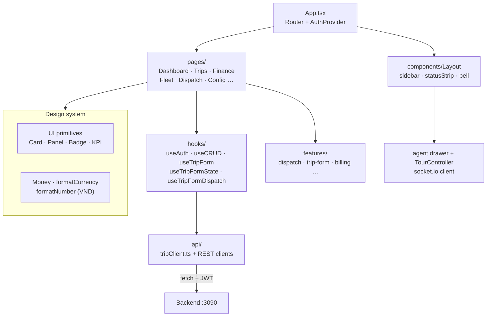

Most-connected frontend abstractions (the "god nodes" to know): `api` client, `PageHeader`, `formatCurrency`, `useCRUD`, `Panel`. Money is always rendered via `<Money>` / `moneyParts` so the ₫ unit stays subtitle-sized and sign-handling is consistent.

## How These Were Built

1. **`/ck:graphify`** — extracted the codebase knowledge graph (`graphify-out/`, AST + communities). The pre-existing report was stale (pre-rename `packages/backend/src/`), so the live **codegraph** index (554 files · 7,267 nodes · 16,594 edges · 216 routes) was used as the authoritative source.
2. **`/ck:mermaidjs-v11`** — Mermaid v11 syntax for all diagrams above.
3. **`/ck:docs`** — this file, cross-referenced from [system-architecture.md](system-architecture.md).

To re-render after code changes: rerun the recipe; diagrams are intentionally small and source-cited so drift is easy to spot.
