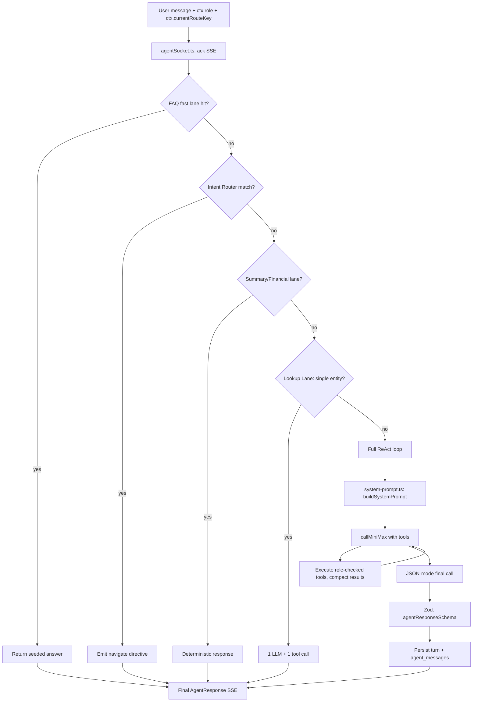

# Context-Engineering Playbook — TransTing Agent

> **What this is.** A grounded, code-cited map of how the TransTing agent
> (the SilverSea bot) engineers the context window of every LLM call. Each
> section maps an abstract context-engineering principle to the concrete file,
> function, and test that implements it here, so a reader can move from
> "what should be true" to "where is it enforced" in one jump.
>
> **Audience.** Backend engineers extending the agent; reviewers evaluating a
> prompt or tool change; LLM-curious on-call engineers debugging a malformed
> `AgentResponse`.
>
> **Source.** Adapted from the public "Context Engineering" guide
> (https://claude.ai/public/artifacts/f498a4cc-4c45-481c-a6dd-8e1d196dadb0)
> and pinned to this repo at commit `612b857` (2026-07-26). The guide is
> generic; this document is the authoritative, code-specific version.

---

## TL;DR — the seven levers, and where they live

| # | Lever | What it constrains | Owner file |
|---|-------|--------------------|------------|
| 1 | **Persona & role grant** | Who the model is; what it may say it can do | `backend/src/services/agent/system-prompt.ts` (`persona` section) |
| 2 | **Time & locale anchor** | "Today", "this month", language | `backend/src/services/agent/system-prompt.ts` (`time` section) |
| 3 | **Tool-use policy** | When to call which tool, when not to | `backend/src/services/agent/system-prompt.ts` (`toolPolicy` / `tourPolicy` / `uiPolicy`) |
| 4 | **Response-shape contract** | JSON schema the final answer must satisfy | `backend/src/services/agent/system-prompt.ts` (`STRUCTURED_RESPONSE_HINT` + `@tingting/shared` `AgentResponse`) |
| 5 | **Tool catalog & selection** | Which tools the model sees; per-role filtering | `backend/src/services/agent/tool.registry.ts`, `tool-selector.ts`, `tools/*.ts` |
| 6 | **Deterministic lanes** | Skip the LLM entirely when a rule suffices | `backend/src/services/agent/{faq-fast-lane,intent-router,lookup-lane,summary-lane,financial-overview-lane,deterministic-report-lane}.ts` |
| 7 | **Governance** | Token budget, failover, rate limit, retention | `token-attribution.ts`, `tool-result-compact.ts`, `llm/failover.ts`, `rate-limiter.ts`, `retention-job.ts` |

> **Reading order for a new contributor:** §1 → §3 → §6 → §8 (turn-flow) → §10
> (anti-patterns). The other sections expand on individual levers.

---

## §1. Instructions are the highest-leverage surface

The model's entire view of "how to behave" flows through one string: the
system prompt. The database, the React UI, the user's permissions — none of
that is directly visible. The system prompt is the *translation layer* between
the application and the model.

**Before this refactor** the prompt was assembled inline at
`orchestrator.ts:137` (`buildSystemPrompt`), interleaved with the ReAct loop
above it and the latency metrics below. That made it hard to (a) unit-test in
isolation, (b) extend one section without re-reading the whole assembler, and
(c) cite in documentation.

**After this refactor** the prompt lives in `system-prompt.ts` as a
composable, section-named module:

```ts
export function buildSystemPromptSections(ctx, tools, message): SystemPromptSections
export function buildSystemPrompt(ctx, tools, message): string   // orchestrator entry
```

`SystemPromptSections` is an **ordered** object with seven fields:

| Section | Fires when | Example content |
|---------|-----------|-----------------|
| `persona` | always | *"Bạn là trợ lý TransTing … Vai trò người dùng: ACCOUNTANT. Bot chỉ đọc."* |
| `time` | always | *"Hôm nay: 2026-07-26. 'Tháng này/nay' luôn là kỳ hiện tại."* |
| `toolPolicy` | any tool's name starts with `data.` or equals `report.run` | *"Tổng tiền tài chính dùng `report.run`; không tự cộng bằng `data.aggregate`."* |
| `tourPolicy` | `tours.search` is in the catalog | *"gọi `tours.search` rồi dùng `start_tour`."* |
| `uiPolicy` | message matches `/mo\|vao\|them\|sua\|xoa\|nut\|form\|trang\|huong dan\|cach lam/i` (diacritic-folded) | *"dùng directive thật; không viết đường dẫn."* |
| `route` | `ctx.currentRouteKey` is set | *"Trang hiện tại: /fleet/1."* |
| `responseShape` | `tools.length === 0` → prose hint; else `STRUCTURED_RESPONSE_HINT` | JSON schema sketch (see §4) |

**Why ordering matters.** Models weight earlier instructions more heavily.
Persona → time → policy → response shape puts the identity anchor first, the
temporal anchor second (so "this month" resolves correctly before any policy),
and the JSON schema last (so it is the closest thing to the answer the model
emits). The test at `agent-system-prompt.test.ts` "all sections present in
correct order" pins this.

**Why the section split exists.** Future enhancements that today would require
re-reading 2,034 lines of orchestrator can instead target one section: per-role
few-shot (extend `persona`), tighter tool budgets (prune `toolPolicy`), or
A/B-tested response shapes (swap `responseShape`). Each is now a single-function
edit plus a focused test.

---

## §2. Role grant: the bot impersonates the user

The bot has no identity of its own. Every tool call is executed *as the calling
user*, scoped by their role. This is enforced in two layers (defense in depth,
labelled `R6` in the code):

1. **Static filtering** — `tool.registry.ts → getToolsForRole(role)` returns
   only the tools the role may see. The model never even hears about a tool it
   cannot call.
2. **Runtime re-check** — every tool's `execute` re-validates
   `allowedRoles.includes(ctx.role)` and throws `ToolForbiddenError` if it
   fails. A registry misconfiguration cannot escalate a DRIVER to an ACCOUNTANT
   tool.

The `persona` line (`Vai trò người dùng: ${ctx.role}`) tells the model *who*
it is acting as, so it doesn't promise actions the user can't take.

**Code:** `backend/src/services/agent/tool.types.ts:86` (`defineReadTool`
helper enforces the runtime re-check), `tool.registry.ts:88` (registry).

---

## §3. Tool-use policy: positive and negative guidance

A tool catalog without usage policy produces "hammer-seeking-nail" behaviour:
the model calls `data.aggregate` three times to sum financials because it can.
The `toolPolicy` section fixes this with **positive** guidance ("use
`report.run` for totals") **and negative** guidance ("do not sum via
`data.aggregate`"). Both are needed — positive-only leaves the old path
available; negative-only leaves the model without the right alternative.

The lookup policy (`data.search` before `data.detail`) similarly encodes a
*workflow*: "find first, drill second". This is a rule a human analyst would
state in onboarding; baking it into the prompt gives every turn the benefit.

**Test:** `agent-system-prompt.test.ts` "data tool present → both data-policy
lines" asserts both bullets appear together (you never get one without the
other).

---

## §4. Response-shape contract: the schema is the spec

The final assistant message must be valid JSON matching
`AgentResponse` from `@tingting/shared`. `STRUCTURED_RESPONSE_HINT` is a
Vietnamese paraphrase of that schema:

```
- text:        {"type":"text","content":"...","actions":[...]}
- insight_card:{"type":"insight_card","title":"...","summary":"...","widgets":[...]}
- tutorial:    {"type":"tutorial","title":"...","summary":"...","steps":[...]}
- start_tour:  {"type":"start_tour","tourId":"..."}
- directive:   {"type":"directive","directive":{...}}
```

Two important details:
- **KPI values must be full VND integers**, not strings, not abbreviated. The
  hint enforces this at the prompt layer; `agentResponseSchema` (Zod) enforces
  it at the parse layer. Either alone is insufficient.
- **No `actions` without a valid `directive`.** The model is told to drop
  `actions` rather than emit a half-formed one. This prevents the drawer from
  rendering a button that goes nowhere.

When the catalog is empty (free-form chat), the response shape collapses to a
single line — *"Trả lời trực tiếp bằng văn bản, không JSON."* — and the
orchestrator streams prose instead of demanding JSON. Forcing JSON on a
no-tool chit-chat turn wastes tokens and degrades the answer.

**Code:** `system-prompt.ts` (`STRUCTURED_RESPONSE_HINT`),
`shared/src/types/...` (`agentResponseSchema`), `orchestrator.ts`
(`sanitizeAgentJson` + `parseAgentResponseContent` for resilience).

---

## §5. Tool catalog & selection: less is more

The orchestrator does not advertise every tool on every turn.
`tool-selector.ts → selectToolsForMessage` picks a relevant subset based on the
message, and `iterationBudgetFor` caps how many tool calls a turn may make.
This is a context-engineering decision as much as a cost decision: a model
shown 40 tools will use worse tools than the same model shown 5 well-chosen
ones.

The catalog itself is role-partitioned: `OFFICE_ROLES` (ADMIN, MANAGER,
ACCOUNTANT) get the data/report/finance tools; DRIVER and FORWARDER get a
different (Phase 2) set. The registry is the single source of truth — adding a
tool means adding one `defineReadTool` and registering it, not editing the
prompt.

**Code:** `backend/src/services/agent/tool.registry.ts`,
`tool-selector.ts`, `tools/*.ts` (14 tool modules).

---

## §6. Deterministic lanes: skip the LLM when a rule suffices

The biggest context-engineering win is to **not call the LLM at all** when a
deterministic answer is available. Six lanes short-circuit before the ReAct
loop, in priority order:

| Lane | Trigger | Cost | File |
|------|---------|------|------|
| FAQ fast lane | Seeded Q&A match | 0 LLM calls | `faq-fast-lane.ts` |
| Intent Router (Lane 0) | URL/route-shaped query | 0 LLM calls | `intent-router.ts` |
| Summary Lane (P3) | "daily work" role query | 0 LLM calls | `summary-lane.ts` |
| Financial Overview | Company health ask | 0 LLM calls | `financial-overview-lane.ts` |
| Deterministic Report | Canonical report | 0 LLM calls | `deterministic-report-lane.ts` |
| Lookup Lane (P1 Lane 2) | Single-entity lookup | **1** LLM call + **1** tool call | `lookup-lane.ts` |

Only when all lanes abstain does the full ReAct loop fire. This is the
"Context Engineering" guide's *retrieval* and *state* pillars, materialised as
explicit code paths rather than prompt prose.

---

## §7. Token & context budget

`token-attribution.ts` estimates tokens per component (system / tools / history
/ tool results) so the orchestrator can see *what is eating the window*.
`tool-result-compact.ts` then prunes oversized tool results (with
`cutAtSafeBoundary` to avoid splitting JSON or Vietnamese mid-grapheme).

**Future work (not yet implemented):** a hard per-turn context budget that
orders sections by the priority table in §1 and drops the lowest-priority
section when over budget. The extraction in §1 makes this a single-module
change in `system-prompt.ts`; before the extraction it would have required
surgery inside the ReAct loop.

---

## §8. The turn flow (end-to-end)



**Invariants at every node:**
- Every path ends in a Zod-validated `AgentResponse` (or a degraded text
  fallback with the reason recorded).
- Role is re-checked at every tool `execute`, not just at the registry filter.
- Latency is measured with `performance.now()` via `withSpan`, never via OTel
  span duration (see `LATENCY CONTRACT` in `orchestrator.ts`).

---

## §9. Governance: failover, rate limit, retention

- **Provider failover** (`llm/failover.ts`, `agentFailover` config): a failed
  primary LLM provider transparently falls back rather than surfacing a 500.
- **Rate limit** (`rate-limiter.ts`, `agentRateLimitPerMin` default 20): per-user
  turn throttling to protect the LLM budget.
- **Retention** (`retention-job.ts`, `agentMessageRetentionDays` default 180):
  `agent_messages` rows are pruned on a schedule; `0` = keep forever.
- **SLA telemetry** (`telemetry.ts`): p95 green/amber thresholds
  (`agentSlaP95GreenMs` / `agentSlaP95AmberMs`) drive the chatbot-metrics
  dashboard.

---

## §10. Anti-patterns this codebase rejects

| Anti-pattern | Where you'd see it | Why this repo doesn't |
|--------------|--------------------|-----------------------|
| **Vague persona** ("you are a helpful assistant") | `persona` section | Replaced with role-stamped, action-scoped: *"Bot chỉ đọc; người dùng tự lưu mọi thay đổi."* |
| **Schema in prose** ("answer in JSON please") | `STRUCTURED_RESPONSE_HINT` | Schema sketch + Zod parse + `sanitizeAgentJson` repair. Three layers. |
| **Tool garden** (advertise every tool always) | `tool-selector.ts` | Subset selection per message; role partition at registry. |
| **LLM for everything** | Lanes §6 | Six deterministic lanes short-circuit before any LLM call. |
| **Latency from OTel spans** | `telemetry.ts` `LATENCY CONTRACT` | `performance.now()` only; OTel samples and would bias p95. |
| **Silent retry on bad JSON** | `orchestrator.ts` `parseAgentResponseContent` | One `jsonrepair` retry, then degrade to text with the reason surfaced. |

---

## §11. How to extend

| You want to … | Touch … | Add a test in … |
|---------------|---------|-----------------|
| Change the persona voice | `system-prompt.ts → persona` | `agent-system-prompt.test.ts` (golden) |
| Add a tool-use rule | `system-prompt.ts → toolPolicy` | same |
| Change the JSON schema | `STRUCTURED_RESPONSE_HINT` *and* `agentResponseSchema` in shared | both |
| Add a tool | `tools/<domain>.ts` + `tool.registry.ts` | tool's own test |
| Add a deterministic lane | new `*-lane.ts` + wire into `orchestrator.ts` before ReAct | new lane test |
| Tighten the token budget | `token-attribution.ts` + `tool-result-compact.ts` | both |

**Golden rule:** any change to `system-prompt.ts` must keep
`agent-system-prompt.test.ts` green. That test's golden strings are the
behaviour-preserving contract for this refactor; if you intend to change the
prompt's output, update the golden strings in the same PR and call out the
model-facing diff in the commit message.

---

## §12. Cross-references

- `AGENTS.md` — closed-loop SDLC, QA gates, `qa/` artifact convention.
- `ROADMAP.md` — what's built next; agent work is woven through Waves 0–4.
- `plans/silversea-prd-roadmap/phase-*.md` — per-wave detail; the agent is
  most affected by `phase-04-wave-3-financial-close.md` (lanes touch finance).
- `backend/src/services/agent/orchestrator.ts:1-30` — the orchestrator's own
  flow header comment, the canonical prose description of the ReAct loop.
