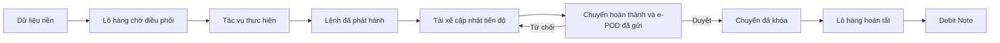

# Quy trình vận hành điều xe

Tài liệu này mô tả luồng vận hành chuẩn của sản phẩm SilverSea từ dữ liệu nền,
tiếp nhận lô hàng, điều xe, tài xế thực hiện, duyệt chứng từ đến xuất Debit Note.

## Vai trò và quyền chính

| Vai trò | Trách nhiệm |
|---|---|
| `ADMIN` | Quản trị dữ liệu nền, nhập Master Data, điều phối và duyệt e-POD |
| `MANAGER` | Điều phối, phát hành lệnh và duyệt e-POD |
| `CUS / CLERK` | Tạo/cập nhật lô hàng trong phạm vi được giao; duyệt e-POD theo quyền được cấp |
| `DRIVER` | Nhận lệnh được giao, cập nhật mốc tiến độ, nộp e-POD và hoàn thành chuyến |
| `ACCOUNTANT` | Xem chuyến đã khóa, lập và xuất Debit Note; không điều xe hoặc duyệt e-POD |
| `CUSTOMER` | Xem dữ liệu/chứng từ đã được phép trong đúng phạm vi khách hàng |

## 1. Thiết lập dữ liệu nền

Admin tải tệp Master Data tại màn hình nhập danh mục. Hệ thống phân tích trước
khi áp dụng và phân loại từng dòng thành hợp lệ, bị chặn, dòng mẫu hoặc dữ liệu
minh họa. Dòng mẫu và dữ liệu minh họa không được ghi thành dữ liệu vận hành hay
tài chính.

Tài khoản demo `cus` được seed dưới vai trò `CLERK` để kiểm tra luồng CUS trên
UI nội bộ.

Các danh mục sử dụng trong quy trình gồm khách hàng, đối tác, cảng/bãi, tuyến
đường, xe, rơ-moóc, tài xế và điểm vận hành. Điểm vận hành có thể lưu Google
Maps URL chỉ để mở chỉ đường, cùng với thông tin xuất hóa đơn nâng/hạ và quy
định của kho. Liên kết này không phải bản đồ GPS trực tiếp, không phải theo dõi
nền và không thay thế chức năng điều phối.

## 2. Tạo và bàn giao lô hàng

CLERK tạo lô mới, chọn khách hàng, tuyến đường và nhà máy/điểm vận hành, sau đó
nhập số Bill hoặc Booking và thông tin tờ khai.

- FCL: nhập từng container, hãng tàu, cảng nâng và cảng hạ. Mỗi container tạo
  đúng một tác vụ thực hiện độc lập.
- LCL: chọn kho lấy hàng, quy cách đóng gói, số lượng, khối lượng, thể tích và
  ngày giao dự kiến. Mỗi lô LCL tạo đúng một tác vụ và không tách nhiều xe.

Khi dữ liệu hợp lệ, CLERK bấm **Bàn giao điều phối**. Lô xuất hiện trong hàng đợi
điều xe với bản chụp quy định điểm vận hành tại thời điểm bàn giao.

## 3. Điều xe và phát hành lệnh

ADMIN hoặc MANAGER mở bàn điều phối, đánh dấu đã xem và tiếp nhận bàn giao. Người
điều phối phải chọn rõ nhà xe, xe/biển số, tài xế và rơ-moóc khi cần; hệ thống
không tự quyết định tài xế từ biển số.

Lịch dự kiến dùng khoảng thời gian nửa mở `[bắt đầu, kết thúc)`. Hai chuyến có
thể nối tiếp khi chuyến trước kết thúc đúng lúc chuyến sau bắt đầu, nhưng không
được trùng tài xế, xe hoặc rơ-moóc trong cùng khoảng thời gian. Khi phát hành,
hệ thống tạo một chuyến gắn với tác vụ và gửi thông báo trong ứng dụng; Web Push
là kênh bổ sung. Sản phẩm không gửi lệnh qua Zalo.

## 4. Tài xế thực hiện chuyến

DRIVER chỉ xem và thao tác trên chuyến được gán cho tài khoản tài xế của mình.
Các mốc tiến độ phải được cập nhật đúng thứ tự:

1. Đã lấy vỏ / lấy hàng.
2. Đang đóng / trả hàng.
3. Đã hạ bãi / giao hàng xong.

Ứng dụng không thu thập vị trí nền, không hiển thị bản đồ GPS trực tiếp và
không thực hiện theo dõi liên tục.

Trước khi hoàn thành chuyến, tài xế tạo một phiên bản e-POD, tải đúng loại chứng
từ bắt buộc và gửi duyệt. Chứng từ bắt buộc gồm phơi hạ hàng và biên bản giao
nhận có chữ ký; vé cầu đường/trạm thu phí là chứng từ bổ sung khi có. Phiên bản
đã gửi không được sửa; nếu bị từ chối, tài xế tạo phiên bản mới thay thế.

## 5. Duyệt e-POD và đóng lô

CLERK có phạm vi lô hàng phù hợp hoặc ADMIN/MANAGER xem chứng từ và quyết định
duyệt hoặc từ chối. `ACCOUNTANT` chỉ được xem. Quyết định hợp lệ đầu tiên thắng;
mọi lần thử đồng thời sau đó phải tải lại trạng thái mới.

Khi e-POD được duyệt, chuyến `COMPLETED` chuyển sang `LOCKED` trong cùng giao
dịch. Lô chỉ chuyển `CLOSED` khi tập tác vụ bắt buộc không rỗng, mọi tác vụ có
chuyến đã khóa và có e-POD được chấp nhận. Tác vụ bị hủy vẫn là bắt buộc cho đến
khi có tác vụ thay thế hợp lệ hoặc được ADMIN/MANAGER xác nhận không còn cần
thực hiện kèm người duyệt, thời gian và lý do.

## 6. Lập và xuất Debit Note

ACCOUNTANT chọn khách hàng và kỳ đối soát. Chỉ chuyến `LOCKED` có e-POD được
chấp nhận mới đủ điều kiện tạo dòng Debit Note. Nguồn của khách hàng khác,
chuyến chưa khóa hoặc chứng từ chưa được duyệt phải bị loại với lý do rõ ràng.

Mẫu **MẪU DEBIT LONG MINH** là một phiên bản trình bày trong hệ thống, không phải
nguồn số liệu tài chính riêng. Dữ liệu ví dụ, số hóa đơn, ngày, thông tin ngân
hàng và số tiền minh họa trong tệp nguồn không được nạp làm dữ liệu thật. Khi
phát hành, hệ thống đóng băng bản chụp mẫu và nguồn dòng để lần xuất lại cho kết
quả ổn định; thay đổi muộn đi qua quy trình điều chỉnh hiện có.

## Trạng thái tổng quát

