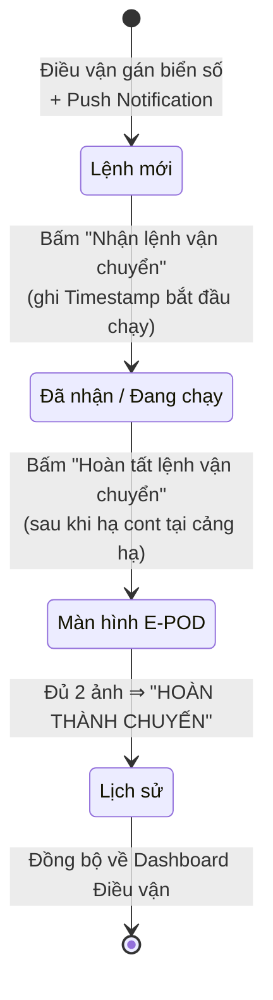

# Màn Hình & Luồng Vận Hành App Lái Xe

**Dự án:** TTransport — Silver Sea
**Nguồn:** `2026.8.27_Man_hinh_lai_xe.docx`
**Liên quan:** [`QuyTrinhO2C.md`](QuyTrinhO2C.md) Bước 3, [`LoHangKepKetHop.md`](LoHangKepKetHop.md), [`OpsVanHanh.md`](OpsVanHanh.md)

**Mục tiêu:** luồng vận hành của Lái xe — **Nhận lệnh ➔ Chạy ➔ Báo cáo POD**.

**Tiêu chuẩn Mobile UI:** thao tác 1 chạm, cuộn dọc, chữ lớn.

---

## 0. Phạm Vi Phase Này

> **Tạm ẨN module Chi phí ở Frontend, nhưng Backend phải thiết kế sẵn Database Schema.**
> Giả lập (bypass) luồng của Ops để thông suốt quy trình test.

| Hạng mục | Trạng thái phase này |
|----------|----------------------|
| Nhận lệnh → chạy → e-POD | **Trong phạm vi** |
| Form "Nhập chi phí lô hàng" | Code sẵn, **ẩn sau feature flag** |
| Form "Báo cáo đổ dầu" | Code sẵn, **ẩn sau feature flag** |
| Bước xác nhận của Ops | **Bypass** (bỏ qua toàn bộ) |

**Yêu cầu Database (chuẩn bị cho phase tiếp theo):** bảng `Trips` phải có sẵn các
cột / bảng quan hệ để lưu: `Tiền nâng`, `Tiền hạ`, `Chi phí phát sinh`, `Tiền đường`,
`Xăng dầu`, `Hình ảnh biên lai`.

---

## 1. Cấu Trúc Điều Hướng

- **Bottom Navigation Bar:** giữ nguyên thiết kế **4 tab hiện tại**.
- Màn hình "Hành trình" (`/my-trips`) chia làm **3 tab con**: `Lệnh mới` | `Đã nhận` | `Lịch sử`.

---

## 2. Màn Hình "Hành Trình" (`/my-trips`)

### 2.1 Lớp 1 — Thẻ Tổng Quát (hiển thị ngoài tab)

> **Đơn vị thẻ = 1 CONTAINER** *(quyết định sản phẩm 2026-09-07 — theo đúng docx)*
>
> Mỗi **container** là **một thẻ riêng**. **Không** gộp nhiều container vào một thẻ,
> và **không** hiển thị một thẻ cho cả chuyến (trip). Số thẻ trong danh sách **bằng
> đúng** số container của tài xế.
>
> Điều này khớp nguyên tắc **"1 Cont = 1 Lệnh (Shipment)"** ở
> [`LoHangKepKetHop.md`](LoHangKepKetHop.md) §2 — mỗi container là một lệnh riêng về
> chứng từ/doanh thu, nên cũng là một thẻ riêng trên app.

> **Lệnh Kẹp / Kết hợp:** hiển thị **2 thẻ riêng biệt nhưng dính liền kề nhau**,
> có **chung Tag phân loại**. Xem [`LoHangKepKetHop.md`](LoHangKepKetHop.md) §3.3.

**Cấu trúc thẻ:**

| Vùng | Nội dung |
|------|----------|
| **Header** | `[Tag: ĐƠN / KẸP / KẾT HỢP]` \| `Giờ đóng / trả: [HH:MM - DD/MM]` |
| **Dòng 1** | `Nhà máy` *(căn lề trái)* \| `Cảng nâng` *(căn lề phải)* |
| **Dòng 2** | `Tuyến đường` *(căn lề trái)* \| `Cảng hạ` *(căn lề phải)* |
| **Dòng 3** | `Cont: [Số Cont] - Loại cont` (ví dụ: `40'HC`) |
| **Footer** | `Xem chi tiết & Nhận lệnh` |

**Không có trên thẻ Lớp 1:** badge/pill trạng thái (Tag ở header + CTA ở footer đã
mang trạng thái — quy ước dự án là chữ màu, không badge), `Mã chuyến` monospace, và
dòng `Tài xế + 🚚 Biển số` (biển số thuộc **Khối 6** của thẻ chi tiết, §2.2).

> ✅ **Đã triển khai (2026-09-07):** `DriverTripsPage.tsx` đã migrate sang mô hình
> thẻ này — 1 thẻ / container (fulfillment), tabs `Lệnh mới / Đã nhận / Lịch sử`,
> cấu trúc 2 cột đúng §2.1, tag `[KẸP]` / `[KẾT HỢP]` suy ra từ cặp ghép
> (`trip_pairs.pair_kind`), 2 thẻ ghép dính liền theo cặp, và khoá tiến độ
> Lệnh 2 (kết hợp) cho tới khi Lệnh 1 hoàn thành. Tiêu chí nghiệm thu:
> [`testplan/roles/03-laixe.md`](../../testplan/roles/03-laixe.md) Flow 1 (`DRV-LIST-02`,
> `DRV-LIST-03`) và [`testplan/flows/03-laixe-nhan-lenh.md`](../../testplan/flows/03-laixe-nhan-lenh.md)
> §3.7 (`TC-LX-NHANLENH-014`, `-015`).

### 2.2 Lớp 2 — Thẻ Chi Tiết (bấm vào thẻ ⇒ mở toàn màn hình)

| Khối | Nội dung |
|------|----------|
| **Khối 1 — Lộ trình** | `[Tuyến đường]` \| `[Nhà máy]` \| `[Cảng nâng]` \| `[Cảng hạ]` |
| **Khối 2 — Hàng hoá** | `[Loại Cont]` \| `[Số Cont]` \| `[Số Chì]` + nút `[📷 Chụp ảnh Cont/Chì]` — **bắt buộc gắn Timestamp vào ảnh lúc chụp** |
| **Khối 3 — Liên hệ** | `[Tên người phụ trách kho bãi]` + `[Số điện thoại]` |
| **Khối 4 — Thông tin hoá đơn** | Thông tin xuất HĐ nâng / hạ, HĐ vệ sinh |
| **Khối 5 — Quy định tại điểm làm hàng** | Lấy dữ liệu từ **note dành cho lái xe** |
| **Khối 6 — Thông tin xe** | `[Biển số Đầu kéo]` \| `[Biển số Mooc]` |
| **Khối 7 — Nút thao tác** | **Sticky bottom** — ghim cố định ở đáy màn hình: `Nhận lệnh vận chuyển` |

Khối 4 lấy từ master data nhà máy (`liftFeeInvoice*`, `dropFeeInvoice*`, `cleaningInvoice*`);
Khối 5 lấy từ `strictRules` — xem [`MasterDataNhaMay.md`](MasterDataNhaMay.md).

---

## 3. Logic Vận Hành

> **Lưu ý phase này:** phân hệ Ops chưa hoàn thiện ⇒ **Bypass** toàn bộ phần công việc của Ops.

### Bước 1 — Nhận lệnh & Bypass Ops

- Ngay khi Điều vận gán biển số xe xong, App bắn **Push Notification**. Thẻ xuất hiện ở tab `Lệnh mới`.
- **Logic tạm thời:** bỏ qua toàn bộ các bước xác nhận của Ops. Lái xe có thể bấm `Nhận lệnh vận chuyển` **ngay khi có lệnh đến**.
- **Action:** bấm nhận lệnh ⇒ **ghi nhận Timestamp bắt đầu chạy** ⇒ thẻ chuyển sang tab `Đã nhận / Đang chạy`.

### Bước 2 — Cập nhật hành trình

- Tại tab `Đang chạy`, khi kết thúc toàn bộ chuyến hàng (hạ cont tại cảng hạ), Lái xe bấm `Hoàn tất lệnh vận chuyển` ⇒ khởi động luồng E-POD (§4).

### Ràng buộc riêng cho hàng Kết hợp

Luồng trạng thái phải **nối tiếp**: *hoàn thành trả hàng Lệnh 1* ⇒ mới mở được
*bắt đầu đóng hàng Lệnh 2*. Hai thẻ dính liền nhưng thẻ thứ hai bị khoá cho đến khi thẻ đầu xong.

---

## 4. E-POD Bắt Buộc & Hoàn Thành Chuyến

Khi Lái xe bấm `Hoàn tất lệnh vận chuyển`, App **không** cho kết thúc chuyến ngay
mà chuyển sang **màn hình Upload E-POD**.

### 4.1 UI màn hình E-POD

Gồm **2 khu vực tải ảnh — cả hai đều bắt buộc**:

1. **Phiếu bãi / Phiếu hạ** (bắt buộc chụp)
2. **Biên bản giao nhận** (bắt buộc chụp, **phải có dấu / chữ ký**)

### 4.2 Logic hệ thống

| Yêu cầu | Chi tiết |
|---------|----------|
| **Compress** | Ảnh tải lên phải được **tự động nén ngay trên điện thoại** để truyền tải nhanh |
| **Timestamp** | Gắn **timestamp thực tế** vào file ảnh |
| **Gate hoàn thành** | Chỉ khi **cả 2 file ảnh upload thành công (thanh tiến trình 100%)**, nút `[HOÀN THÀNH CHUYẾN]` mới **sáng** và bấm được |

### 4.3 Kết thúc

Bấm `HOÀN THÀNH CHUYẾN` ⇒ thẻ chuyển sang tab `Lịch sử` ⇒ **đồng bộ trạng thái về
Dashboard của Điều vận**.

---

## 5. Quy Tắc Chung

| Quy tắc | Chi tiết |
|---------|----------|
| **Thao tác 1 chạm** | Mọi hành động chính đạt được trong 1 lần chạm; nút ≥ 48 px |
| **Cuộn dọc, chữ lớn** | Không cuộn ngang; cỡ chữ đọc được dưới nắng |
| **Sticky CTA** | Nút thao tác chính ghim đáy màn, tôn trọng `env(safe-area-inset-bottom)` |
| **Ảnh luôn có timestamp** | Áp dụng cho ảnh Cont/Chì (Khối 2) và cả 2 ảnh E-POD |
| **Không kết thúc chuyến thiếu ảnh** | Gate 2 ảnh là điều kiện duy nhất, không có đường vòng |
| **Module chi phí ẩn** | Frontend không render form chi phí / đổ dầu trong phase này |
