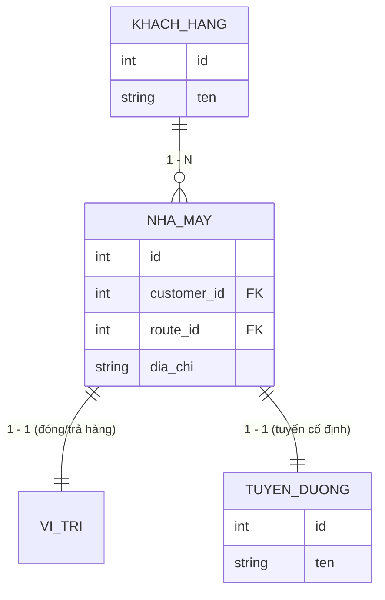
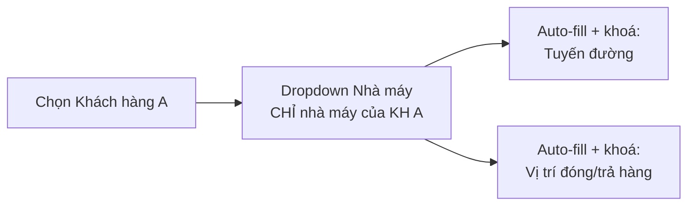

# Master Data: Khách Hàng — Nhà Máy — Tuyến Đường — Vị Trí

**Dự án:** TTransport — Silver Sea
**Nguồn:** `2026.9.6_Logic_nghiep_vu.docx` — Phần 1
**Liên quan:** [`QuyTrinhO2C.md`](QuyTrinhO2C.md) Bước 1 (Chứng Từ khởi tạo lô)

> **Hai luồng song song.** Đặc tả này mô tả **hai** luồng tạo lô, dùng chung một form:
>
> | Luồng | Khi nào | Ràng buộc master data |
> |-------|---------|------------------------|
> | **Luồng chuẩn** | Lô của khách hàng có trong danh mục | Cascading + auto-fill + khoá (§3) — **chặt** |
> | **Lệnh chạy ngoài** | Cuốc vãng lai tối ưu xe rỗng | Bypass validation, nhập text tự do (§4) — **lỏng** |
>
> Cơ chế phân biệt là **một checkbox duy nhất** ở đầu form (§4.1). Mọi ràng buộc ở §3
> chỉ áp dụng cho **luồng chuẩn**.

---

## 1. Sơ Đồ Quan Hệ (ERD)

| Quan hệ | Bậc | Ý nghĩa nghiệp vụ |
|---------|-----|-------------------|
| Khách hàng → Nhà máy | 1 – N | Một khách hàng có 1 hoặc nhiều nhà máy |
| Nhà máy → Vị trí đóng/trả hàng | 1 – 1 | Mỗi nhà máy có **duy nhất 01** vị trí giao nhận (địa chỉ / toạ độ) |
| Nhà máy → Tuyến đường | 1 – 1 | Mỗi nhà máy nằm trên **một tuyến vận chuyển cố định** (ví dụ: Nhà máy A ⇒ tuyến Hải Phòng – Bắc Ninh) |

---

## 2. Yêu Cầu Database (Backend)

Bảng **Nhà máy** là nơi *duy nhất* giữ khoá ngoại tới Tuyến đường và Vị trí.

**Bắt buộc:**

- Bảng nhà máy chứa FK cứng tới `Tuyến đường` và giữ Vị trí (địa chỉ/toạ độ) ngay trên bản ghi nhà máy.
- **Không** để trường `Tuyến đường` hay `Vị trí` trôi nổi ở bảng Khách hàng hoặc bảng Lô hàng. Lô hàng chỉ tham chiếu tới nhà máy; tuyến và vị trí được suy ra (derive) từ nhà máy.

**Hiện trạng hệ thống:** bảng `operational_sites` (`backend/src/db/schema/master-data.ts`) đã có `customer_id`, `route_id`, `address` và ràng buộc duy nhất `(customer_id, code)` — khớp mô hình trên. Nhà máy (`site_type = FACTORY`) bắt buộc có `route_id`; kho (warehouse) được phép để trống vì định tuyến LCL vẫn ở cấp lô hàng.

**Snapshot khi phát lệnh:** fulfillment đã phát lệnh phải chụp lại (snapshot) các trường vận hành của nhà máy để dữ liệu không trôi khi quản trị viên sửa master data về sau.

---

## 3. Yêu Cầu Giao Diện (Frontend)

Áp dụng cho **Form Tạo Lô Hàng** (CUS) và mọi form điều vận có chọn nhà máy.

### 3.1 Cascading Dropdown (đổ dữ liệu tuần tự)

- Khi user chọn `[Khách hàng A]`, trường `[Nhà máy]` **chỉ** xổ ra danh sách nhà máy thuộc Khách hàng A.
- Đổi khách hàng ⇒ reset lựa chọn nhà máy đang có (không giữ nhà máy của khách cũ).
- Chưa chọn khách hàng ⇒ dropdown nhà máy vô hiệu (disabled), không hiển thị toàn bộ danh mục.

### 3.2 Auto-fill & Read-only

Ngay khi chọn xong `[Nhà máy]`:

- `[Tuyến đường]` và `[Vị trí đóng/trả hàng]` được **tự động điền** theo cấu hình của nhà máy đó.
- Cả 2 trường ở trạng thái **read-only** — nhân viên CUS / Điều vận không chọn tay.
- Không dùng chữ gợi ý giải thích vì sao trường bị khoá; trạng thái disabled tự nó là tín hiệu.

**Lý do:** loại bỏ hoàn toàn khả năng CUS gán sai tuyến cho một nhà máy, và bỏ 2 thao tác chọn tay mỗi lần tạo lô.

### 3.3 Trường hợp dữ liệu thiếu

| Tình huống | Hành vi |
|------------|---------|
| Nhà máy chưa cấu hình tuyến | Chặn lưu lô, báo lỗi tiếng Việt chỉ đích danh nhà máy cần bổ sung tuyến |
| Khách hàng chưa có nhà máy nào | Dropdown rỗng + link tạo nhanh nhà máy (theo mẫu tạo nhanh khách hàng hiện có) |
| Nhà máy bị vô hiệu hoá (`is_active = false`) | Không xuất hiện trong dropdown tạo mới; lô cũ đã tham chiếu vẫn hiển thị bình thường |
