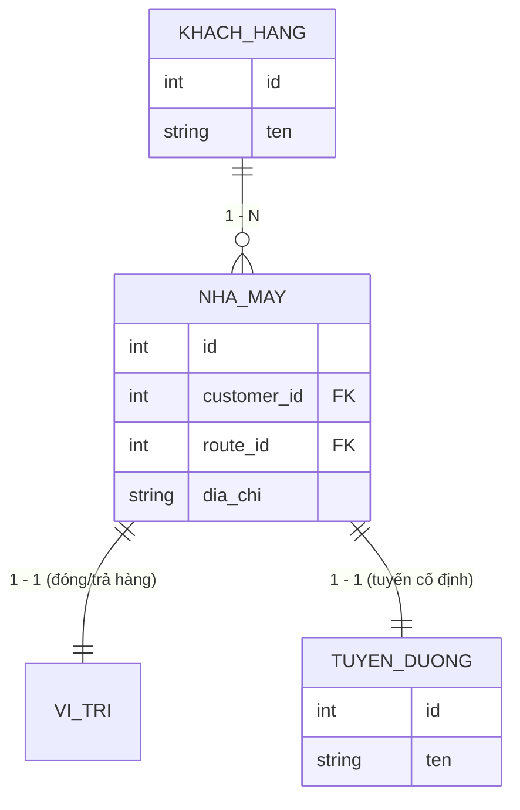
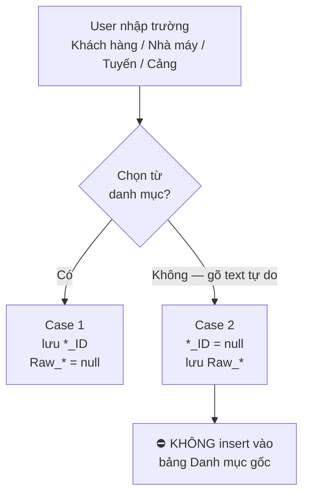
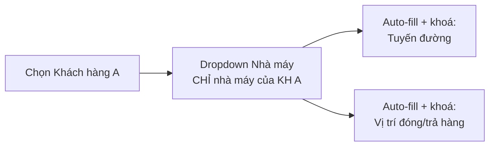

# Master Data: Khách Hàng — Nhà Máy — Tuyến Đường — Vị Trí

**Dự án:** TTransport — Silver Sea
**Nguồn:** `2026.9.6_Logic_nghiep_vu.docx` — Phần 1
**Liên quan:** [`QuyTrinhO2C.md`](QuyTrinhO2C.md) Bước 1 (Chứng Từ khởi tạo lô)

> **Hai luồng song song.** Đặc tả này mô tả **hai** luồng tạo lô, dùng chung một form:
>
> | Luồng | Khi nào | Ràng buộc master data |
> |-------|---------|------------------------|
> | **Luồng chuẩn** | Lô của khách hàng có trong danh mục | Cascading + auto-fill + khoá (§3) — **chặt** |
> | **Lệnh chạy ngoài** | Cuốc vãng lai tối ưu xe rỗng | Bypass validation, nhập text tự do (§4) — **lỏng** |
>
> Cơ chế phân biệt là **một checkbox duy nhất** ở đầu form (§4.1). Mọi ràng buộc ở §3
> chỉ áp dụng cho **luồng chuẩn**.

---

## 1. Sơ Đồ Quan Hệ (ERD)



| Quan hệ | Bậc | Ý nghĩa nghiệp vụ |
|---------|-----|-------------------|
| Khách hàng → Nhà máy | 1 – N | Một khách hàng có 1 hoặc nhiều nhà máy |
| Nhà máy → Vị trí đóng/trả hàng | 1 – 1 | Mỗi nhà máy có **duy nhất 01** vị trí giao nhận (địa chỉ / toạ độ) |
| Nhà máy → Tuyến đường | 1 – 1 | Mỗi nhà máy nằm trên **một tuyến vận chuyển cố định** (ví dụ: Nhà máy A ⇒ tuyến Hải Phòng – Bắc Ninh) |

---

## 2. Yêu Cầu Database (Backend)

Bảng **Nhà máy** là nơi *duy nhất* giữ khoá ngoại tới Tuyến đường và Vị trí.

**Bắt buộc:**

- Bảng nhà máy chứa FK cứng tới `Tuyến đường` và giữ Vị trí (địa chỉ/toạ độ) ngay trên bản ghi nhà máy.
- **Không** để trường `Tuyến đường` hay `Vị trí` trôi nổi ở bảng Khách hàng hoặc bảng Lô hàng. Lô hàng chỉ tham chiếu tới nhà máy; tuyến và vị trí được suy ra (derive) từ nhà máy.

**Hiện trạng hệ thống:** bảng `operational_sites` (`backend/src/db/schema/master-data.ts`) đã có `customer_id`, `route_id`, `address` và ràng buộc duy nhất `(customer_id, code)` — khớp mô hình trên. Nhà máy (`site_type = FACTORY`) bắt buộc có `route_id`; kho (warehouse) được phép để trống vì định tuyến LCL vẫn ở cấp lô hàng.

**Snapshot khi phát lệnh:** fulfillment đã phát lệnh phải chụp lại (snapshot) các trường vận hành của nhà máy để dữ liệu không trôi khi quản trị viên sửa master data về sau.

### 2.1 Lưu Trữ Hỗn Hợp (Hybrid Storage)

Bảng `shipments` phải hỗ trợ **cả hai** cách lưu cho các trường **Khách hàng, Nhà máy,
Tuyến đường, Cảng nâng, Cảng hạ**:

| Case | Người dùng làm gì | Backend lưu | Trường ID |
|------|-------------------|-------------|-----------|
| **Case 1 — Luồng chuẩn** | Chọn từ danh sách xổ xuống | `Customer_ID`, `Factory_ID`, `Route_ID`, `Port_ID` | **có giá trị** |
| **Case 2 — Lệnh chạy ngoài** | Gõ text mới hoàn toàn | `Raw_Customer_Name`, `Raw_Factory_Name`, `Raw_Route_Name`, `Raw_Port_Name` | **`null`** |



**Quy tắc bắt buộc:**

1. **Loại trừ lẫn nhau:** với mỗi trường, đúng **một** trong hai vế có giá trị. Không
   bao giờ có cả `Customer_ID` lẫn `Raw_Customer_Name` cùng khác `null`, và không bao
   giờ cả hai cùng `null` khi trường đó bắt buộc.
2. **Guardrail — không làm rác master data:** free text ở Case 2 **tuyệt đối không**
   được tự động `INSERT` vào bảng danh mục gốc (`customers`, `operational_sites`,
   `routes`, `ports`). Danh mục của Kế toán phải sạch.
3. **Trộn được trong cùng một lô:** một lô chạy ngoài có thể có Khách hàng là text tự do
   nhưng Cảng hạ chọn từ danh mục — hai trường độc lập nhau.
4. **Hiển thị đồng nhất:** mọi màn đọc (danh sách lô, chi tiết, điều vận, app lái xe,
   báo cáo, bản in) phải hiển thị `COALESCE(tên từ ID, Raw_*)` — người xem không phân
   biệt được nguồn, ngoài **nhãn "Chạy ngoài"** (§4.4).
5. **Không suy ra tuyến/vị trí:** Case 2 không có `Factory_ID` ⇒ không có gì để derive.
   Tuyến và vị trí ở lô chạy ngoài là text người dùng nhập, không phải giá trị auto-fill.

---

## 3. Yêu Cầu Giao Diện — Luồng Chuẩn (Frontend)

Áp dụng cho **Form Tạo Lô Hàng** (CUS) và mọi form điều vận có chọn nhà máy,
**khi checkbox "Lệnh chạy ngoài" KHÔNG được tích** (§4.1).

### 3.1 Cascading Dropdown (đổ dữ liệu tuần tự)



- Khi user chọn `[Khách hàng A]`, trường `[Nhà máy]` **chỉ** xổ ra danh sách nhà máy thuộc Khách hàng A.
- Đổi khách hàng ⇒ reset lựa chọn nhà máy đang có (không giữ nhà máy của khách cũ).
- Chưa chọn khách hàng ⇒ dropdown nhà máy vô hiệu (disabled), không hiển thị toàn bộ danh mục.

### 3.2 Auto-fill & Read-only

Ngay khi chọn xong `[Nhà máy]`:

- `[Tuyến đường]` và `[Vị trí đóng/trả hàng]` được **tự động điền** theo cấu hình của nhà máy đó.
- Cả 2 trường ở trạng thái **read-only** — nhân viên CUS / Điều vận không chọn tay.
- Không dùng chữ gợi ý giải thích vì sao trường bị khoá; trạng thái disabled tự nó là tín hiệu.

**Lý do:** loại bỏ hoàn toàn khả năng CUS gán sai tuyến cho một nhà máy, và bỏ 2 thao tác chọn tay mỗi lần tạo lô.

### 3.3 Trường hợp dữ liệu thiếu

| Tình huống | Hành vi |
|------------|---------|
| Nhà máy chưa cấu hình tuyến | Chặn lưu lô, báo lỗi tiếng Việt chỉ đích danh nhà máy cần bổ sung tuyến |
| Khách hàng chưa có nhà máy nào | Dropdown rỗng + link tạo nhanh nhà máy (theo mẫu tạo nhanh khách hàng hiện có) |
| Nhà máy bị vô hiệu hoá (`is_active = false`) | Không xuất hiện trong dropdown tạo mới; lô cũ đã tham chiếu vẫn hiển thị bình thường |

---

## 4. Lệnh Chạy Ngoài (Ad-hoc Orders)

**Bài toán nghiệp vụ:** khi có cuốc xe vãng lai để **tối ưu xe rỗng**, điều vận cần đẩy
lệnh sang thật nhanh. Khách hàng / nhà máy / cảng của cuốc đó thường **không** có trong
danh mục, và **không đáng** để thêm vào danh mục (chạy một lần rồi thôi).

### 4.1 Cờ đánh dấu (checkbox)

Ngay **đầu Form Khởi tạo lô** — trước mọi trường khác:

```text
[ ] Lệnh chạy ngoài (Tối ưu xe rỗng)
```

| Trạng thái | Hành vi form |
|------------|--------------|
| **Không tích** (mặc định) | Luồng chuẩn — toàn bộ §3 áp dụng: cascading, auto-fill, khoá read-only, validation định mức cước phí đầy đủ |
| **Tích** | Bypass validation khắt khe về **định mức cước phí**; mở khoá `Tuyến đường` + `Vị trí đóng/trả hàng` cho nhập tay; các trường master data chuyển sang chấp nhận text tự do |

**Ràng buộc:**

- Checkbox đặt ở vị trí **cố định đầu form**, nhìn thấy được mà không cần cuộn.
- Bật/tắt cờ **giữa chừng** không xoá dữ liệu người dùng đã gõ; chỉ đổi tập validation
  và trạng thái khoá của trường. Tắt cờ trên form đang có text tự do ⇒ cảnh báo các
  trường cần chọn lại từ danh mục trước khi lưu.
- Cờ lưu vào lô (`is_ad_hoc`) và **hiển thị lại** khi mở/sửa lô.
- Bypass chỉ áp dụng cho **định mức cước phí**. Các validation an toàn dữ liệu **vẫn
  giữ nguyên**: định dạng số container ISO-6346, ngày hợp lệ, số lượng > 0, trường bắt
  buộc không rỗng.

### 4.2 Component nhập liệu — Combobox (Creatable Select)

Các trường **Khách hàng, Nhà máy, Tuyến đường, Cảng nâng, Cảng hạ** chuyển từ dropdown
thuần sang **Combobox**:

| Khả năng | Yêu cầu |
|----------|---------|
| **Xổ chọn** | Bấm mũi tên ⇒ xổ danh sách danh mục; gõ ⇒ lọc theo chuỗi con, không phân biệt hoa/thường và dấu tiếng Việt |
| **Gõ text tự do** | Chuỗi không khớp mục nào vẫn **giữ lại được** làm giá trị của trường (Case 2), không bị xoá khi blur |
| **Phân biệt trực quan** | Giá trị chọn từ danh mục và giá trị text tự do phải **nhìn ra được là khác nhau** (ví dụ: text tự do kèm chú thích "mới") |
| **Bàn phím** | ↑/↓ duyệt, `Enter` chọn mục đang tô sáng — hoặc chốt text tự do khi không có mục nào tô sáng, `Esc` đóng |
| **Đóng đúng cách** | Click ra ngoài / `Esc` đóng danh sách và **giữ** text đã gõ — xem quy ước dropdown dismissal hiện có |

### 4.3 Phân biệt "text tự do" với "tạo mới inline"

Đây là **hai cơ chế khác nhau** và không được lẫn lộn:

| | **Text tự do** (§4.2) | **Tạo mới inline** (nút `+ Tạo mới`) |
|---|---|---|
| Thao tác | Gõ chuỗi rồi rời trường | Bấm nút, điền form phụ, xác nhận |
| Ghi vào master data | **Không bao giờ** | **Có** — tạo bản ghi thật |
| Lưu ở lô | `Raw_*` (ID = `null`) | `*_ID` trỏ bản ghi mới |
| Dùng khi | Cuốc vãng lai một lần | Khách/nhà máy thật, sẽ dùng lại |

Nút `+ Tạo mới` (test case `TC-CUS-CREATE-012 / -017 / -019 / -020`) **vẫn giữ nguyên**
hành vi hiện có. Cờ "Lệnh chạy ngoài" **không** vô hiệu hoá nút này.

### 4.4 Hệ quả xuôi dòng (downstream)

| Phân hệ | Hành vi với lô chạy ngoài |
|---------|---------------------------|
| **Danh sách lô / chi tiết** | Hiển thị nhãn **"Chạy ngoài"** (chữ màu, không badge) cạnh mã lô |
| **Điều vận** | Phân xe / phát lệnh bình thường; không chặn vì thiếu `Factory_ID` |
| **App lái xe** | Các khối lộ trình đọc từ `Raw_*` khi không có ID — không hiện ô trống |
| **Kế toán / công nợ** | Lô không có `Customer_ID` **không** gộp vào công nợ khách hàng nào; đối soát thủ công |
| **Báo cáo theo khách hàng / tuyến** | Nhóm riêng **"Chạy ngoài"**, không nhét vào nhóm `null` |
| **Master data** | Số bản ghi danh mục **không đổi** sau khi tạo lô chạy ngoài |

### 4.5 Tiêu chí nghiệm thu (§4)

1. Checkbox hiện ở đầu form, mặc định **không tích**, nhãn đúng `Lệnh chạy ngoài (Tối ưu xe rỗng)`.
2. Tích cờ ⇒ `Tuyến đường` + `Vị trí đóng/trả hàng` **mở khoá**; bỏ tích ⇒ khoá lại theo §3.2.
3. Tích cờ ⇒ lưu được lô **thiếu định mức cước phí**; không tích ⇒ vẫn bị chặn như cũ.
4. Gõ khách hàng mới hoàn toàn ⇒ lô lưu với `Customer_ID = null` **và** `Raw_Customer_Name` = đúng chuỗi đã gõ.
5. Sau khi lưu, **`SELECT count(*)` của `customers` / `operational_sites` / `routes` / `ports` không đổi**.
6. Lô chạy ngoài hiển thị đủ tên ở danh sách, chi tiết, màn điều vận và app lái xe — không ô trống, không hiện `null`.
7. Trộn được: cùng một lô có Khách hàng free-text và Cảng hạ chọn từ danh mục.
8. Combobox: xổ chọn được, lọc được, gõ text lạ giữ nguyên sau blur, `Esc`/click-ngoài không mất text.
9. Nút `+ Tạo mới` vẫn tạo bản ghi master data thật, kể cả khi cờ đang bật.
10. Mở lại lô chạy ngoài để sửa ⇒ checkbox vẫn ở trạng thái tích.

Bộ test case: [`testplan/flows/01-cus-create-shipment.md`](../../testplan/flows/01-cus-create-shipment.md) §1.11
(`TC-CUS-CREATE-025` … `TC-CUS-CREATE-034`).
