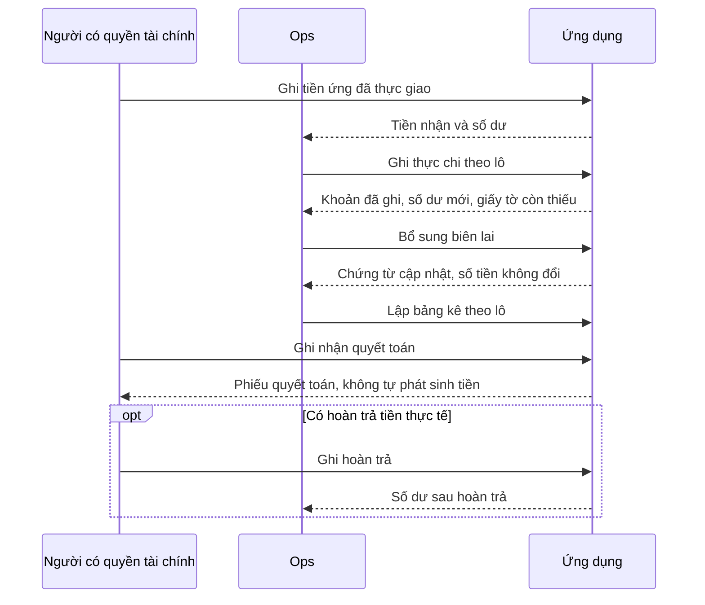

# PRD: Vận hành hiện trường — Kế hoạch, phương tiện và quỹ Ops

**Dự án:** TTransport — Silver Sea

**Cập nhật:** 16/09/2026

**Nguồn bổ sung:** `các chi phí.docx` — chi phí Ops, bảng phơi phiếu và hoàn ứng. Hình minh họa từ phần mềm cũ xác định thông tin cần quản lý, không bắt buộc sao chép bố cục cũ.

Tài liệu mô tả nhu cầu và hành vi sản phẩm cần đáp ứng cho nhân viên hiện trường, gọi tắt là **Ops**, trong [Quy trình O2C](QuyTrinhO2C.md).

## 1. Vấn đề cần giải quyết

Ops cần biết hôm nay có những lô nào phải làm, xe mình phụ trách đang ở bước nào, đã chi tiền cho lô nào và còn thiếu giấy tờ gì. Việc tra cứu, nhập lại thông tin và đối chiếu tiền không được làm gián đoạn công việc tại hiện trường.

Sản phẩm cần giúp Ops:

- Tìm nhanh kế hoạch công ty và ghim các lô cần theo dõi riêng.
- Theo dõi đúng xe được giao, phân biệt đã phát lệnh với lái xe đã nhận.
- Ghi một khoản thực chi ngay trong lô đang làm, bổ sung biên lai sau khi có.
- Hiểu số dư quỹ và đối chiếu từng khoản tiền nhận, chi, hoàn trả.
- Lập bảng kê, biết giấy tờ còn thiếu và hoàn tất quyết toán mà không nhập lại khoản chi.

Người có quyền thực hiện trực tiếp nghiệp vụ của mình. Không có bước gửi, kiểm tra rồi phê duyệt nội bộ. Ứng dụng cần Internet để làm việc; không có chế độ nhập nghiệp vụ ngoại tuyến rồi tự gửi sau.

## 2. Người sử dụng và quyền hạn

| Người sử dụng | Nhu cầu và quyền trong phạm vi này |
|---|---|
| Ops | Xem toàn bộ lô công ty theo ngày kế hoạch, ghim riêng; ghi chi và bổ sung ảnh trong phạm vi được giao; xem quỹ của mình; lập bảng kê cá nhân. |
| Quản trị viên đội xe | Phân công Ops đang hoạt động phụ trách xe; thay đổi hoặc thu hồi phân công. |
| Kế toán và người có quyền tài chính | Ghi nhận tiền thực giao/nhận, hoàn trả, điều chỉnh và quyết toán theo phạm vi được cấp; tra cứu bảng kê và lịch sử liên quan. |
| Quản lý | Theo dõi hoạt động và số liệu trong phạm vi được cấp; chỉ ghi hoặc sửa khi có quyền nghiệp vụ tương ứng. |

Quyền xem kế hoạch toàn công ty không đồng nghĩa được sửa mọi lô, xem mọi ảnh hoặc ghi tiền cho mọi người. Quyền xem ví không tự cấp quyền chi tiền. Người đã mất phân công không được tiếp tục thao tác hay truy cập ảnh ngoài quyền hiện tại, kể cả ảnh từng mở trước đó.

Mọi nơi người dùng mở cùng một khoản chi hoặc số dư phải thể hiện cùng thông tin. Không có hai cách tính quỹ hoặc hai quy trình quyết toán khác nhau giữa các màn hình.

## 3. Kế hoạch làm hàng

### 3.1 Tìm lô cần làm

- Mặc định là hôm nay theo giờ Việt Nam, lọc theo **ngày giao dự kiến** của lô. Cho chọn ngày quá khứ hoặc tương lai.
- Hiển thị toàn bộ lô công ty phù hợp ngày, không lọc theo người phụ trách hoặc người đã ghim. Nếu có lọc theo ngày vận chuyển, phải ghi rõ đó là một loại ngày khác.
- Lô chưa có lịch vẫn lưu và tìm lại được trong nhóm chưa chốt lịch. Không tự gán ngày giả.
- Tìm theo mã lô, khách hàng, Bill/Booking hoặc số container đầy đủ và 4–5 ký tự cuối. Khi không thấy kết quả, người dùng biết bộ lọc nào đang áp dụng và cách xóa lọc.
- Mỗi lô có mã, khách hàng/nhà máy, tuyến, số lượng và số container đã biết, Bill/Booking đúng chiều nhập/xuất, trạng thái và việc cần làm tiếp.
- Lô hủy tách khỏi công việc đang làm nhưng vẫn tra cứu được. Lô hoàn thành không biến mất khỏi lịch sử.
- Nếu còn thiếu lệnh giấy hoặc chứng từ, nêu rõ thiếu gì, ai phụ trách và cách bổ sung. Không đưa người dùng tới một nút mà chắc chắn không thể thực hiện vì chuyến đã kết thúc.

### 3.2 Ghim cá nhân

Ops có thể ghim hoặc bỏ ghim một lô mà không ảnh hưởng đồng nghiệp. Trong kết quả phù hợp bộ lọc, lô ghim đứng đầu, lô mới ghim trước. Trạng thái giữ nguyên khi mở lại trang; bấm lặp không làm kết quả đảo ngược ngoài ý muốn. Nếu chưa lưu được, giao diện phải nói rõ.

### 3.3 Ghi chi ngay từ lô

Khi mở **Khai báo chi phí**, sản phẩm giữ ngữ cảnh lô và không bắt Ops nhập lại thông tin đã có.

| Thông tin | Yêu cầu |
|---|---|
| Lô và Bill/Booking | Tự điền đúng lô, đúng chiều nhập/xuất. |
| Container hoặc phí chung | Chọn đúng container; có “Phí chung lô” khi phù hợp. Hàng lẻ không cần số container giả. |
| Loại phí | Chọn loại đang sử dụng; phân biệt có/không yêu cầu hóa đơn theo danh mục. |
| Số tiền | Số nguyên dương bằng đồng Việt Nam. Số âm hoặc sai định dạng được giải thích, không tự biến thành giá trị khác. |
| Ngày và người chi | Phản ánh thực tế. Khi được nhập thay, vẫn phân biệt người chi với người ghi thông tin. |
| Biên lai | Cho chụp hoặc chọn ảnh; có thể ghi khoản đã thực chi rồi bổ sung ảnh sau. |
| Ghi chú | Có thể thêm khi cần; sửa/hủy khoản ảnh hưởng tiền phải có lý do. |

Lưu hợp lệ thì khoản chi được ghi nhận trực tiếp và phản ánh vào quỹ liên quan. Không chuyển sang chờ duyệt. Nội dung còn đang nhập chưa được tính là khoản đã ghi.

Chi phí nâng/hạ do Ops khai dùng số tiền thực chi, không tự áp giá từ bảng định mức nâng/hạ. Quy tắc này không thay đổi cách tính cước hoặc chi phí lái xe ở phân hệ khác.

## 4. Theo dõi xe phụ trách

Một xe có một Ops phụ trách tại một thời điểm; một Ops có thể phụ trách nhiều xe. Chỉ chọn người đang hoạt động. Người quản lý phải tìm được người phù hợp dù danh sách dài hoặc trùng tên.

Màn theo dõi chỉ để xem: biển số, rơ-moóc, lệnh và mã lô, tài xế, tiến độ, lần cập nhật gần nhất. Ops không xác nhận hay sửa tiến độ tại đây. Khi Điều vận đổi xe hoặc phân công hợp lệ, người cũ và người mới nhìn thấy đúng phần việc của mình.

| Thông tin hiển thị | Ý nghĩa |
|---|---|
| Chưa có lệnh hoạt động | Xe chưa có công việc phù hợp đang thực hiện. |
| Chờ lái xe nhận | Đã phát lệnh nhưng lái xe chưa nhận thực tế. |
| Đã nhận / đang thực hiện | Lái xe đã nhận và có tiến độ được ghi nhận. |
| Hoàn thành | Công việc đã kết thúc, vẫn có thể tra cứu. |
| Dữ liệu chưa cập nhật | Chưa lấy được thông tin mới; hiển thị thời điểm thông tin đang xem. |

Thông tin được cập nhật kịp thời khi có Internet. Khi chưa có xe được giao, giải thích rõ và hướng tới người quản lý phân công, thay vì hiện bảng trống khó hiểu.

## 5. Quỹ tạm ứng và đối chiếu chi phí

### 5.1 Ghi nhận tiền nhận và hoàn trả

Người có quyền ghi tiền thực giao cho Ops, gồm người nhận, số tiền, ngày, nguồn quỹ hoặc phương thức và chứng từ cần thiết. Ghi trong phần mềm không tự thực hiện hay chứng minh một chuyển khoản ngân hàng.

Tiền Ops hoàn trả là một giao dịch riêng: ai nhận tiền về, số tiền, ngày và khoản ứng liên quan. Quyết toán chi phí không tự có nghĩa Ops đã hoàn tiền.

Một yêu cầu ứng cũ chưa có chứng cứ giao tiền không được tính thành tiền thực nhận. Các khoản lịch sử chưa rõ phải được chỉ ra để đối chiếu, không tự giải ngân hoặc hoàn tiền chỉ vì tên trạng thái cũ.

### 5.2 Số dư quỹ

**Số dư cuối = Số dư đầu + Tiền ứng thực nhận − Khoản thực chi từ quỹ − Tiền ứng đã hoàn trả + Điều chỉnh có căn cứ.**

- Mỗi số tổng mở được danh sách giao dịch tạo nên nó; số dư đầu khớp số chuyển sang từ kỳ trước.
- Phân biệt Ops trả từ quỹ, công ty trả trực tiếp và khoản còn nợ nhà cung cấp. Một khoản không bị trừ hai lần hoặc trừ vào hai quỹ.
- Thêm ảnh, bổ sung giấy tờ, lập bảng kê và quyết toán không làm khoản đã chi bị trừ thêm lần nữa.
- Thiếu hoặc khó đọc biên lai không làm tiền tự quay lại ví. Sửa sai số tiền hoặc hủy một khoản ghi nhầm phải có lý do và lịch sử trước/sau.
- Số dư âm hiển thị đúng số và các khoản tạo ra nó. Không tự kết luận Ops nhận quá nhiều tiền ứng hoặc tự bỏ tiền túi khi không có thông tin chứng minh.
- Người dùng phân biệt được số đã ghi với khoản đang lưu. Khi chưa biết thao tác đã thành công hay chưa, sản phẩm nói rõ và giúp xác định kết quả trước khi người dùng nhập lại.

Các thông tin **Số dư**, **Tiền nhận**, **Đã chi**, **Đã hoàn trả** phải dễ đọc, nhưng không chiếm gần hết màn hình. Lịch sử giao dịch và hành động thường dùng xuất hiện sớm trên điện thoại và máy tính bảng.

### 5.3 Chứng từ và biên lai

Lịch sử khoản chi cho biết ngày, lô, container/phí chung, loại phí, người chi, tiền, chứng từ và tình trạng quyết toán. Có thể lọc theo ngày, lô, loại phí, còn thiếu chứng từ, chưa/đã quyết toán và khoản điều chỉnh/hủy.

“Nợ chứng từ” phải nói rõ tài liệu còn thiếu. Không đồng nhất hóa đơn, biên lai và thông tin thuế; loại phí không cần hóa đơn vẫn có thể cần chứng từ khác theo quy định đã xác định.

Ops bổ sung biên lai ngay từ khoản đã lưu hoặc danh sách nợ chứng từ, không phải tạo lại khoản chi. Ảnh phải đọc được và mở xem đầy đủ. Một ảnh lỗi không làm mất ảnh đã lưu hoặc ảnh khác đang chọn. Khi xóa/thay ảnh trong lúc tải, kết quả cuối phải đúng lựa chọn mới nhất và đúng khoản chi, không xuất hiện ảnh ở khoản khác.

### 5.4 Bảng kê và quyết toán

1. Ops lập bảng kê các khoản thực chi chưa quyết toán của mình.
2. Bảng kê nhóm theo lô và Bill/Booking, giữ người chi, phân nhóm có/không hóa đơn và tổng tiền tương ứng.
3. Người có quyền ghi nhận quyết toán trực tiếp khi đủ dữ liệu và trong kỳ được phép. Khoản thiếu giấy tờ, đã nằm trong phiếu khác, bị hủy hoặc thuộc kỳ khóa phải có lý do rõ và hướng xử lý.
4. Quyết toán không tự tạo thanh toán hay hoàn ứng. Nếu thực tế có tiền bổ sung, ghi riêng và liên kết để đối chiếu.

Khoản mới phát sinh không tự chen vào bảng kê đã chốt. Hồ sơ đã khóa không được sửa đè hoặc mất lịch sử; sai sót được xử lý theo quyền điều chỉnh và quy tắc kỳ kế toán. Không có gửi duyệt, duyệt cả phiếu hay từ chối của người thứ hai.

Xuất Excel và in A4 giữ mã phiếu, người lập, ngày, lô, nhóm hóa đơn, khoản chi và tổng đúng như màn hình. Một lô có nhiều người chi không tạo khoản trùng. Chữ ký trên bản giấy nếu cần không trở thành cấp duyệt trong ứng dụng.

### 5.5 Những trạng thái cần phân biệt

| Nội dung | Người dùng cần biết |
|---|---|
| Nhập liệu | Đang nhập, đang lưu, đã lưu, chưa lưu được hoặc chưa rõ kết quả. |
| Khoản chi | Đã ghi nhận, đã điều chỉnh hoặc đã hủy có lý do. |
| Chứng từ | Còn thiếu, đang bổ sung, đã đủ hoặc chưa đọc được. |
| Quyết toán | Chưa quyết toán, đã quyết toán hoặc có điều chỉnh. |
| Kỳ kế toán | Đang mở hay đã khóa, những thao tác nào còn được phép. |

## 6. Độ tin cậy và trải nghiệm sử dụng

- Hai người sửa cùng một khoản không được âm thầm ghi đè nhau. Người đang sửa được biết thông tin nào đã đổi, giữ nội dung mình đang nhập và lựa chọn cách tiếp tục.
- Bấm lưu nhiều lần hoặc thử lại sau lỗi không tạo thêm khoản tiền, phiếu hoặc ảnh trùng. Thông báo thành công phải khớp dữ liệu khi mở lại.
- Nếu khoản chi đã lưu nhưng ảnh chưa lưu, nói rõ phần nào đã xong; người dùng tiếp tục trên đúng khoản cũ.
- Cần Internet để thao tác. Khi mất mạng, không báo đã lưu hay nhận thêm nghiệp vụ để gửi sau. Nếu còn giữ nội dung đang nhập trên màn hình, phải nói rõ nội dung chưa được lưu và giới hạn khi rời trang.
- Khi có mạng lại, người dùng chủ động tiếp tục. Ứng dụng không tự gửi các thao tác cũ khi nối mạng, mở lại trang hoặc đổi tài khoản. Dữ liệu đã ghi vẫn được giữ.
- Sự cố dịch vụ tạm thời không bị mô tả thành hết phiên đăng nhập nếu tài khoản vẫn hợp lệ.
- Điện thoại, máy tính bảng và máy tính đều đọc được mã, tiền và tên dài. Tránh thẻ quá lớn, nhiều thẻ lồng nhau hoặc lề cộng dồn làm vùng dữ liệu hẹp.
- Lỗi nằm cạnh trường cần sửa. Nút lưu/đóng tới được khi dùng bàn phím ảo; các hộp thoại dùng được bằng bàn phím và không làm người dùng mất vị trí đang thao tác. Chuyển động nhẹ, không đẩy nội dung đang đọc hoặc sửa.

## 7. Tiêu chí chấp nhận

| Tình huống | Kết quả người dùng quan sát được |
|---|---|
| Xem kế hoạch ngày | Thấy mọi lô công ty có ngày giao dự kiến phù hợp; không bị lọc theo người. Tìm lại được lô chưa lịch và lô đã hoàn thành. |
| Ghim và mở lại | Chỉ danh sách cá nhân thay đổi; mở lại giữ đúng lô ghim, bấm lặp không đổi ngược ý định. |
| Ghi chi | Lô/Bill/container đúng; khoản hàng lẻ hoặc phí chung không cần vỏ giả. Số sai có lỗi rõ, khoản hợp lệ lưu trực tiếp. |
| Đối chiếu quỹ | Số đầu 100.000 + nhận 500.000 − chi 120.000 − hoàn 50.000 cho số dư 430.000. Thêm biên lai hoặc quyết toán không làm số này đổi. |
| Tiền và giấy tờ khác nhau | Thiếu ảnh không hoàn tiền; phiếu chưa có chứng cứ giao tiền không tăng quỹ. Mỗi tổng truy ra đúng giao dịch. |
| Bổ sung ảnh | Thêm, mở xem, thay hoặc xóa đúng khoản đã có. Lỗi một phần và thử lại không bắt tạo lại chi phí hoặc làm ảnh xuất hiện nhầm. |
| Quyết toán | Bảng kê theo lô/nhóm hóa đơn đúng, không trùng người chi; ghi trực tiếp đủ điều kiện, Excel và bản in khớp số liệu. |
| Phân công xe | Ops thấy đúng xe, lệnh và tiến độ; đổi người phụ trách có hiệu lực. Người ngừng hoạt động không được phân công mới. |
| Thay đổi đồng thời | Thông tin mới của người khác không bị mất; khoản tiền không nhân đôi; lịch sử và số dư khớp sau mở lại. |
| Mất kết nối | Biết việc đã lưu, chưa lưu hoặc chưa rõ kết quả; nối mạng/mở lại/đổi tài khoản không tự gửi việc cũ. |
| Dùng trên ba loại thiết bị | Mã và tiền không đè nhau; dữ liệu và hành động chính dễ tìm; nút không bị bàn phím che; không có nhiều lớp thẻ/lề gây chật. |

## 8. Ngoài phạm vi và vấn đề cần làm rõ

Không mở rộng sang ứng dụng native, làm việc ngoại tuyến, bản đồ GPS mới hoặc thiết kế lại toàn bộ kế toán. Phê duyệt chỉ được xem xét như một yêu cầu mới nếu khách hàng định nghĩa lại trong tương lai.

Loại chứng từ bắt buộc cho từng loại phí phải có căn cứ nghiệp vụ. Nơi chưa rõ, cần làm rõ nội dung đó; không tự đặt giấy tờ mới hoặc dùng một bước phê duyệt để thay thế.

## 9. Chi phí Ops và hoàn ứng

### 9.1 Phân loại và số tiền

Một khoản chi giữ riêng **Thực chi** (tiền Ops đã trả khi làm hàng), **Thực thu — thu khách** (số tính cho khách và ghi công nợ), **Đã thu/Đã trả** theo phiếu tiền và thông tin chứng từ. Thực thu có thể bằng 0, nhỏ hơn, bằng hoặc lớn hơn thực chi; không tự ép bằng nhau. Ví dụ Ops chi 500.000đ, tính khách 300.000đ nhưng khách chưa trả: thực thu 300.000đ, đã thu 0đ, còn phải thu 300.000đ, chênh lệch khoản phí −200.000đ. Khách trả 100.000đ thì đã thu 100.000đ, còn phải thu 200.000đ; thực thu và thực chi không đổi. Có hóa đơn không đồng nghĩa đã được khách thanh toán. Không có hóa đơn không đồng nghĩa không cần biên lai, hoặc luôn được tính thêm cho khách.

| Nhóm | Nội dung cần hỗ trợ | Thu khách |
|---|---|---|
| Chi hộ có hóa đơn — nâng | Nâng vỏ, nâng hàng, lưu bãi tại điểm nâng | Mặc định có thu khách; số thu và số chi vẫn sửa độc lập theo quyền |
| Chi hộ có hóa đơn — hạ | Hạ vỏ, hạ hàng, lưu vỏ, lưu bãi tại điểm hạ | Như nhóm nâng |
| Chi hộ có hóa đơn — khác | Hạ tầng công nghệ, gia hạn, vệ sinh, soi chiếu, kiểm hóa, bốc xếp, công nhân, cơ sở hạ tầng, lưu kho | Có tên phí cụ thể, số hóa đơn và số tiền |
| Giao nhận Ops không hóa đơn | Làm hàng luồng xanh/vàng/đỏ, chọn vỏ, chi hải quan và khoản chi ngoài liên quan | Thực chi và số thu khách độc lập; giữ được khoản công ty chịu |
| Phát sinh Ops không hóa đơn | Sửa tờ khai, ship Lạch Huyện, công nhân, ngoài giờ, nợ phơi, xe nâng, kẹp chì hải quan, bóc tem nguy hiểm | Ghi tên phí; CUS/kế toán xác định khoản thu thêm khách theo thỏa thuận |

Khoản chi lưu ngay, không qua gửi duyệt. Ops ghi thực tế chi và chứng từ; CUS/kế toán có quyền xác định số thu khách và lý do công ty chịu hoặc thu khác thực chi. Khoản đã nằm trong đơn giá trọn gói vẫn là chi phí nhưng không tự thu thêm lần nữa. Không tự lấy màu luồng hải quan làm mức tiền nếu chưa có bảng giá được xác định.

Mỗi dòng có lô, container/phí chung, ngày chi, nhóm/tên phí, người thực trả tiền, người nhập, thực chi, số thu khách, số hóa đơn khi có, biên lai và ghi chú. “Người thanh toán” là người thực hiện khoản chi; nhập thay không đổi người này thành người đang đăng nhập. Ghi chú cần trao đổi thu thêm với khách phải đọc được tại kế hoạch điều vận và nơi CUS/kế toán xử lý khoản thu.

### 9.2 Xác nhận chi phí và bảng hoàn ứng

Kế toán có thể chọn một hoặc nhiều dòng để **ghi nhận đối chiếu**; ghi người và ngày đối chiếu thực tế. Đây là thao tác trực tiếp, không tạo người duyệt, cấp duyệt, trạng thái chờ duyệt hay điều kiện hoàn thành chuyến. Khoản đã chi từ quỹ Ops chỉ trừ quỹ một lần khi ghi nhận thực chi; đối chiếu, thêm hóa đơn và lập bảng hoàn ứng không trừ lại.

Bảng hỗ trợ lọc ngày/đợt đề nghị, nhân viên, lô và khách hàng; xem theo lô hoặc nhân viên. Hiển thị ngày lập, ngày đối chiếu, người đề nghị, khách/nhà máy, Bill/Booking/tờ khai, container, hai nhóm chi phí có/không hóa đơn và ghi chú. Chọn tất cả phải nói rõ phạm vi chọn và tổng tiền.

Báo cáo hoàn ứng theo nhân viên/đợt cho biết **chi phí thuộc đợt**, **tiền ứng thực nhận được phân bổ**, **công ty cần trả thêm**, **Ops cần hoàn lại**, **đã quyết toán bằng tiền** và **còn lại**. Một khoản ứng hay chi không được tính toàn bộ vào nhiều đợt.

**Chênh lệch ban đầu = Chi phí thuộc đợt − Tiền ứng thực nhận được phân bổ.** Dương là công ty cần trả thêm; âm là Ops cần hoàn lại. Số dư quỹ dùng chiều ngược lại, vì vậy đối chiếu cùng giao dịch và ý nghĩa thu/chi, không ép hai số có cùng dấu. Thanh toán bổ sung và hoàn ứng thực tế giảm nghĩa vụ còn lại đúng một lần.

### 9.3 Tiêu chí nghiệm thu bổ sung

| Mã | Tình huống và kết quả cần đạt |
|---|---|
| AC-CP-OPS-01 | Ghi nâng/hạ/phí khác có hóa đơn: mở lại giữ đúng nhóm, tên, lô/container, người chi, số hóa đơn, thực chi và số thu khách; mặc định thu khách không tạo phiếu thu tiền. |
| AC-CP-OPS-02 | Ghi chi giao nhận 100.000đ, số thu khách 0đ và lý do đã bao gồm trong hợp đồng: chi phí vẫn 100.000đ, không thêm 100.000đ vào debit. |
| AC-CP-OPS-03 | Thử chi 500.000đ/thu 300.000đ/chưa trả: công nợ 300.000đ, đã thu 0đ, chênh lệch −200.000đ. Ghi phát sinh 120.000đ, thỏa thuận thu 150.000đ: giữ hai số độc lập; CUS thấy ghi chú/nguồn phí; số thu 150.000đ chỉ được tính một lần trên chứng từ khách. |
| AC-CP-OPS-04 | Thiếu hóa đơn/ảnh được nhận biết riêng; thêm chứng từ vào khoản cũ không tạo khoản chi mới hoặc đổi số dư quỹ. |
| AC-CP-OPS-05 | Nhập thay người khác giữ cả người nhập và người thực chi; Ops không đọc/sửa khoản hoặc ảnh ngoài quyền hiện tại. |
| AC-CP-OPS-06 | Chọn một/nhiều dòng ghi nhận đối chiếu lưu đúng người/ngày, không trừ quỹ lần hai và không tạo luồng phê duyệt. Dòng bị khóa hoặc đổi đồng thời có lỗi rõ. |
| AC-CP-OPS-07 | Với số dư đầu 0đ, không có giao dịch khác, chi 1.200.000đ từ quỹ Ops và ứng thực nhận 1.000.000đ: công ty cần trả 200.000đ; ví trước thanh toán bổ sung là −200.000đ. Ghi trả 200.000đ: còn phải trả 0đ, ví 0đ. |
| AC-CP-OPS-08 | Chi 800.000đ, ứng 1.000.000đ: Ops cần hoàn 200.000đ. Ghi nhận hoàn tiền mới giảm nghĩa vụ; việc lập/đối chiếu bảng không giả định đã hoàn. |
| AC-CP-OPS-09 | Hai đợt cùng nhân viên không dùng trùng một khoản chi hoặc toàn bộ một lần ứng; lọc ngày/đợt/nhân viên và xuất báo cáo cho cùng tổng. |
| AC-CP-OPS-10 | Sửa thực chi/thu khách khi được phép cần lý do và giữ lịch sử; khoản đã phát hành, thanh toán hoặc khóa kỳ được điều chỉnh có liên kết, không sửa đè số cũ. |

## 10. Tài liệu liên quan

- [Quy trình O2C](QuyTrinhO2C.md).
- [Màn hình lái xe](ManHinhLaiXe.md).

### Kết nối và thử lại

Ứng dụng gửi yêu cầu nghiệp vụ bình thường; nếu backend không khả dụng thì báo lỗi API và giữ nội dung chưa lưu trong màn hình để người dùng thử lại. Không heartbeat, kiểm tra sức khỏe trước thao tác hoặc tự gửi lại mutation khi mạng phục hồi.
