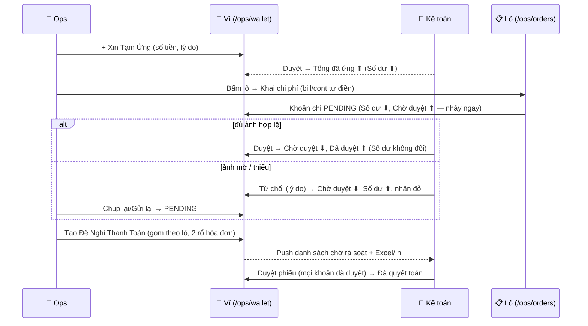
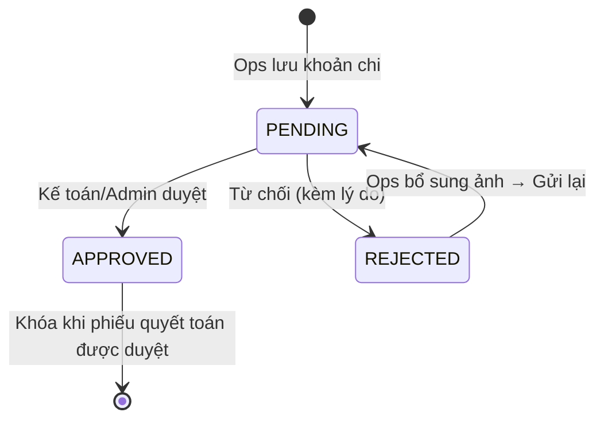

# PRD: Vận Hành Hiện Trường (Ops) — Kế hoạch làm hàng · Theo dõi xe · Quỹ tạm ứng

**Dự án:** TTransport — Silver Sea
**Ngày:** 2026-09-06 · **Cập nhật:** 2026-09-07 · **Trạng thái:** Đã triển khai
(local dev — schema, API, 3 màn hình, tab kế toán; staging/prop chờ deploy)
**Phạm vi tài liệu:** Module làm việc của Nhân viên Hiện trường (Ops, `Role.OPS`), chạy
song song trên Web PC và trình duyệt điện thoại (responsive web — không phải app native,
không phải PWA).

> **Quan hệ với tài liệu khác:** Quy trình O2C lõi (`QuyTrinhO2C.md`) không đổi. Tài liệu
> này bổ sung luồng tiền & giám sát của riêng vai trò Ops (docx `2026.9.6_Man_hinh_ops.docx`),
> tách biệt với chi phí lái xe trên app (Bước 3 O2C) và với luồng tạm ứng/hoàn ứng theo chuyến hiện có
> (`/my-advances`, `/my-settlements` — vẫn hoạt động nguyên trạng).
>
> **Ghi chú triển khai (audit 2026-09-09):** các điểm lệch có chủ đích so với docx —
> (1) bản in phiếu = modal + `@media print` trong `OpsSettlementsPanel.tsx`/`OpsWalletPage.css`
> (A4, có ô ký tên, ẩn chrome app), **không** có route in riêng; (2) API **chặn duyệt** khoản chi
> chưa có ảnh biên lai (`decideOpsExpense`) — quy tắc **hai đường duyệt**: đường chính là từ chối
> (kèm lý do) → Ops bổ sung ảnh → gửi lại (TC-OPS-VI-011); đường thứ hai (docx "kiểm chứng giấy
> tận tay"): kế toán duyệt được khoản không ảnh **chỉ khi** có cờ `inPersonCheck` + ghi chú bắt buộc
> (dialog "Duyệt không ảnh biên lai"), ghi chú lưu `audit_logs` (event
> `OPS_EXPENSE_APPROVE_IN_PERSON`, không thêm bảng);
> (3) màn Kế toán **gom các khoản cùng lô dưới một mã lô** bất kể người chi, lot giữ thứ tự mới-trước
> (`cda12f57`); (4) ghim dùng PUT set-semantics — request replay về cùng trạng thái, không lật đảo.

---

## 1. Mục tiêu

1. Ops nắm kế hoạch làm hàng trong ngày (toàn bộ lô của công ty), tự đánh dấu lô cần
   theo dõi (ghim), và khai báo chi phí phát sinh tại cảng ngay tại chỗ kèm ảnh biên lai.
2. Ops theo dõi thụ động (read-only) các đầu xe được giao quản lý: lệnh đang gán và
   trạng thái thời gian thực đồng bộ từ thao tác của Lái xe trên app.
3. Ops kiểm soát quỹ tiền mặt tạm ứng theo thời gian thực: xin tạm ứng đầu ngày, xem số
   dư nhảy tức thời khi chi tiền, đối chiếu chứng từ còn nợ, và xuất đề nghị thanh toán
   nhóm theo lô để Kế toán rà soát.

## 2. Vai trò & phân quyền

| Hành động | OPS | ADMIN | MANAGER | ACCOUNTANT | DISPATCHER | CUS | DRIVER | CUSTOMER |
|-----------|-----|-------|---------|------------|------------|-----|--------|----------|
| /ops/orders (xem lô, ghim, khai chi phí) | ✅ | ❌ | ❌ | ❌ | ❌ | ❌ | ❌ | ❌ |
| /ops/fleet-tracking (xem) | ✅ | ❌ | ❌ | ❌ | ❌ | ❌ | ❌ | ❌ |
| /ops/wallet (ví của mình) | ✅ | ❌ | ❌ | ❌ | ❌ | ❌ | ❌ | ❌ |
| Cấu hình "Ops phụ trách" trên xe | ❌ | ✅ | ❌ | ❌ | ❌ | ❌ | ❌ | ❌ |
| Duyệt / từ chối tạm ứng (bảng `advance_requests` sẵn có) | ❌ | ✅ | ✅ | ❌ | ❌ | ❌ | ❌ | ❌ |
| Duyệt / từ chối khoản chi Ops | ❌ | ✅ | ✅ | ✅ | ❌ | ❌ | ❌ | ❌ |
| Duyệt đề nghị thanh toán Ops | ❌ | ✅ | ✅ | ✅ | ❌ | ❌ | ❌ | ❌ |

- Vai trò khác vào nhầm route `/ops/*` → chuyển về trang chủ của vai trò đó (chuẩn
  AUTH-03, §5 README testplan).
- Mọi so sánh vai trò phía frontend đi qua `getModernRole` (FORWARDER cũ → OPS).

## 3. Màn hình 1 — Kế hoạch làm hàng (/ops/orders)

### 3.1 Danh sách lô theo ngày

- Bộ chọn ngày, **mặc định hôm nay**; trục ngày = `expected_delivery_date` (Ngày giao
  dự kiến của lô). Cho phép tra cứu ngày bất kỳ trong quá khứ/tương lai.
- Hiển thị **toàn bộ lô của công ty** trong ngày đã chọn (không lọc theo người),
  bỏ qua lô đã hủy. Tìm kiếm theo mã lô / khách hàng / số container.
- Bảng: Mã lô | Khách hàng | Tuyến | Cont (số lượng + danh sách số vỏ) | Bill/Booking
  (theo chiều xuất/nhập) | Trạng thái (chữ màu, không badge) | hành động.
- Mobile: bảng giữ dạng tabular tới giới hạn container 680px, mục tiêu chạm ≥ 44px.

### 3.2 Ghim lệnh (sổ tay cá nhân)

- Mỗi dòng lô có nút hành động **Ghim** (ghim/bỏ ghim).
- Lô được ghim nổi lên **đầu danh sách** (giữ nguyên thứ tự tương đối theo giờ ghim,
  mới nhất trước) — chỉ áp dụng cho **tài khoản Ops đó** (bookmark cá nhân, không ảnh
  hưởng người khác).
- Ghim lưu ngay (optimistic); trạng thái giữ nguyên qua các lần tải lại và các ngày
  tra cứu khác (lô đã ghim vẫn hiển thị ghim khi rơi vào ngày đang xem).

### 3.3 Khai báo chi phí (context-first)

- Bấm vào dòng lô → mở form **Khai báo chi phí** trong ngữ cảnh lô đó:
  - Tự điền readonly: **Mã lô**, **Số Bill** (`bl_number` với IMPORT, `booking_ref`
    với EXPORT), số vỏ container có sẵn của lô.
  - **Số Cont**: chọn 1 vỏ trong danh sách vỏ của lô; lô nhiều vỏ cho thêm lựa chọn
    "Phí chung lô" (không gắn vỏ riêng).
  - **Loại phí**: chọn từ danh mục loại phí đang hoạt động, nhóm hiển thị
    "Có hóa đơn" / "Không hóa đơn" (theo cột `requires_invoice` của danh mục).
  - **Số tiền**: nguyên dương, VND, không phân tách thập phân.
  - **Ảnh biên lai**: 0..n ảnh (nén trước khi tải; cho chụp trực tiếp từ camera trên
    điện thoại). Cho phép lưu trước - bổ sung ảnh sau (tạo "nợ chứng từ" — xem §5.3).
  - **Ghi chú**: tùy chọn.
- Lưu → hệ thống ghi khoản chi với `paid_by = Ops hiện tại`, trạng thái **Chờ duyệt
  (PENDING)**, và cập nhật ngay Màn hình 3 (ví).

### 3.4 Danh mục loại phí (tái sử dụng `forwarder_expense_types`)

| Nhóm | Loại phí (mã gợi ý) | `requires_invoice` |
|------|--------------------|--------------------|
| Có hóa đơn | Nâng/hạ (NANGHA), Phí cảng (PHICANG), Lưu kho (LUUKHO), Cơ sở hạ tầng (CSHT) | true |
| Không hóa đơn | Phí làm hàng hải quan (HQLH), Bồi dưỡng (BOIDUONG), Tiền luật (TIENLUAT), Cân xe (CANXE) | false |

Danh mục là dữ liệu cấu hình (Admin sửa được); nhóm "Có/Không hóa đơn" luôn suy từ
`requires_invoice`, không hard-code theo tên.

## 4. Màn hình 2 — Theo dõi phương tiện (/ops/fleet-tracking)

**Tính chất:** read-only. Không có bất kỳ thao tác xác nhận/chỉnh sửa nào trên màn này.

**Đặc thù vận hành SS:** mỗi Ops được giao quản lý việc giao lệnh cho một số đầu xe nhà
nhất định. Việc gán xe ↔ Ops do **Admin cấu hình** tại trang Đội xe (trường "Ops phụ
trách", một Ops active duy nhất cho mỗi xe; một Ops quản lý nhiều xe).

**Dữ liệu tự động:**

- Backend join `truck_ops_assignments` (xe của Ops) với `trips` (chuyến do Điều vận
  phân công cho xe đó). Khi Điều vận phát lệnh/đổi xe cho một xe thuộc danh sách của
  Ops, chuyến tương ứng **tự xuất hiện** trên màn của Ops đó — không cần thao tác nào.
- Trạng thái đồng bộ trực tiếp từ thao tác của Lái xe trên app (nhận lệnh, lấy vỏ/hàng,
  đóng/trả, hạ bãi, hoàn thành).

**Danh sách:** Biển số xe | Rơ-moóc (nếu có) | Lệnh đang gán (mã chuyến + mã lô; "—"
khi xe rảnh) | Tài xế | Trạng thái | Thời gian cập nhật.

| Hiển thị | Nguồn |
|----------|-------|
| Chờ nhận lệnh | Trip `CREATED`, lái xe chưa nhận |
| Đang vận chuyển | Trip `IN_TRANSIT` (kèm mốc tiến độ mới nhất của lái xe) |
| Đã hoàn thành | Trip `COMPLETED` (mới nhất của xe trong ngày) |
| Đang rảnh | Không có trip active |

Tự làm mới (polling 30s). Trang trống: "Chưa có xe nào được giao cho bạn quản lý" +
gợi ý liên hệ Admin.

## 5. Màn hình 3 — Quỹ tạm ứng cá nhân & chi phí (/ops/wallet)

### 5.1 Xin tạm ứng (Advance Request)

- Nút **+ Xin Tạm Ứng** cố định đầu màn. Form: **Số tiền** (VND nguyên), **Lý do / Ghi
  chú** (bắt buộc).
- Lưu → ghi vào bảng `advance_requests` (tái sử dụng nguyên trạng thái PENDING /
  APPROVED / REJECTED và luồng duyệt sẵn có của phân hệ Kế toán — cùng dữ liệu với
  `/my-advances`).
- Khi Kế toán/Admin duyệt → **Tổng tiền đã ứng** của Ops tăng, kéo theo **Số dư hiện
  tại** tăng.

### 5.2 Bảng điều khiển ví (4 thẻ, real-time + optimistic)

```text
[SỐ DƯ HIỆN TẠI]  =  Tổng tiền đã ứng  −  (Đã duyệt + Chờ duyệt)
```

| Thẻ | Nguồn | Màu |
|-----|-------|-----|
| **SỐ DƯ HIỆN TẠI** (cỡ chữ lớn nhất — tâm màn hình) | Σ advance_requests APPROVED của Ops − (Σ chi APPROVED + Σ chi PENDING) | Mực (nhấn mạnh) |
| Đã duyệt | Σ chi phí Ops APPROVED (chưa + đã quyết toán) | Xanh lá |
| Chờ duyệt | Σ chi phí Ops PENDING | Vàng/cam |
| Bị từ chối | Σ chi phí Ops REJECTED | Đỏ |

- **Optimistic UI:** bấm Lưu một khoản chi → Số dư **giảm** và Chờ duyệt **tăng** ngay
  lập tức (local patch), đối chiếu lại với server sau khi refetch.
- Kế toán duyệt tạm ứng → Số dư tăng. Kế toán **từ chối** một khoản chi → khoản rời
  khối "Chờ duyệt", số tiền **cộng ngược vào Số dư**, và hiển thị ở "Bị từ chối" — sự
  chênh lệch với tiền mặt thực có buộc Ops tìm lại hóa đơn hợp lệ chụp lại, hoặc tự
  đền bằng tiền túi.

### 5.3 Lịch sử chi phí & nhắc nợ chứng từ (Smart Tags)

- Bảng chi phí của Ops: Ngày | Mã lô | Cont | Loại phí | Số tiền | Chứng từ | Trạng thái.
- **Nhãn đỏ "Nợ chứng từ"** (chữ đỏ): khoản chi đã có số tiền nhưng **chưa có ảnh biên
  lai** nào. Ops nhìn danh sách là biết đang nợ Kế toán giấy tờ của lô nào.
- Khoản bị từ chối: hiển thị lý do + thao tác **Chụp lại/Gửi lại** (bổ sung ảnh rồi
  gửi lại → trả về Chờ duyệt).
- Bộ lọc: Tất cả / Chờ duyệt / Đã duyệt / Bị từ chối.
- **Micro-ledger:** mỗi khoản ghi `paid_by` = người nhập. Nhiều Ops chi cho cùng một lô
  thì backend vẫn gom hết về **một mã lô duy nhất** khi Kế toán tổng hợp.

### 5.4 Đề nghị thanh toán & sổ phụ

- Nút **Tạo Đề Nghị Thanh Toán** (cuối ngày/cuối tuần):
  - Tự query toàn bộ chi phí **PENDING + APPROVED chưa quyết toán** của Ops.
  - Group by **lô hàng** (Mã lô + Bill/Booking); mỗi lô chia 2 rổ: **Có hóa đơn** /
    **Không hóa đơn** (theo `requires_invoice` của loại phí) + tổng từng rổ + tổng chung.
  - Xác nhận → tạo phiếu (`ops_settlements`) mang mã phiếu, khóa danh sách khoản chi
    tham gia; khoản mới nhập sau đó rơi vào phiếu kế tiếp.
- **Xuất file:** Excel (bảng kê theo lô + 2 rổ, dòng tổng) để Ops in đính kèm hồ sơ
  giấy; **In phiếu** (bản in A4, không khung điều hướng, có ô ký tên).
- **Đồng bộ Kế toán:** phiếu + từng khoản chi hiển thị ở phân hệ Kế toán (tab "Chi phí
  Ops" trong workspace tạm ứng). Kế toán:
  - Duyệt từng khoản (đủ ảnh hợp lệ) → nhãn xanh, khớp trừ chính thức vào tạm ứng
    (không đổi công thức ví — Đã duyệt đã trừ từ lúc duyệt).
  - Từ chối (ảnh mờ, mất hóa đơn…) → cần lý do; khoản rơi khỏi phiếu, Ops bổ sung.
  - Duyệt cả phiếu khi mọi khoản trong phiếu đã Đã duyệt → phiếu chốt "đã quyết toán".



### 5.5 Trạng thái khoản chi (vòng đời)



> Khoản PENDING/REJECTED của Ops được sửa/xóa (chỉ người nhập); APPROVED khóa vĩnh viễn.

## 6. Mô hình dữ liệu

**Bảng mới** (FK mức ứng dụng — quy ước dự án; tiền `numeric(15,0)` VND):

| Bảng | Trường chính | Ý nghĩa |
|------|--------------|---------|
| `user_shipment_pins` | user_id, shipment_id (unique cặp), pinned_at | Ghim lô theo người |
| `truck_ops_assignments` | truck_id, ops_user_id, is_active (unique truck khi active) | Gán Ops phụ trách xe |
| `ops_expense_entries` | shipment_id, shipment_container_id?, expense_type_code, amount, paid_by_id, approval_status, approved_by_id?, rejection_reason?, ops_settlement_id?, paid_at | Khoản chi theo lô của Ops |
| `ops_expense_photos` | ops_expense_id, storage_key, uploaded_by_id, uploaded_at | Ảnh biên lai (serve `/api/photos/…`) |
| `ops_settlements` | code (unique), ops_user_id, status, total_amount, note?, approved_by_id?/at?, rejection_reason? | Đề nghị thanh toán |

> **Ghi chú triển khai (2026-09-07):** bảng nối `ops_settlement_expense_links`
> của bản nháp đã được **bỏ** — cột `ops_settlement_id` ngay trên
> `ops_expense_entries` mô tả cùng quan hệ 1-N mà không cần ghi kép; khi từ
> chối phiếu, hệ thống gỡ liên kết các khoản để chúng rơi vào phiếu kế tiếp.

**Bảng tái sử dụng (nguyên trạng):** `shipments` + `shipment_containers` (dữ liệu lô),
`trucks`/`trailers`/`trips` + `driver_progress_events` (theo dõi xe), `advance_requests`
(tạm ứng — duyệt sẵn có), `forwarder_expense_types` (danh mục loại phí), pipeline upload
ảnh sẵn có (`storage_key` + `/api/photos`).

**Không dựng lại (đã nghỉ hưu 2026-09-05):** trạng thái lô `PENDING_EXPENSE_APPROVAL`,
maker-checker, tự cấn trừ tạm ứng, áp giá nâng/hạ tự động theo bảng giá master.

## 7. Non-goals

- App native / PWA / offline cho Ops (chỉ responsive web).
- Bản đồ GPS lộ trình trên /ops/fleet-tracking (dạng danh sách; telemetry là luồng riêng).
- Gộp/xóa cổng `/my-orders`, `/my-advances`, `/my-settlements` hiện có (quyết định
  gộp là việc riêng của ban sản phẩm sau khi module ổn định).
- Sổ sách kế toán tổng thể (chỉ phạm vi duyệt chi phí Ops + phiếu thanh toán).
- Áp giá tự động nâng/hạ theo bảng giá master (đã thuộc luồng cũ bị dừng).

## 8. Lịch sử phạm vi

- Luồng "Chi phí phát sinh Ops" cũ (`testplan/flows/05-ops-chi-phi.md`, xoá commit
  `58a330af`, 2026-09-05) từng gắn với trạng thái lô PENDING_EXPENSE_APPROVAL + tự cấn
  trừ — toàn bộ đã dừng theo quyết định 2026-09-05.
- Tài liệu này **tái đưa** phạm vi chi phí Ops theo đặc tả mới 2026-09-06: đơn giản hơn
  (số tiền nhập tay + ảnh biên lai + duyệt/từ chối), tổ chức quanh ví tiền mặt cá nhân,
  tách khỏi trạng thái lô, không dùng lại bất kỳ cơ chế nào đã dừng.

## 9. Tiêu chí nghiệm thu (tóm tắt)

Chi tiết regression: [`testplan/flows/05-ops-quy-chi-phi.md`](../../testplan/flows/05-ops-quy-chi-phi.md)
(`TC-OPS-KH-*`, `TC-OPS-XE-*`, `TC-OPS-VI-*`, `TC-OPS-RBAC-*`) và
[`testplan/roles/06-vanhanh.md`](../../testplan/roles/06-vanhanh.md) Flow 7–9. Điểm P0:

1. RBAC: chỉ OPS vào được 3 route; vai trò khác bị chuyển hướng.
2. Ghim per-user, đứng đầu danh sách, sống sót qua reload.
3. Khai chi phí: bill/cont tự điền đúng chiều; lưu → PENDING + paid_by đúng người;
   ảnh tải/xem được; số tiền nguyên dương.
4. Ví: công thức đúng tuyệt đối (test đơn vị); optimistic nhảy đúng chiều; từ chối cộng
   ngược số dư; nhãn đỏ khi thiếu ảnh.
5. Đề nghị thanh toán: gom đúng theo lô, chia đúng 2 rổ `requires_invoice`, Excel tải
   được, bản in A4 hiển thị đủ; Kế toán duyệt/từ chối từng khoản và duyệt phiếu.
6. Fleet: chỉ xe được gán; lệnh xuất hiện khi Điều vận phát lệnh cho xe đó; màn hình
   không có thao tác ghi.
7. Không hồi quy: `/my-advances`, `/my-settlements`, `/my-orders`, duyệt tạm ứng
   hiện có giữ nguyên hành vi.
