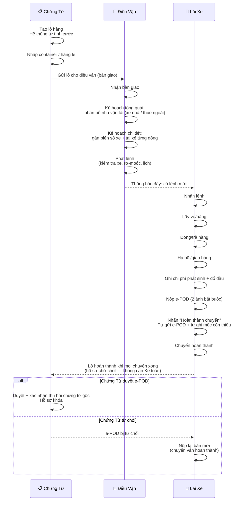
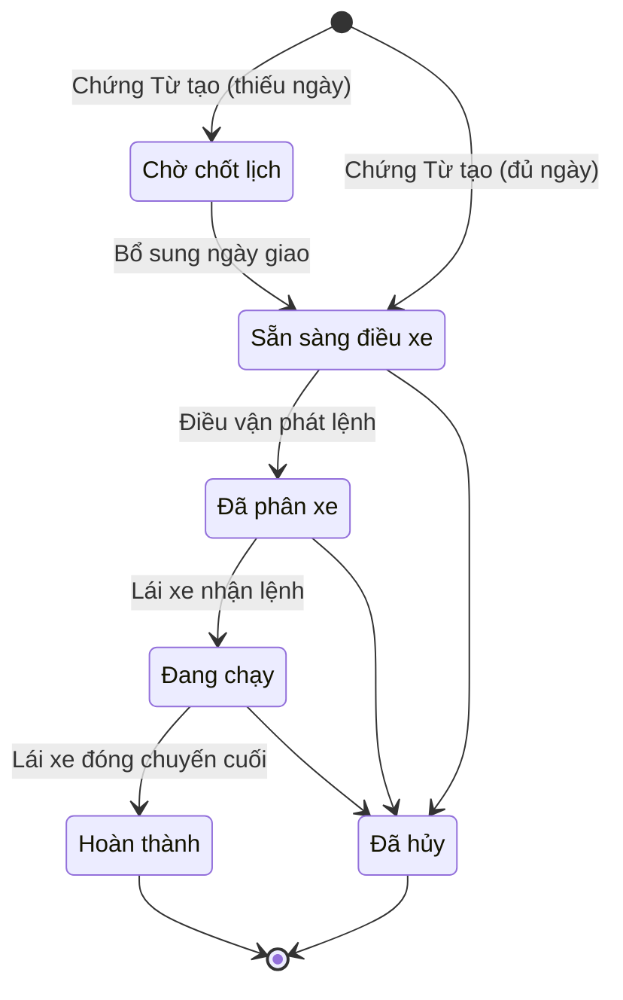
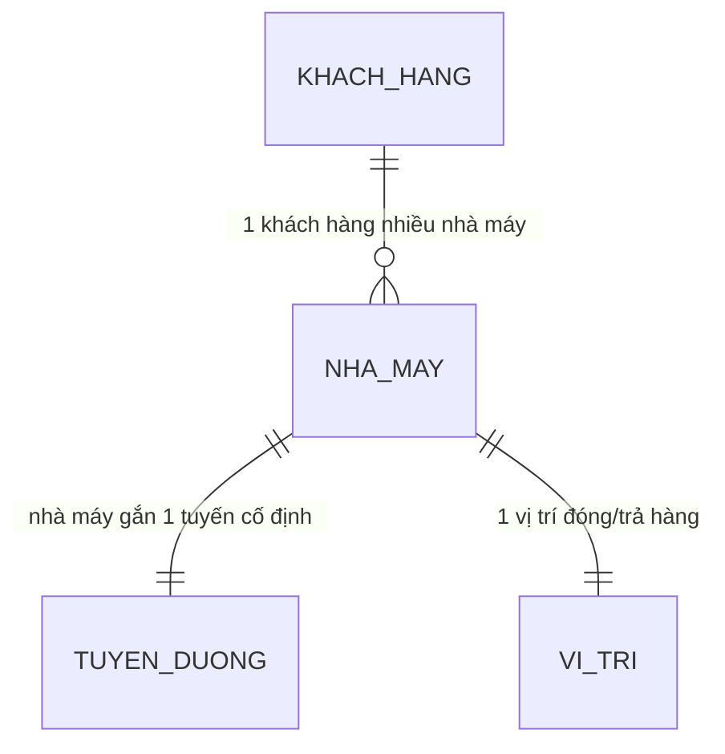
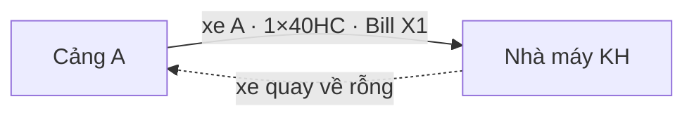
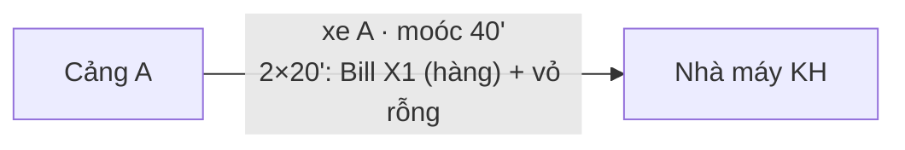
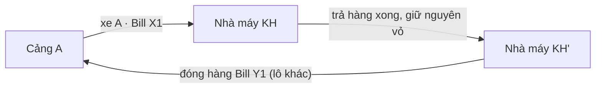

# Quy Trình O2C: Chứng Từ → Điều Vận → Lái Xe

**Dự án:** TTransport — Silver Sea

---

## Sơ Đồ Tương Tác Tổng Quát

Toàn bộ thao tác giữa 3 vai trò, theo 4 giai đoạn:

---

## Vòng Đời Lô Hàng

| Trạng thái | Chịu trách nhiệm |
|------------|-------------------|
| Chờ chốt lịch | Chứng Từ |
| Sẵn sàng điều xe | Chứng Từ |
| Đã phân xe | Điều vận |
| Đang chạy | Lái xe |
| Hoàn thành | Lái xe (tự đóng) |
| Đã hủy | Admin/GĐ |

> Lô 1 chuyến đi thẳng đến hoàn thành. Lô nhiều chuyến giữ trạng thái "Đang chạy" đến khi chuyến cuối hoàn thành (giai đoạn "Chờ duyệt phí" đã dừng 2026-09-05). Mỗi bước chuyển đều ghi nhận vào lịch sử.

---

## Danh Mục: Quan Hệ Khách Hàng – Nhà Máy – Tuyến – Vị Trí (Master Data)

Các trường Tuyến đường và Vị trí đóng/trả hàng **không nằm trôi nổi** ở bảng Khách hàng hay bảng Lô hàng — chúng neo về **Nhà máy**:

- **[Khách hàng] 1–N [Nhà máy]:** mỗi khách hàng có 1 hoặc nhiều nhà máy (`operational_sites`, theo khách hàng).
- **[Nhà máy] 1–1 [Tuyến đường]:** nhà máy dạng **Factory** bắt buộc gắn đúng 1 tuyến vận chuyển cố định (ví dụ nhà máy A luôn chạy tuyến Hải Phòng – Bắc Ninh). Kho (Warehouse) phục vụ hàng lẻ nên tuyến vẫn giữ ở cấp lô.
- **[Nhà máy] 1–1 [Vị trí đóng/trả hàng]:** mỗi nhà máy có đúng 1 vị trí giao nhận (địa chỉ + tọa độ/Google Maps) cấu hình sẵn trên nhà máy.

**Luồng nhập liệu ở Form Tạo Lô Hàng (Cascading + Auto-fill):**

1. Chọn **Khách hàng** → dropdown **Nhà máy** chỉ đổ các nhà máy ACTIVE của khách hàng đó (đổi khách hàng → tải lại, reset chọn cũ).
2. Chọn **Nhà máy** → hệ thống **tự điền và khóa (read-only)** 2 trường **Tuyến đường** và **Vị trí đóng/trả hàng** theo cấu hình của nhà máy — CUS/Điều vận không phải chọn tay. Nhà máy chưa cấu hình tuyến → trường Tuyến vẫn chọn tay được (không dead-end), nhưng form thêm nhà máy bắt buộc chọn tuyến với loại Factory.
3. Backend chốt tại điểm ghi: container có nhà máy mà tuyến ≠ tuyến của nhà máy → từ chối (422, tiếng Việt); thiếu tuyến → tự suy từ nhà máy.

---

## Bước 1 — Chứng Từ: Khởi Tạo Lô Hàng

1. Khách hàng gửi booking. Chứng Từ tạo lô nhanh — hệ thống trả **mã lô + giá cước dự kiến**.
2. Nhập hàng:
   - **Hàng nguyên container:** nhập danh sách container; hệ thống kiểm tra số container đúng chuẩn, đủ chữ số kiểm tra.
   - **Hàng lẻ:** nhập quy cách, số lượng, khối lượng, CBM.
3. Gửi lô cho điều vận — hệ thống tạo **phiếu bàn giao**, lô chuyển **sẵn sàng điều xe**.

**Kiểm soát hệ thống:**
- **Tính cước tự động** — 3 tầng: theo kg → theo container → điều chỉnh thủ công (dự phòng). Không gõ tay giá.
- **Số container chuẩn quốc tế (ISO 6346)** — Có chữ số kiểm tra; OCR tự sửa khi nhập gần đúng.
- **Bàn giao** — Điều vận phải chấp nhận phiếu bàn giao trước khi phân bổ.
- **Gửi lặp an toàn** — Thao tác trùng không tạo lô mới.
- **Chọn nhà máy → tự điền tuyến + vị trí** — chọn khách hàng lọc nhà máy theo đúng khách hàng; chọn nhà máy tự điền và khóa Tuyến đường + Vị trí đóng/trả hàng theo cấu hình nhà máy (xem mục Danh Mục ở trên).

---

## Bước 2 — Điều Vận: Phân Bổ & Phát Lệnh

Điều vận xử lý qua 2 bước: Kế hoạch tổng quát (phân bổ nhà vận tải) → Kế hoạch chi tiết (gán xe cụ thể) → Phát lệnh.

### 2a. Kế Hoạch Tổng Quát — Phân Bổ Nhà Vận Tải (theo Lô hàng)

**Mức dữ liệu: trải phẳng ở cấp Lô hàng (Shipment Level).** Một lô hàng lớn — dù có 5, 10 hay 20 container — chỉ hiển thị **1 dòng duy nhất** trên màn này. Màn này *không* hiển thị số cont, biển số xe, hay cảng nâng/hạ riêng từng container; chỉ lấy thông tin chung + cộng gộp (sum).

**Điều kiện hiển thị:** API tải lô theo **toàn bộ dải trạng thái vận hành** (`READY_FOR_DISPATCH` → `DISPATCHED` → `IN_TRANSIT` → `COMPLETED`) để lô không biến mất giữa chừng khi đã phân bổ/phát lệnh/hoàn thành (regression 2026-09-05: lô 1 cont hoàn thành biến mất khỏi màn này). Chỉ lô **Chờ chốt lịch** (thiếu `Ngày giao hàng`, chưa tới lượt điều vận) và lô **Đã hủy** là không xuất hiện. Lô `COMPLETED` vẫn hiển thị nhưng **khóa phân bổ** (nút "Phân bổ nhà xe" vô hiệu — hệ thống chỉ cho đổi nhà xe khi lô còn `READY_FOR_DISPATCH`).

**Phân bổ đa nhà vận tải (multi-vendor):** 1 lô có thể được chia cho nhiều nhà xe chạy (ví dụ `SS: 2×40HC` + `HÀ AN: 2×40HC`). Mỗi dòng phân bổ gồm: `[Dropdown nhà xe] + [Số lượng Cont 20'] + [Số lượng Cont 40']`. Điều vận bấm `+` để thêm nhà xe mới.

**Quy tắc validation:**

- Tổng số cont đã phân bổ **không được vượt quá** tổng số lượng cont của lô (theo từng loại 20'/40'). Nếu vượt → hệ thống chặn lưu, hiển thị lỗi tiếng Việt.
- Hỗ trợ **lưu phân bổ một phần** (`PARTIALLY_ALLOCATED`) — Điều vận có thể phân bổ trước một phần rồi bổ sung sau. Trạng thái cuối là `FULLY_ALLOCATED` khi đã khớp đủ.

**Trigger tự động sau khi lưu:** Hệ thống tự động **auto-split** lô thành N dòng container tương ứng ở **Kế Hoạch Chi Tiết** (2b), đồng thời **điền sẵn (pre-fill)** tên nhà xe cho từng dòng để Điều vận tiếp tục gán biển số.

Gợi ý theo vùng: ưu tiên xe nhà có điểm hạ bãi hôm trước (D-1) hoặc điểm lấy hàng hôm sau (D+1) cùng vùng.

### 2b. Kế Hoạch Chi Tiết — Gán Xe Cụ Thể (theo Container)

**Mức dữ liệu: trải phẳng ở cấp Container.** Mỗi dòng ứng với 1 container (chuyến xe). Không dùng dòng mở rộng (no expandable rows).

Cột **Nhà xe** trên mỗi dòng đã được **pre-fill tự động** từ kết quả phân bổ ở Kế Hoạch Tổng Quát (2a). Điều vận chỉ cần gán tiếp **Biển số xe**:

- **Xe nhà (In-house):** Dropdown Searchable lấy từ Master Data Đội xe (chỉ các xe thuộc quyền quản lý công ty).
- **Xe ngoài (Subcontractor):** Dropdown Searchable lấy từ danh sách xe của riêng Vendor đó; **đồng thời cho phép nhập tay tự do (free-text)** khi xe mới chưa có trong catalog. Trường hợp Điều vận để trống biển số, CUS sẽ bổ sung sau khi liên hệ nhà xe ngoài.

**Trigger trạng thái lô:** Lô chỉ chuyển sang **Đã phân xe** khi **TẤT CẢ** các dòng container thuộc cùng lô đã được điền đủ cột Biển số xe. Nếu 1 dòng còn trống → lô vẫn ở trạng thái cũ.

**Push notification tới Lái xe:** Ngay khi một dòng container thuộc nhóm Xe nhà được gán biển số hoàn tất, hệ thống lập tức bắn Push Notification "Chuyến được điều phối" và hiển thị chuyến trên App của Lái xe đó (kể cả khi Ops chưa lấy được lệnh giấy).

Có thể chọn **phân loại chuyến** cho mỗi dòng vận chuyển. Đây là nhãn thao tác ở cấp dòng (fulfillment); riêng đánh dấu **ghép chuyến** ở cấp lô hàng — hai thông tin độc lập. Có 4 loại:

#### a) Cont đơn (Đơn — 1 chiều)

1 xe chở 1 container đi 1 chiều, trả về rỗng.

**Khi dùng:** Lô FCL đơn lẻ, không có chiều về hợp lý, hoặc lộ trình 1 chiều không có hàng ngược.

**Hệ thống xử lý:** 1 fulfillment = 1 trip. Phí VETC / phí đường tính 1 lần bình thường. Không có ràng buộc ghép.

#### b) Cont kẹp (Kẹp — 2 cont 20' trên cùng 1 mooc, chạy cùng lúc)

Ghép **2 container 20ft lên cùng 1 xe mooc để chạy đồng thời** — thường 1 cont có hàng + 1 cont rỗng kéo đi/về trong cùng một chuyến đi vật lý.

**Điều kiện ghép kẹp hợp lệ:**

- Cùng biển số xe + cùng tài xế
- Cùng ngày khởi hành
- **2 container đều 20'** (moóc 40' = 2 slot 20'; không kẹp 2×40')
- Tuyến không khớp → cảnh báo, không chặn (Điều vận quyết định)

**Hệ thống xử lý:**

- **1 cont = 1 lệnh**: mỗi container vẫn là 1 lệnh riêng (chứng từ, doanh thu, công nợ độc lập với khách hàng)
- 2 trips liên kết thành **1 cặp ghép loại KẸP** (`pair_kind = KEP`) — cùng xe, cùng tài xế, thời gian **chồng lấn được phép** (chạy cùng lúc)
- Phí VETC / phí đường chỉ ghi nhận **1 lần duy nhất cho cả cặp** (trip thứ hai khử trùng tiền trạm — không lấy định mức × 2 cont)
- Lương tài xế của cặp = **cuốc cơ bản + phụ phí kẹp hàng** (Cài đặt → Lương), không cộng 2 cuốc đơn
- Thiếu điều kiện → không cho ghép, cảnh báo "Không đủ điều kiện kẹp hàng"

#### c) Cont kết hợp (Kết hợp — tái sử dụng vỏ, 2 lệnh nối tiếp)

Xe chở cont đến **trả hàng xong, không kéo vỏ rỗng về bãi** mà giữ lại vỏ đó để tiếp tục đi **đóng hàng cho một lô khác** — tiết kiệm 1 cuốc chở rỗng.

**Điều kiện ghép kết hợp hợp lệ:**

- Cùng biển số xe + cùng tài xế
- Thời gian **nối tiếp, không chồng lấn** (trả hàng lệnh 1 xong mới bắt đầu đóng hàng lệnh 2)
- **Cùng số vỏ container** trên cả 2 lệnh (tái sử dụng đúng vỏ; thiếu số vỏ ở giai đoạn điều vận thì bỏ qua, CUS bổ sung sau)

**Hệ thống xử lý:**

- **1 cont = 1 lệnh**: 2 lệnh độc lập về chứng từ/doanh thu/công nợ
- 2 trips liên kết thành **1 cặp ghép loại KẾT HỢP** (`pair_kind = KET_HOP`) — giữ nguyên bộ quy tắc kiểm tra hiện hành (cửa sổ kế hoạch, khoảng trống di chuyển xe rỗng)
- Phí VETC / phí đường tính **1 lần cho cả vòng khép kín** (trip thứ hai khử trùng)
- Lương tài xế của cặp = **cuốc cơ bản + phụ phí kết hợp** (Cài đặt → Lương)
- App Lái xe: **hoàn thành trả hàng Lệnh 1 → mới bắt đầu đóng hàng Lệnh 2** (lệnh 2 khóa tiến độ đến khi lệnh 1 hoàn thành/đủ bằng chứng)

> **Ghi chú thuật ngữ (2026-09-06):** Bản trước dùng "kẹp" cho cặp 2 chiều nối tiếp và "kết hợp" cho nhiều cont cùng chuyến. Theo định nghĩa chuẩn của khách hàng (đặc tả 2026-09-06): **kẹp = 2 cont 20' cùng 1 mooc chạy cùng lúc**; **kết hợp = tái sử dụng vỏ qua 2 lệnh nối tiếp**. Cặp nối tiếp tồn tại trước ngày này (chưa có `pair_kind`) được hiểu theo nghĩa kết hợp.

#### d) Hàng lẻ (Lẻ)

Lô hàng LCL — không phải nguyên container. Nhập quy cách, số lượng, khối lượng, CBM. Phân loại này tách riêng với 3 mô hình cont ở trên.

#### Bảng so sánh nhanh — 3 mô hình cont

| Tiêu chí | Đơn | Kẹp (cùng lúc) | Kết hợp (nối tiếp) |
|----------|-----|-----|---------|
| Số trip | 1 | 2 (liên kết cặp KEP) | 2 (liên kết cặp KET_HOP) |
| Số fulfillment | 1 | 2 | 2 |
| Số xe vật lý | 1 | 1 (chở 2 cont cùng lúc) | 1 (đi 2 lượt) |
| Vỏ container | 1 | 2 vỏ | **1 vỏ dùng lại** |
| Phí đường / VETC | 1 lần | **1 lần cho cả cặp** (trip 2 khử trùng) | **1 lần cho vòng khép kín** (trip 2 khử trùng) |
| Thời gian | 1 chiều | Chồng lấn (cùng lúc) | **Nối tiếp, không chồng lấn** |
| Cùng biển số + tài xế | — | **Bắt buộc** | **Bắt buộc** |
| Push Lái xe | Khi gán biển số | Khi gán biển số (cả 2 trips) | Khi gán biển số (cả 2 trips) |

Trạng thái phát lệnh theo từng dòng vận chuyển: **Chưa xếp xe → Đã gán biển số → Đã phát lệnh**.

### 2c. Phát Lệnh

Khi Điều vận nhấn **"Phát lệnh"**, hệ thống kiểm tra:

- Xe đang hoạt động, tài xế có tài khoản đăng nhập
- Rơ-moóc khớp container, trọng lượng ≤ tải trọng
- Không trùng lịch xe

Hệ thống tạo chuyến, lô chuyển **sẵn sàng → đã phân xe**, và gửi thông báo "Chuyến được điều phối" tới lái xe.

Sau khi phát lệnh, Điều vận vẫn được đổi xe/tài xế tự do — chỉ chặn với lô đã hoàn thành hoặc đã hủy.

---

## Bước 3 — Lái Xe: Thực Thi & Hoàn Thành Chuyến

### Bảng Chuyến Trên App

App lái xe có 3 tab: **Lệnh mới** → **Đã nhận** → **Lịch sử**. Thẻ nhóm theo phân loại (Đơn/Kẹp/Kết hợp/Lẻ).

> **Cặp ghép (chung 1 xe vật lý):** khi 2 lệnh cont được liên kết bằng mã ghép chuyến (cặp KẸP hoặc KẾT HỢP), app hiển thị **2 thẻ dính liền kề nhau** kèm nhãn **[KẸP]** / **[KẾT HỢP**] cạnh số container — tài xế biết đây là 1 "combo" phải chạy cùng nhau. Với hàng **kết hợp**, luồng trạng thái nối tiếp nhau: **hoàn thành trả hàng Lệnh 1 → mới bắt đầu đóng hàng Lệnh 2** (lệnh 2 khóa tiến độ đến khi lệnh 1 hoàn thành hoặc đủ bằng chứng).

### Chuỗi Thao Tác Trên Chuyến

Mốc bắt buộc theo thứ tự: **Nhận lệnh → Lấy vỏ/hàng → Đóng/trả hàng → Hạ bãi/giao hàng**.

Sự kiện bổ sung (không bắt buộc): xuất phát, đến nơi, đổ dầu, sự cố, ghi chú.

### Hoàn Thành Chuyến — Lái Xe Tự Đóng

Lái xe nộp e-POD rồi nhấn **"Hoàn thành chuyến"**. Điều kiện:

- Lái xe đã bấm nhận lệnh (thao tác thủ công)
- Đủ 2 file e-POD bắt buộc đã tải lên (nút bấm tự gửi e-POD)
- Các mốc còn thiếu (lấy vỏ, đóng/trả, hạ bãi) được tự ghi nhận

Đủ điều kiện → **chuyến hoàn thành ngay**. Lô 1 chuyến hoàn thành luôn; lô nhiều chuyến giữ "Đang chạy" đến khi chuyến cuối hoàn thành.

**Tự động bỏ qua:** phê duyệt đặc biệt, thu hồi chứng từ gốc (chưa cần trước khi đóng), xác nhận doanh thu bằng 0, ảnh hiện trường (cont/seal), phạm vi chi phí.

### e-POD (Chứng Từ Điện Tử)

Quy trình theo hướng: **Nháp** (tải ảnh lên) → **Đã gửi** → **Đã duyệt** hoặc **Bị từ chối** (lái xe sửa lại rồi nộp bản mới).

**2 file bắt buộc:** phiếu hạ bãi/trả hàng + biên bản giao nhận đã ký.

**File tùy chọn:** vé cầu đường.

> e-POD chỉ cần đã gửi là chuyến hoàn thành. Chứng Từ duyệt/từ chối SAU khi hoàn thành — không chặn luồng.

### Chi Phí Phát Sinh

Lái xe nhập chi phí trực tiếp trên app:

- **Nhập tay:** Phí nâng/hạ, cầu đường, đỗ xe, rửa/hàn cont, cân lốp
- **Tự tính (không sửa được):** Tiền đường (từ chuyến), phí nâng/hạ Lạch Huyên (50k)
- **Đổ dầu (riêng):** Chụp ảnh cột bơm → hệ thống đọc số lít, đơn giá, tổng tiền → phát hiện bất thường (đối chiếu GPS lộ trình đã dừng cùng tính năng tracking, 2026-09-06)

> Chi phí chưa cần duyệt trong luồng chính — xử lý sau, ngoài phạm vi.

---

## Bước 4 — Chứng Từ: Chốt Hồ Sơ Sau Chuyến

Sau khi lái xe hoàn thành, Chứng Từ xử lý chứng từ trên hồ sơ đã hoàn thành:

- **Duyệt e-POD** — chỉ vai trò Chứng Từ mới được duyệt. Chấp nhận phải kèm xác nhận đã thu hồi chứng từ gốc.
- **Từ chối e-POD** — lái xe nộp lại bản mới; chuyến vẫn hoàn thành, không mở lại.
- **Chốt hồ sơ** — lô hoàn thành → hồ sơ khóa, không sửa trực tiếp được; mở lại phải qua phê duyệt Admin.

**Nhóm hồ sơ Chứng Từ** (tự suy ra từ trạng thái lô, theo hướng **Mới → Đang chạy → Chờ khóa → Đã khóa**):

| Nhóm hồ sơ | Khi nào | Ý nghĩa |
|------------|---------|---------|
| Mới | Lô vừa tạo, chưa phát lệnh | Chưa có chuyến |
| Đang chạy | Đã phát lệnh / đang chạy | Chờ các chuyến hoàn thành |
| Chờ khóa | Hoàn thành một phần (còn chuyến chưa xong) | Sắp chốt hồ sơ |
| Đã khóa | Lô hoàn thành | Hồ sơ cuối — không sửa trực tiếp được |

> Đối soát tài chính / khóa sổ kế toán xử lý sau, ngoài phạm vi tài liệu này.

---

## Quy Tắc Hệ Thống

| Quy tắc | Chi tiết |
|---------|----------|
| **Xóa dữ liệu** | Bản tạo mới được xóa trong phiên hiện tại. Phiên cũ → Admin/GĐ phê duyệt |
| **Chi phí đã duyệt** | Cấm xóa (bất kỳ ai) |
| **Thông báo đẩy** | Lái xe nhận thông báo: lệnh mới, hủy lệnh, phạt. Điều vận nhận sự kiện lô hàng |
| **Lái xe tự đóng chuyến** | Không cần Kế toán duyệt — e-POD đã gửi là đủ |
| **Duyệt e-POD** | Chỉ Chứng Từ duyệt — sau hoàn thành, không chặn. Chấp nhận cần xác nhận đã thu hồi chứng từ gốc |
| **Chốt hồ sơ** | Lô hoàn thành → hồ sơ khóa — không sửa trực tiếp được, mở lại phải qua phê duyệt Admin |
| **Yêu cầu thay đổi** | Chứng Từ sửa lô sau phát lệnh → tạo yêu cầu thay đổi (không sửa trực tiếp) |
| **Phân loại chuyến** | Nhãn thao tác (Đơn/Kẹp/Kết hợp/Lẻ). Đánh dấu ghép chuyến độc lập theo lô |
| **Phí đường cặp ghép** | Chuyến có mã ghép kẹp/kết hợp: VETC/tiền trạm thu phí chỉ ghi nhận **1 lần cho cả cặp** — trip thứ hai được khử trùng bằng đúng tiền trạm gộp (không lấy định mức × 2 cont) |
| **Lương cặp ghép** | Không trả bằng tổng 2 cuốc chạy đơn: lương cặp = **cuốc cơ bản + phụ phí kẹp/kết hợp**, phụ phí lấy từ cấu hình lương (Cài đặt → Lương). Hủy cặp → khôi phục lương tiêu chuẩn từng trip |
