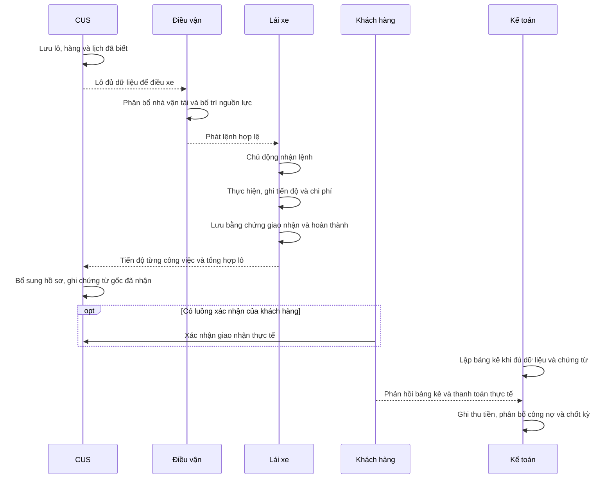

# Quy trình O2C: Chứng từ → Điều vận → Lái xe → Hồ sơ và công nợ

**Dự án:** TTransport — Silver Sea

Tài liệu xác định trải nghiệm từ khi tiếp nhận nhu cầu vận chuyển đến khi hoàn thành công việc, đủ hồ sơ và thu tiền. Mỗi bên cần biết phần việc của mình, thông tin còn thiếu và bước tiếp theo, không phải nhập lại dữ liệu đã có hoặc dò qua nhiều màn hình để biết một lô đang ở đâu.

Xem thêm: [mục lục PRD](README.md), [danh mục khách hàng/nhà máy](MasterDataNhaMay.md), [vận hành hiện trường](OpsVanHanh.md), [màn hình lái xe](ManHinhLaiXe.md).

## 1. Mục tiêu, người sử dụng và phạm vi

Sản phẩm phục vụ vận chuyển nguyên container (FCL) và hàng lẻ (LCL), gồm lệnh đơn, lệnh kẹp và lệnh kết hợp. Người có quyền thực hiện trực tiếp nghiệp vụ của mình; không có luồng gửi yêu cầu, kiểm tra và phê duyệt nội bộ. Việc lái xe nhận lệnh và khách hàng xác nhận giao hàng là phản hồi thực tế của bên thực hiện hoặc bên nhận, vẫn được giữ.

| Người sử dụng | Mục tiêu và trách nhiệm |
|---|---|
| Nhân viên chứng từ, gọi tắt là CUS | Tạo và bổ sung lô, thông tin khách hàng/hàng hóa/lịch; theo dõi phần chưa phân xe, thiếu số container hoặc thiếu hồ sơ. |
| Điều vận | Phân bổ nhà vận tải, bố trí xe–moóc–tài xế, phát lệnh và xử lý thay đổi trong phạm vi được phép. |
| Lái xe | Biết đi đâu, làm gì, liên hệ ai; nhận lệnh, ghi nhận công việc và nộp bằng chứng giao nhận. |
| Ops | Theo dõi kế hoạch công ty và xe được giao; ghi chi hiện trường, bổ sung giấy tờ và đối chiếu quỹ cá nhân. |
| Kế toán | Xác định khoản đủ hồ sơ lập bảng kê, ghi nhận thanh toán/công nợ, chi phí và lương đúng kỳ. |
| Quản lý và quản trị viên | Theo dõi hoạt động, quản lý danh mục/quyền và thực hiện nghiệp vụ tài chính hoặc điều chỉnh theo quyền được cấp. |
| Khách hàng | Xem các lô thuộc phạm vi của mình, xác nhận thực tế giao nhận và phản hồi bảng kê khi có luồng tương ứng. |

Quyền xem không tự cấp quyền sửa, xóa, ghi tiền hoặc xem mọi ảnh. Các hành động và tài liệu chỉ thuộc phạm vi người dùng đang được phép truy cập. Ứng dụng cần Internet để làm việc, không hỗ trợ ghi nghiệp vụ ngoại tuyến rồi tự gửi sau.

**Các khái niệm cần phân biệt:**

- **Lô hàng:** thông tin khách hàng, chứng từ và hàng hóa; có thể gồm nhiều phần việc vận chuyển.
- **Container:** đơn vị hàng FCL; số vỏ có thể chưa biết khi nhập ban đầu.
- **Công việc/chuyến vận chuyển:** phần được giao cho xe hoặc nhà vận tải thực hiện. Hàng lẻ có công việc riêng mà không cần container.
- **Đã nhập biển số, đã phát lệnh và lái xe đã nhận:** ba sự việc khác nhau, không suy ra lẫn nhau.
- **Hoàn thành vận chuyển, đủ chứng từ, sẵn sàng lập bảng kê, đã thanh toán và đã khóa kỳ:** các thông tin riêng; một trạng thái không tự chứng minh các trạng thái còn lại.

## 2. Luồng làm việc từ đầu đến cuối

Bàn giao nội bộ là giao trách nhiệm hoặc ghi đã trao/nhận lệnh, giấy tờ. Nó không tạo một cấp cho phép người khác mới được làm việc. Xác nhận trước khi chính người có quyền thực hiện một thao tác quan trọng vẫn được dùng để tránh nhầm lẫn.

## 3. Tiến độ và quyền thay đổi công việc

### 3.1 Theo dõi lô nhiều phần việc

Một lô có thể vừa có phần chưa chốt lịch, phần đã phân xe và phần đang thực hiện. Màn tổng hợp phải cho biết số lượng ở từng bước và giúp mở đúng phần cần xử lý.

| Giai đoạn của phần việc | Người dùng cần biết |
|---|---|
| Chưa đủ dữ liệu điều xe | Thiếu lịch hoặc thông tin nào; vẫn lưu và tìm lại được. |
| Sẵn sàng điều xe | Đủ dữ liệu kế hoạch cần thiết, còn phần nguồn lực nào phải bố trí. |
| Đã phát lệnh | Lệnh đã tới đúng người thực hiện, chưa mặc nhiên là đã nhận. |
| Đã nhận / đang thực hiện | Ai đã nhận và tiến độ nào đã được ghi. |
| Hoàn thành vận chuyển | Phần việc đã kết thúc; tình trạng giấy tờ và tiền được theo dõi riêng. |
| Đã hủy | Phần việc không còn thực hiện, có lý do và lịch sử; không được tính là đã giao. |

Một container hoàn thành không làm cả lô hoàn thành. Lô chỉ hoàn thành khi mọi phần việc bắt buộc còn hiệu lực đã xong. Lô đã phát, hoàn thành hoặc hủy vẫn tra cứu được; bộ lọc phải cho biết vì sao một lô không xuất hiện trong danh sách hiện tại.

### 3.2 Thay đổi phân công trước và sau nhận lệnh

| Tình huống | Quy tắc nghiệp vụ |
|---|---|
| Chưa phát lệnh | Cho sửa kế hoạch theo quyền, số lượng và khả năng thực hiện. |
| Đã phát nhưng lái xe chưa thực tế nhận công việc hiện tại | Cho đổi nhà vận tải, xe, tài xế hoặc moóc hợp lệ. Không khóa chỉ vì nhãn tổng hợp đang thể hiện đang vận chuyển. |
| Lái xe đã nhận công việc hiện tại | Khóa thay đổi phân công thông thường, nêu lý do và hướng xử lý được phép; không chuyển sang gửi yêu cầu duyệt. |
| Đã hoàn thành, hủy hoặc thuộc kỳ đã khóa | Không sửa phân công như một kế hoạch mới. Sai sót được xử lý bằng nghiệp vụ điều chỉnh phù hợp, giữ lý do và lịch sử. |
| Nhãn trạng thái và thông tin nhận lệnh mâu thuẫn | Chỉ rõ vấn đề và xác định việc nhận của phân công hiện tại; không tự coi là chưa nhận chỉ dựa vào nhãn. |

Nếu lái xe nhận trong lúc Điều vận đang sửa, không được lưu một phân công đã hết điều kiện. Người sửa phải biết công việc vừa được nhận và giữ được nội dung đang nhập để đối chiếu. Đổi phân công phải cập nhật nhất quán xe, moóc, tài xế và nhà vận tải liên quan; người cũ không còn tiếp tục công việc hay truy cập ảnh ngoài quyền hiện tại.

## 4. Chuẩn bị dữ liệu và tạo lô

### 4.1 Khách hàng, nhà máy và tuyến

Một khách hàng có nhiều nhà máy. Nhà máy có tuyến cố định và vị trí đóng/trả; nhiều nhà máy có thể dùng cùng tuyến. Kho phục vụ hàng lẻ có thể xác định tuyến tại lô theo nghiệp vụ.

- Chọn khách hàng chỉ đưa ra nhà máy phù hợp đang hoạt động. Đổi khách hàng không để lại nhà máy sai quan hệ; cảnh báo trước khi làm mất nội dung liên quan đang nhập.
- Chọn nhà máy tự điền tuyến và vị trí đã cấu hình; không cho chọn trái tuyến cố định đó.
- Với nhà máy cũ chưa có tuyến, người có quyền vẫn có thể chọn một tuyến hợp lệ cho công việc và được nhắc bổ sung danh mục. Lựa chọn cho một lô không tự thay đổi danh mục nhà máy. Nếu vẫn thiếu tuyến bắt buộc thì chưa được phát lệnh.
- Tạo nhà máy mới phải có tuyến. Người dùng biết ai có thể bổ sung cấu hình khi mình không có quyền.
- Lựa chọn sau cùng của người dùng được giữ đúng. Danh sách chưa tải được phải có thông báo và cách thử lại, khác với danh sách thực sự không có dữ liệu.

### 4.2 Nhập thông tin đã biết, bổ sung thông tin còn thiếu

1. CUS lưu khách hàng, Bill/Booking và hàng hóa đã biết, nhận mã lô để tiếp tục theo dõi.
2. Với FCL, ghi loại, số lượng và từng container. Số container hoặc ngày giao chưa biết được để trống và hiển thị ngắn gọn “Chưa có số” hoặc “Chưa chốt lịch”. Giá trị đã nhập sai phải được giải thích để sửa, không coi là chưa biết.
3. Với LCL, ghi quy cách, số lượng, khối lượng/thể tích và lịch khi đã biết; không tạo số vỏ hoặc container giả.
4. Người có quyền bổ sung số container còn trống và dữ liệu được phép trực tiếp, không gửi phê duyệt. Nhập từng dòng hay nhiều dòng cùng lúc phải có cùng quy tắc hợp lệ.
5. Nhận dạng từ ảnh chỉ đề xuất thông tin để người dùng kiểm tra và lưu; không âm thầm thay thông tin đã nhập.
6. Lô đủ dữ liệu xuất hiện trong kế hoạch Điều vận. Việc giao người tiếp nhận hoặc thông báo không làm phát sinh bước duyệt.

### 4.3 Ngày và giờ

- Ngày nghiệp vụ theo Việt Nam, không tự lệch ngày khi người dùng mở từ nơi khác. Ngày giao dự kiến, ngày vận chuyển, giờ hẹn và thời điểm xe thực tế chạy phải có nhãn rõ.
- Nhập và hiển thị giờ theo dạng 24 giờ, giữ đầy đủ phút như 00:15 hoặc 20:45. Qua nửa đêm phải sang đúng ngày tiếp theo.
- Có nút **Xác nhận** rõ khi bổ sung lịch; gõ, chọn lịch hoặc dùng Enter cho cùng kết quả. Chỉ báo đã lưu khi mở lại còn đúng ngày và giờ đã chọn.
- Cho sửa hoặc xóa lịch theo quyền và giai đoạn. Xóa lịch trở về chưa chốt, không tự điền hôm nay hay giữ ngày cũ ở nơi khác.
- Chưa đủ lịch vẫn được lưu lô. Khi phát lệnh, chỉ yêu cầu lịch thực sự cần để thực hiện và hướng tới đúng chỗ bổ sung. Không bắt nhập lại lịch đã có ở một biểu mẫu khác.

### 4.4 Cước và lệnh chạy ngoài

Cước được xác định theo điều khoản của từng hợp đồng. Khi hợp đồng cho phép các nguồn giá này, ưu tiên giá gốc theo kg, sau đó giá theo container/loại xe, cuối cùng là nhập hoặc điều chỉnh thủ công bởi người có quyền khi cần. Thứ tự này không cho phép lấy giá của hợp đồng khác hoặc coi dữ liệu thiếu là giá 0. Giá dự kiến phải phân biệt với giá đã phát hành; quyền sửa lô không tự cho phép sửa giá.

Đối với mô hình Long Minh trong [Cước và phụ phí dầu](CuocPhiPhuPhiDau.md):

- **Cước điều chỉnh = Giá gốc × (1 + Tỷ lệ chia sẻ / 100).** Tỷ lệ thuộc cặp khách hàng–tuyến.
- **Phụ phí dầu = (Giá dầu kỳ − Giá dầu mốc) × Lít định mức khứ hồi**, nhưng không nhỏ hơn 0. Tỷ lệ chia sẻ không nhân thêm vào phụ phí dầu.
- **Tổng cước = Cước điều chỉnh + Phụ phí dầu.** Hai thành phần tiền được làm tròn riêng đến đồng; phần lẻ từ nửa đồng trở lên làm tròn lên, dưới nửa đồng làm tròn xuống. Không thay bằng chỉ làm tròn tổng cuối.
- Lít định mức khứ hồi dựa trên quãng đường một chiều × 2 × định mức phù hợp đơn vị. Giữ độ chính xác của các tham số và lượng nhiên liệu đến bước tính tiền.
- Chọn kỳ giá theo ngày vận chuyển và độ trễ hợp đồng. Thiếu tham số phải nói rõ, không tự dùng 0. Kỳ giá mới không làm thay đổi cước đã phát hành trước đó.

Không áp mô hình này cho hợp đồng khác khi chưa có căn cứ. Các mức giá và điều kiện cụ thể theo các tài liệu cước liên quan, không đặt lại trong quy trình này.

**Lệnh chạy ngoài** cho chọn dữ liệu danh mục hoặc nhập thông tin tự do được phép. Ban đầu tùy chọn này tắt; bật/tắt không làm mất nội dung đang nhập. Tên nhập cho một lệnh không tự trở thành danh mục mới. Các màn liên quan hiển thị đúng tên đã lưu. Danh sách và chi tiết có nhãn **Chạy ngoài** gọn tại vị trí nhận diện lô, cùng cách lọc riêng các lệnh này; không lặp nhãn cạnh từng trường.

Bản chất của loại lô này — nguồn hàng, cước do khách báo và phí chi hộ, các thao tác/chi phí được bỏ qua — định nghĩa tại [MasterDataNhaMay.md](MasterDataNhaMay.md) §4; công thức cước tại [Quy tắc cước và phụ phí dầu](CuocPhiPhuPhiDau.md). Mục này chỉ quy định cách lô chạy ngoài đi qua quy trình O2C.

Chạy ngoài không bỏ qua tải trọng, lịch, quyền hoặc hạn mức tín dụng. Nếu có ngoại lệ tín dụng được phép, người có thẩm quyền ghi trực tiếp đúng hạn mức, lý do và thời gian hiệu lực; không tạo yêu cầu chờ duyệt.

## 5. Phân bổ và phát lệnh

### 5.1 Kế hoạch tổng quát

- Mỗi lô một dòng thông tin chung và tổng số lượng, giúp Điều vận nhìn được nhiều lô cùng lúc.
- Một lô có thể phân cho nhiều nhà vận tải và lưu từng phần. Tổng phân bổ không vượt số lượng từng loại; phần còn thiếu phải thấy rõ.
- Thêm phân bổ hoặc bấm lưu lại không nhân đôi công việc. Những phần đã nhận hoặc hoàn thành không được mở khóa chỉ vì phần khác của lô chưa xong.
- LCL có đủ các bước phân bổ, bố trí nguồn lực và phát lệnh như một công việc hàng lẻ thực sự, không phụ thuộc vào container giả.

### 5.2 Kế hoạch chi tiết

Trên máy tính, mỗi dòng thể hiện một container hoặc công việc: nhà vận tải, biển số, tài xế, moóc, lịch, khách hàng/nhà máy, tuyến, cảng nâng/hạ, tình trạng nhận lệnh và ghi chú. Trên điện thoại và máy tính bảng, giữ thông tin trọng tâm dễ đọc và mở chi tiết khi cần, không ép tên dài vào các cột quá hẹp.

- Xe nhà được chọn trong đội xe phù hợp. Xe ngoài có thể chọn xe của nhà vận tải hoặc nhập biển số được phép; cùng một biển số phải có cách nhận diện nhà vận tải nhất quán.
- Chưa có biển số vẫn lưu kế hoạch được, nhưng không coi là đã phát lệnh.
- Chọn Đơn/Kẹp/Kết hợp tại công việc; hàng lẻ giữ phân loại Lẻ. “Đóng kết hợp” cấp lô của CUS là thông tin riêng, không lặp thành lựa chọn cùng nghĩa trong điều phối.
- Tác vụ và ghi chú tự do có mục đích khác nhau. Tác vụ hiển thị viết hoa ở dòng riêng; ghi chú giữ khoảng trắng, xuống dòng và cách viết có nghĩa, kể cả khi gõ từng ký tự.

### 5.3 Phát lệnh trực tiếp

Người có quyền bấm **Phát lệnh** khi phân bổ, lịch, xe, tài xế và moóc phù hợp. Nút ở dòng kế hoạch phát ngay theo thông tin đã lưu; không mở bước hẹn ngày/giờ phát lệnh hay hộp xác nhận lặp lại. Trong lúc đang gửi, nút thể hiện tiến độ và không nhận lần bấm thứ hai; lỗi nằm tại dòng để người dùng sửa hoặc thử lại. Xe/người phải đang hoạt động, đủ sức chở và không xung đột với công việc khác. Nếu chưa đủ, thông báo cụ thể công việc hoặc dữ liệu đang chặn và cách xử lý trong phạm vi người dùng được xem.

Khi phát thành công, có đúng công việc cần thực hiện và đúng tài xế được thông báo. Bấm lại không tạo thêm chuyến hoặc thêm tiền. Việc nhập một biển số hay gửi thông báo không tự có nghĩa đã phát lệnh thành công.

Lệnh giấy Ops chưa lấy được là thông tin riêng, không phải cấp phê duyệt để lái xe nhận lệnh. Thay đổi sau phát tuân thủ ranh giới trước/sau nhận ở mục 3.2.

### 5.4 Đơn, Kẹp và Kết hợp

| Tiêu chí | Đơn | Kẹp | Kết hợp |
|---|---|---|---|
| Công việc | Một phần việc | Hai container 20FT đồng thời | Hai phần việc nối tiếp, tái dùng vỏ |
| Theo dõi | Một lệnh | Hai lệnh riêng có quan hệ cặp rõ | Hai lệnh riêng có thứ tự rõ |
| Nguồn lực | Xe phù hợp | Cùng xe, moóc và tài xế | Cùng xe/tài xế và vỏ phù hợp |
| Lịch | Thực hiện được | Đồng thời trong cặp hợp lệ | Đủ thời gian chuyển tiếp |
| Phí chung | Theo định mức phù hợp | Không nhân đôi phí đường/VETC | Không nhân đôi phí chung của vòng |
| Thu nhập lái xe | Theo công việc | Cuốc cơ bản và phụ phí kẹp | Cuốc cơ bản và phụ phí kết hợp |

**Kẹp:** hai container 20FT có cùng ngày/lịch tương thích, cùng xe–moóc–tài xế; phương tiện phải đáp ứng cả hai vị trí container và **tổng tải đồng thời**. Moóc 40FT phù hợp có thể chở hai container 20FT; không đồng nghĩa một container 40FT được ghép vào cặp hai 20FT. Thành viên thứ ba, quá tải hoặc lộ trình không thể thực hiện phải bị chặn.

Hai lệnh trong cặp được nhận diện nhất quán ở kế hoạch, màn lái xe và tính chi phí. Không coi thành viên còn lại là chuyến ngoài cặp để chặn nhầm, cũng không cho phép một công việc không liên quan dùng chung xe chỉ vì có nhãn kẹp. Người dùng phải biết cả cặp đã được bố trí hay phần nào còn chưa xong. Mỗi lệnh vẫn giữ riêng khách hàng, chứng từ, doanh thu và công nợ.

**Kết hợp:** tái dùng đúng vỏ qua hai lệnh nối tiếp. Chưa biết số vỏ có thể lưu kế hoạch để bổ sung, nhưng hai số khác nhau không được coi là cùng vỏ. Hoàn thành trả hàng Lệnh 1 rồi mới bắt đầu đóng hàng Lệnh 2; khi chưa thể bắt đầu, nêu rõ phần việc trước đang chặn.

Hủy, tháo cặp hoặc đổi một thành viên không làm mất phần còn hiệu lực hoặc bỏ qua xung đột phương tiện. Phí chung và thu nhập của cặp tính đúng một lần theo định mức đã xác định, không trả thành hai cuốc đơn. Điều chỉnh giữ lịch sử và không tự thay đổi kỳ đã khóa. Chi tiết tại [Lô hàng Kẹp và Kết hợp](LoHangKepKetHop.md).

## 6. Lái xe thực hiện, hoàn thành và ghi nhận thu nhập

### 6.1 Tiếp nhận và xem công việc

Lái xe có **Lệnh mới**, **Đã nhận** và **Lịch sử**. Hai lệnh trong cặp đặt liền nhau với quan hệ rõ, không trộn trạng thái hay ảnh.

Thẻ công việc ưu tiên nhà máy viết tắt → tuyến → từng số container đi cùng loại và thao tác trả/đóng hàng → cảng nâng/hạ → tác vụ/ghi chú. Chi tiết có tên đầy đủ, địa chỉ và liên hệ cùng nhóm; từng bên xuất hóa đơn có tiêu đề trước tên, địa chỉ và mã số thuế. Với hàng nhập, cảng hạ là nơi trả vỏ, không lấy nhà máy giao hàng thay thế. Thông tin thiếu phải nói rõ, không mượn dữ liệu của bên khác.

**Nhận lệnh vận chuyển** là hành động chủ động của lái xe khi có Internet và còn được giao công việc. Chỉ chuyển sang Đã nhận khi thành công; giờ nhận không được diễn giải thành giờ xe xuất phát thực tế. Nếu xe hoặc tài xế đang vướng công việc khác, giải thích và hướng xử lý, không chỉ yêu cầu tải lại.

### 6.2 Tiến độ, bằng chứng và hoàn thành

Tiến độ gồm nhận lệnh, lấy vỏ/hàng, đóng/trả hàng và hạ bãi/giao hàng. Mốc ghi thực tế giữ đúng thời điểm, người ghi và bằng chứng. Chi phí, nhiên liệu, sự cố và ghi chú thuộc đúng công việc.

Với FCL, cần hai nhóm bằng chứng đã lưu:

1. **Phiếu hạ bãi / trả hàng** phù hợp công việc.
2. **Biên bản giao nhận** có dấu hoặc chữ ký theo yêu cầu chứng từ.

Sau khi tự nhận lệnh và có đủ hai nhóm bằng chứng, lái xe bấm **Hoàn thành chuyến** trong một thao tác. Nếu thiếu các mốc sau nhận lệnh, cho phép ghi chúng là **suy ra từ hoàn thành**; không buộc lái xe bấm thêm từng mốc chỉ để đủ danh sách. Mốc suy ra không được mô tả thành thời điểm quan sát thực tế hoặc GPS, không ghi đè mốc thực tế đã có và không tự tạo việc nhận lệnh thay lái xe.

Ảnh tải đến 100% chưa đủ để báo hồ sơ đã lưu; ảnh phải mở lại được. Công việc còn thuộc quyền lái xe, còn được phép hoàn thành và tuân thủ thứ tự kết hợp. Đủ điều kiện thì hoàn thành trực tiếp, không chờ duyệt e-POD hoặc kế toán. Ảnh container/chì, vé cầu đường, thu hồi chứng từ gốc, đối chiếu chi phí hoặc xác nhận doanh thu 0 không trở thành điều kiện thêm để đóng chuyến.

Với LCL, hoàn thành theo công việc hàng lẻ. Bộ chứng từ thay phiếu hạ container cần được xác định theo nghiệp vụ hàng lẻ; không mặc định dùng bộ FCL, số container hoặc ảnh container giả.

### 6.3 Tổng hợp, chấm công và lương

Hoàn thành cập nhật đúng công việc và tổng hợp lô cho các vai trò liên quan. Ngày hoàn thành theo ngày nghiệp vụ Việt Nam, nhất quán khi xem, mở sửa và mở lại. Công việc qua nửa đêm không bị lệch hoặc mất ngày chỉ vì cách hiển thị thời gian.

- Ngày công phản ánh các công việc hợp lệ thực hiện trong ngày, kể cả chuyến kéo dài qua nhiều ngày. Nhiều chuyến trong cùng ngày không nhân đôi ngày công.
- Hủy hoặc đổi một chuyến không xóa công của chuyến khác còn hiệu lực trong ngày. Nội dung chấm công thủ công có căn cứ của người có quyền không bị thay thế âm thầm.
- Nếu còn thông tin ảnh hưởng ngày công chưa được đối chiếu, người chốt lương phải biết trước khi chốt; không bỏ sót rồi báo lương đã đầy đủ.
- Lương cơ bản và các mức thu nhập áp dụng đúng ngày hiệu lực. Thay mức mới không tự tính lại khoản đã chốt bằng mức hiện tại. Không đặt thêm mức lương hoặc phụ cấp trong quy trình này.
- Người có quyền ghi và điều chỉnh kỷ luật trực tiếp theo quy định. Khoản đã hủy không còn là khấu trừ hiện hành hoặc được tính vào tổng vi phạm đang có hiệu lực; lịch sử vẫn tra cứu được.
- Số phải trả, đã trả, khấu trừ và còn lại phải đối chiếu được. Số âm được giải thích theo các khoản thực sự tạo ra nó, không tự kết luận do nhận thừa tạm ứng.
- Kỳ lương phải thể hiện đúng khoảng ngày đang áp dụng và ngày hiệu lực khi thay cấu hình. Lương đã chốt không tự thay đổi; sai sót được điều chỉnh theo quyền và giữ lịch sử.

### 6.4 Chi phí và nhiên liệu

Lái xe ghi chi trực tiếp theo quyền và danh mục, gắn đúng chuyến. Tiền đường và phụ cấp dùng định mức phù hợp; giá trị 0 được nhập rõ khác với chưa nhập. Đổi moóc phải dùng đúng định mức mới; nếu thiếu thì nói rõ, không giữ giá cũ như thể đã tính đúng.

Nhận dạng ảnh cột bơm đề xuất lít, đơn giá và tiền để người dùng kiểm tra, sửa và lưu. Hóa đơn nhiên liệu phải phân bổ đúng số lít, không trùng và có tổng tiền hợp lệ; đây là yêu cầu dữ liệu, không phải cấp duyệt. Khoản chi đã ghi, chứng từ còn thiếu, thanh toán và quyết toán được theo dõi riêng. Chi phí hiện trường và quỹ Ops theo [Vận hành Ops](OpsVanHanh.md).

## 7. Hồ sơ, bảng kê và công nợ

### 7.1 Bằng chứng và chứng từ gốc

Hồ sơ điện tử cho biết còn thiếu tài liệu nào, tài liệu nào đã lưu và bản nào đang có hiệu lực. Ảnh không đọc được có chỉ dẫn thay hoặc bổ sung. Bản thay thế giữ liên hệ với lịch sử; người không còn quyền không được tiếp tục mở, sửa hoặc xóa ảnh.

Không có duyệt/từ chối hồ sơ nội bộ. Đủ bằng chứng, vận chuyển hoàn thành và đã nhận chứng từ giấy là ba thông tin riêng. Chứng từ gốc chỉ được ghi đã nhận khi có người và ngày nhận thực tế, không tự nhận vì có ảnh hoặc chuyến đã xong.

CUS bổ sung thông tin được phép sau phát lệnh. Khi một thay đổi ảnh hưởng kế hoạch hoặc tiền, chỉ người có quyền tương ứng được thực hiện và phải tuân thủ giai đoạn/kỳ liên quan. Thông báo chặn phải nêu ràng buộc thật và cách điều chỉnh phù hợp, không tạo yêu cầu thay đổi chờ duyệt.

### 7.2 Lập bảng kê và phản hồi khách hàng

Kế toán lập và phát hành bảng kê/debit note trực tiếp khi đủ dữ liệu hàng hóa, giá, chứng từ và điều kiện kỳ. Một phần việc không được tính lặp trên các dòng nguồn đang có hiệu lực. Nếu chưa đủ, hiển thị đầy đủ từng lý do và cách bổ sung; các lý do không che nhau hay tràn ra ngoài vùng thông báo.

Khách hàng xác nhận giao hàng hoặc phản hồi bảng kê theo phạm vi của mình, có người phản hồi và thời điểm. Đây là phản hồi bên ngoài, không phải cấp phê duyệt nội bộ. Xác nhận giao nhận không tự có nghĩa đã thanh toán.

### 7.3 Ghi nhận tiền và điều chỉnh

Thanh toán dựa trên khoản thu/chi thực tế và phân bổ đúng đối tượng, bảng kê hoặc khoản nợ. Thanh toán một phần giữ phần còn lại. Ghi nhận trong ứng dụng không tự chứng minh có chuyển khoản ngân hàng.

Số tiền và tình trạng thanh toán phải thống nhất giữa chứng từ, danh sách và sổ công nợ. Bấm lặp hoặc thử lại không tăng thu, chi hay công nợ hai lần. Bổ sung ảnh, hoàn thành vận chuyển hoặc quyết toán không tự tạo thêm giao dịch tiền.

Sửa/hủy sau phát hành phải theo quyền, có lý do và lịch sử trước/sau; số dư được điều chỉnh tương ứng khi thực tế cần. Không xóa dấu vết, tự mở kỳ đã khóa hoặc tự thay số tiền đã chốt.

### 7.4 Phơi phiếu và phân công kế toán

Kế toán phơi phiếu quản lý một danh sách xe được phân công; một xe có một người phụ trách hiện hành, một người có nhiều xe. Phân công này độc lập với phân công Ops, không cố định số kế toán hoặc số xe; chỉ là trách nhiệm công việc và bộ lọc mặc định, không thu hẹp quyền xem xe/lô hiện có. Kế toán vẫn xem được xe người khác phụ trách và xe chưa phân công trong phạm vi vai trò. Quản trị/người được cấp quyền phân công được chọn tài khoản kế toán đang hoạt động. Xe chưa phân công có nhóm riêng để không bị bỏ sót; lịch sử người đối chiếu/thanh toán không đổi khi phân công lại.

Nơi làm việc kế toán có hai bảng liên kết nguồn:

1. **Chi phí Ops và hoàn ứng:** theo lô/nhân viên, xem khoản thực chi, giấy tờ, người/ngày đối chiếu và nghĩa vụ hoàn ứng theo [Vận hành Ops](OpsVanHanh.md).
2. **Phơi phiếu và tiền đường:** mỗi dòng nhận diện công việc/lô/container, lịch, khách hàng/nhà máy/tuyến, nơi nâng/hạ, nhà vận tải, biển số/tài xế, số chi hộ phải thu/phải trả, tiền đường, trạng thái chứng từ/thanh toán và ngày liên quan. Các dòng cùng biển số đứng liền nhau khi dùng chế độ nhóm xe, kể cả kẹp/kết hợp; vẫn truy được từng nguồn, không nhân đôi tiền dùng chung. Ghi chú CUS/điều vận và ghi chú lái xe là hai nội dung riêng.

Bộ lọc lịch của phơi phiếu sử dụng đúng ngày hẹn đang hiển thị, theo giờ Việt Nam; không âm thầm lọc theo ngày xuất phát khác. Tìm kiếm nhận cả tên phí và số hóa đơn. Khi lọc đã/chưa đối chiếu, chỉ các khoản phù hợp xuất hiện trong chi tiết thu/trả và tổng tương ứng. Khách hàng, nhà máy và tuyến là ba thông tin riêng, không dùng tên khách thay nhà máy.

Tiền đường lấy theo chi phí công việc đã ghi nhận: phụ cấp tiền đường, phụ cấp ca, cầu đường và phát sinh riêng. Bấm tổng thấy từng thành phần, phân biệt vé thực tế đã đối chiếu với ước tính. Vé thực tế thay ước tính, không cộng thêm lần nữa; giữ các phụ cấp đã thỏa thuận. Phí chung kẹp/kết hợp chỉ tính một lần tại công việc sở hữu. Thiếu định mức hiển thị chưa xác định. Bộ lọc chứng từ không làm thay đổi tổng tiền đường đã thỏa thuận của công việc.

Mỗi số tổng mở được các dòng phí: tên, số hóa đơn, số thu khách, số phải trả, người thực chi và giấy tờ. Có thể nhập thêm hoặc điều chỉnh theo quyền. Tùy chọn **Thu bằng trả** chỉ là hỗ trợ nhập: bật thì hai giá trị đi cùng nhau, tắt thì sửa độc lập; không áp ngầm lên mọi khoản.

Đối chiếu/xác nhận chỉ ghi nhận sự kiện đã kiểm tra bởi người có quyền. Không có hàng đợi gửi duyệt, cấp duyệt hay từ chối. Không đổi điều kiện hoàn thành vận chuyển và không giả định tiền đã chuyển.

### 7.5 Nguồn quỹ và phiếu thu/chi

Hai nguồn theo dõi là **Quỹ công ty** và **Quỹ TM**. Mỗi tài khoản thực tế được người có quyền cấu hình rõ thuộc Quỹ công ty hoặc Quỹ TM, độc lập với loại Tiền mặt/Ngân hàng. Không suy ra nguồn quỹ từ tên, ngân hàng hoặc loại tài khoản. Tài khoản cũ chưa phân nguồn giữ nguyên số dư và lịch sử, hiển thị “Chưa phân nguồn quỹ” và cần cấu hình trước khi dùng ở phiếu chi phí. Người quản lý/quản trị thiết lập hoặc phân nguồn trực tiếp tại Sổ quỹ / ngân hàng; kế toán thấy hướng dẫn cấu hình, không dùng tài khoản giả. Thay đổi cấu hình có kiểm tra phiên bản và lịch sử, không tạo hoặc di chuyển giao dịch tiền.

- Quỹ công ty, tài khoản ACB được nêu trong yêu cầu: cược container với hãng tàu, ứng Ops và tiền đường lái xe.
- Quỹ TM: các khoản có hóa đơn như nâng/hạ/lưu bãi; thu các khoản của khách không theo dõi chi hộ riêng và trả chi hộ cho vendor/xe nhà.
- Chọn nguồn/tài khoản trước khi ghi thu/chi; hiển thị số tiền, đối tượng, nguồn được phân bổ và chiều tăng/giảm quỹ. Số tài khoản chưa cấu hình phải được bổ sung đúng quyền, không dùng số minh họa.
- Chọn một, nhiều hoặc toàn bộ kết quả trong phạm vi được chỉ rõ để lập phiếu tổng hợp. Không gộp dòng thu và dòng chi thành một số ròng khiến mất nghĩa vụ; không trộn các đối tượng không thể cùng một phiếu.
- Phiếu chỉ được ghi khi mọi dòng còn hợp lệ, cùng kỳ cho phép và không vượt số còn lại. Khóa nghiệp vụ áp theo thao tác; thanh toán công nợ đã chốt không sửa lại chi phí hay chứng từ kỳ cũ. Nếu một dòng đã đổi/đã thanh toán/không còn quyền thì giải thích dòng đó và không ghi một phần rồi báo cả phiếu thành công.
- Sau ghi, phiếu, phân bổ và số dư quỹ cùng được cập nhật một lần. Số đã thu/đã trả bằng tổng phân bổ tiền; không ghi đè Thực thu (thu khách) hoặc Thực chi. Thanh toán một phần giữ phần còn lại. Hủy/đảo phiếu có quyền, lý do và dấu vết, không xóa lịch sử.

Quỹ phản ánh tiền đã giao/nhận thực tế. Nhập chi phí, đối chiếu, xuất Excel, phát hành debit hoặc ghi ngày nộp hồ sơ hoàn cược không tự tạo thêm tiền thu/chi.

### 7.9 Khóa lô và bảng quyết toán theo lô (Chi phí — Quyết toán)

**Khóa lô** (khóa chi phí) là mốc đóng băng hồ sơ tài chính của lô: tổng phải thu, tổng phải trả, các nhóm chi phí, **luồng hải quan** (đỏ/vàng/xanh) và **nhãn cảng nâng/hạ** được giữ đúng **tại thời điểm khóa**. Sửa chi phí bị chặn khi lô đã khóa; các trường theo dõi thực tế (ngày nộp hồ sơ hoàn cược, ngày tiền về, số đã hoàn) vẫn bổ sung được theo thực tế. Khi lô chưa khóa, các số này theo dõi hiện hành; đã khóa rồi thì hồ sơ đã phát hành không tự viết lại khi danh mục (tên cảng, nhóm chi phí) thay đổi sau đó.

**Bảng quyết toán theo lô** có hai lớp. Lớp tổng (Tổng phải thu khách, Tổng phải trả, chênh lệch) tính từ cả hai bảng của lô; dòng chi hộ có hóa đơn tự tính lại số thu khách theo quy tắc của loại chi phí (hiện nay: tính lại đúng thực chi — chi phí qua lại); chỉ dòng **Phí khác (không hóa đơn)** do CUS tự nhập số thu khách, và chỉ các dòng này nhận số gõ tay. Lớp chi tiết hiện mỗi container một dòng trên cả hai bảng, kể cả container chưa có phần việc.

Các con số chưa xác định hiển thị **Chưa xác định**, không tự thành 0. Loại chi phí chưa được phân nhóm quyết toán hiển thị trong nhóm **Chưa phân loại** và tổng các nhóm luôn khớp tổng chi phí lô — không mất đồng nào khỏi bảng. Luồng hải quan là thuộc tính tờ khai của **lô**, hiển thị thống nhất trên bảng quyết toán; chưa khai báo hiển thị "—". Khoảng ngày trên bảng kê theo **ngày giao của các lô được chọn** vào đợt phát hành, không phải ngày xử lý; một lô chỉ nằm trong một bảng kê đang hiệu lực — chọn lại lô đã thuộc bảng kê khác bị chặn và nêu rõ số lô.

Chi tiết mỗi đợt đối chiếu hoàn ứng phải cho biết từng khoản ứng đã sử dụng (mã yêu cầu, số tiền phân bổ và lý do), kể cả đợt đã hoàn tác. Khi dữ liệu cũ chỉ có tổng tiền mà không có phân bổ chi tiết, hiển thị rõ thiếu thông tin; không suy đoán hoặc tạo phân bổ mới.

### 7.6 Báo cáo chi hộ phải thu và phải trả

Hai báo cáo theo tháng/khoảng ngày dùng cùng cách đọc:

| Báo cáo | Nhóm đối tượng | Số liệu |
|---|---|---|
| Phải thu | Khách hàng | Nâng, hạ, phát sinh khác, tổng phải thu, đã thu, còn phải thu, ghi chú |
| Phải trả | Nhà vận tải/đối tượng được thanh toán | Nâng, hạ, phát sinh khác, tổng phải trả, đã trả, còn phải trả, ghi chú |

Xe nội bộ có mã đối chiếu SilverSea để xem như một nhóm nhà vận tải, nhưng vẫn mang loại xe nội bộ; không vì nhóm báo cáo mà biến xe nhà thành nhà xe ngoài hoặc tạo thêm nghĩa vụ trả vendor. Người nhận tiền thực tế vẫn được chỉ rõ.

Mỗi tổng mở được khoản phí và phiếu phân bổ tạo nên nó. Các ô nâng, hạ, khác, tổng, đã thanh toán và còn lại mở đúng nguồn cấu thành số đang xem, giữ nguyên ngày chốt thanh toán. Loại báo cáo và ngày chốt được giữ khi đổi tab, quay lại hoặc tải lại trang; không tự trở về loại báo cáo khác. Báo cáo ghi rõ loại ngày lọc và ngày chốt số liệu; không dùng tháng đang mở trên máy người dùng để âm thầm đổi kỳ chứng từ. Ngày chi, ngày vận chuyển, ngày đối chiếu và ngày thu/chi tiền không được tráo nhau. Khoản đã hủy loại khỏi số hiện hành nhưng còn lịch sử. Phiếu thu/chi bị đảo sau ngày chốt vẫn được tính tại thời điểm trước ngày đảo: thu 100.000đ ngày 10, đảo ngày 20 thì báo cáo chốt ngày 15 giữ đã thu 100.000đ; chốt ngày 20 trở đi đã thu bằng 0đ. Màn hình, chi tiết và bản xuất sử dụng cùng ngày hiệu lực. Khoản ứng chỉ giảm phải trả khi đã giao tiền và đã được phân bổ vào khoản chi tính đến ngày chốt. Hoàn tác phân bổ sau ngày chốt không xóa phân bổ tại kỳ trước. Thiếu căn cứ phân bổ theo thời điểm phải hiển thị chưa xác định. Ngày chốt là ngày thanh toán tính đến trên phạm vi chi phí hiện hành; không phải chức năng phục dựng toàn bộ hồ sơ chi phí trước các lần điều chỉnh. Không cộng lại khoản chi hộ đã có trong debit/phân bổ khác.

### 7.7 Hóa đơn kết hợp và cược container

**Hóa đơn kết hợp:** người có quyền theo dõi lô, số hóa đơn, giá trị hóa đơn, nhà cung cấp và số phải trả nhà cung cấp. CUS xem được thông tin trong phạm vi lô của mình. Khoản trả nhà cung cấp cho việc lấy hóa đơn là **chi phí hóa đơn** riêng của lô; không nhầm với toàn bộ giá trị hóa đơn hoặc tạo thêm tiền chi chỉ vì lưu hồ sơ. Nếu đã có khoản phí nguồn, liên kết thay vì ghi lại phí nâng/hạ lần nữa. Khi có đúng một công việc vận chuyển thực tế, phí hóa đơn gắn với công việc đó; khi có nhiều công việc, người nhập chọn rõ công việc chịu phí. Phí trước điều xe vẫn thuộc lô và không tạo chuyến giả. Hồ sơ hóa đơn giữ quyền sở hữu khoản phải trả nhà cung cấp; việc liên kết vào công việc chỉ để truy nguồn, không tạo nghĩa vụ thanh toán thứ hai.

**Cược container:** lưu Bill, khách hàng, hãng tàu, số tiền cược, ngày cược, ngày nộp chứng từ hoàn cược, ngày tiền cược về và ghi chú. Chưa nộp/chưa về hiển thị đúng tình trạng, tìm/lọc được; tiền cược hoàn lại không phải doanh thu vận tải. Các ngày phản ánh thực tế, đúng định dạng, số tiền dương; sửa có quyền và lịch sử. Khi các ngày có trình tự bất thường, chỉ rõ để người dùng kiểm tra; quy tắc bắt buộc nộp chứng từ trước khi nhận tiền hoàn cần được khách hàng xác nhận, không tự chặn theo giả định này. Không tự tạo phiếu hoàn tiền từ việc điền ngày tiền về. Theo dõi riêng số tiền đã hoàn và số còn cược: đã hoàn không âm, không vượt số cược; đã hoàn lớn hơn 0 phải có ngày nhận thực tế. Cược 2.000.000đ đã hoàn 500.000đ thì còn 1.500.000đ; chỉ có ngày nhận không đủ để kết luận đã hoàn toàn bộ. Đây là theo dõi hồ sơ, không tự tạo giao dịch tiền từ số đã hoàn. Sau khi khóa chi phí lô, kế toán vẫn bổ sung ngày nộp hồ sơ, ngày nhận, số đã hoàn và ghi chú cược theo thực tế; giữ lịch sử và không sửa số cược gốc hoặc định danh hồ sơ trong thao tác này. Nút cập nhật hồ sơ cược vẫn xuất hiện ngay tại lô đã chốt; các trường số cược gốc, Bill, hãng tàu và ngày cược được khóa, còn trường bổ sung chứng từ/hoàn tiền vẫn dùng được.

Điều kiện cảnh báo quá hạn cược chưa đủ nội dung trong tài liệu nguồn và cần khách hàng xác định mốc bắt đầu, số ngày và cách nhắc. Khi chưa có quy tắc, sản phẩm chỉ nêu số ngày/tình trạng thực tế; không tự gắn “quá hạn” theo ngưỡng tự đặt.

### 7.8 Tiêu chí nghiệm thu chi phí và kế toán

| Mã | Tình huống và kết quả cần đạt |
|---|---|
| AC-CP-KT-01 | Gán nhiều xe cho kế toán đang hoạt động; đổi người phụ trách giữ lịch sử người đã đối chiếu/chi tiền; không thay phân công Ops. Xe chưa gán tìm được, tài khoản ngừng hoạt động không nhận phân công mới. |
| AC-CP-KT-02 | Mở hai bảng Ops/phơi phiếu theo quyền; lọc tìm, ngày, nhân viên/xe/khách và trạng thái giữ đúng phạm vi; không lộ quỹ/người ngoài quyền. |
| AC-CP-KT-03 | Nhóm theo biển số làm các dòng cùng xe liền nhau; lệnh kẹp/kết hợp vẫn giữ nguồn riêng và chỉ tính một lần các khoản dùng chung. |
| AC-CP-KT-04 | Mở tổng chi hộ/tiền đường thấy đủ chi tiết tên phí, hóa đơn, số thu/trả, người chi; tổng bằng các dòng, tiền đường không vào phải thu khách. |
| AC-CP-KT-05 | Bật Thu bằng trả điền hai số bằng nhau; tắt và sửa thu 150.000đ/trả 120.000đ giữ đúng hai giá trị sau lưu; không biến thành một giao dịch tiền mặt. |
| AC-CP-KT-06 | Kế toán đối chiếu dòng, thêm/sửa khoản có lý do và theo kỳ; không yêu cầu người thứ hai duyệt; ghi rõ người/ngày, hoàn thành chuyến không bị phụ thuộc đối chiếu. |
| AC-CP-KT-07 | Tạo tài khoản hoặc phân nguồn tài khoản cũ tại Sổ quỹ / ngân hàng; chọn rõ Quỹ công ty/TM, không suy ra từ CASH/BANK hoặc tên. API danh mục và màn hình lập phiếu trả/hiện đúng tài khoản đang hoạt động của quỹ đã chọn. Tài khoản chưa phân nguồn có thông báo cấu hình, không ghi phiếu chi phí được. Phân nguồn giữ nguyên số dư, lịch sử tiền; kiểm tra quyền và phiên bản, không ghi tiền mới. |
| AC-CP-KT-08 | Chọn tất cả chỉ chọn phạm vi được ghi rõ, hiển thị số dòng/tổng; đổi bộ lọc không giữ âm thầm dòng ẩn để thanh toán. |
| AC-CP-KT-09 | Ghi phiếu chi 300.000đ phân bổ 100.000đ + 200.000đ: quỹ giảm đúng 300.000đ, từng khoản đã trả đúng phân bổ; mở lại hoặc bấm lặp không ghi thêm. |
| AC-CP-KT-10 | Khoản phải thu 500.000đ, thu 200.000đ: đã thu 200.000đ, còn 300.000đ; thu vượt còn lại bị chặn, không tạo số dư âm ngầm. |
| AC-CP-KT-11 | Một dòng trong phiếu nhiều dòng bị đổi/đã trả/khóa kỳ: toàn bộ thao tác không ghi tiền; lỗi chỉ rõ dòng, người dùng giữ được lựa chọn để xử lý. |
| AC-CP-KT-12 | Mất phản hồi sau ghi phiếu cho tra lại kết quả theo mã; thử lại cùng thao tác không sinh phiếu/phân bổ/giao dịch trùng. |
| AC-CP-KT-13 | Báo cáo tháng nhóm đúng khách/nhà vận tải và nâng/hạ/khác; tổng phải thu/trả trừ đã thu/trả bằng còn lại; xuất và drill-down khớp cùng bộ lọc/ngày chốt. |
| AC-CP-KT-14 | Xe SilverSea ở nhóm đối chiếu nội bộ; không tạo thêm AP nhà xe ngoài hoặc trả hai lần cho cùng khoản lái xe/chi hộ. |
| AC-CP-KT-15 | Chi phí có số thu khách 0đ không lên debit; khoản có thu lên đúng khách/lô một lần, không coi việc tạo debit là thu tiền. |
| AC-CP-KT-16 | Hóa đơn kết hợp giá trị 1.000.000đ, phí nhà cung cấp 50.000đ: chi phí hóa đơn của lô là 50.000đ; lưu hồ sơ không tự xuất tiền hoặc nhân đôi phí nâng/hạ. CUS xem đúng phạm vi. |
| AC-CP-KT-17 | Cược 2.000.000đ giữ Bill/hãng tàu/khách và các ngày thực tế; ghi đã hoàn 500.000đ thì còn 1.500.000đ. Hoàn vượt số cược hoặc đã hoàn dương nhưng thiếu ngày nhận bị chặn. Ngày sai định dạng có lỗi rõ, ngày có trình tự bất thường được nêu để kiểm tra; không chặn chỉ vì tiền về trước ngày nộp khi chưa có quy tắc được xác nhận. |
| AC-CP-KT-18 | Cược 2.000.000đ đã hoàn 500.000đ vẫn còn 1.500.000đ, không báo đã hoàn đủ chỉ vì có ngày nhận. Theo dõi số đã hoàn/ngày nhận tách khỏi doanh thu vận tải và không tự tạo phiếu tiền; hồ sơ chưa về hoặc hoàn một phần tìm được, không tự đặt ngưỡng quá hạn. |
| AC-CP-KT-19 | Tiền âm, không hữu hạn, sai định dạng hoặc vượt giới hạn lưu trữ bị chặn ở nhập liệu và khi lưu; 0đ thu khách được giữ có chủ ý, số tiền chi không được rỗng/0 khi khai thực chi. |
| AC-CP-KT-20 | Khóa kỳ, đổi quyền, đồng thời sửa và hủy/đảo phiếu không làm thay hồ sơ đã chốt hoặc mất lịch sử; quỹ/công nợ/chi phí luôn đối chiếu theo nguồn. Nhật ký ghi đúng nghiệp vụ tiền đã thực hiện (thu khách, trả nhà cung cấp, trả lái xe hoặc hoàn ứng OPS), kể cả khi dùng chung màn hình hoặc thử lại; không gọi mọi phiếu là hoàn ứng OPS. Thiếu khai báo nghiệp vụ hoặc không ghi được nhật ký phải hủy toàn bộ thay đổi trong giao dịch. |
| AC-CP-KT-21 | 390px/820px/desktop: bộ lọc và trường tiền cùng cỡ điều khiển, tổng/hành động dễ thấy, không tràn ngang toàn trang; chi tiết mở gọn, thao tác bàn phím được, không thẻ lồng thẻ. |
| AC-CP-KT-22 | Mất mạng giữ nội dung chưa lưu trong màn hình khi còn có thể; không báo thành công giả, không xếp hàng hoặc tự gửi lại khi mạng về/đổi tài khoản. |

**Thực thu (thu khách)** là khoản tính cho khách và ghi công nợ, chưa phải tiền vào quỹ. **Đã thu** lấy từ phiếu thu và phân bổ thực tế. Thực chi 500.000đ, thực thu 300.000đ, chưa trả: công nợ 300.000đ, đã thu 0đ; sau thu 100.000đ thì còn nợ 200.000đ. Chênh lệch khoản phí −200.000đ không bị đổi thành phí dịch vụ âm. Cho phép thực thu 0đ, thấp hơn hoặc cao hơn thực chi. Phần **chốt debit vendor** được khách ghi rõ chưa hoàn thiện: giữ quy tắc hiện hành cho tới khi phạm vi mới được xác nhận, không tự áp các mô tả VAT/thời điểm ghi AP còn tạm thời.

## 8. Trải nghiệm chung và độ tin cậy

### 8.1 Biết chính xác điều gì đã được lưu

- Mọi thao tác cho biết đang lưu, đã lưu, chưa lưu được hoặc chưa rõ kết quả. Thông báo thành công khớp dữ liệu khi mở lại.
- Khi không rõ kết quả vì mất kết nối hoặc phản hồi, sản phẩm giúp xác định dữ liệu thực tế đã ghi trước khi người dùng nhập lại. Không tự kết luận thất bại rồi tạo trùng lô, chuyến, ảnh hoặc khoản tiền.
- Nếu thông tin chính đã lưu nhưng ảnh hay phần bổ sung chưa xong, nói rõ phần nào thành công và cho tiếp tục đúng công việc đó, không bắt tạo lại.
- Hai người sửa cùng dữ liệu không âm thầm ghi đè nhau. Người đang sửa được biết thay đổi liên quan và giữ nội dung mình đang nhập để đối chiếu.
- Giá trị chưa biết, nội dung cố ý xóa và số 0 có ý nghĩa riêng. Lưu một dòng không làm mất các dòng khác hoặc khôi phục dữ liệu người dùng đã xóa.
- Ảnh đã lưu phải đọc được. Thêm, thay, xóa và thử lại giữ đúng lựa chọn cuối cùng, không làm ảnh xuất hiện ở công việc khác hoặc trở lại sau khi đã xóa.

### 8.2 Internet, quyền và thao tác quan trọng

- Không có ngoại lệ phê duyệt nội bộ cho nghiệp vụ tài chính, khách hàng, tín dụng, nhiên liệu, chấm công hoặc lương. Không cần một người khác kiểm tra rồi duyệt, không có hàng đợi hoặc bước tự động duyệt ẩn. Hành động hợp lệ hoàn tất trực tiếp trong phạm vi được cấp; lý do, chứng từ, phiên bản và khóa kỳ vẫn được kiểm tra.
- Lịch sử quyết định cũ còn đọc được để đối chiếu, không biến thành nút duyệt hiện hành và không bị xóa để làm sạch giao diện. Không tự chuyển yêu cầu ứng cũ thành đã trả, không sinh giao dịch hoặc đổi tổng tiền vì bỏ luồng duyệt.

- Tất cả vai trò cần Internet để làm việc với thông tin hiện hành. Mất mạng phải ngừng thao tác ghi và nói rõ thông tin đang xem có thể chưa mới.
- Nội dung đang nhập nếu còn giữ trên màn hình phải được ghi rõ chưa lưu; cảnh báo khi rời hoặc tải lại có thể làm mất nội dung. Không cho nhập nghiệp vụ ngoại tuyến với lời hứa sẽ tự gửi.
- Khi có mạng, mở lại trang hoặc đổi tài khoản, không tự thực hiện các thao tác cũ. Người dùng chủ động tiếp tục sau khi biết kết quả lần trước.
- Lỗi dịch vụ tạm thời không bị gọi là hết phiên đăng nhập nếu phiên vẫn hợp lệ. Người dùng có cách thử lại mà không mất nội dung đang làm.
- Quyền luôn theo vai trò, tổ chức, phân công và đối tượng hiện hành; biết mã hay từng mở liên kết không tự cấp quyền. Khách hàng không xem dữ liệu khách hàng khác; lái xe/Ops không giữ quyền cũ sau khi phân công đổi.
- Xóa/hủy dựa vào quyền, công việc đã phát sinh, dữ liệu liên quan và kỳ đã khóa. Người đủ điều kiện xác nhận rồi thực hiện trực tiếp; không bị đưa vào hàng đợi phê duyệt. Tình huống không được xóa phải giải thích và hướng tới cách xử lý hợp lệ.

### 8.3 Làm việc hiệu quả trên điện thoại, máy tính bảng và máy tính

- Ưu tiên lô, công việc và hành động thực tế trước tổng hợp dự kiến hoặc khu vực chưa có dữ liệu. Màn hình chứa nhiều thông tin vẫn phải quét nhanh được.
- Mã lô, biển số, số container và số tiền đọc được nguyên nghĩa; tên dài không đè lên hành động. Không dùng chữ quá nhỏ để ép dữ liệu, cũng không dùng chữ/thẻ quá lớn hoặc nhiều lớp lề, thẻ lồng nhau.
- Điện thoại dành đủ chiều ngang cho dữ liệu, máy tính bảng không ép quá nhiều cột, máy tính tận dụng diện tích để so sánh nhiều dòng. Giữ cùng nghĩa thông tin và cùng khả năng thao tác trên ba loại thiết bị.
- Hành động ít dùng và thông tin dài có thể mở khi cần; không giấu phần cần thiết cho quyết định chính. Danh sách dài có tìm kiếm, bộ lọc rõ và cách quay lại vị trí đang xem.
- Biểu mẫu chỉ yêu cầu dữ liệu cần thiết tại bước hiện tại. Lỗi nằm cạnh trường cần sửa; nút lưu/hủy dễ tìm và không bị bàn phím ảo che.
- Hộp thoại và các thao tác chính dùng được bằng bàn phím, trạng thái không phụ thuộc riêng màu sắc. Hiệu ứng nhẹ, tôn trọng lựa chọn giảm chuyển động; làm mới không đẩy hàng hoặc nút người dùng đang thao tác.

## 9. Tiêu chí chấp nhận

| Tình huống | Kết quả người dùng quan sát được |
|---|---|
| Tạo lô chưa đủ thông tin | Lưu và tìm lại được FCL chưa số/ngày; LCL không cần container giả; giá trị sai có hướng sửa rõ. |
| Chọn khách hàng và nhà máy | Đúng quan hệ, tuyến cấu hình được giữ; nhà máy cũ thiếu tuyến có lựa chọn hợp lệ và hướng bổ sung; nhà máy mới yêu cầu tuyến. |
| Bổ sung lịch | Nhập 00:15/20:45, qua nửa đêm, xóa lịch, Enter hoặc Xác nhận đều giữ đúng ngày/phút khi mở lại. |
| Tính cước Long Minh | Giá dầu dưới mốc cho phụ phí 0; hai thành phần tiền làm tròn riêng; đúng kỳ/độ trễ; giá đã phát hành không đổi theo kỳ mới. |
| Lệnh chạy ngoài | Giữ thông tin nhập và tính chất chạy ngoài; không tự thêm danh mục; không bỏ qua quyền, tải trọng, lịch hay tín dụng. |
| Phân bổ một phần hoặc hàng lẻ | Nhiều nhà vận tải không vượt số lượng, phần thiếu rõ; LCL được phân xe và phát lệnh mà không có vỏ giả. |
| Đổi phân công | Trước khi lái xe nhận thì đổi hợp lệ được; sau nhận thì chặn đúng lý do. Nếu nhận trong lúc sửa, không ghi đè phân công đã được nhận. |
| Phát lệnh kẹp | Hai container 20FT trên phương tiện phù hợp được ghép; quá tổng tải, thành viên 40FT, thành viên thứ ba hoặc công việc ngoài cặp xung đột bị chặn. |
| Lệnh kết hợp | Đúng vỏ và thứ tự; phần việc trước chưa xong được chỉ rõ; phí chung và lương không tính thành hai cuốc đơn. |
| Lái xe xem và nhận việc | Đủ nhà máy, tuyến, từng số–loại, cảng và liên hệ đúng nhóm; nhận chủ động; ghi chú tiếng Việt giữ khoảng trắng. |
| Hoàn thành FCL | Sau tự nhận và đủ hai nhóm bằng chứng đã lưu, hoàn thành trong một thao tác; mốc còn thiếu được ghi rõ suy ra, không giả GPS/thời điểm thực tế. |
| Công việc và lương | Đúng tổng hợp lô, ngày công qua ngày và nhiều chuyến; hủy một chuyến không xóa công khác; chấm thủ công có căn cứ được giữ; mức lương đúng hiệu lực, kỳ chốt không tự đổi. |
| Kỷ luật và khấu trừ | Khoản hủy rời khấu trừ/tổng vi phạm hiện hành nhưng còn lịch sử; số phải trả, đã trả và còn lại giải thích được. |
| Hồ sơ và bảng kê | Đủ/thiếu bằng chứng, chứng từ gốc và xác nhận khách hàng tách biệt; đủ dữ liệu lập bảng kê trực tiếp, không chờ duyệt. |
| Thao tác trực tiếp toàn ứng dụng | Mọi vai trò có quyền lưu/ghi nhận/điều chỉnh trực tiếp; không có màn hình, thông báo hoặc bước duyệt ẩn. Vai trò thiếu quyền vẫn bị chặn; lịch sử và khóa kỳ được giữ. |
| Thanh toán và công nợ | Thu/chi một phần còn dư đúng; danh sách, chi tiết và sổ nợ thống nhất; thử lại hoặc bổ sung ảnh không tạo tiền trùng. |
| Lưu một phần hoặc chưa rõ kết quả | Biết phần đã xong, đọc lại được kết quả thực tế, tiếp tục đúng bản ghi; không mất nội dung đang nhập hay ghi đè người khác. |
| Mất mạng hoặc đổi tài khoản | Không nhận thêm thao tác để gửi sau, không báo thành công giả hoặc tự gửi lại; người dùng chủ động tiếp tục khi có mạng. |
| Ba loại thiết bị | Dữ liệu dài, rỗng, đang tải và lỗi đều dễ hiểu; mã/tiền không chồng nhau; biểu mẫu gọn, nút không bị che, thao tác được bằng bàn phím. |

## 10. Tài liệu liên quan và điểm cần làm rõ

- [Màn hình lái xe](ManHinhLaiXe.md), [Vận hành Ops](OpsVanHanh.md), [Lô hàng Kẹp và Kết hợp](LoHangKepKetHop.md).
- [Master data nhà máy](MasterDataNhaMay.md).
- [Cước và phụ phí dầu](CuocPhiPhuPhiDau.md), [Phương án tính cước tự động](PhuongAnTinhCuocTuDong.md), [Mô hình và quy tắc cước](CuocPhiThietKeDB.md).

Bộ chứng từ bắt buộc cho LCL thay phiếu hạ container cần được chốt với người phụ trách nghiệp vụ. Điều kiện hợp đồng hoặc nguồn thông tin còn chưa rõ cần được xác định trước khi áp dụng; không tự đặt giá, giấy tờ mới hoặc thêm phê duyệt để thay thế câu trả lời.

## 11. Kết nối và thử lại

Khi mở một trang đã đăng nhập mà máy chủ tạm lỗi, giữ phiên và địa chỉ trang, hiện nút thử lại; không chuyển người dùng về đăng nhập như thể mật khẩu đã hết hiệu lực. Chỉ yêu cầu đăng nhập lại khi phiên thực sự không còn hợp lệ.

Ứng dụng gửi yêu cầu nghiệp vụ bình thường; nếu backend không khả dụng thì báo lỗi API và giữ nội dung chưa lưu trong màn hình để người dùng thử lại. Không heartbeat, kiểm tra sức khỏe trước thao tác hoặc tự gửi lại mutation khi mạng phục hồi.
