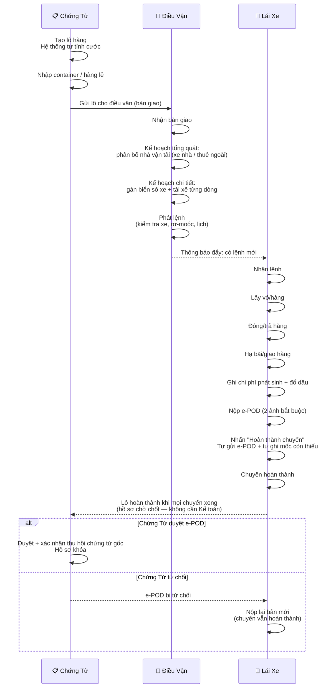
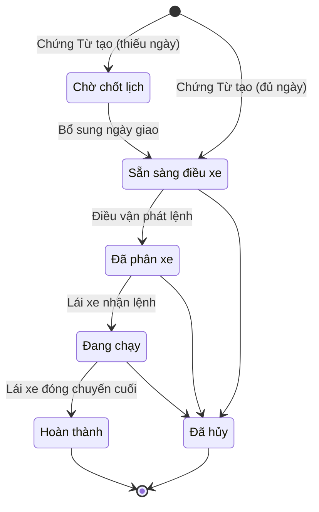
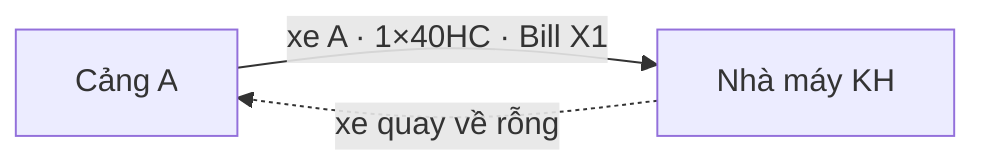
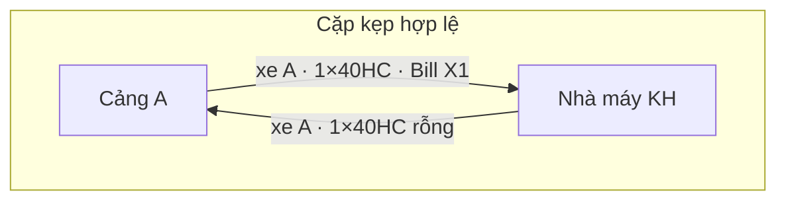
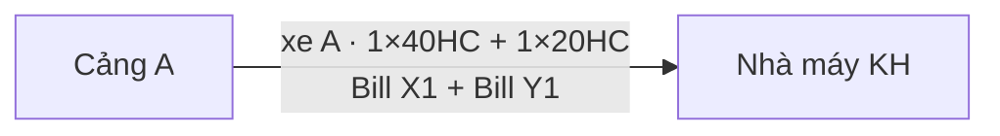

# Quy Trình O2C: Chứng Từ → Điều Vận → Lái Xe

**Dự án:** TTransport — Silver Sea

---

## Sơ Đồ Tương Tác Tổng Quát

Toàn bộ thao tác giữa 3 vai trò, theo 4 giai đoạn:

---

## Vòng Đời Lô Hàng

| Trạng thái | Chịu trách nhiệm |
|------------|-------------------|
| Chờ chốt lịch | Chứng Từ |
| Sẵn sàng điều xe | Chứng Từ |
| Đã phân xe | Điều vận |
| Đang chạy | Lái xe |
| Hoàn thành | Lái xe (tự đóng) |
| Đã hủy | Admin/GĐ |

> Lô 1 chuyến đi thẳng đến hoàn thành. Lô nhiều chuyến giữ trạng thái "Đang chạy" đến khi chuyến cuối hoàn thành (giai đoạn "Chờ duyệt phí" đã dừng 2026-09-05). Mỗi bước chuyển đều ghi nhận vào lịch sử.

---

## Bước 1 — Chứng Từ: Khởi Tạo Lô Hàng

1. Khách hàng gửi booking. Chứng Từ tạo lô nhanh — hệ thống trả **mã lô + giá cước dự kiến**.
2. Nhập hàng:
   - **Hàng nguyên container:** nhập danh sách container; hệ thống kiểm tra số container đúng chuẩn, đủ chữ số kiểm tra.
   - **Hàng lẻ:** nhập quy cách, số lượng, khối lượng, CBM.
3. Gửi lô cho điều vận — hệ thống tạo **phiếu bàn giao**, lô chuyển **sẵn sàng điều xe**.

**Kiểm soát hệ thống:**
- **Tính cước tự động** — 3 tầng: theo kg → theo container → điều chỉnh thủ công (dự phòng). Không gõ tay giá.
- **Số container chuẩn quốc tế (ISO 6346)** — Có chữ số kiểm tra; OCR tự sửa khi nhập gần đúng.
- **Bàn giao** — Điều vận phải chấp nhận phiếu bàn giao trước khi phân bổ.
- **Gửi lặp an toàn** — Thao tác trùng không tạo lô mới.

---

## Bước 2 — Điều Vận: Phân Bổ & Phát Lệnh

Điều vận xử lý qua 2 bước: Kế hoạch tổng quát (phân bổ nhà vận tải) → Kế hoạch chi tiết (gán xe cụ thể) → Phát lệnh.

### 2a. Kế Hoạch Tổng Quát — Phân Bổ Nhà Vận Tải (theo Lô hàng)

**Mức dữ liệu: trải phẳng ở cấp Lô hàng (Shipment Level).** Một lô hàng lớn — dù có 5, 10 hay 20 container — chỉ hiển thị **1 dòng duy nhất** trên màn này. Màn này *không* hiển thị số cont, biển số xe, hay cảng nâng/hạ riêng từng container; chỉ lấy thông tin chung + cộng gộp (sum).

**Điều kiện hiển thị:** API tải lô theo **toàn bộ dải trạng thái vận hành** (`READY_FOR_DISPATCH` → `DISPATCHED` → `IN_TRANSIT` → `COMPLETED`) để lô không biến mất giữa chừng khi đã phân bổ/phát lệnh/hoàn thành (regression 2026-09-05: lô 1 cont hoàn thành biến mất khỏi màn này). Chỉ lô **Chờ chốt lịch** (thiếu `Ngày giao hàng`, chưa tới lượt điều vận) và lô **Đã hủy** là không xuất hiện. Lô `COMPLETED` vẫn hiển thị nhưng **khóa phân bổ** (nút "Phân bổ nhà xe" vô hiệu — hệ thống chỉ cho đổi nhà xe khi lô còn `READY_FOR_DISPATCH`).

**Phân bổ đa nhà vận tải (multi-vendor):** 1 lô có thể được chia cho nhiều nhà xe chạy (ví dụ `SS: 2×40HC` + `HÀ AN: 2×40HC`). Mỗi dòng phân bổ gồm: `[Dropdown nhà xe] + [Số lượng Cont 20'] + [Số lượng Cont 40']`. Điều vận bấm `+` để thêm nhà xe mới.

**Quy tắc validation:**

- Tổng số cont đã phân bổ **không được vượt quá** tổng số lượng cont của lô (theo từng loại 20'/40'). Nếu vượt → hệ thống chặn lưu, hiển thị lỗi tiếng Việt.
- Hỗ trợ **lưu phân bổ một phần** (`PARTIALLY_ALLOCATED`) — Điều vận có thể phân bổ trước một phần rồi bổ sung sau. Trạng thái cuối là `FULLY_ALLOCATED` khi đã khớp đủ.

**Trigger tự động sau khi lưu:** Hệ thống tự động **auto-split** lô thành N dòng container tương ứng ở **Kế Hoạch Chi Tiết** (2b), đồng thời **điền sẵn (pre-fill)** tên nhà xe cho từng dòng để Điều vận tiếp tục gán biển số.

Gợi ý theo vùng: ưu tiên xe nhà có điểm hạ bãi hôm trước (D-1) hoặc điểm lấy hàng hôm sau (D+1) cùng vùng.

### 2b. Kế Hoạch Chi Tiết — Gán Xe Cụ Thể (theo Container)

**Mức dữ liệu: trải phẳng ở cấp Container.** Mỗi dòng ứng với 1 container (chuyến xe). Không dùng dòng mở rộng (no expandable rows).

Cột **Nhà xe** trên mỗi dòng đã được **pre-fill tự động** từ kết quả phân bổ ở Kế Hoạch Tổng Quát (2a). Điều vận chỉ cần gán tiếp **Biển số xe**:

- **Xe nhà (In-house):** Dropdown Searchable lấy từ Master Data Đội xe (chỉ các xe thuộc quyền quản lý công ty).
- **Xe ngoài (Subcontractor):** Dropdown Searchable lấy từ danh sách xe của riêng Vendor đó; **đồng thời cho phép nhập tay tự do (free-text)** khi xe mới chưa có trong catalog. Trường hợp Điều vận để trống biển số, CUS sẽ bổ sung sau khi liên hệ nhà xe ngoài.

**Trigger trạng thái lô:** Lô chỉ chuyển sang **Đã phân xe** khi **TẤT CẢ** các dòng container thuộc cùng lô đã được điền đủ cột Biển số xe. Nếu 1 dòng còn trống → lô vẫn ở trạng thái cũ.

**Push notification tới Lái xe:** Ngay khi một dòng container thuộc nhóm Xe nhà được gán biển số hoàn tất, hệ thống lập tức bắn Push Notification "Chuyến được điều phối" và hiển thị chuyến trên App của Lái xe đó (kể cả khi Ops chưa lấy được lệnh giấy).

Có thể chọn **phân loại chuyến** cho mỗi dòng vận chuyển. Đây là nhãn thao tác ở cấp dòng (fulfillment); riêng đánh dấu **ghép chuyến** ở cấp lô hàng — hai thông tin độc lập. Có 4 loại:

> **Quyền chọn phân loại của Điều vận (2026-09-08):** Điều vận được quyền chọn/đổi **phân loại chuyến Đơn / Kẹp / Kết hợp** cho từng dòng trong dialog **"Chỉnh sửa điều phối"** (Kế hoạch chi tiết) và lưu cùng bước phân xe. Riêng dòng hàng lẻ (LCL) giữ cố định phân loại **Lẻ** (gắn với hình thức lô, không phải lựa chọn theo cont). Đánh dấu **"Đóng kết hợp"** cấp lô **không** nằm trong dialog điều vận — vẫn là quyền của CUS (tạo lô / sửa nhanh); chọn **Kết hợp** ở phân loại đã đủ thể hiện ghép chuyến ở cấp dòng, nên checkbox này là dư thừa đối với điều vận.

#### a) Cont đơn (Đơn — 1 chiều)

1 xe chở 1 container đi 1 chiều, trả về rỗng.

**Khi dùng:** Lô FCL đơn lẻ, không có chiều về hợp lý, hoặc lộ trình 1 chiều không có hàng ngược.

**Hệ thống xử lý:** 1 fulfillment = 1 trip. Phí VETC / phí đường tính 1 lần bình thường. Không có ràng buộc ghép.

#### b) Cont kẹp (Kẹp — 2 chiều khép kín)

Cùng 1 xe + cùng tài xế chạy **2 chuyến** trong 1 lộ trình khép kín — chiều đi có hàng, chiều về cũng có hàng (thường là cont rỗng trả về cảng, hoặc 1 lô khác cùng tuyến ngược).

**Điều kiện ghép kẹp hợp lệ:**

- Cùng biển số xe
- Cùng tài xế
- Cùng lộ trình 2 chiều
- Thời gian **không chồng lấn** (chiều đi xong rồi mới tới chiều về)

**Hệ thống xử lý:**

- 2 trips được liên kết thành **1 cặp kẹp** (audit log ghi nhận)
- Phí VETC / phí đường chỉ tính **1 lần cho cả lộ trình khép kín** (không nhân đôi khi chiều về đi qua cùng trạm thu phí)
- Doanh thu, trạng thái và các chi phí khác vẫn **độc lập** giữa 2 trips (mỗi trip có doanh thu riêng cho lô mình)
- Thiếu 1 trong 4 điều kiện trên → không cho kẹp, cảnh báo "Không đủ điều kiện kẹp hàng"

#### c) Cont kết hợp (Ghép chuyến)

Nhiều container (có thể từ nhiều lô khác nhau) **gộp vào cùng 1 xe, cùng 1 chuyến**, đi cùng tuyến trong cùng khoảng thời gian.

**Hai kiểu ghép:**

| Kiểu | Đặc điểm | Ví dụ |
|------|----------|-------|
| **Ghép cùng lô** | Nhiều container của 1 lô FCL (đã auto-split ở `/dispatch-detail`) → 1 đầu kéo + rơ-moóc chở cả | Lô 5×40HC → 1 đầu kéo chở 2×40HC/chuyến × 3 chuyến |
| **Ghép khác lô** | Container từ nhiều lô khác nhau (khác KH hoặc cùng KH) hợp tuyến | Lô X đi Bắc Ninh + Lô Y đi Bắc Ninh cùng ngày → ghép 1 xe |

**Điều kiện ghép:**

- Cùng tuyến (điểm nâng → điểm hạ nằm trên cùng trục đường)
- Thời gian chạy overlap chấp nhận được
- Tổng khối lượng ≤ tải trọng xe
- Tổng số cont ≤ số slot của xe (xe 40' → 2 slot 20' hoặc 1 slot 40'; đầu kéo + rơ-moóc thì tăng slot)

**Hệ thống xử lý:**

- Tạo **1 trip duy nhất** cho cả nhóm cont ghép (không phải 2 trip riêng)
- Trip đó link tới **nhiều fulfillments** (mỗi fulfillment = 1 container)
- Phí đường / VETC: chia theo số container hoặc theo thỏa thuận (tuỳ cấu hình kế toán)
- Doanh thu: mỗi fulfillment vẫn giữ doanh thu của lô mình

#### d) Hàng lẻ (Lẻ)

Lô hàng LCL — không phải nguyên container. Nhập quy cách, số lượng, khối lượng, CBM. Phân loại này tách riêng với 3 mô hình cont ở trên.

#### Bảng so sánh nhanh — 3 mô hình cont

| Tiêu chí | Đơn | Kẹp | Kết hợp |
|----------|-----|-----|---------|
| Số trip | 1 | 2 (liên kết cặp) | 1 |
| Số fulfillment | 1 | 2 | ≥ 2 |
| Số xe vật lý | 1 | 1 (đi 2 chiều) | 1 |
| Phí đường / VETC | 1 lần | **1 lần cho cả lộ trình khép kín** (không nhân đôi) | 1 lần (chia theo cont) |
| Cùng biển số | — | **Bắt buộc** | **Bắt buộc** |
| Cùng tuyến | — | **Bắt buộc** (ngược chiều) | **Bắt buộc** (cùng chiều) |
| Cùng tài xế | — | **Bắt buộc** | Không bắt buộc |
| Push Lái xe | Khi gán biển số | Khi gán biển số (cả 2 trips) | Khi gán biển số (1 trip cho cả nhóm) |

Trạng thái phát lệnh theo từng dòng vận chuyển: **Chưa xếp xe → Đã gán biển số → Đã phát lệnh**.

### 2c. Phát Lệnh

Khi Điều vận nhấn **"Phát lệnh"**, hệ thống kiểm tra:

- Xe đang hoạt động, tài xế có tài khoản đăng nhập
- Rơ-moóc khớp container, trọng lượng ≤ tải trọng
- Không trùng lịch xe

Hệ thống tạo chuyến, lô chuyển **sẵn sàng → đã phân xe**, và gửi thông báo "Chuyến được điều phối" tới lái xe.

Sau khi phát lệnh, Điều vận vẫn được đổi xe/tài xế tự do — chỉ chặn với lô đã hoàn thành hoặc đã hủy.

---

## Bước 3 — Lái Xe: Thực Thi & Hoàn Thành Chuyến

### Bảng Chuyến Trên App

App lái xe có 3 tab: **Lệnh mới** → **Đã nhận** → **Lịch sử**. Thẻ nhóm theo phân loại (Đơn/Kẹp/Kết hợp/Lẻ).

### Chuỗi Thao Tác Trên Chuyến

Mốc bắt buộc theo thứ tự: **Nhận lệnh → Lấy vỏ/hàng → Đóng/trả hàng → Hạ bãi/giao hàng**.

Sự kiện bổ sung (không bắt buộc): xuất phát, đến nơi, đổ dầu, sự cố, ghi chú.

### Hoàn Thành Chuyến — Lái Xe Tự Đóng

Lái xe nộp e-POD rồi nhấn **"Hoàn thành chuyến"**. Điều kiện:

- Lái xe đã bấm nhận lệnh (thao tác thủ công)
- Đủ 2 file e-POD bắt buộc đã tải lên (nút bấm tự gửi e-POD)
- Các mốc còn thiếu (lấy vỏ, đóng/trả, hạ bãi) được tự ghi nhận

Đủ điều kiện → **chuyến hoàn thành ngay**. Lô 1 chuyến hoàn thành luôn; lô nhiều chuyến giữ "Đang chạy" đến khi chuyến cuối hoàn thành.

**Tự động bỏ qua:** phê duyệt đặc biệt, thu hồi chứng từ gốc (chưa cần trước khi đóng), xác nhận doanh thu bằng 0, ảnh hiện trường (cont/seal), phạm vi chi phí.

### e-POD (Chứng Từ Điện Tử)

Quy trình theo hướng: **Nháp** (tải ảnh lên) → **Đã gửi** → **Đã duyệt** hoặc **Bị từ chối** (lái xe sửa lại rồi nộp bản mới).

**2 file bắt buộc:** phiếu hạ bãi/trả hàng + biên bản giao nhận đã ký.

**File tùy chọn:** vé cầu đường.

> e-POD chỉ cần đã gửi là chuyến hoàn thành. Chứng Từ duyệt/từ chối SAU khi hoàn thành — không chặn luồng.

### Chi Phí Phát Sinh

Lái xe nhập chi phí trực tiếp trên app:

- **Nhập tay:** Phí nâng/hạ, cầu đường, đỗ xe, rửa/hàn cont, cân lốp
- **Tự tính (không sửa được):** Tiền đường (từ chuyến), phí nâng/hạ Lạch Huyên (50k)
- **Đổ dầu (riêng):** Chụp ảnh cột bơm → hệ thống đọc số lít, đơn giá, tổng tiền → phát hiện bất thường (đối chiếu GPS lộ trình đã dừng cùng tính năng tracking, 2026-09-06)

> Chi phí chưa cần duyệt trong luồng chính — xử lý sau, ngoài phạm vi.

---

## Bước 4 — Chứng Từ: Chốt Hồ Sơ Sau Chuyến

Sau khi lái xe hoàn thành, Chứng Từ xử lý chứng từ trên hồ sơ đã hoàn thành:

- **Duyệt e-POD** — chỉ vai trò Chứng Từ mới được duyệt. Chấp nhận phải kèm xác nhận đã thu hồi chứng từ gốc.
- **Từ chối e-POD** — lái xe nộp lại bản mới; chuyến vẫn hoàn thành, không mở lại.
- **Chốt hồ sơ** — lô hoàn thành → hồ sơ khóa, không sửa trực tiếp được; mở lại phải qua phê duyệt Admin.

**Nhóm hồ sơ Chứng Từ** (tự suy ra từ trạng thái lô, theo hướng **Mới → Đang chạy → Chờ khóa → Đã khóa**):

| Nhóm hồ sơ | Khi nào | Ý nghĩa |
|------------|---------|---------|
| Mới | Lô vừa tạo, chưa phát lệnh | Chưa có chuyến |
| Đang chạy | Đã phát lệnh / đang chạy | Chờ các chuyến hoàn thành |
| Chờ khóa | Hoàn thành một phần (còn chuyến chưa xong) | Sắp chốt hồ sơ |
| Đã khóa | Lô hoàn thành | Hồ sơ cuối — không sửa trực tiếp được |

> Đối soát tài chính / khóa sổ kế toán xử lý sau, ngoài phạm vi tài liệu này.

---

## Quy Tắc Hệ Thống

| Quy tắc | Chi tiết |
|---------|----------|
| **Xóa dữ liệu** | Bản tạo mới được xóa trong phiên hiện tại. Phiên cũ → Admin/GĐ phê duyệt |
| **Chi phí đã duyệt** | Cấm xóa (bất kỳ ai) |
| **Thông báo đẩy** | Lái xe nhận thông báo: lệnh mới, hủy lệnh, phạt. Điều vận nhận sự kiện lô hàng |
| **Lái xe tự đóng chuyến** | Không cần Kế toán duyệt — e-POD đã gửi là đủ |
| **Duyệt e-POD** | Chỉ Chứng Từ duyệt — sau hoàn thành, không chặn. Chấp nhận cần xác nhận đã thu hồi chứng từ gốc |
| **Chốt hồ sơ** | Lô hoàn thành → hồ sơ khóa — không sửa trực tiếp được, mở lại phải qua phê duyệt Admin |
| **Yêu cầu thay đổi** | Chứng Từ sửa lô sau phát lệnh → tạo yêu cầu thay đổi (không sửa trực tiếp) |
| **Phân loại chuyến** | Nhãn thao tác (Đơn/Kẹp/Kết hợp/Lẻ). Điều vận được chọn/đổi Đơn/Kẹp/Kết hợp cho từng dòng trong "Chỉnh sửa điều phối" (hàng lẻ LCL giữ Lẻ); đánh dấu "Đóng kết hợp" cấp lô thuộc CUS, không có trong dialog điều vận |
