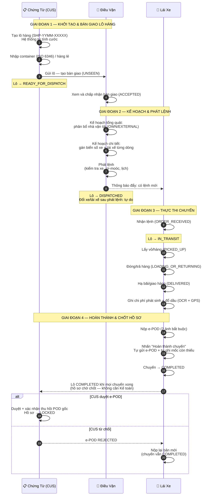
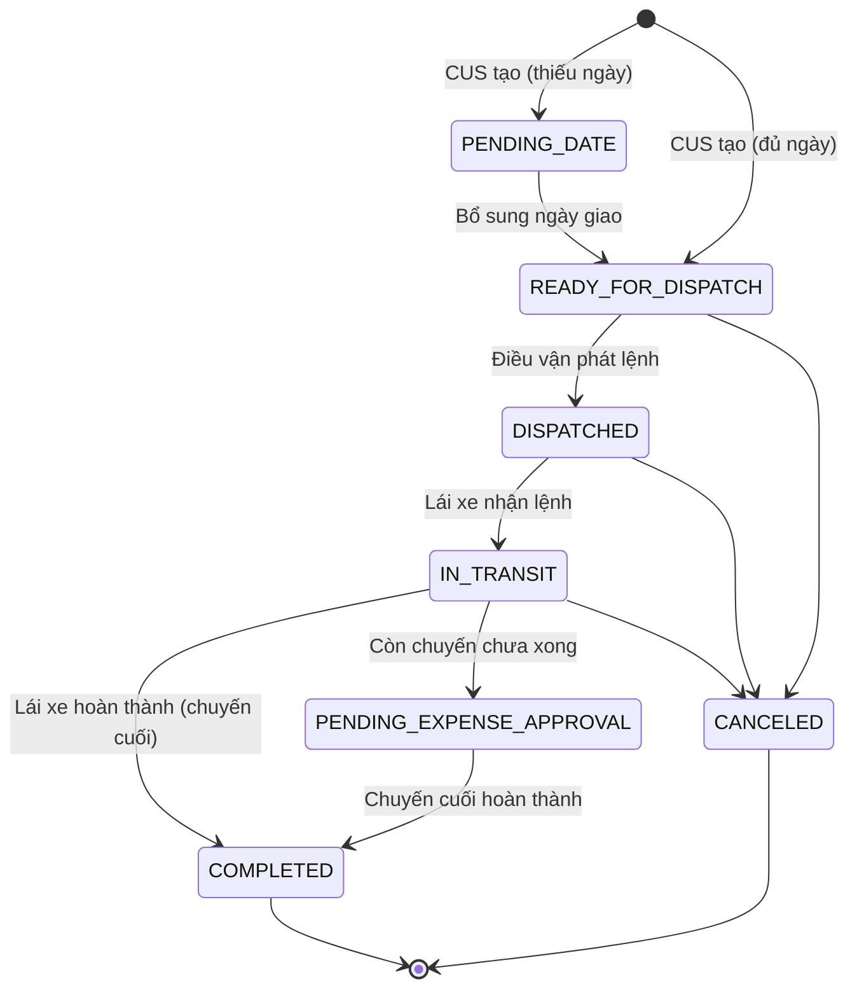
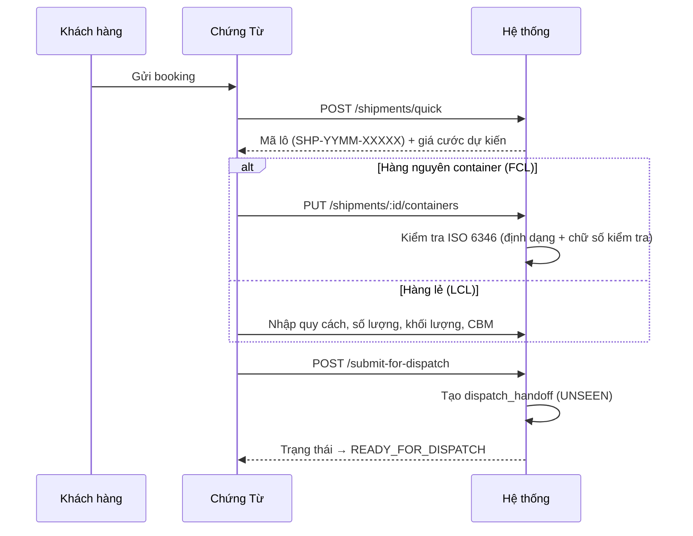
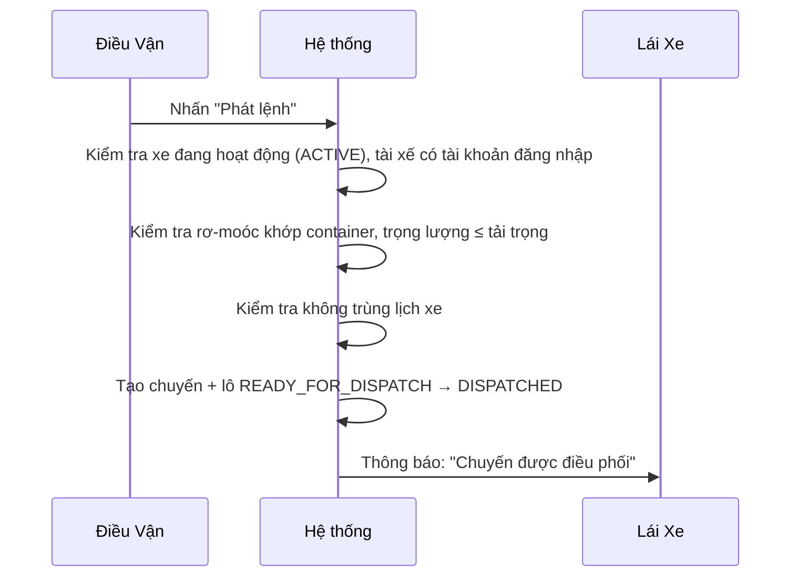
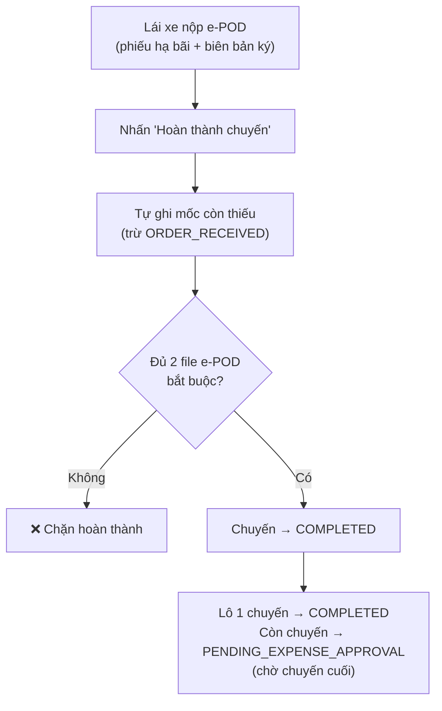
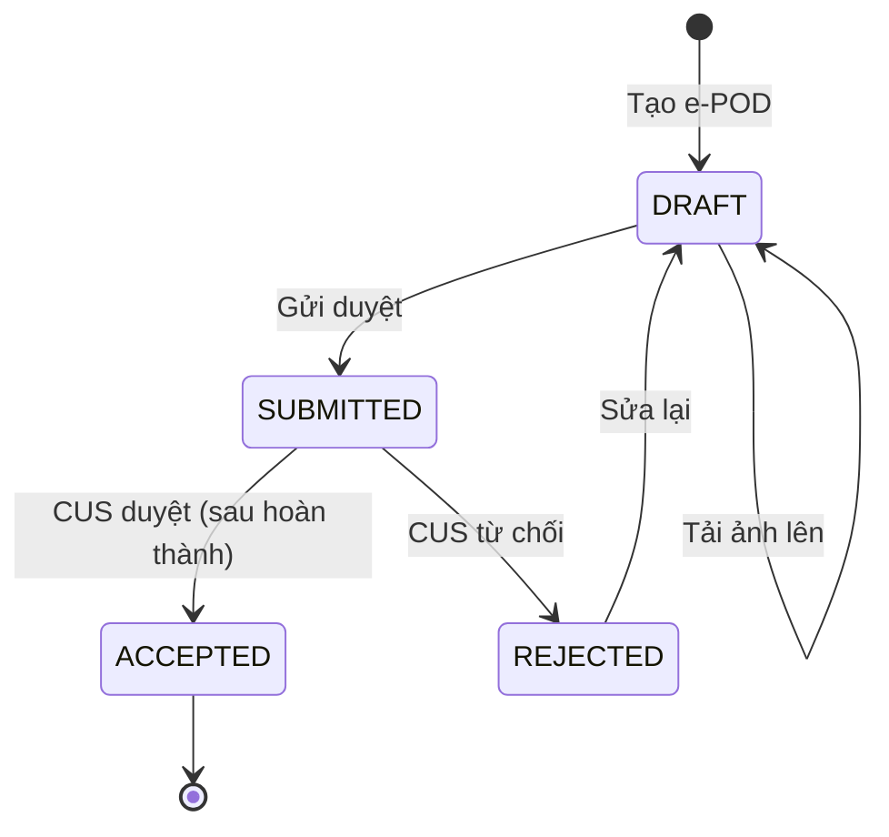
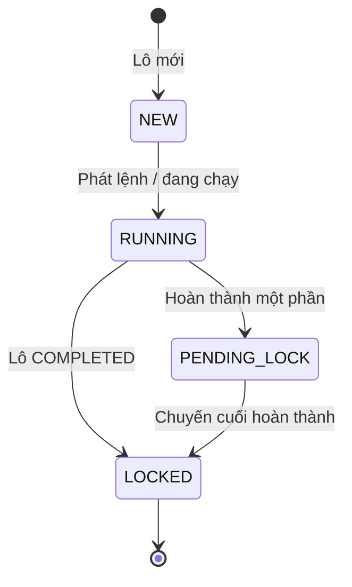

# Quy Trình O2C: Chứng Từ → Điều Vận → Lái Xe

**Dự án:** TTransport — Silver Sea

---

## Sơ Đồ Tương Tác Tổng Quát

Toàn bộ thao tác giữa 3 vai trò, theo 4 giai đoạn:

---

## Vòng Đời Lô Hàng

| Trạng thái | Nhãn | Chịu trách nhiệm |
|------------|------|-------------------|
| `PENDING_DATE` | Chờ chốt lịch | CUS |
| `READY_FOR_DISPATCH` | Sẵn sàng điều xe | CUS |
| `DISPATCHED` | Đã phân xe | Điều vận |
| `IN_TRANSIT` | Đang chạy | Lái xe |
| `PENDING_EXPENSE_APPROVAL` | Chờ duyệt phí | Tự động — chờ các chuyến còn lại |
| `COMPLETED` | Hoàn thành | Lái xe (tự đóng) |
| `CANCELED` | Đã hủy | Admin/GĐ |

> Lô 1 chuyến đi thẳng `IN_TRANSIT → COMPLETED`. Lô nhiều chuyến tạm dừng ở `PENDING_EXPENSE_APPROVAL` (tự động) đến khi chuyến cuối hoàn thành. Mỗi bước chuyển đều ghi vào lịch sử trạng thái.

---

## Bước 1 — Chứng Từ (CUS): Khởi Tạo Lô Hàng

**Kiểm soát hệ thống:**
- **Tính cước tự động** — 3 tầng: TIER (theo KG) → TABLE (theo cont) → MANUAL (dự phòng). Không gõ tay giá.
- **ISO 6346** — Định dạng `XXXXNNNNNNN` + chữ số kiểm tra. Có OCR tự sửa khi nhập gần đúng.
- **Bàn giao** — Khi CUS gửi lô, hệ thống tạo `dispatch_handoff` (UNSEEN → SEEN → ACCEPTED/REJECTED), Điều vận phải chấp nhận trước khi phân bổ.
- **Gọi lặp an toàn** — Dùng `Idempotency-Key`: trả 201 lần đầu, 200 khi gọi lại.

---

## Bước 2 — Điều Vận: Phân Bổ & Phát Lệnh

Điều vận xử lý qua 2 bước: Kế hoạch tổng quát (phân bổ nhà vận tải) → Kế hoạch chi tiết (gán xe cụ thể) → Phát lệnh.

### 2a. Kế Hoạch Tổng Quát — Phân Bổ Nhà Vận Tải

Điều vận xem các lô `READY_FOR_DISPATCH`, phân bổ nhà vận tải (OWN / EXTERNAL) theo từng loại container. Hệ thống tự tách mỗi container thành 1 dòng thực chuyển (fulfillment).

Gợi ý theo vùng: ưu tiên xe nhà có điểm hạ bãi hôm trước (D-1) hoặc điểm lấy hàng hôm sau (D+1) cùng vùng.

### 2b. Kế Hoạch Chi Tiết — Gán Xe Cụ Thể

Mỗi dòng thực chuyển được gán biển số xe + tài xế cụ thể. Có thể chọn phân loại chuyến:

| Phân loại | Nhãn | Ghi chú |
|-----------|------|---------|
| `SINGLE` | Đơn | 1 chiều |
| `DOUBLE` | Kẹp | 2 chiều |
| `COMBINED` | Kết hợp | Ghép chuyến |
| `LCL` | Lẻ | Hàng lẻ |

> `classification` là nhãn thao tác (theo từng dòng thực chuyển). `isCombined` là cờ ở cấp lô hàng. Hai trường độc lập.

### 2c. Phát Lệnh

Trạng thái phát lệnh theo từng dòng thực chuyển: **Chưa xếp xe** (`UNASSIGNED`) → **Đã gán biển số** (`PLATED_NOT_ISSUED`) → **Đã phát lệnh** (`ISSUED`).

Sau khi phát lệnh, Điều vận vẫn được đổi xe/tài xế tự do — chỉ chặn với lô đã hoàn thành hoặc đã hủy.

---

## Bước 3 — Lái Xe: Thực Thi & Hoàn Thành Chuyến

### Bảng Chuyến Trên App

App lái xe có 3 tab: **Lệnh mới** → **Đã nhận** → **Lịch sử**. Thẻ nhóm theo phân loại (Đơn/Kẹp/Kết hợp/Lẻ).

### Chuỗi Thao Tác Trên Chuyến

Mốc bắt buộc theo thứ tự: `ORDER_RECEIVED` (nhận lệnh) → `PICKED_UP` (lấy vỏ/hàng) → `LOADING_OR_RETURNING` (đóng/trả hàng) → `DELIVERED` (hạ bãi/giao hàng).

Sự kiện bổ sung (không bắt buộc): `DEPARTED`, `ARRIVED`, `FUELED`, `INCIDENT`, `NOTE`.

### Hoàn Thành Chuyến

**Điều kiện (lái xe tự đóng chuyến):**
- Lái xe đã nhận lệnh (ORDER_RECEIVED — bấm thủ công, không tự động)
- Đủ 2 file e-POD bắt buộc đã tải lên (nút bấm tự chuyển e-POD DRAFT → SUBMITTED)
- Các mốc còn thiếu (PICKED_UP, LOADING_OR_RETURNING, DELIVERED) được tự ghi nhận

**Tự động bỏ qua:**
- Phê duyệt đặc biệt (governance) — không cần duyệt trước
- Thu hồi chứng từ gốc (`podRecoveredAt`) — không cần trước khi đóng
- Xác nhận doanh thu bằng 0 — tự xác nhận
- Ảnh hiện trường (cont/seal) — tự bỏ qua
- Phạm vi chi phí — không yêu cầu

### e-POD (Chứng Từ Điện Tử)

**2 file bắt buộc:** Phiếu hạ bãi/trả hàng (`YARD_OR_DROP_RECEIPT`) + biên bản giao nhận đã ký (`SIGNED_DELIVERY_NOTE`).

**File tùy chọn:** Vé cầu đường (`TOLL_TICKET`).

> e-POD chỉ cần SUBMITTED để hoàn thành chuyến. CUS duyệt/từ chối SAU khi hoàn thành — không chặn luồng.

### Chi Phí Phát Sinh

Lái xe nhập chi phí trực tiếp trên app:

- **Nhập tay:** Phí nâng/hạ, cầu đường, đỗ xe, rửa/hàn cont, cân lốp
- **Tự tính (không sửa được):** Tiền đường (từ chuyến), phí nâng/hạ Lạch Huyên (50k)
- **Đổ dầu (riêng):** Chụp ảnh cột bơm → OCR (lít, đơn giá, tổng) + GPS → đối chiếu lộ trình, phát hiện bất thường

> Chi phí chưa cần duyệt trong luồng chính — xử lý sau, ngoài phạm vi.

---

## Bước 4 — Chứng Từ (CUS): Chốt Hồ Sơ Sau Chuyến

Sau khi lái xe hoàn thành, CUS xử lý chứng từ trên hồ sơ đã COMPLETED:

- **Duyệt e-POD** — chỉ vai trò CUS mới được duyệt. Chấp nhận phải kèm xác nhận đã thu hồi chứng từ gốc (ghi `podRecoveredAt`).
- **Từ chối e-POD** — lái xe nộp lại bản mới; chuyến vẫn COMPLETED, không mở lại.
- **Chốt hồ sơ** — lô COMPLETED → hồ sơ LOCKED, CUS không sửa trực tiếp được; mở lại phải qua phê duyệt Admin.

**Nhóm hồ sơ CUS** (tự suy ra từ trạng thái lô):

> Đối soát tài chính / khóa sổ kế toán xử lý sau, ngoài phạm vi tài liệu này.

---

## Quy Tắc Hệ Thống

| Quy tắc | Chi tiết |
|---------|----------|
| **Xóa dữ liệu** | Bản tạo mới được xóa trong phiên hiện tại. Phiên cũ → Admin/GĐ phê duyệt |
| **Chi phí đã duyệt** | Cấm xóa (bất kỳ ai) |
| **Thông báo đẩy** | Lái xe: TRIP_DISPATCHED, TRIP_CANCELED, PENALTY. Điều vận: sự kiện lô hàng |
| **Lái xe tự đóng chuyến** | Không cần Kế toán duyệt — e-POD SUBMITTED là đủ |
| **Duyệt e-POD** | Chỉ CUS duyệt — sau hoàn thành, không chặn. Chấp nhận cần xác nhận đã thu hồi POD gốc |
| **Chốt hồ sơ** | Lô COMPLETED → nhóm hồ sơ LOCKED — không sửa trực tiếp được, mở lại phải qua phê duyệt Admin |
| **Yêu cầu thay đổi** | CUS sửa lô sau phát lệnh → tạo yêu cầu thay đổi (không sửa trực tiếp) |
| **Phân loại chuyến** | Nhãn thao tác (SINGLE/DOUBLE/COMBINED/LCL). Cờ `isCombined` độc lập |
