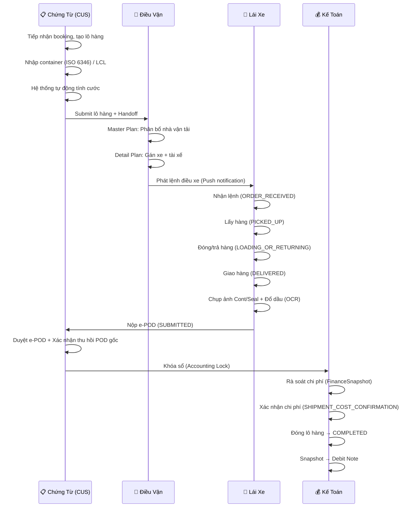
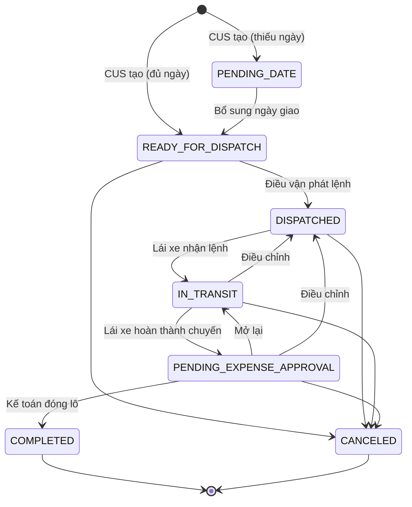
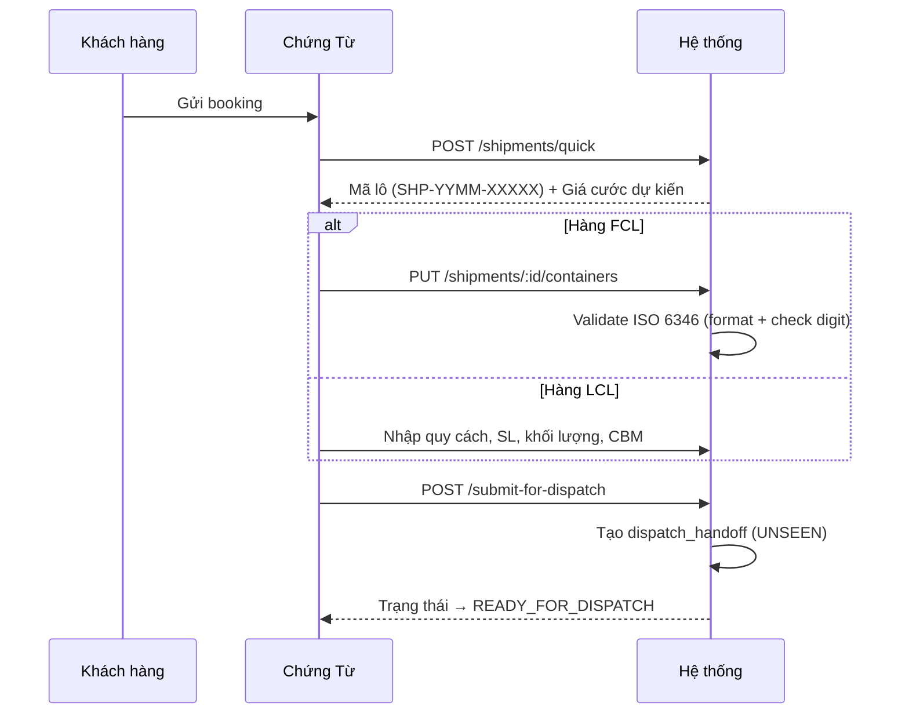
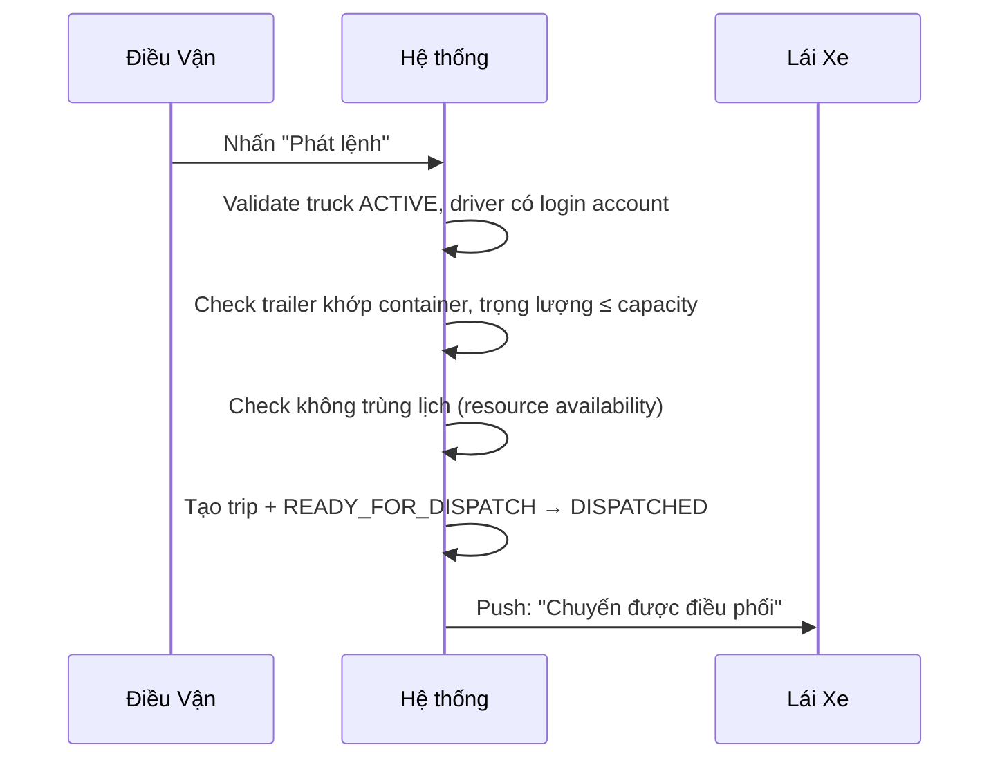
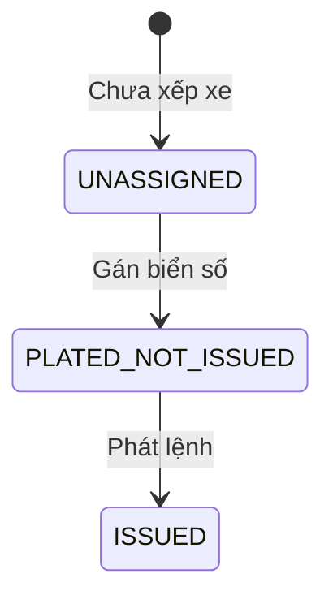
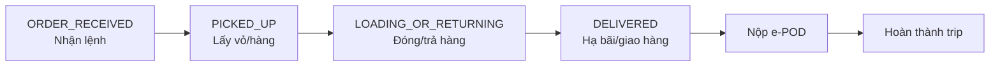
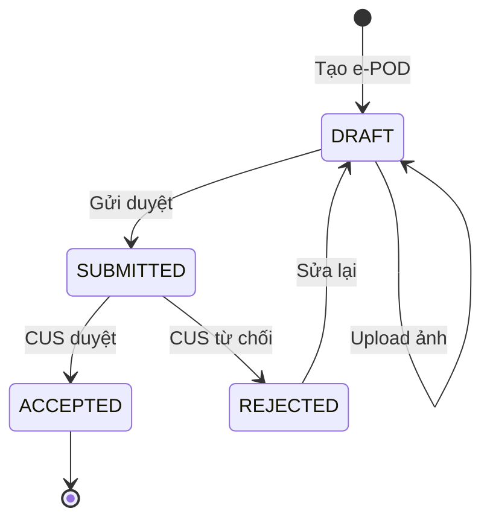
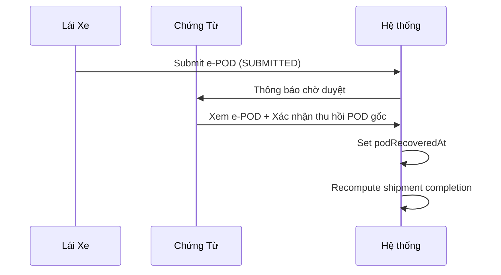
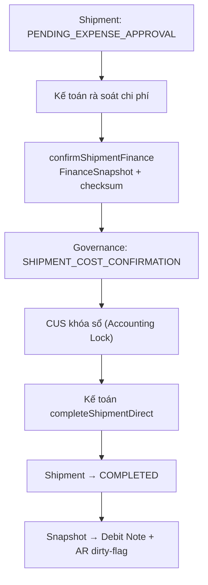
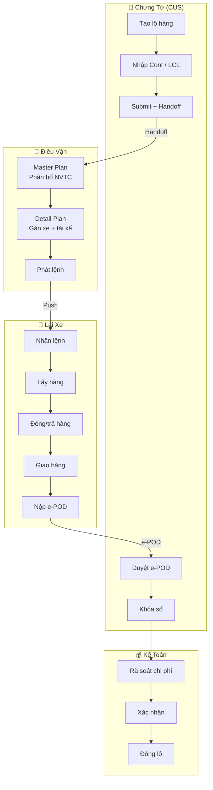

# Quy Trình O2C: Chứng Từ → Điều Vận → Lái Xe

**Dự án:** TTransport — Silver Sea

---

## Tổng Quan Luồng Xử Lý

---

## Vòng Đời Lô Hàng

Lô hàng có 8 trạng thái, chuyển đổi tự động hoặc do thao tác người dùng:

| Trạng thái | Nhãn | Chịu trách nhiệm |
|------------|------|-------------------|
| `PENDING_DATE` | Chờ chốt lịch | CUS |
| `READY_FOR_DISPATCH` | Sẵn sàng điều xe | CUS |
| `DISPATCHED` | Đã phân xe | Điều vận |
| `IN_TRANSIT` | Đang chạy | Lái xe |
| `PENDING_EXPENSE_APPROVAL` | Chờ duyệt phí | Kế toán |
| `COMPLETED` | Hoàn thành | Kế toán |
| `CANCELED` | Đã hủy | Admin/GĐ |

> `TripStatus.LOCKED` đã bị xóa — chi phí vẫn chỉnh sửa sau `COMPLETED`, hệ thống dùng `arSnapshotDirty` flag theo dõi thay đổi.

---

## Bước 1 — Chứng Từ (CUS): Khởi Tạo Lô Hàng

CUS tiếp nhận booking từ khách hàng, tạo lô hàng trên hệ thống, nhập container, và submit cho Điều vận.

**Kiểm soát hệ thống:**
- **Auto-pricing** — 3 tier: TIER (bulk/KG) → TABLE (fixed/cont) → MANUAL (fallback). Không gõ tay giá.
- **ISO 6346** — Format `XXXXNNNNNNN` + check digit. Có OCR auto-correction cho nhập liệu gần đúng.
- **Handoff** — CUS submit tạo `dispatch_handoff` (UNSEEN → SEEN → ACCEPTED/REJECTED), Điều vận phải chấp nhận trước khi phân bổ.
- **Idempotent** — Dùng `Idempotency-Key` header, trả 201 lần đầu, 200 khi replay.

---

## Bước 2 — Điều Vận: Phân Bổ & Phát Lệnh

Điều vận xử lý qua 2 bước: Master Plan (phân bổ nhà vận tải) → Detail Plan (gán xe cụ thể) → Phát lệnh.

### 2a. Master Plan — Phân Bổ Nhà Vận Tải

Điều vận xem các lô `READY_FOR_DISPATCH`, phân bổ nhà vận tải (OWN / EXTERNAL) theo từng loại container. Hệ thống tự động split mỗi container thành 1 fulfillment row.

Zone-based suggestions: gợi ý xe nhà có dropoff D-1 hoặc pickup D+1 cùng zone.

### 2b. Detail Plan — Gán Xe Cụ Thể

Mỗi fulfillment row được gán biển số xe + tài xế cụ thể. Có thể chọn phân loại chuyến:

| Phân loại | Nhãn | Ghi chú |
|-----------|------|---------|
| `SINGLE` | Đơn | 1 chiều |
| `DOUBLE` | Kẹp | 2 chiều |
| `COMBINED` | Kết hợp | Ghép chuyến |
| `LCL` | Lẻ | Hàng lẻ |

> `classification` là label thao tác (fulfillment-level). `isCombined` là flag shipment-level. Hai field độc lập.

### 2c. Phát Lệnh

**Dispatch Issue Status** (fulfillment-level):

---

## Bước 3 — Lái Xe: Thực Thi Chuyến Đi

Lái xe nhận lệnh trên App, thực hiện chuyến theo chuỗi milestone, ghi nhận chi phí, và nộp e-POD.

### Journey Board

App lái xe có 3 tab: **Lệnh mới** → **Đã nhận** → **Lịch sử**. Cards nhóm theo phân loại (Đơn/Kẹp/Kết hợp/Lẻ).

### Chuỗi Milestone

Sự kiện bổ sung (không bắt buộc): `DEPARTED`, `ARRIVED`, `FUELED`, `INCIDENT`, `NOTE`.

### Chi Phí Phát Sinh

Lái xe nhập chi phí trực tiếp trên App:

- **Nhập tay:** Phí nâng/hạ, cầu đường, đỗ xe, rửa/hàn cont, cân lọp
- **Tự động (read-only):** Tiền đường (từ trip), Phí nâng/ha Lạch Huyên (50k)
- **Đổ dầu (riêng):** Chụp ảnh cột bơm → OCR (lít, đơn giá, tổng) + GPS → đối chiếu lộ trình phát hiện bất thường

Mọi chi phí gom cụm theo lô hàng, chuyển trạng thái chờ duyệt.

### e-POD (Chứng Từ Điện Tử)

**2 file bắt buộc:** Phiếu hạ bãi/trả hàng (`YARD_OR_DROP_RECEIPT`) + Biên bản giao nhận đã ký (`SIGNED_DELIVERY_NOTE`).

**Tùy chọn:** Vé cầu đường (`TOLL_TICKET`).

### Hoàn Thành Trip

Khi lái xe nhấn "Hoàn thành", hệ thống kiểm tra:

1. Tất cả 4 milestone đã ghi nhận (ORDER_RECEIVED → DELIVERED)
2. Cả 2 file e-POD đã upload
3. e-POD status = SUBMITTED hoặc ACCEPTED

Đủ điều kiện → trip chuyển `COMPLETED`. Nếu tất cả trip trong lô đều COMPLETED + e-POD SUBMITTED → shipment chuyển `PENDING_EXPENSE_APPROVAL`.

> Driver-close path bỏ qua gate Kế toán — lái xe có thể tự đóng trip mà không cần Kế toán duyệt trước.

---

## Bước 4 — Đối Soát & Quyết Toán

### CUS: Duyệt e-POD

Chỉ CUS mới duyệt e-POD. Bắt buộc xác nhận đã thu hồi chứng từ gốc (POD) trước khi duyệt.

### Kế Toán: Xác Nhận & Đóng Lô

**Điều kiện đóng lô:** Shipment ở `PENDING_EXPENSE_APPROVAL` + Snapshot checksum khớp + VAT 0/5/8/10% + Maker-checker (CUS duyệt POD ≠ Kế toán đóng lô).

### Accounting Lock

CUS khóa sổ sau khi Kế toán xác nhận → mọi mutation trực tiếp bị chặn (status change, soft delete, POD review, change request). Muốn mở lại: CUS đề nghị → Admin phê duyệt → Debit Note chuyển `ADJUSTMENT_REQUIRED`.

### Tạm Ứng & Cấn Trừ

Phiếu tạm ứng qua lifecycle: `PENDING` → `CHECKED_BY_ACCOUNTANT` → `APPROVED`. Khi approve: chi phí tự động APPROVED, post SERVICE_FEE vào sổ CUSTOMER, post OPS_SETTLEMENT vào sổ FORWARDER (cấn trừ tạm ứng).

---

## Toàn Cảnh Flow

---

## Quy Tắc Hệ Thống

| Quy tắc | Chi tiết |
|---------|----------|
| **Xóa dữ liệu** | Create-only được xóa trong phiên hiện tại. Phiên cũ → Admin/GĐ phê duyệt |
| **Chi phí đã duyệt** | Cấm xóa (bất kỳ ai) |
| **Push Notification** | Lái xe: TRIP_DISPATCHED, TRIP_CANCELED, PENALTY. Điều vận: shipment events |
| **POD Gate** | CUS duyệt e-POD + xác nhận thu hồi POD gốc → mới chuyển Hoàn thành |
| **Driver-close bypass** | Lái xe tự đóng trip → bỏ qua gate Kế toán (chỉ cần e-POD SUBMITTED) |
| **Accounting Lock** | CUS khóa sổ → mọi mutation phải qua governance (Admin phê duyệt mở lại) |
| **Change Request** | CUS sửa lô sau dispatch → tạo change request (không sửa trực tiếp) |
| **Tạm ứng** | PENDING → CHECKED → APPROVED. Auto-cấn trừ khi approve |
