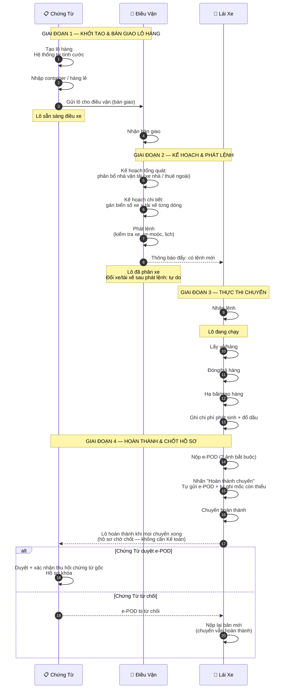
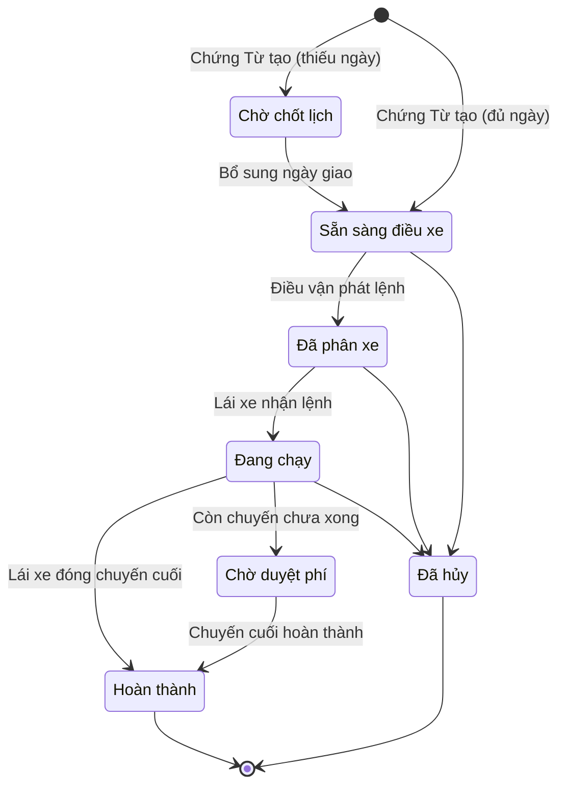
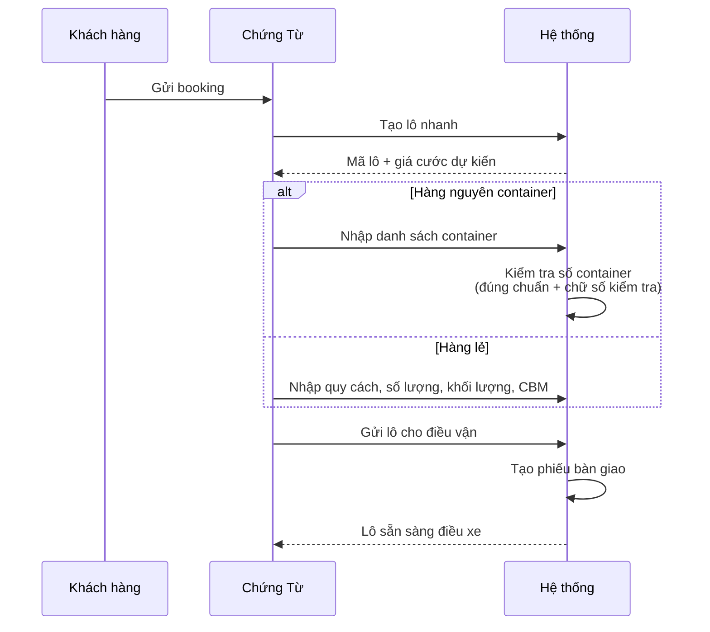
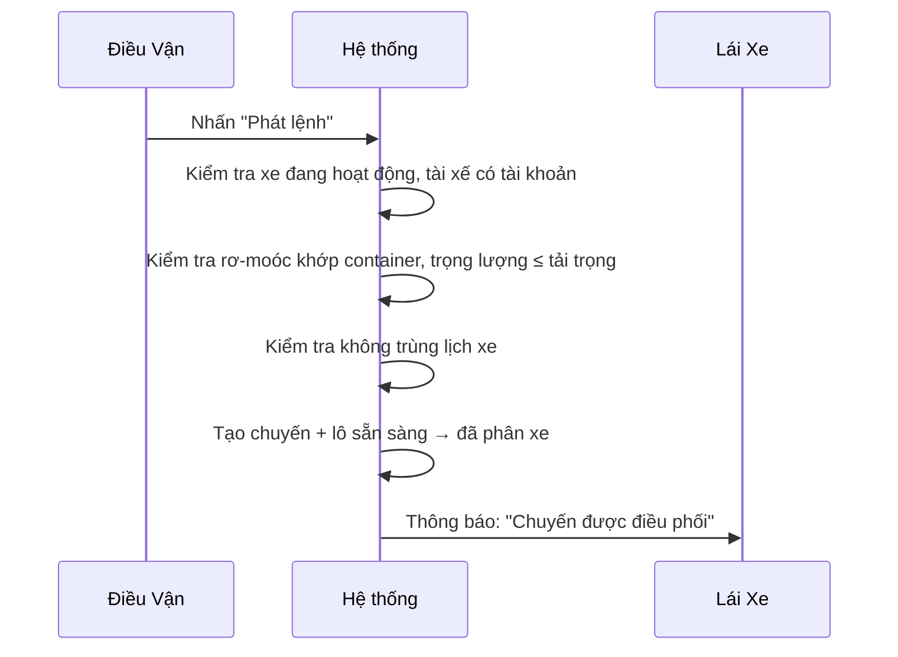
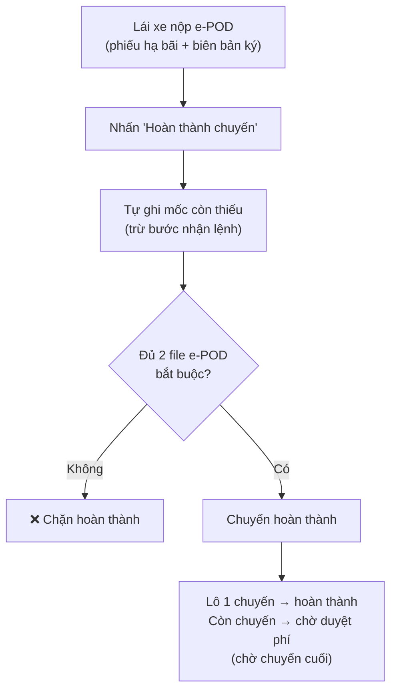
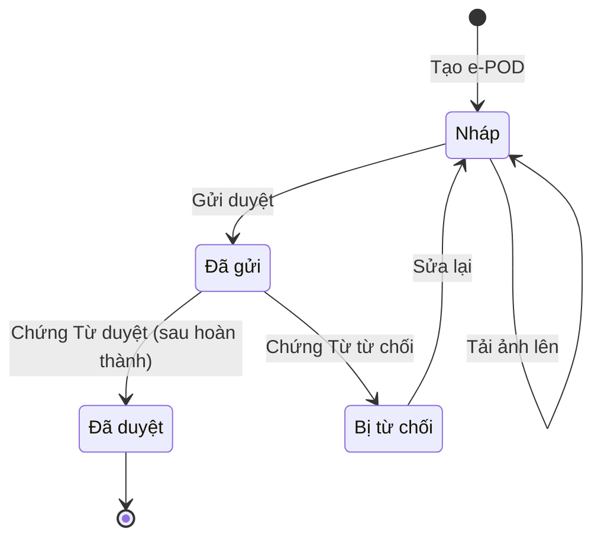

# Quy Trình O2C: Chứng Từ → Điều Vận → Lái Xe

**Dự án:** TTransport — Silver Sea

---

## Sơ Đồ Tương Tác Tổng Quát

Toàn bộ thao tác giữa 3 vai trò, theo 4 giai đoạn:

---

## Vòng Đời Lô Hàng

| Trạng thái | Chịu trách nhiệm |
|------------|-------------------|
| Chờ chốt lịch | Chứng Từ |
| Sẵn sàng điều xe | Chứng Từ |
| Đã phân xe | Điều vận |
| Đang chạy | Lái xe |
| Chờ duyệt phí | Tự động — chờ các chuyến còn lại |
| Hoàn thành | Lái xe (tự đóng) |
| Đã hủy | Admin/GĐ |

> Lô 1 chuyến đi thẳng đến hoàn thành. Lô nhiều chuyến tạm dừng ở "Chờ duyệt phí" (tự động) đến khi chuyến cuối hoàn thành. Mỗi bước chuyển đều ghi nhận vào lịch sử.

---

## Bước 1 — Chứng Từ: Khởi Tạo Lô Hàng

**Kiểm soát hệ thống:**
- **Tính cước tự động** — 3 tầng: theo kg → theo container → điều chỉnh thủ công (dự phòng). Không gõ tay giá.
- **Số container chuẩn quốc tế (ISO 6346)** — Có chữ số kiểm tra; OCR tự sửa khi nhập gần đúng.
- **Bàn giao** — Khi Chứng Từ gửi lô, hệ thống tạo phiếu bàn giao; Điều vận phải chấp nhận trước khi phân bổ.
- **Gửi lặp an toàn** — Thao tác trùng không tạo lô mới.

---

## Bước 2 — Điều Vận: Phân Bổ & Phát Lệnh

Điều vận xử lý qua 2 bước: Kế hoạch tổng quát (phân bổ nhà vận tải) → Kế hoạch chi tiết (gán xe cụ thể) → Phát lệnh.

### 2a. Kế Hoạch Tổng Quát — Phân Bổ Nhà Vận Tải

Điều vận xem các lô sẵn sàng điều xe, phân bổ nhà vận tải (xe nhà / thuê ngoài) theo từng loại container. Hệ thống tự tách mỗi container thành 1 dòng vận chuyển riêng.

Gợi ý theo vùng: ưu tiên xe nhà có điểm hạ bãi hôm trước (D-1) hoặc điểm lấy hàng hôm sau (D+1) cùng vùng.

### 2b. Kế Hoạch Chi Tiết — Gán Xe Cụ Thể

Mỗi dòng vận chuyển được gán biển số xe + tài xế cụ thể. Có thể chọn phân loại chuyến:

| Phân loại | Ghi chú |
|-----------|---------|
| Đơn | 1 chiều |
| Kẹp | 2 chiều |
| Kết hợp | Ghép chuyến |
| Lẻ | Hàng lẻ |

> Phân loại là nhãn thao tác theo từng dòng vận chuyển. Riêng đánh dấu "ghép chuyến" áp ở cấp lô hàng — hai thông tin độc lập.

### 2c. Phát Lệnh

Trạng thái phát lệnh theo từng dòng vận chuyển: **Chưa xếp xe → Đã gán biển số → Đã phát lệnh**.

Sau khi phát lệnh, Điều vận vẫn được đổi xe/tài xế tự do — chỉ chặn với lô đã hoàn thành hoặc đã hủy.

---

## Bước 3 — Lái Xe: Thực Thi & Hoàn Thành Chuyến

### Bảng Chuyến Trên App

App lái xe có 3 tab: **Lệnh mới** → **Đã nhận** → **Lịch sử**. Thẻ nhóm theo phân loại (Đơn/Kẹp/Kết hợp/Lẻ).

### Chuỗi Thao Tác Trên Chuyến

Mốc bắt buộc theo thứ tự: **Nhận lệnh → Lấy vỏ/hàng → Đóng/trả hàng → Hạ bãi/giao hàng**.

Sự kiện bổ sung (không bắt buộc): xuất phát, đến nơi, đổ dầu, sự cố, ghi chú.

### Hoàn Thành Chuyến

**Điều kiện (lái xe tự đóng chuyến):**
- Lái xe đã bấm nhận lệnh (thao tác thủ công)
- Đủ 2 file e-POD bắt buộc đã tải lên (nút bấm tự gửi e-POD)
- Các mốc còn thiếu (lấy vỏ, đóng/trả, hạ bãi) được tự ghi nhận

**Tự động bỏ qua:**
- Phê duyệt đặc biệt — không cần duyệt trước
- Thu hồi chứng từ gốc — không cần trước khi đóng chuyến
- Xác nhận doanh thu bằng 0 — tự xác nhận
- Ảnh hiện trường (cont/seal) — tự bỏ qua
- Phạm vi chi phí — không yêu cầu

### e-POD (Chứng Từ Điện Tử)

**2 file bắt buộc:** phiếu hạ bãi/trả hàng + biên bản giao nhận đã ký.

**File tùy chọn:** vé cầu đường.

> e-POD chỉ cần đã gửi là chuyến hoàn thành. Chứng Từ duyệt/từ chối SAU khi hoàn thành — không chặn luồng.

### Chi Phí Phát Sinh

Lái xe nhập chi phí trực tiếp trên app:

- **Nhập tay:** Phí nâng/hạ, cầu đường, đỗ xe, rửa/hàn cont, cân lốp
- **Tự tính (không sửa được):** Tiền đường (từ chuyến), phí nâng/hạ Lạch Huyên (50k)
- **Đổ dầu (riêng):** Chụp ảnh cột bơm → hệ thống đọc số lít, đơn giá, tổng tiền + GPS → đối chiếu lộ trình, phát hiện bất thường

> Chi phí chưa cần duyệt trong luồng chính — xử lý sau, ngoài phạm vi.

---

## Bước 4 — Chứng Từ: Chốt Hồ Sơ Sau Chuyến

Sau khi lái xe hoàn thành, Chứng Từ xử lý chứng từ trên hồ sơ đã hoàn thành:

- **Duyệt e-POD** — chỉ vai trò Chứng Từ mới được duyệt. Chấp nhận phải kèm xác nhận đã thu hồi chứng từ gốc.
- **Từ chối e-POD** — lái xe nộp lại bản mới; chuyến vẫn hoàn thành, không mở lại.
- **Chốt hồ sơ** — lô hoàn thành → hồ sơ khóa, không sửa trực tiếp được; mở lại phải qua phê duyệt Admin.

**Nhóm hồ sơ Chứng Từ** (tự suy ra từ trạng thái lô, theo hướng **Mới → Đang chạy → Chờ khóa → Đã khóa**):

| Nhóm hồ sơ | Khi nào | Ý nghĩa |
|------------|---------|---------|
| Mới | Lô vừa tạo, chưa phát lệnh | Chưa có chuyến |
| Đang chạy | Đã phát lệnh / đang chạy | Chờ các chuyến hoàn thành |
| Chờ khóa | Hoàn thành một phần (còn chuyến chưa xong) | Sắp chốt hồ sơ |
| Đã khóa | Lô hoàn thành | Hồ sơ cuối — không sửa trực tiếp được |

> Đối soát tài chính / khóa sổ kế toán xử lý sau, ngoài phạm vi tài liệu này.

---

## Quy Tắc Hệ Thống

| Quy tắc | Chi tiết |
|---------|----------|
| **Xóa dữ liệu** | Bản tạo mới được xóa trong phiên hiện tại. Phiên cũ → Admin/GĐ phê duyệt |
| **Chi phí đã duyệt** | Cấm xóa (bất kỳ ai) |
| **Thông báo đẩy** | Lái xe nhận thông báo: lệnh mới, hủy lệnh, phạt. Điều vận nhận sự kiện lô hàng |
| **Lái xe tự đóng chuyến** | Không cần Kế toán duyệt — e-POD đã gửi là đủ |
| **Duyệt e-POD** | Chỉ Chứng Từ duyệt — sau hoàn thành, không chặn. Chấp nhận cần xác nhận đã thu hồi chứng từ gốc |
| **Chốt hồ sơ** | Lô hoàn thành → hồ sơ khóa — không sửa trực tiếp được, mở lại phải qua phê duyệt Admin |
| **Yêu cầu thay đổi** | Chứng Từ sửa lô sau phát lệnh → tạo yêu cầu thay đổi (không sửa trực tiếp) |
| **Phân loại chuyến** | Nhãn thao tác (Đơn/Kẹp/Kết hợp/Lẻ). Đánh dấu ghép chuyến độc lập theo lô |
