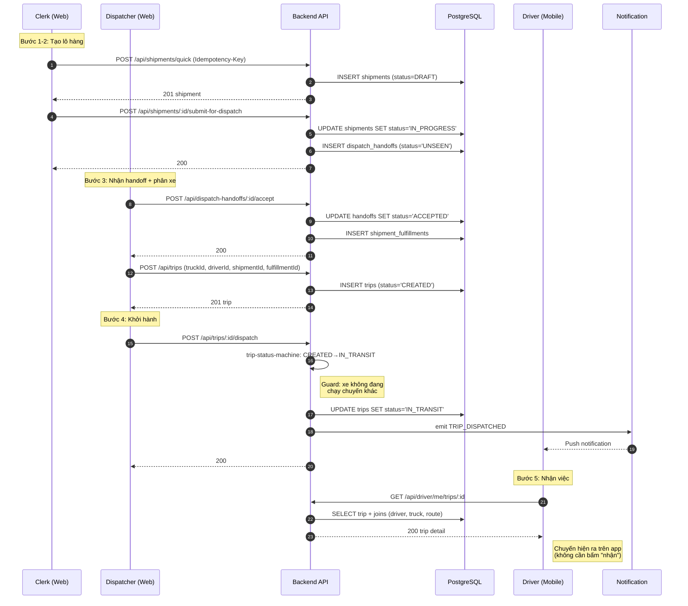

# Quy trình: Tạo lô hàng → Lái xe nhận việc

Tài liệu tổng hợp nghiệp vụ (SOP), kiến trúc kỹ thuật và phân quyền cho luồng
outbound logistics: từ **Tạo lô hàng** đến **Tài xế nhận chuyến**.

> Phạm vi: Shipment (lô hàng) → Fulfillment → Trip (chuyến đi) → Driver mobile.
> Không bao gồm chốt sổ kế toán / debit-note (xem doc riêng).

---

## Mục lục

1. [SOP & Nghiệp vụ](#1-sop--nghiệp-vụ)
2. [Kiến trúc kỹ thuật (API + DB + Sequence)](#2-kiến-trúc-kỹ-thuật)
3. [Phân quyền (RBAC) & Màn hình](#3-phân-quyền-rbac--màn-hình)

---

## 1. SOP & Nghiệp vụ

### 1.1. Các thực thể chính

| Thực thể | Tiếng Việt | Ý nghĩa |
|----------|-----------|---------|
| **Shipment** | Lô hàng | Đơn hàng logistics của khách hàng (booking/BL/tờ khai) |
| **Shipment Fulfillment** | Phân giao | Đơn vị giao hàng độc lập được tách ra từ lô hàng |
| **Dispatch Handoff** | Bàn giao điều độ | Bản ghi chuyển lô từ clerk → dispatcher |
| **Trip** | Chuyến đi | Một chuyến chạy thực tế: 1 xe + 1 lái + 1 tuyến |

### 1.2. Trạng thái (Status) liên quan

**Shipment** (`shipment_status` enum):
```
DRAFT → IN_PROGRESS → DELIVERED → CLOSED
            ↓
        CANCELED
```

**Dispatch Handoff**:
```
UNSEEN → SEEN → ACCEPTED (hoặc REJECTED)
```

**Trip** (`trip_status` enum):
```
CREATED → IN_TRANSIT → COMPLETED → LOCKED
              ↓
          CANCELED
```

### 1.3. SOP từng bước — Ai làm gì

| # | Hành động | Role | Kết quả trạng thái |
|---|-----------|------|--------------------|
| 1 | **Tạo lô hàng** (nhập khách hàng, booking, BL, tuyến, FCL/LCL, container) | CLERK | shipment = `DRAFT` |
| 2 | **Bổ sung chứng từ** (Booking/BL/DO/Declaration, container, seal) | CLERK | (không đổi status) |
| 3 | **Submit for dispatch** (chuyển cho điều độ) | CLERK | shipment `DRAFT → IN_PROGRESS`, tạo handoff `UNSEEN` |
| 4 | **Xem & nhận handoff** trên bảng điều độ | MANAGER/ADMIN | handoff `UNSEEN → SEEN → ACCEPTED` |
| 5 | **Phân xe (Dispatch)**: tách fulfillment, chọn xe + lái (hoặc thuê ngoài), phát lệnh | MANAGER/ADMIN | trip = `CREATED`, link `shipmentId`/`fulfillmentId` |
| 6 | **Khởi hành chuyến** (bấm "Khởi hành") | MANAGER/ADMIN | trip `CREATED → IN_TRANSIT`, gửi push `TRIP_DISPATCHED` cho lái |
| 7 | **Lái xe nhận việc** (xem chi tiết chuyến) | DRIVER | *(không đổi status — xem ghi chú)* |

### 1.4. Ghi chú quan trọng: Lái xe KHÔNG có "chấp nhận/từ chối"

Hệ thống **không có bước accept/reject** chính thức cho tài xế:

- Khi trip chuyển `IN_TRANSIT`, backend phát notification `TRIP_DISPATCHED`.
- Chuyến tự xuất hiện trên app lái xe (`DriverTwoOrdersPage`: chuyến đang chạy + chuyến tiếp theo).
- Lái xe xem chi tiết → chạy luôn (không cần bấm nhận).

**Nếu lái không thể chạy** → quy trình thủ công:
- Dispatcher **Đổi xe/lái** (`PATCH /trips/:id/reassign`) — chỉ khi trip vẫn `CREATED`.
- Hoặc **Hủy chuyến** (`POST /trips/:id/cancel`) — ADMIN/MANAGER.

### 1.5. Sơ đồ luồng

```
┌─────────┐   submit    ┌──────────┐  accept   ┌────────────┐
│ SHIPMENT│────────────►│ HANDOFF  │──────────►│ FULFILLMENT│
│  DRAFT  │             │  UNSEEN  │           │ (tách từ lô)│
└─────────┘             └──────────┘           └────────────┘
                                                      │ issue order
                                                      ▼
┌─────────────────┐  "Khởi hành"  ┌──────────┐ push  ┌──────────┐
│ TRIP (CREATED)  │──────────────►│IN_TRANSIT│──────►│ DRIVER   │
│ xe+lái đã gán   │               │          │       │ nhận việc│
└─────────────────┘               └──────────┘       └──────────┘
```

---

## 2. Kiến trúc kỹ thuật

### 2.1. API Endpoints

| Bước | Method | Endpoint | Role yêu cầu | Mô tả |
|------|--------|----------|--------------|-------|
| Tạo lô | `POST` | `/api/shipments` | ADMIN, MANAGER, CLERK | Tạo shipment DRAFT |
| Tạo lô (mobile) | `POST` | `/api/shipments/quick` | ADMIN, MANAGER, CLERK | Idempotent (cần `Idempotency-Key`) |
| Cập nhật lô | `PUT` | `/api/shipments/:id` | ADMIN, MANAGER, CLERK | Sửa thông tin |
| Submit dispatch | `POST` | `/api/shipments/:id/submit-for-dispatch` | ADMIN, MANAGER, CLERK | DRAFT → IN_PROGRESS, tạo handoff |
| Nhận handoff | `POST` | `/api/dispatch-handoffs/:id/accept` | MANAGER, ADMIN | UNSEEN/SEEN → ACCEPTED |
| Tạo chuyến | `POST` | `/api/trips` | ADMIN, MANAGER | Tạo trip CREATED |
| Phát lệnh dispatch | `POST` | `/api/trips/:id/dispatch` | ADMIN, MANAGER | CREATED → IN_TRANSIT |
| Đổi xe/lái | `PATCH` | `/api/trips/:id/reassign` | ADMIN, MANAGER | Chỉ khi trip `CREATED` |
| Xem chi tiết (lái) | `GET` | `/api/driver/me/trips/:id` | DRIVER | Lấy thông tin chuyến được gán |

**Lưu ý:**
- Tất cả endpoint mount tại `backend/src/index.ts` với middleware `authMiddleware` + `casbinAuthz(<resource>)`.
- `/api/driver/me/*` dùng `casbinAuthz('driver_portal')` + `requireRoles(DRIVER)`.
- Thao tác tạo/sửa dùng **idempotency** (header `Idempotency-Key`) để chống trùng lặp khi mạng yếu.

### 2.2. Database Tables (Drizzle schema)

Schema chính: `backend/src/db/schema.ts`

| Bảng | Mục đích | Khóa chính / FK |
|------|----------|-----------------|
| `shipments` | Lô hàng | `id`, `customerId`→customers, `status` (enum) |
| `shipment_containers` | Container của lô | `shipmentId`→shipments |
| `shipment_documents` | Chứng từ (Booking/BL/DO/Declaration) | `shipmentId`→shipments |
| `shipment_status_history` | Lịch sử đổi trạng thái (append-only) | `shipmentId`, `fromStatus`, `toStatus` |
| `shipment_fulfillments` | Đơn vị giao hàng tách từ lô | `shipmentId`→shipments |
| `dispatch_handoffs` | Bàn giao clerk→dispatcher | `shipmentId`, `status` |
| `trips` | Chuyến đi (đơn vị vận hành) | `id`, `driverId`→drivers, `truckId`→trucks, `shipmentId`→shipments, `fulfillmentId` |
| `shipment_milestones` | Milestone gắn với chuyến | `shipmentId`, `tripId` |

**Enum quan trọng:**
```ts
// Trip
tripStatusEnum = ['CREATED', 'IN_TRANSIT', 'COMPLETED', 'LOCKED', 'CANCELED']
// Shipment
shipmentStatusEnum = ['DRAFT', 'IN_PROGRESS', 'DELIVERED', 'CLOSED', 'CANCELED']
```

### 2.3. Service Layer chịu trách nhiệm

| Service | Trách nhiệm |
|---------|-------------|
| `shipment.service.ts` | CRUD lô hàng, `assertLegalTransition` (state machine shipment) |
| `shipment-intake.service.ts` | `submitShipmentForDispatch()`, validate readiness |
| `shipment-fulfillment.service.ts` | Tách fulfillment, `assertFulfillmentReadyForDispatch` |
| `dispatch-handoff.service.ts` | Vòng đời handoff: `UNSEEN → SEEN → ACCEPTED/REJECTED` |
| `dispatch-planning.service.ts` | Bảng kế hoạch phân xe, `issueFulfillmentDispatchOrder()` |
| `trip-status-machine.service.ts` | **State machine chuẩn của trip** — transitions, guards, side effects |
| `trip-command.service.ts` | Command: `dispatchTripCommand()` phát notification |
| `trip-mutations.service.ts` | `reassignTrip()`, tạo/sửa trip |
| `driver.service.ts` | Trip của lái, milestone, completion |

### 2.4. Sequence Diagram



### 2.5. Frontend Flow

| Trang | File | Role |
|-------|------|------|
| Tạo lô (clerk) | `pages/clerk/ClerkShipmentCreatePage.tsx` | CLERK |
| Danh sách lô | `pages/ShipmentsPage.tsx` | CLERK, MANAGER, ADMIN |
| Chi tiết lô | `pages/ShipmentDetailPage.tsx` | CLERK, MANAGER, ADMIN |
| Bảng phân xe | `features/dispatch/` (`DispatchPage`, `DispatchTripCard`) | MANAGER, ADMIN |
| Chi tiết chuyến | `pages/TripDetailPage.tsx`, `pages/DriverTripDetailPage.tsx` | theo role |
| App lái xe | `pages/driver/DriverTwoOrdersPage.tsx`, `pages/DriverTripDetailPage.tsx` | DRIVER |

---

## 3. Phân quyền (RBAC) & Màn hình

### 3.1. 7 Role trong hệ thống

Định nghĩa tại `shared/src/constants/index.ts`:

| Role | Label VN | Phạm vi |
|------|----------|---------|
| **ADMIN** | Quản trị viên | Toàn hệ thống (Casbin wildcard `*`) |
| **MANAGER** | Quản lý | Vận hành + tài chính + nhân sự + cấu hình |
| **ACCOUNTANT** | Kế toán | Tài chính; **chỉ xem** lô hàng (read-only) |
| **CLERK** | Nhân viên chứng từ | Tạo/sửa lô, chứng từ, ePOD review |
| **DRIVER** | Lái xe | Portal riêng (mobile): chuyến, thu nhập, phạt |
| **FORWARDER** | Giao nhận | Portal riêng: chuyến, tạm ứng, thanh toán |
| **CUSTOMER** | Khách hàng | Portal riêng: lô của họ, sao kê, giấy báo nợ |

### 3.2. Role tham gia luồng này

Chỉ **5/7 role** dính tới flow "tạo lô → lái nhận việc":

| Role | Vai trò trong flow |
|------|-------------------|
| **CLERK** | Tạo lô, bổ sung chứng từ, submit for dispatch |
| **MANAGER** | Nhận handoff, phân xe, khởi hành, đổi/hủy chuyến |
| **ADMIN** | Như MANAGER + quyền tuyệt đối |
| **DRIVER** | Nhận push, xem chi tiết, chạy chuyến |
| **ACCOUNTANT** | Chỉ đọc lô hàng (không thao tác) |

> `FORWARDER`, `CUSTOMER` không tham gia flow này.

### 3.3. Bảng phân quyền (Casbin policy)

Nguồn: `backend/src/casbin/policy.csv`. `*` = toàn quyền trên resource.

| Resource | ADMIN | MANAGER | CLERK | ACCOUNTANT | DRIVER |
|----------|-------|---------|-------|------------|--------|
| `shipments` | `*` | read, write, delete | read, write | read | — |
| `shipment_fulfillments` | `*` | read, write | read | read | — |
| `trips` | `*` | read, write, delete | — | read | — |
| `driver_portal` | — | — | — | — | read, write, delete |
| `dispatch_handoffs` | `*` | read, write | — | — | — |

### 3.4. Màn hình theo từng Role (flow này)

**CLERK** — `/clerk/*`:
- `/shipments` (danh sách lô)
- `/clerk/shipments/new` (tạo lô — `clerkOrAdminOnly`)
- `/shipments/:id` (chi tiết)
- `/clerk/shipments/:id/docs` (chứng từ)

**MANAGER / ADMIN** — `officeStaffOnly`:
- `/shipments`, `/shipments/:id`
- `/dispatch` (bảng phân xe — `managerOrAdminOnly`)
- `/trips`, `/trips/new`, `/trips/:id`, `/trips/:id/edit`

**ACCOUNTANT**:
- `/shipments`, `/shipments/:id` (chỉ xem)
- Không vào `/dispatch`, không tạo/sửa trip

**DRIVER** — layout mobile với bottom nav:
- `/my-trips` (hành trình — `driverOnly`)
- `/my-trips/:id` (chi tiết chuyến)
- `/my-trips/two-orders` (2 đơn: đang chạy + tiếp theo)

### 3.5. Trang chủ theo role

```ts
// frontend/src/lib/routes.ts
DRIVER     → /my-trips
FORWARDER  → /my-forwarder-trips
CUSTOMER   → /portal/shipments
CLERK      → /shipments
ACCOUNTANT → /accounting
ADMIN/MGR  → /dashboard
```

---

## Phụ lục: File tham chiếu

| Mục | File |
|-----|------|
| Role enum + label | `shared/src/constants/index.ts` |
| Casbin policy | `backend/src/casbin/policy.csv` |
| Casbin middleware | `backend/src/middleware/casbin.ts` |
| Capabilities → frontend | `backend/src/services/user.service.ts` (`getCapabilities`) |
| Route guards | `frontend/src/App.tsx` |
| Sidebar nav | `frontend/src/components/Layout.tsx` |
| Trip state machine | `backend/src/services/trip-status-machine.service.ts` |
| Shipment state machine | `backend/src/services/shipment.service.ts` (`LEGAL_TRANSITIONS`) |
| DB schema | `backend/src/db/schema.ts` |
